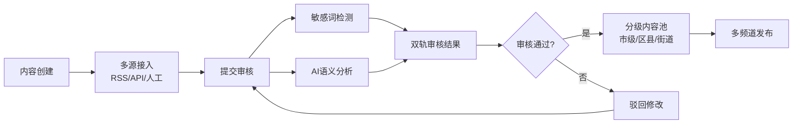

## 1. 产品概述

徐州市级城市级综合信息服务平台控制台是以广电集团为运营主体的一站式城市信息服务中枢，整合新闻资讯、政务公告、公共事务、应急响应、本地生活五大核心能力，为市民提供权威、便捷、智能的城市综合信息服务。

- **核心目标**：打造市级权威信息发布主渠道，构建"新闻+政务+服务+应急"四位一体的城市信息服务生态
- **目标用户**：徐州市民（C端用户）、内容运营人员（B端运营）、各级政务机构（B端机构）、应急管理部门（B端应急）
- **市场价值**：提升城市治理数字化水平，增强政务信息传播力，打通市民诉求响应最后一公里

## 2. 核心功能

### 2.1 用户角色

| 角色 | 登录方式 | 核心权限 |
|------|----------|----------|
| 市民用户 | 手机号/实名认证 | 浏览资讯、查询服务、提交诉求、接收应急推送 |
| 市级运营员 | 账号密码+权限认证 | 全平台内容管理、应急信息发布、数据查看 |
| 区县级运营员 | 账号密码+权限认证 | 本区县内容发布、辖区应急信息推送 |
| 街道级运营员 | 账号密码+权限认证 | 街道级内容池管理、本地信息录入 |
| 审核员 | 账号密码+权限认证 | 内容审核、敏感词管理、AI审核配置 |
| 系统管理员 | 账号密码+双因素认证 | 用户管理、权限配置、系统设置 |

### 2.2 功能模块

1. **首页大屏**：综合概览、实时数据统计、应急信息横幅、快捷入口
2. **内容管理中心**：多频道内容流（时政/民生/文化/教育）、内容发布、多源接入适配
3. **GIS公共服务地图**：停水停电停气图层叠加、实时公共服务状态、区域定位
4. **市民诉求中心**：12345诉求提交、诉求进度查询、诉求统计分析
5. **审核管理**：敏感词审核、AI语义审核、双轨审核流程、审核记录
6. **分级发布管理**：市级/区县/街道三级内容池、权限管控、内容流转
7. **应急指挥中心**：应急信息强制置顶、定向区域推送、应急响应流程
8. **舆情分析仪表盘**：舆情热度监测、传播路径溯源、热点话题追踪
9. **系统设置**：用户管理、角色权限、系统配置

### 2.3 页面详情

| 页面名称 | 模块名称 | 功能描述 |
|----------|----------|----------|
| 控制台首页 | 数据概览 | 实时用户数、内容发布量、诉求处理数、应急等级 |
| 控制台首页 | 快捷入口 | 内容发布、诉求处理、应急发布、地图服务 |
| 控制台首页 | 应急横幅 | 高优先级应急信息滚动展示 |
| 控制台首页 | 舆情简报 | 当日热点话题TOP5、舆情趋势 |
| 内容管理 | 频道列表 | 时政/民生/文化/教育四大频道切换 |
| 内容管理 | 内容列表 | 文章卡片列表、状态标签、操作按钮 |
| 内容管理 | 内容编辑器 | 富文本编辑、图片上传、频道选择、分级设置 |
| 内容管理 | 多源接入 | RSS源配置、政务API对接、人工录入 |
| GIS地图 | 地图视图 | 徐州行政区划地图、缩放平移 |
| GIS地图 | 图层控制 | 停水/停电/停气/施工等图层开关 |
| GIS地图 | 详情弹窗 | 点击地图要素查看详细信息、影响范围 |
| 市民诉求 | 诉求列表 | 诉求工单列表、状态筛选、转办操作 |
| 市民诉求 | 诉求详情 | 诉求内容、处理记录、12345对接状态 |
| 市民诉求 | 数据统计 | 诉求类型分布、处理时效统计 |
| 内容审核 | 待审列表 | 待审核内容列表、一键审核/驳回 |
| 内容审核 | 双轨审核 | 敏感词检测结果+AI语义分析结果对比 |
| 内容审核 | 敏感词库 | 敏感词增删改查、分类管理 |
| 分级发布 | 内容池管理 | 三级内容池视图、内容上下池操作 |
| 分级发布 | 权限管理 | 各级别用户权限配置 |
| 应急管理 | 应急发布 | 应急信息编辑、定向区域选择、置顶设置 |
| 应急管理 | 应急列表 | 历史应急信息、状态管理 |
| 舆情分析 | 热度仪表盘 | 舆情热度指数、趋势图表 |
| 舆情分析 | 传播溯源 | 传播路径可视化、关键节点分析 |
| 系统设置 | 用户管理 | 用户列表、角色分配、状态管理 |
| 系统设置 | 角色权限 | 角色定义、权限点配置 |

## 3. 核心流程

### 内容发布审核流程

### 市民诉求转办流程

### 应急信息发布流程

## 4. 用户界面设计

### 4.1 设计风格

- **主色调**：政务蓝 (#1E40AF) 作为主色，体现权威、专业、可信赖的政府平台形象
- **辅助色**：应急红 (#DC2626) 用于应急预警，成功绿 (#059669) 用于状态提示，警告橙 (#D97706) 用于待办提醒
- **中性色**：深灰 (#1F2937) 为主文字，中灰 (#6B7280) 为次文字，浅灰 (#F3F4F6) 为背景
- **按钮风格**：圆角 6px，主按钮实色填充，次要按钮描边样式，悬停有微动效
- **字体**：主字体使用 "Noto Sans SC"（思源黑体），标题字重 600，正文 400，数据展示使用等宽数字
- **布局风格**：左侧导航 + 顶部状态栏 + 主内容区的经典控制台布局，卡片式内容展示
- **图标风格**：使用 lucide-react 线性图标，保持统一的 24px 网格尺寸

### 4.2 页面设计概览

| 页面名称 | 模块名称 | UI元素 |
|----------|----------|--------|
| 控制台首页 | 数据概览 | 四个数据卡片横向排列，数字大字展示，趋势小图点缀 |
| 控制台首页 | 快捷入口 | 图标+文字的宫格布局，悬停有上浮效果 |
| 控制台首页 | 应急横幅 | 红色渐变背景，文字滚动动画，紧急图标闪烁 |
| 控制台首页 | 舆情简报 | 左侧排名列表，右侧趋势折线图 |
| 内容管理 | 频道标签 | 顶部横向标签栏，下划线式选中态 |
| 内容管理 | 内容卡片 | 封面图+标题+摘要+标签+操作区的列表卡片 |
| GIS地图 | 地图容器 | 全幅地图，右侧悬浮图层控制面板 |
| GIS地图 | 详情弹窗 | 地图Marker点击弹出信息卡片 |
| 内容审核 | 双轨对比 | 左右分栏布局，左侧敏感词结果，右侧AI分析结果 |
| 舆情分析 | 热度仪表盘 | 环形进度仪表盘，渐变色填充 |
| 舆情分析 | 传播溯源 | 力导向关系图，节点大小代表热度 |

### 4.3 响应式设计

- **设计原则**：桌面端优先，适配 1366px、1440px、1920px 主流分辨率
- **平板适配**：左侧导航可折叠为图标模式，内容区自适应
- **关键断点**：1280px（导航折叠）、1024px（双栏变单栏）、768px（移动端布局）
- **触控优化**：移动端按钮最小尺寸 44px，列表项增大点击区域

### 4.4 数据可视化设计

- **图表库**：使用 ECharts 实现各类数据可视化
- **仪表盘**：舆情热度使用半环形仪表盘，颜色从绿到红渐变
- **趋势图**：面积折线图，渐变填充，平滑曲线
- **关系图**：传播溯源使用力导向图，节点带光晕效果
- **地图**：使用 ECharts GIS 地图，支持区域着色、点标注、热力图
