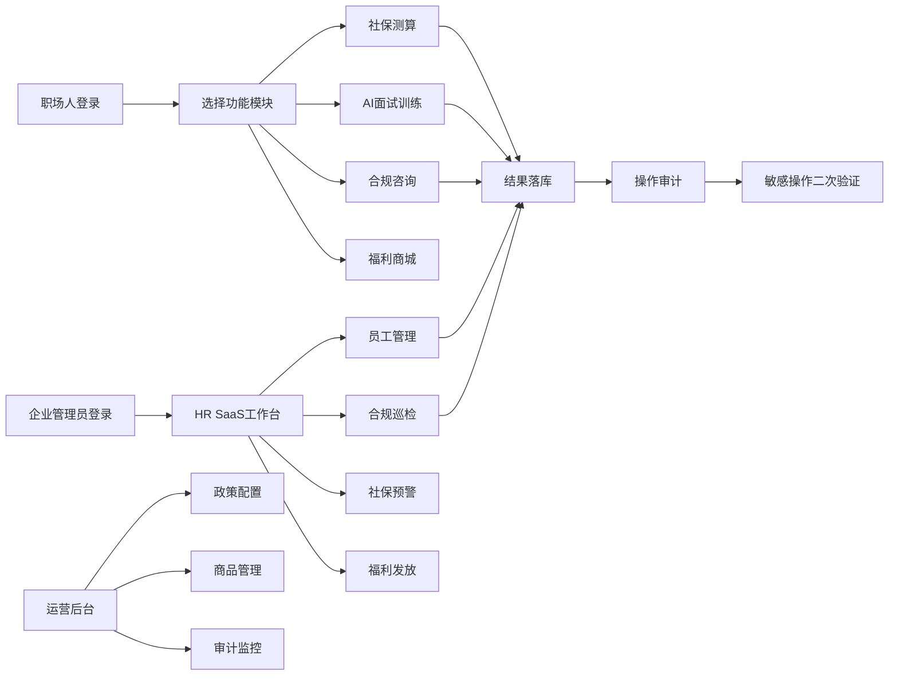

## 1. 产品概述

职场全生命周期数字助手平台是面向职场人和企业的一站式服务系统，覆盖社保公积金测算、就业能力提升、劳动关系合规、HR SaaS及员工福利商城五大业务域。通过AI驱动的智能服务，帮助职场人管理职业发展全周期，助力企业实现用工合规与数字化管理。

## 2. 核心功能

### 2.1 用户角色

| 角色 | 注册方式 | 核心权限 |
|------|---------|---------|
| 职场人用户 | 手机号/邮箱注册 | 社保测算、AI面试、劳动法咨询、福利商城购物 |
| 企业管理员 | 企业资质认证 | HR SaaS管理、合规巡检、员工福利管理、社保预警 |
| 平台运营 | 后台邀请 | 商品管理、政策配置、用户管理、数据统计 |

### 2.2 功能模块

1. **首页仪表盘**：数据概览、快捷入口、通知中心
2. **社保公积金测算**：跨省市政策引擎、个性化缴存建议、基数调整模拟
3. **就业能力提升**：AI模拟面试、简历关键词优化、职业技能评估
4. **劳动关系合规**：AI律师咨询、合同风险扫描、劳动法语义检索
5. **企业HR SaaS**：员工管理、合规巡检、社保变动预警、热力图分析
6. **员工福利商城**：商品浏览、权益核销、过期提醒、使用统计
7. **运营后台**：配置管理、用户管理、数据监控、审计日志

### 2.3 页面详情

| 页面名称 | 模块名称 | 功能描述 |
|---------|---------|---------|
| 首页仪表盘 | 数据概览卡片 | 社保缴纳状态、面试进度、合规分数、福利余额 |
| 首页仪表盘 | 快捷入口 | 快速访问核心功能模块 |
| 社保测算页 | 城市选择器 | 跨省市社保政策动态加载 |
| 社保测算页 | 基数计算器 | 五险一金缴纳明细、个性化建议 |
| AI面试页 | 对话界面 | 模拟面试对话树、实时反馈 |
| 简历优化页 | 文档上传 | OCR解析、关键词提取与优化建议 |
| 合规咨询页 | AI律师对话 | 劳动法问答、条款风险分析 |
| 合同扫描页 | 文档分析 | 劳动合同OCR、风险点标注与修订建议 |
| 企业后台首页 | 用工概览 | 人员统计、合规评分、预警信息 |
| 企业员工管理 | 员工列表 | 入职/离职管理、合同管理、社保状态 |
| 合规巡检页 | 自动巡检 | 合规体检报告、风险项追踪 |
| 福利商城首页 | 商品展示 | 分类浏览、推荐商品、搜索 |
| 商品详情页 | 权益详情 | 使用规则、有效期、核销方式 |
| 运营后台 | 政策配置 | 社保政策维护、城市细则管理 |
| 运营后台 | 商品管理 | 福利商品上下架、核销码管理 |
| 审计日志页 | 操作记录 | 敏感操作水印、二次验证记录 |

## 3. 核心流程

## 4. 用户界面设计

### 4.1 设计风格

- **主色调**：深海蓝 (#1a365d) - 专业、可信赖
- **辅助色**：
  - 科技蓝 (#3182ce) - 智能、创新
  - 成功绿 (#38a169) - 合规、安全
  - 警示橙 (#dd6b20) - 预警、提醒
  - 危险红 (#e53e3e) - 风险、错误
- **中性色**：浅灰 (#f7fafc) 到深灰 (#2d3748) 的渐变层次
- **按钮风格**：圆角8px，微悬浮效果，点击反馈
- **字体**：
  - 标题：Noto Sans SC - 现代感、可读性强
  - 正文：系统字体栈 - 跨平台一致性
- **布局风格**：卡片式布局 + 左侧导航 + 顶部状态栏
- **图标风格**：线性图标 + 适当圆角，保持专业简洁

### 4.2 页面设计概览

| 页面名称 | 模块名称 | UI元素 |
|---------|---------|--------|
| 首页仪表盘 | 数据概览 | 渐变卡片、数据可视化图表、微动画数字跳动 |
| 社保测算页 | 计算表单 | 步骤引导、实时计算、结果对比卡片 |
| AI对话页 | 聊天界面 | 消息气泡、打字动画、快捷回复 |
| 企业后台 | 数据大屏 | 热力图组件、趋势折线、预警指示器 |
| 福利商城 | 商品卡片 | 悬浮效果、角标标识、渐变标签 |

### 4.3 响应式

- **桌面优先设计**：1440px基准分辨率
- **平板适配**：1024px断点，侧边栏收起，内容区自适应
- **大屏优化**：1920px+断点，多栏布局，数据密度提升
- **触控优化**：最小点击区域44px，适当间距

### 4.4 动效规范

- 页面加载：渐进式加载，骨架屏占位
- 卡片悬浮：轻微上浮 + 阴影加深
- 数据更新：数字平滑过渡动画
- 表单交互：输入框聚焦动效，错误提示平滑滑入
- 对话框：缩放 + 淡入组合效果
