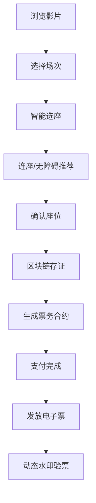
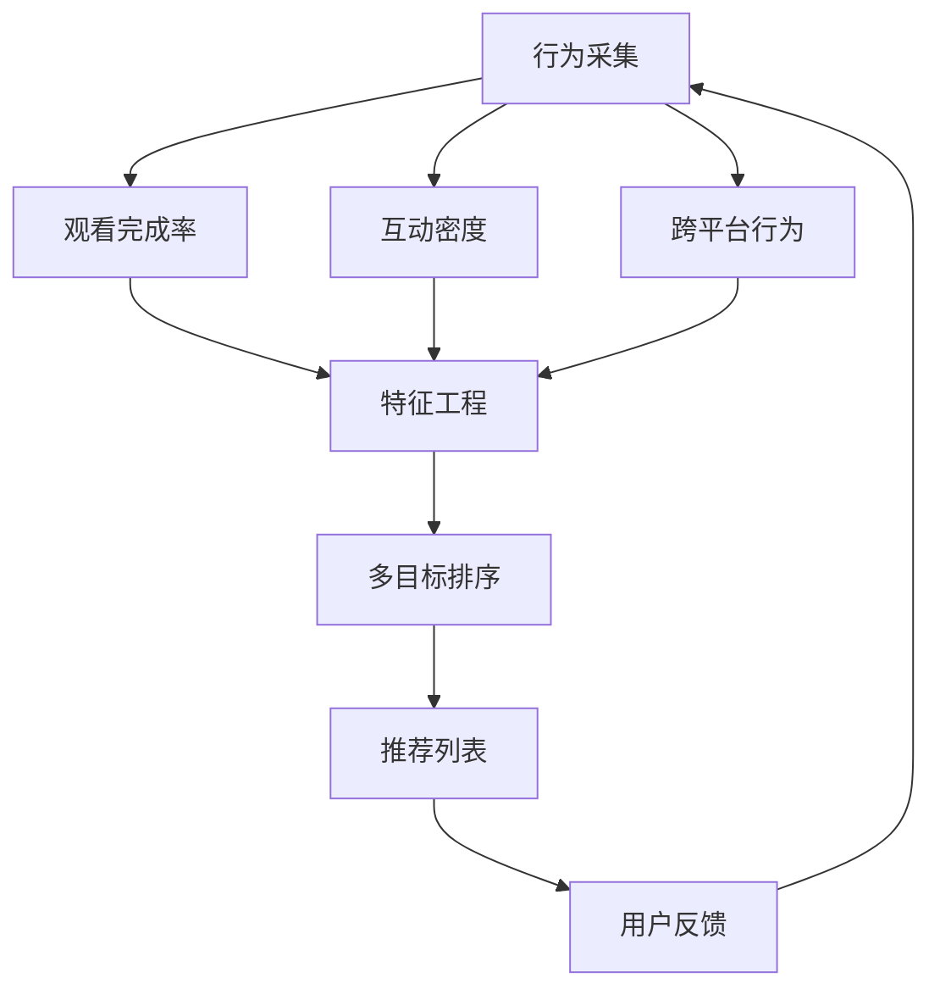

## 1. 产品概述

文娱内容消费与社区化决策平台，是集影片/演出信息聚合、智能选座购票、社区互动、会员权益于一体的综合性文娱消费决策平台。通过多源数据融合算法、区块链存证、智能推荐引擎等核心技术，为用户提供从内容发现到消费决策再到社区沉淀的全链路服务。

- 解决用户在文娱消费决策中信息不对称、选座体验差、票务真伪难辨等痛点
- 目标用户为城市年轻消费群体、影视/演出爱好者、艺术电影发烧友
- 市场价值在于打通内容-票务-社区-权益的完整闭环，打造文娱消费新生态

## 2. 核心功能

### 2.1 用户角色

| 角色 | 注册方式 | 核心权限 |
|------|----------|----------|
| 普通用户 | 手机号/邮箱注册 | 浏览内容、选座购票、社区互动、积分消费 |
| VIP会员 | 付费升级 | 专属权益、买一赠一券、优先购票、线下活动参与 |
| 运营管理员 | 后台登录 | 内容管理、排片管理、数据统计、监管上报 |
| 主办方 | 商户入驻 | 演出发布、票务管理、数据查看 |

### 2.2 功能模块

1. **首页**：影片/演出推荐轮播、话题热度榜单、分类导航、个性化推荐
2. **影片/演出详情页**：多源评分融合展示、话题热度趋势、主创IP信息、场次排期
3. **智能选座页**：3D视线角建模、连座推荐、无障碍席位高亮、区块链座位存证
4. **票务中心**：真票源直连、动态水印电子票、转赠/退改管理、合约存证查看
5. **会员中心**：积分池管理、买一赠一券发放、LBS活动推送、权益查询
6. **快看视频**：短视频推荐、多目标排序、互动数据统计
7. **艺术电影频道**：电影节排片联动、导演访谈专栏、影迷社群
8. **社区广场**：UGC内容发布、影评/剧评、话题讨论、关注关系
9. **管理后台**：内容审核、数据上报、排片管理、用户管理、系统设置

### 2.3 页面详情

| 页面名称 | 模块名称 | 功能描述 |
|----------|----------|-------------|
| 首页 | Hero轮播 | 热门影片/演出大图轮播，自动切换+手动控制 |
| 首页 | 热度榜单 | 实时话题热度排行，多维度筛选 |
| 首页 | 个性化推荐 | 基于用户行为向量的智能推荐卡片 |
| 首页 | 分类导航 | 电影/演出/艺术/快视频快速入口 |
| 影片详情 | 评分融合卡片 | 豆瓣/猫眼/灯塔多源评分加权展示 |
| 影片详情 | 热度趋势图 | 话题热度7天/30天趋势曲线 |
| 影片详情 | 主创影响力 | 导演/演员IP权重可视化 |
| 影片详情 | 排期列表 | 影院/场次/票价信息展示 |
| 智能选座 | 3D座位视图 | 视线角三维建模，可视区着色 |
| 智能选座 | 连座推荐 | 基于人数自动推荐最优连座 |
| 智能选座 | 无障碍高亮 | 轮椅位、陪同位特殊标识 |
| 票务中心 | 电子票夹 | 动态水印防伪，二维码实时刷新 |
| 票务中心 | 合约详情 | 区块链存证座位号、转赠限制、退改政策 |
| 会员中心 | 积分池 | 电影/演出通用积分，消费记录 |
| 会员中心 | 券包管理 | 买一赠一券智能发放、过期提醒 |
| 会员中心 | LBS活动 | 基于位置推送线下活动信息 |
| 快看视频 | 推荐流 | 无限滚动短视频，多目标排序 |
| 快看视频 | 互动面板 | 点赞/评论/转发密度实时统计 |
| 艺术电影频道 | 电影节专区 | 电影节排片联动、展映预约 |
| 艺术电影频道 | 导演访谈 | 专栏文章、视频访谈 |
| 艺术电影频道 | 影迷社群 | 主题讨论组、线下活动组织 |
| 社区广场 | UGC信息流 | 用户影评/剧评，关注动态 |
| 社区广场 | 内容发布 | 图文/长评发布，质量分计算 |
| 管理后台 | 数据概览 | 核心业务指标看板 |
| 管理后台 | 内容管理 | 影片/演出信息编辑、审核 |
| 管理后台 | 监管上报 | 国家电影专项资金数据接口 |
| 管理后台 | 用户管理 | 用户列表、权限配置 |

## 3. 核心流程

### 3.1 购票主流程

用户浏览影片详情 → 选择场次 → 进入智能选座 → 系统推荐最优座位 → 确认座位 → 生成区块链票务合约 → 支付 → 获得动态水印电子票 → 入场验票

### 3.2 内容推荐流程

用户行为采集 → 观影历史向量化 → 社交关系图谱 → 跨平台行为融合 → 多目标排序模型 → 生成个性化推荐列表

## 4. 用户界面设计

### 4.1 设计风格

**设计定位**：沉浸式电影美学 + 现代极简主义，营造大银幕般的视觉体验

- **主色调**：深邃藏青 `#0F172A` 作为背景基调，致敬电影放映厅的沉浸感
- **强调色**：影院红光 `#DC2626` 用于CTA按钮和重要提示，金色 `#D97706` 用于会员权益
- **辅助色**：银灰色 `#94A3B8` 用于次要信息，渐变紫 `#7C3AED` 用于艺术电影专区
- **字体选择**：展示字体使用具有电影感的`Playfair Display`，正文字体使用高可读性的`Noto Sans SC`
- **按钮风格**：微圆角（8px）+ 微妙悬停动画 + 按下反馈
- **布局风格**：卡片式布局 + 沉浸式大图 + 层次感阴影
- **图标风格**：线性图标，统一2px描边，来自lucide-react

### 4.2 页面设计概览

| 页面名称 | 模块名称 | UI元素 |
|----------|----------|--------|
| 首页 | Hero轮播 | 全屏渐变遮罩 + 大标题动效 + 渐入渐出切换 |
| 首页 | 热度榜单 | 排名徽章动画 + 热度条实时变化 |
| 首页 | 推荐卡片 | 海报悬停放大 + 评分标签悬浮 |
| 影片详情 | 评分融合 | 雷达图可视化多源评分 |
| 影片详情 | 热度趋势 | 平滑曲线图表 + 节点悬停详情 |
| 智能选座 | 3D视图 | 座位网格 + 视线角热区着色 |
| 智能选座 | 座位状态 | 已售/可选/已选/无障碍不同配色 |
| 票务中心 | 电子票 | 动态水印层叠 + 渐变边框 |
| 会员中心 | 积分展示 | 数字滚动动画 + 进度条 |
| 快看视频 | 播放卡片 | 垂直滑动 + 播放按钮脉冲动画 |
| 艺术电影 | 专区头部 | 胶片纹理背景 + 手写体标题 |

### 4.3 响应式设计

- **桌面优先**：1440px基准设计，栅格系统12列
- **平板适配**：1024px断点，侧边栏收起为抽屉
- **移动适配**：768px断点，底部导航栏，单列布局
- **触控优化**：最小触控区域44x44px，滑动手势支持

### 4.4 微交互与动画

- 页面加载：骨架屏 → 内容渐入，stagger延迟100ms
- 卡片悬停：Y轴上移4px + 阴影加深 + 边框高亮
- 按钮点击：scale(0.96) + 背景色过渡
- 滚动触发：元素进入视口时从底部滑入
- 数字变化：easeOutQuart缓动函数的数字滚动
