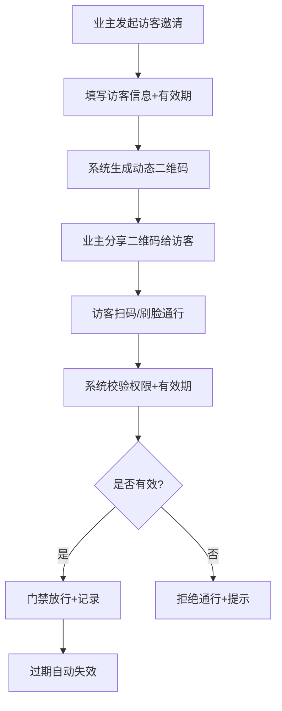
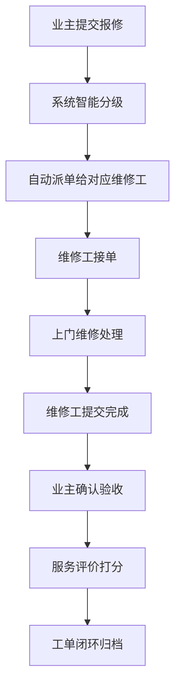

## 1. 产品概述

面向大型智慧社区的物业与生活服务融合平台，以碧桂园在管小区为落地单元，打造集无感通行、物业服务、社区商圈、邻里社交于一体的数字化社区生态。通过连接业主、物业、商户三方，实现社区管理智能化、生活服务便捷化、邻里关系温情化。

- 核心价值：解决传统物业效率低、业主办事难、社区资源分散的痛点，构建"一张屏管社区、一部手机办完事"的智慧社区新范式
- 目标用户：业主、租户、访客、物业员工、商户五类角色，覆盖社区全场景用户

## 2. 核心功能

### 2.1 用户角色

| 角色 | 注册方式 | 核心权限 |
|------|----------|----------|
| 业主 | 实名认证+房屋绑定 | 通行权限管理、报事报修、物业缴费、商圈消费、邻里社交 |
| 租户 | 业主授权+实名认证 | 临时通行、报事报修、商圈消费、邻里社交 |
| 访客 | 业主邀请二维码 | 临时通行权限（动态过期）、访客登记 |
| 物业员工 | 企业账号分配 | 工单处理、设备管理、数据查看、预警处理 |
| 商户 | 资质审核入驻 | 商品管理、优惠券发放、订单核销、经营数据查看 |

### 2.2 功能模块

1. **无感通行体系**：多模识别门禁、访客权限动态管理、通行记录追溯
2. **物业服务工单中心**：报事报修、分级响应、进度推送、服务评价
3. **社区商圈服务聚合**：商户入驻、优惠券、积分通兑、会员互通
4. **邻里社交空间**：实名制楼栋群、兴趣圈子、闲置流转、社区活动
5. **物业KPI驾驶舱**：工单及时率、投诉闭环率、设备在线率
6. **商户经营分析**：核销转化、复购频次、坪效排名
7. **社区风险预警**：高空抛物告警、消防通道占压、异常访客分析

### 2.3 页面详情

| 页面名称 | 模块名称 | 功能描述 |
|----------|----------|----------|
| 登录页 | 角色选择登录 | 支持五类角色差异化登录入口、实名认证引导 |
| 首页工作台 | 概览卡片 | 根据角色展示个性化首页、快捷入口、消息通知 |
| 通行管理页 | 门禁控制 | 人脸/二维码/蓝牙/NFC多模识别、访客邀请生成 |
| 工单中心页 | 工单列表 | 报事报修提交、分级派单、进度追踪、服务评价 |
| 商圈首页 | 商户列表 | 入驻商户展示、商品浏览、优惠券领取、积分兑换 |
| 邻里社交页 | 社区动态 | 楼栋群、兴趣圈子、闲置物品发布、活动报名 |
| 物业驾驶舱 | 数据大屏 | KPI指标展示、实时监控、趋势分析图表 |
| 商户后台页 | 经营分析 | 核销数据、复购分析、坪效排名、会员管理 |
| 风险预警页 | 告警中心 | 高空抛物、消防通道、异常访客实时告警与处置 |
| 个人中心页 | 账户管理 | 房屋档案、实名认证、积分查询、设置 |

## 3. 核心流程

### 3.1 访客邀请通行流程

业主在APP发起访客邀请，系统生成动态二维码并设置有效期，访客扫码通行，过期自动失效，所有通行记录自动留存。

### 3.2 报事报修工单流程

业主提交报修工单，系统自动分级派单，维修工接单处理，完成后业主评价，形成闭环。

## 4. 用户界面设计

### 4.1 设计风格

- **主色调**：智慧蓝 (#1E40AF) - 代表科技、专业、可信赖
- **辅助色**：活力橙 (#F97316) - 用于强调、交互、告警
- **中性色**：深灰 (#1F2937)、中灰 (#6B7280)、浅灰 (#F3F4F6)
- **设计语言**：现代简约+科技感，采用卡片式布局、圆角设计、细腻阴影
- **字体**：标题使用 "Noto Sans SC Bold"，正文使用 "Noto Sans SC Regular"
- **图标**：统一使用线性风格图标，保持视觉一致性
- **动效**：页面切换采用淡入淡出，按钮点击有缩放反馈，数据加载有骨架屏

### 4.2 页面设计概述

| 页面名称 | 模块名称 | UI元素 |
|----------|----------|--------|
| 首页工作台 | 概览卡片 | 渐变背景卡片、数据指标、快捷入口图标、消息气泡 |
| 通行管理页 | 门禁控制 | 二维码展示区、人脸识别按钮、访客列表卡片 |
| 工单中心页 | 工单列表 | 状态标签（不同颜色区分）、进度条、时间线 |
| 商圈首页 | 商户列表 | 轮播Banner、分类标签、商家卡片、优惠券角标 |
| 物业驾驶舱 | 数据大屏 | 深色背景、数据图表、实时告警闪烁效果 |
| 风险预警页 | 告警中心 | 告警等级颜色标识、处理按钮、历史记录时间轴 |

### 4.3 响应式设计

- **桌面端优先**：主要面向PC端物业管理人员和商户使用
- **平板适配**：横向展示完整布局，保持操作便捷性
- **移动端适配**：单列流式布局，底部导航栏，触控优化
- **触控优化**：按钮最小尺寸44x44px，表单间距适配手指操作

## 5. 非功能性需求

### 5.1 性能要求

- 页面首屏加载时间 < 2秒
- API响应时间 < 500ms
- 支持10000+用户并发访问
- 数据实时推送延迟 < 3秒

### 5.2 安全要求

- 所有接口HTTPS加密传输
- 敏感数据AES加密存储
- 多因素身份认证
- 操作日志完整可追溯
- 基于角色的权限控制(RBAC)

### 5.3 可用性要求

- 系统可用性 > 99.9%
- 数据每日自动备份
- 故障自动恢复机制
