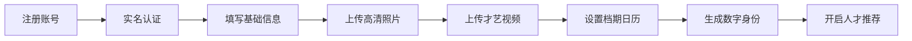
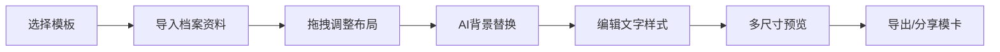
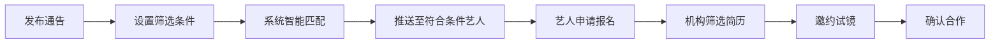

## 1. 产品概述

演艺行业人才数字身份基础设施，服务于模特、主播、演员及经纪机构。通过数字化艺人档案、智能匹配引擎、模卡自助生成等核心功能，构建连接人才与商业机会的高效平台，解决行业信息不对称、匹配效率低、资料管理混乱等痛点。

- **目标用户**：职业艺人（模特/主播/演员）、经纪机构、品牌方、广告公司、影视制作公司
- **核心价值**：标准化人才数字身份、智能化供需匹配、合规化数据管理、高效化业务流程

## 2. 核心功能

### 2.1 用户角色

| 角色 | 注册方式 | 核心权限 |
|------|----------|----------|
| 艺人用户 | 手机号/邮箱注册，实名认证 | 个人档案管理、模卡制作、档期管理、通告浏览与申请、授权管理 |
| 机构管理员 | 企业资质审核注册 | 艺人签约管理、通告发布、人才搜索、简历查看、联系记录管理 |
| 企业HR/ casting | 企业资质审核注册 | 通告发布、人才搜索、简历查看、邀约发送 |
| 系统管理员 | 后台账号 | 用户审核、数据管理、系统配置、权限管理 |

### 2.2 功能模块

1. **首页仪表盘**：数据概览、快捷入口、推荐通告/人才、消息通知
2. **艺人档案管理**：基础信息、高清正脸照/三视图、才艺视频、签约状态、档期日历
3. **模卡自助生成**：模板库、拖拽式编辑器、AI背景替换、多分辨率导出
4. **企业通告中心**：通告发布、预算设置、试镜要求、合同附件、申请管理
5. **人才库匹配引擎**：多维度筛选、标签匹配、地理位置搜索、档期冲突检测
6. **机构后台管理**：签约艺人管理、团队权限分级、联系记录归档
7. **数据安全中心**：GDPR授权管理、敏感信息脱敏、数据导出/删除申请

### 2.3 页面详情

| 页面名称 | 模块名称 | 功能描述 |
|----------|----------|----------|
| 登录/注册 | 身份验证 | 多角色注册入口、手机号/邮箱验证、企业资质上传 |
| 首页仪表盘 | 数据概览 | 关键指标卡片、待办事项、推荐内容、消息通知中心 |
| 艺人档案详情 | 信息展示 | 高清照片轮播、三视图展示、才艺视频播放、基本信息、标签云 |
| 艺人档案编辑 | 信息录入 | 分步骤表单、图片拖拽上传、视频上传、档期日历组件 |
| 模卡模板库 | 模板浏览 | 平台分类筛选、缩略图预览、收藏/使用记录 |
| 模卡编辑器 | 在线编辑 | 拖拽式布局、AI背景替换、文字样式编辑、实时预览 |
| 通告列表 | 浏览筛选 | 行业分类、预算范围、地理位置、发布时间筛选 |
| 通告发布 | 表单录入 | 多步骤表单、预算区间设置、试镜要求编辑、合同附件上传 |
| 通告详情 | 信息展示 | 企业信息、职位要求、申请流程、相似艺人推荐 |
| 人才库搜索 | 匹配引擎 | 多维度筛选面板、地理位置半径搜索、智能排序、档期校验 |
| 机构后台 | 管理中心 | 签约艺人列表、团队成员管理、权限配置、联系记录 |
| 数据安全中心 | 隐私管理 | 授权列表、敏感信息查看记录、数据导出/删除申请 |

## 3. 核心流程

### 3.1 艺人入驻与档案完善流程

### 3.2 模卡制作流程

### 3.3 通告发布与匹配流程

## 4. 用户界面设计

### 4.1 设计风格

- **主色调**：深邃黑金配色 `#1a1a2e`（午夜蓝）作为主背景，`#e94560`（玫瑰红）作为品牌主色，`#0f3460`（宝石蓝）作为辅助色
- **按钮风格**：圆角8px，渐变填充，悬停时微上浮+阴影增强，点击时缩小反馈
- **字体**：标题使用 "Playfair Display" 衬线字体营造时尚质感，正文使用 "Inter" 无衬线字体保证可读性
- **布局风格**：卡片式设计，网格布局，大量留白，层次分明的阴影系统
- **图标风格**：线性图标，统一2px描边，优雅简约

### 4.2 页面设计概述

| 页面名称 | 模块名称 | UI元素 |
|----------|----------|--------|
| 登录页 | 品牌展示区 | 全屏动态背景、品牌标语、动画入场效果、玻璃拟态登录卡片 |
| 仪表盘 | 数据卡片 | 毛玻璃效果卡片、数据渐变色、数字滚动动画、趋势微型图表 |
| 艺人档案 | 展示区 | 3D照片轮播、视频悬浮播放器、标签云动画、信息瀑布流 |
| 模卡编辑器 | 画布区 | 可拖拽元素、网格对齐、实时渲染、快捷键提示浮层 |
| 人才搜索 | 筛选面板 | 可折叠侧边栏、滑块组件、地图热力图、结果卡片悬停动效 |

### 4.3 响应式设计

- **桌面端优先**（1280px+）：三栏布局，完整功能面板
- **平板端**（768px-1279px）：两栏布局，筛选面板可折叠
- **移动端**（<768px）：单栏流式布局，底部导航栏，手势操作优化

### 4.4 动效与交互

- **页面加载**：骨架屏占位→内容淡入→元素错落动画（100ms间隔）
- **卡片悬停**：Y轴上浮4px + 阴影扩散 + 边框高光
- **按钮交互**：scale(0.98) 点击反馈，背景色渐变过渡
- **模态框**：背景模糊 + 缩放入场动画
- **数据更新**：数字滚动动画，进度条平滑过渡
