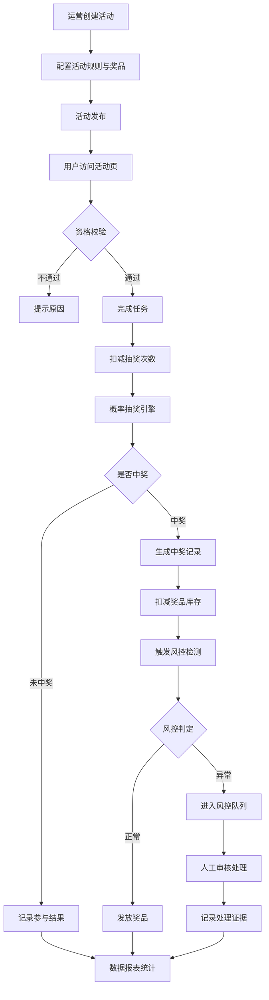

## 1. 产品概述

线上活动互动抽奖运营平台，服务于活动运营、用户、客服和财务角色，覆盖活动配置、参与资格校验、抽奖引擎、奖品发放、风控处理和数据复盘全链路。

- 解决活动运营效率低、抽奖公平性难保障、奖品发放混乱、风险无法及时管控、业务效果无法量化的问题
- 核心价值：一站式活动运营闭环，所有核心动作落库可审计，风控自动化+人工双轨

## 2. 核心功能

### 2.1 用户角色

| 角色 | 登录方式 | 核心权限 |
|------|----------|----------|
| 活动运营 | 账号密码 | 创建/编辑活动、配置抽奖规则、查看数据报表 |
| 普通用户 | 手机号/匿名 | 参与活动、完成任务、抽奖、查看我的奖品 |
| 客服 | 账号密码 | 查询用户参与记录、处理投诉、申请人工补发 |
| 财务 | 账号密码 | 查看中奖成本、审核补发、导出对账数据 |
| 风控管理员 | 账号密码 | 处理风控队列、封禁异常账号、查看风控证据 |

### 2.2 功能模块

1. **活动管理**：活动列表、创建/编辑活动、活动详情、活动上下架
2. **抽奖引擎**：用户资格校验、抽奖次数扣减、概率抽奖、中奖结果落库
3. **奖品中心**：奖品创建、库存管理、发放记录、物流跟踪、核销记录
4. **风控中心**：异常账号检测、设备刷量检测、同地址集中中奖检测、人工补发审批、处理证据链
5. **数据报表**：参与人数、转化率、中奖成本、奖品发放率、投诉统计
6. **用户端**：活动展示页、任务中心、抽奖页、我的奖品

### 2.3 页面详情

| 页面名称 | 模块名称 | 功能描述 |
|----------|----------|----------|
| 运营后台登录 | 登录模块 | 账号密码登录、权限校验 |
| 活动列表页 | 活动管理 | 活动列表搜索、筛选、上下架、新建入口 |
| 活动编辑页 | 活动配置 | 主题配置、时间配置、参与条件、抽奖规则、概率配置、奖品关联、页面模板 |
| 活动详情页 | 活动数据 | 活动概览、参与趋势、中奖记录、奖品消耗 |
| 奖品列表页 | 奖品管理 | 奖品搜索、分类筛选、库存查看、新建奖品 |
| 奖品编辑页 | 奖品配置 | 奖品类型（实物/优惠券/积分/虚拟）、库存、面值、有效期 |
| 奖品发放页 | 发放管理 | 发放记录、物流录入、核销操作、补发申请 |
| 风控队列页 | 风控中心 | 待处理风险列表、风险详情、处理操作（通过/驳回/封禁） |
| 风控证据页 | 风控证据 | 账号行为轨迹、设备指纹、IP聚合分析、处理历史 |
| 数据报表页 | 数据复盘 | 核心指标看板、趋势图、明细表、导出功能 |
| 用户活动页 | 用户端 | 活动主题展示、规则说明、任务列表、抽奖按钮 |
| 我的奖品页 | 用户端 | 中奖记录、奖品状态、物流查看、核销码 |

## 3. 核心流程

### 3.1 活动创建与发布流程

运营创建活动 → 配置主题/时间/参与条件 → 配置抽奖规则与概率 → 关联奖品与库存 → 预览活动页 → 审核发布 → 用户可见

### 3.2 用户参与抽奖流程

用户进入活动页 → 资格校验（登录/时间/任务/次数）→ 完成前置任务 → 扣减抽奖次数 → 概率抽奖 → 生成中奖记录 → 扣减奖品库存 → 发放奖品 → 记录参与日志

### 3.3 风控处理流程

异常行为触发 → 进入风控队列 → 风控员查看证据 → 判定处理（正常通过/驳回中奖/封禁账号/人工补发）→ 记录处理意见 → 同步结果

### 3.4 核心流程图

## 4. 用户界面设计

### 4.1 设计风格

- **主色调**：深邃蓝 `#1e3a8a`（专业可靠）、活力橙 `#f97316`（活动氛围）
- **辅助色**：成功绿 `#10b981`、警示红 `#ef4444`、中性灰 `#64748b`
- **按钮风格**：圆角 8px，渐变背景，hover 阴影提升，active 按压效果
- **字体**：标题使用 `Noto Sans SC` 700，正文使用 `Noto Sans SC` 400，数字使用 `JetBrains Mono`
- **布局风格**：左侧导航 + 顶部面包屑 + 右侧内容区，卡片式布局，充足留白
- **图标风格**：Lucide 线性图标，统一 20px 尺寸，1.5px 线宽

### 4.2 页面设计概览

| 页面名称 | 模块名称 | UI 元素 |
|----------|----------|----------|
| 活动列表页 | 数据表格 | 筛选器、搜索框、状态标签、操作列、分页 |
| 活动编辑页 | 表单配置 | 分栏布局、步骤条、实时预览、概率可视化滑块 |
| 奖品管理页 | 卡片列表 | 奖品卡片、库存进度条、类型标签、快捷操作 |
| 风控队列页 | 风险列表 | 风险等级徽章、证据链时间线、批量处理按钮 |
| 数据报表页 | 仪表盘 | KPI 卡片、趋势折线图、饼图占比、条件筛选 |
| 用户抽奖页 | 抽奖互动 | 大转盘/九宫格动画、中奖弹窗、粒子特效 |

### 4.3 响应式

- 桌面优先设计，适配 1280px 及以上
- 运营后台：平板端折叠侧边栏，移动端卡片重排
- 用户活动页：移动端优化触摸区域，大按钮设计，抽奖动画自适应

### 4.4 动效设计

- 页面加载：元素渐入 + 轻微上浮，stagger 延迟 50ms
- 抽奖动画：转盘旋转 3-5 圈后缓停，中奖结果缩放弹出
- 按钮交互：hover 时 translateY(-2px) + 阴影加深，active 时还原
- 数据更新：数字滚动动画，进度条平滑过渡
- 通知提示：右上角滑入，自动消失，可手动关闭
