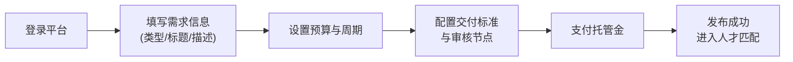
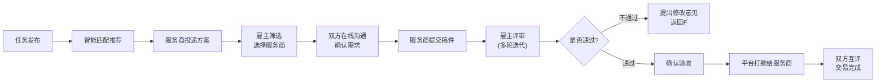
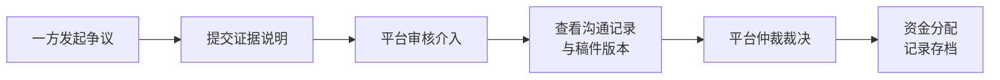

# 创意服务众包平台 - 产品需求文档 (PRD)

## 1. 产品概述

面向企业雇主的专业创意服务众包平台，连接企业雇主与各领域专业创意人才。解决企业在品牌设计、软件开发、知识产权等领域的灵活用工需求，通过标准化流程、资质认证、多轮评审与资金托管实现高效、合规、可追溯的创意服务交易闭环。

- **目标用户**：企业采购方、创意服务商（设计师/开发者/策划师等）、平台运营方
- **核心价值**：降低企业采购成本、提升创意服务交付质量、保障交易双方权益、留存知识产权证据

## 2. 核心功能

### 2.1 用户角色

| 角色 | 注册方式 | 核心权限 |
|------|----------|----------|
| 企业雇主 | 企业邮箱/手机号注册，资质认证 | 发布需求、查看人才库、发起沟通、稿件评审、验收打款、争议申诉 |
| 创意服务商 | 个人/机构注册，资质认证 | 浏览需求、投递方案、提交稿件、查看评分、提现管理 |
| 平台管理员 | 内部账号登录 | 任务看板、服务商分级、争议仲裁、合规审计、知识产权存证管理 |

### 2.2 功能模块

1. **工作台首页**：数据概览、待办事项、任务快捷入口、统计图表
2. **需求任务中心**：任务发布、任务列表、任务详情、任务状态追踪
3. **人才库中心**：服务商列表、人才详情、资质认证、作品展示、历史评分
4. **智能匹配推荐**：基于任务标签与服务商技能的双向匹配
5. **在线沟通系统**：任务聊天、文件传输、消息通知
6. **稿件评审系统**：稿件提交、多轮评审、版本对比、审核节点
7. **交易支付系统**：资金托管、验收打款、退款流程、财务流水
8. **后台管理系统**：任务看板、服务商管理、争议仲裁、合规审计、知识产权存证

### 2.3 页面详情

| 页面名称 | 模块名称 | 功能描述 |
|---------|----------|----------|
| 工作台首页 | 数据概览 | 任务统计、财务概览、待办提醒、趋势图表 |
| 工作台首页 | 快捷操作 | 快速发布需求、查看推荐人才、待处理任务入口 |
| 需求列表页 | 筛选导航 | 按类型、状态、预算、周期多维度筛选 |
| 需求列表页 | 任务卡片 | 展示任务标题、类型、预算、周期、状态、已投标数 |
| 需求发布页 | 基础信息 | 任务类型、标题、描述、标签选择 |
| 需求发布页 | 预算周期 | 预算区间、交付周期、里程碑节点设置 |
| 需求发布页 | 交付标准 | 交付物要求、验收标准、审核节点配置 |
| 任务详情页 | 任务信息 | 完整任务描述、预算、周期、状态时间线 |
| 任务详情页 | 投标管理 | 查看服务商投标、邀请投标、选择服务商 |
| 任务详情页 | 沟通区 | 与服务商在线沟通、文件共享 |
| 任务详情页 | 稿件区 | 稿件提交记录、版本对比、多轮评审操作 |
| 任务详情页 | 支付区 | 托管资金、验收打款、退款申请 |
| 人才库首页 | 筛选导航 | 按技能、评分、地域、认证等级筛选 |
| 人才库首页 | 人才卡片 | 头像、昵称、技能标签、评分、完成项目数 |
| 人才详情页 | 基本信息 | 个人简介、资质认证徽章、联系方式 |
| 人才详情页 | 作品集 | 作品展示、项目案例、客户评价 |
| 人才详情页 | 履约记录 | 历史项目、评分详情、交付准时率 |
| 消息中心 | 会话列表 | 按任务分组的聊天会话、未读提醒 |
| 消息中心 | 聊天窗口 | 文字消息、文件传输、稿件卡片 |
| 财务中心 | 账户概览 | 余额、冻结资金、累计收入/支出 |
| 财务中心 | 流水记录 | 充值、托管、打款、退款、提现记录 |
| 财务中心 | 提现管理 | 绑定银行卡、提现申请、提现记录 |
| 后台任务看板 | 状态看板 | 按状态分组的任务卡片、拖拽流转 |
| 后台任务看板 | 任务详情 | 完整任务信息、操作日志、争议记录 |
| 服务商管理 | 分级列表 | 服务商等级、认证状态、评分排行 |
| 服务商管理 | 资质审核 | 认证材料审核、等级调整操作 |
| 争议仲裁 | 争议列表 | 待处理争议、争议详情、证据查看 |
| 争议仲裁 | 仲裁操作 | 平台裁决、资金分配、记录存档 |
| 合规审计 | 操作日志 | 全量操作记录、按用户/时间/类型筛选 |
| 合规审计 | 知识产权存证 | 稿件哈希存证、时间戳、存证验证 |
| 登录页 | 登录表单 | 账号密码登录、手机号验证码登录 |
| 登录页 | 角色选择 | 企业雇主/服务商角色切换 |

## 3. 核心流程

### 3.1 雇主发布需求流程

### 3.2 任务执行完整流程

### 3.3 争议处理流程

## 4. 用户界面设计

### 4.1 设计风格

**美学方向：专业商务 + 科技感**
- **主色调**：深空蓝 `#1e3a5f` - 传达专业、可信赖
- **辅助色**：活力橙 `#f59e0b` - 强调行动按钮、重要提醒
- **成功色**：翡翠绿 `#10b981` - 验收通过、交易完成
- **警示色**：珊瑚红 `#ef4444` - 争议、逾期、错误
- **中性色**：冷灰系列 `#f8fafc #f1f5f9 #e2e8f0 #94a3b8 #475569 #1e293b`

**字体方案**：
- 标题字体：`"Noto Sans SC"` - 专业稳重
- 正文字体：`"Inter"` - 清晰易读
- 数字字体：`"JetBrains Mono"` - 金额、周期等数据展示

**视觉元素**：
- 卡片式布局，圆角 `8px`，精细边框 `1px solid #e2e8f0`
- 多层次阴影区分层级，悬停微交互
- 渐变背景点缀，数据可视化图表
- 图标使用 `lucide-react` 线性图标

### 4.2 页面设计概述

| 页面名称 | 模块名称 | UI 元素 |
|---------|----------|----------|
| 工作台首页 | 数据概览 | 指标卡片、趋势折线图、状态饼图、待办列表 |
| 需求列表页 | 筛选导航 | Tab 切换、下拉筛选器、搜索框、排序按钮 |
| 需求发布页 | 表单区域 | 分区表单、步骤指示器、实时预览、标签选择器 |
| 任务详情页 | 时间线 | 状态流转时间线、阶段进度条、节点状态标识 |
| 任务详情页 | 稿件评审 | 版本切换器、对比视图、批注工具、评分组件 |
| 人才详情页 | 作品集 | 图片瀑布流、作品卡片放大、标签筛选 |
| 消息中心 | 聊天窗口 | 消息气泡、文件卡片、时间分割线、输入工具栏 |
| 后台任务看板 | 看板视图 | 拖拽卡片、状态列、快捷操作菜单 |

### 4.3 响应式设计

- **桌面优先**：最小支持 `1280px` 宽度，优化 `1920px` 大屏展示
- **平板适配**：`768px - 1279px`，侧边栏收起为图标模式
- **触控优化**：按钮最小点击区域 `44x44px`，滚动区域流畅

### 4.4 动画与交互

- 页面加载：骨架屏 + 淡入动画（`opacity 0.3s ease`）
- 卡片悬停：阴影加深 + 轻微上移（`transform: translateY(-2px)`）
- 状态切换：平滑过渡（`transition: all 0.25s cubic-bezier(0.4, 0, 0.2, 1)`）
- 消息通知：右上角滑入 + 铃声图标动画
- 稿件上传：拖拽区域高亮 + 进度条动画
