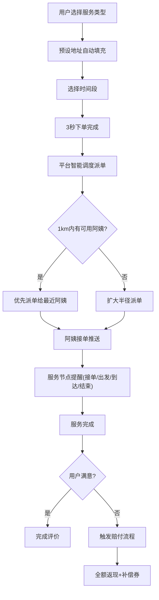
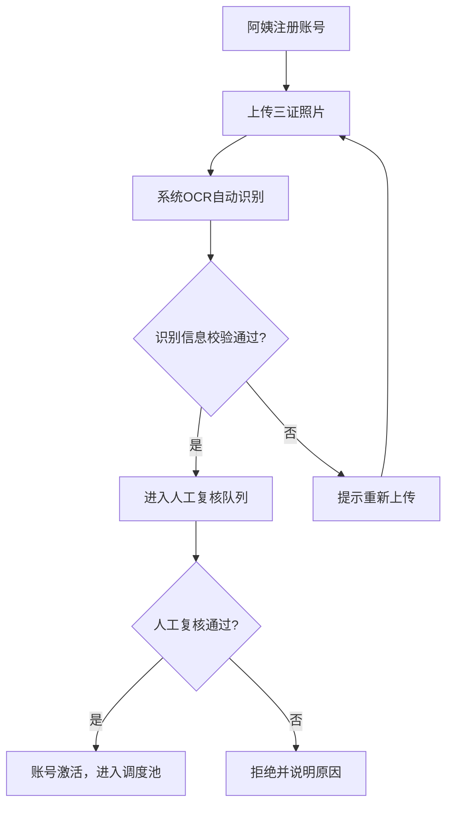

## 1. 产品概述

高品质家政服务履约调度平台，聚焦保洁、育婴、做饭等高频刚需场景，通过阿姨侧强管控、用户侧极简交互、后台智能调度三大核心体系，打造可信赖的家政服务生态。

- 目标用户：C端家庭用户、B端企业客户（物业/公寓运营商）、家政服务人员（阿姨）、平台运营管理员
- 核心价值：建立服务人员资质准入壁垒、实现智能派单调度、保障服务质量可追溯、提升用户下单体验

## 2. 核心功能

### 2.1 用户角色

| 角色 | 注册方式 | 核心权限 |
|------|----------|----------|
| C端用户 | 手机号注册/微信登录 | 下单、支付、评价、查看服务进度、申请赔付 |
| B端企业客户 | 企业认证注册 | 批量采购、定制服务包、企业账单管理 |
| 阿姨（服务人员） | 实名认证+三证审核 | 接单、服务打卡、查看评分、收入管理 |
| 平台管理员 | 后台账号登录 | 阿姨资质审核、订单调度、SOP管理、保险配置、质检分析 |

### 2.2 功能模块

1. **用户端首页**：服务类型选择、地址预设、3秒快速下单、我的订单
2. **阿姨端工作台**：证件上传审核、订单接收/处理、服务打卡、评分看板
3. **管理后台**：阿姨资质管理、订单调度中心、SOP文档库、保险SaaS配置、质检分析
4. **订单履约流程**：下单→派单→接单→出发→到达→服务→结束→评价→赔付
5. **服务质量回溯**：录音转文字质检、差评根因聚类、评分动态加权
6. **企业客户中心**：批量采购、定制化服务包、企业账单

### 2.3 页面详情

| 页面名称 | 模块名称 | 功能描述 |
|----------|----------|----------|
| 用户端首页 | Hero区域 | 品牌展示、服务类型快捷入口（保洁/育婴/做饭）、快速下单按钮 |
| 用户端首页 | 快速下单区 | 预设地址、服务类型、时间段选择，3秒完成下单 |
| 用户端首页 | 订单列表 | 进行中订单实时状态、历史订单查看 |
| 用户端订单详情 | 履约进度条 | 接单/出发/到达/结束节点提醒与时间戳 |
| 用户端订单详情 | 赔付入口 | 爽约自动赔付申请、全额返现+补偿券发放 |
| 阿姨端工作台 | 证件管理 | 身份证/健康证/无犯罪记录三证上传、OCR识别状态、人工复核进度 |
| 阿姨端工作台 | 订单池 | 附近1km订单优先展示、接单/拒单操作 |
| 阿姨端工作台 | 评分看板 | 准时率/客户好评/投诉率动态加权评分展示 |
| 阿姨端工作台 | 服务打卡 | 到达打卡、服务录音上传、完成确认 |
| 管理后台-调度中心 | 地图调度 | 基于地理位置热力图的1km优先派单、人工派单干预 |
| 管理后台-阿姨管理 | 资质审核 | 三证OCR识别结果展示、人工复核操作、黑名单管理 |
| 管理后台-SOP库 | 文档管理 | 各服务类型标准SOP文档上传、版本管理、阿姨端推送 |
| 管理后台-保险配置 | SaaS接口 | 保险产品配置、自动投保、保单查询 |
| 管理后台-质检中心 | 录音质检 | 录音转文字、关键词质检、差评根因聚类分析 |
| 企业客户中心 | 批量采购 | 服务包选择、批量下单、企业地址管理 |
| 企业客户中心 | 账单管理 | 月度账单、发票申请、消费统计 |

## 3. 核心流程

### 3.1 用户下单履约流程

用户选择服务类型→预设地址自动填充→选择时间段→3秒下单完成→平台基于位置热力图1km内优先派单→阿姨接单推送提醒→阿姨出发/到达实时节点推送→服务完成→用户评价→异常情况触发爽约自动赔付

### 3.2 阿姨资质审核流程

阿姨注册→上传三证（身份证/健康证/无犯罪记录）→系统OCR自动识别→识别结果比对校验→人工复核→审核通过激活账号→进入可调度阿姨池

## 4. 用户界面设计

### 4.1 设计风格

- **主色调**：暖橙色（#FF6B35）作为品牌主色，传递温暖、可信赖的家政服务氛围
- **辅助色**：深青色（#1A535C）用于专业感区域（管理后台）、米白色（#F7FFF7）作为背景色
- **按钮风格**：圆角胶囊型按钮，悬停有柔和阴影与微缩放动效
- **字体**：标题使用思源宋体（庄重可信赖），正文使用思源黑体（清晰易读）
- **布局风格**：卡片式布局，大留白设计，强调视觉呼吸感
- **图标风格**：线性简洁图标，搭配品牌色系

### 4.2 页面设计概览

| 页面名称 | 模块名称 | UI元素 |
|----------|----------|----------|
| 用户端首页 | Hero区域 | 大标题+温暖家庭场景插画、服务类型卡片网格、渐变背景叠加噪点纹理 |
| 用户端首页 | 快速下单区 | 地址胶囊标签、服务类型切换按钮组、时间选择器、悬浮下单按钮脉冲动画 |
| 用户端订单详情 | 履约进度条 | 节点式时间轴、当前节点发光高亮、状态标签色彩区分（绿/蓝/橙） |
| 阿姨端工作台 | 地图调度 | 热力图覆盖层、订单Marker点击展开、1km范围圆圈可视化 |
| 阿姨端工作台 | 评分看板 | 环形进度条展示综合评分、三项指标柱状图、趋势折线小图 |
| 管理后台-质检中心 | 聚类分析 | 词云展示差评关键词、问题分类饼图、趋势折线图 |

### 4.3 响应式设计

- 桌面端优先设计，适配1280px及以上宽度
- 用户端适配移动端，采用底部Tab导航
- 管理后台采用侧边栏+内容区经典布局，支持折叠侧边栏
- 地图区域在移动端全屏展示，桌面端与订单列表分栏布局

### 4.4 动效设计

- 页面加载：标题渐入+卡片错落上升动画（stagger 80ms）
- 订单状态变更：节点脉冲发光+滑入动画
- 下单按钮：持续微弱脉冲吸引注意力，点击有涟漪反馈
- 热力图：数据区域呼吸式渐变闪烁
- 卡片悬停：微妙上浮（translateY -2px）+ 阴影加深
