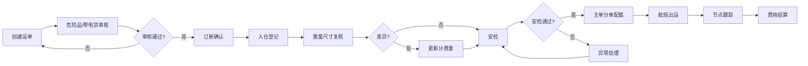

# 空运运单系统产品需求文档

## 1. 产品概述
航空货代空运运单管理系统，覆盖订舱、入仓、安检、主单分单、航班跟踪和费用结算全流程。
- 解决空运业务中时效要求高、单证准确性要求严格的业务痛点
- 目标用户：航空货代操作人员、客服、财务人员及客户

## 2. 核心功能

### 2.1 用户角色
| 角色 | 注册方式 | 核心权限 |
|------|----------|----------|
| 运营人员 | 后台创建 | 运单管理、入仓安检、主单分单、航班管理 |
| 客服人员 | 后台创建 | 运单查询、状态跟踪、客户通知 |
| 财务人员 | 后台创建 | 费用结算、对账管理 |
| 客户 | 注册/邀请 | 运单查询、节点订阅、费用查看 |

### 2.2 功能模块
1. **运单管理**：运单创建、编辑、查询、危险品审核
2. **入仓安检**：入仓登记、重量尺寸复核、安检记录、异常处理
3. **单证管理**：主单、分单、舱位对应、版本记录
4. **航班跟踪**：节点展示、状态更新、订阅提醒
5. **费用结算**：计费计算、费用对账、结算管理
6. **系统管理**：用户管理、基础数据配置

### 2.3 页面详情
| 页面名称 | 模块名称 | 功能描述 |
|---------|---------|----------|
| 首页仪表盘 | 数据概览 | 今日运单数、待安检、待结算、航班状态统计 |
| 运单列表页 | 运单管理 | 运单查询、筛选、新建、编辑、删除 |
| 运单详情页 | 运单详情 | 基础信息、发货人/收货人、件重体、品名航线、危险品审核 |
| 入仓安检页 | 入仓安检 | 入仓登记、实际件重体录入、异常照片上传、安检结果记录 |
| 单证管理页 | 单证管理 | 主单分单关联、舱位分配、版本历史、改配记录 |
| 航班跟踪页 | 航班跟踪 | 航班节点时间线、状态更新、订阅管理 |
| 费用结算页 | 费用结算 | 计费重计算、费用明细、对账管理、结算记录 |

## 3. 核心流程

## 4. 用户界面设计

### 4.1 设计风格
- 主色调：深蓝色(#165DFF)代表专业可靠，橙色(#FF7D00)代表时效警示
- 按钮风格：直角微圆角、清晰层次、悬停动效
- 字体：Inter 现代无衬线字体，保证数据表格可读性
- 布局风格：侧边导航+顶部工具栏+内容区的企业级布局
- 图标：线性图标为主，关键状态使用彩色图标

### 4.2 页面设计概览
| 页面名称 | 模块名称 | UI元素 |
|---------|---------|--------|
| 首页仪表盘 | 数据概览 | 统计卡片、状态进度条、待办事项列表、最近活动 |
| 运单列表页 | 运单管理 | 高级筛选栏、数据表格、批量操作、分页 |
| 运单详情页 | 运单详情 | 标签页布局、表单分组、状态标签、操作按钮组 |
| 入仓安检页 | 入仓安检 | 步骤指示器、照片上传区、异常标记、差异对比 |
| 航班跟踪页 | 航班跟踪 | 时间线组件、节点状态、订阅开关 |

### 4.3 响应式
- 桌面端优先设计，适配1280px及以上
- 平板端侧边导航可折叠
- 手机端简化为底部导航+卡片列表
