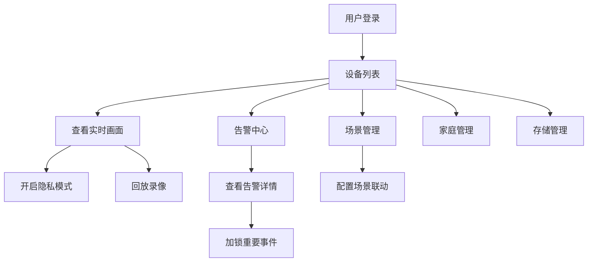

## 1. 产品概述

家庭安防IoT云平台客户端系统，核心支撑云视通协议设备（IPC/NVR）的快速接入与统一管理。面向家庭用户提供智能安防体验，同时为运营团队提供设备管理、OTA发布、数据分析等后台能力。

- 目标用户：家庭用户（多设备分组管理、成员权限分级）、平台运营人员
- 核心价值：零配置入网、智能场景联动、隐私保护、云端存储分级
- 市场定位：一站式家庭安防解决方案，覆盖从设备接入到运维的全链路

## 2. 核心功能

### 2.1 用户角色

| 角色 | 描述 | 核心权限 |
|------|------|----------|
| 家庭用户（所有者） | 家庭组创建者，设备绑定者 | 设备管理、成员管理、场景配置、存储管理、全部权限 |
| 家庭用户（管理员） | 被邀请的家庭成员 | 设备查看与控制、告警查看、场景管理 |
| 家庭用户（成员） | 普通家庭成员 | 设备查看、告警查看 |
| 家庭用户（查看者） | 临时访客 | 仅设备实时画面查看 |
| 平台管理员 | 平台运营人员 | 设备健康监控、审计日志、OTA灰度发布、数据统计 |

### 2.2 功能模块

**用户端功能：**
1. **设备管理**：设备列表、设备分组、在线/离线状态、设备详情、扫码绑定设备、Wi-Fi配置透传
2. **告警中心**：告警列表、告警详情、告警类型筛选、未读标记、重要事件加锁、告警删除
3. **智能场景**：场景列表、场景创建/编辑/删除、场景启用/禁用、手动触发场景
4. **隐私保护**：摄像头开关、音频采集开关、物理级锁定、隐私模式一键切换
5. **存储管理**：云存储套餐、SD卡管理、录像列表、重要录像加锁、存储空间告警
6. **家庭管理**：家庭成员列表、成员邀请、角色权限设置、成员移除

**管理端功能：**
1. **设备健康看板**：在线率统计、掉线频次、设备健康评分、录像完整性检测、存储告警
2. **用户行为审计**：操作日志、IP/时间/设备ID记录、操作类型筛选、日志导出
3. **OTA灰度发布中心**：固件版本管理、灰度发布策略、发布任务监控、按地域/型号分批推送

### 2.3 页面详情

**用户端页面：**

| 页面名称 | 模块名称 | 功能描述 |
|----------|----------|----------|
| 设备列表页 | 设备卡片网格 | 展示所有设备，显示在线状态、位置、缩略图 |
| 设备列表页 | 设备分组筛选 | 按分组筛选设备，支持分组管理 |
| 设备列表页 | 快速操作栏 | 一键布防/撤防、全部隐私模式、添加设备 |
| 设备详情页 | 实时视频预览 | 实时画面播放、截图、录像、语音对讲 |
| 设备详情页 | 云台控制 | 方向控制、变焦、预置位 |
| 设备详情页 | 隐私控制 | 摄像头开关、音频开关、物理锁定 |
| 设备详情页 | 存储信息 | 存储空间使用情况、SD卡状态 |
| 设备详情页 | 录像回放 | 时间轴录像回放、事件录像、下载/加锁 |
| 告警中心页 | 告警列表 | 按时间倒序的告警列表，支持多维度筛选 |
| 告警中心页 | 告警详情 | 告警缩略图、视频回放、事件加锁、删除 |
| 场景联动页 | 场景卡片 | 场景列表展示，启用/禁用切换 |
| 场景联动页 | 场景编辑 | 触发条件配置、动作配置、设备选择 |
| 家庭管理页 | 成员列表 | 家庭成员展示，角色标签 |
| 家庭管理页 | 成员邀请 | 邀请新成员，设置角色权限 |
| 存储服务页 | 套餐展示 | 云存储套餐对比，订阅管理 |
| 存储服务页 | SD卡管理 | 格式化、健康检测、容量信息 |

**管理端页面：**

| 页面名称 | 模块名称 | 功能描述 |
|----------|----------|----------|
| 健康概览看板 | 统计卡片 | 设备总数、在线率、平均健康分、今日告警数 |
| 健康概览看板 | 趋势图表 | 在线率趋势、告警趋势折线图 |
| 健康概览看板 | 设备健康列表 | 各设备健康详情，支持排序筛选 |
| 设备健康详情 | 离线记录 | 设备离线历史记录统计 |
| 设备健康详情 | 录像完整性 | 按小时展示录像完整度热力图 |
| 审计日志页 | 日志列表 | 操作日志分页列表，支持多条件筛选 |
| 审计日志页 | 日志详情 | 操作明细、IP地址、设备信息 |
| OTA管理页 | 固件版本列表 | 各型号固件版本管理 |
| OTA管理页 | 发布任务列表 | 灰度/全量发布任务监控 |
| OTA管理页 | 创建发布任务 | 选择固件、推送策略、地域/型号选择 |

## 3. 核心流程

### 3.1 设备绑定流程
用户通过扫码添加设备 → 系统识别设备序列号 → 自动获取设备当前Wi-Fi信息 → 用户输入家庭Wi-Fi密码 → 云端下发Wi-Fi配置 → 设备连接Wi-Fi上线 → 自动绑定到用户家庭组

### 3.2 智能场景联动流程
配置触发条件（人形识别/移动侦测/定时/手动） → 配置联动动作（录像/消息推送/灯光/警笛/隐私模式） → 场景启用 → 事件触发条件满足 → 执行预设动作序列 → 推送执行结果

### 3.3 隐私保护流程
用户触发隐私模式 → 指令加密下发 → 设备端物理层关闭摄像头/音频传感器 → 返回确认状态 → 状态同步到云端 → 记录操作审计日志

### 3.4 OTA灰度发布流程
上传新固件版本 → 创建发布任务 → 选择灰度策略（地域/型号/比例） → 开始发布 → 监控升级进度 → 根据成功率决定扩量或回滚 → 全量发布

## 4. 用户界面设计

### 4.1 设计风格

**整体定位：科技感、安全感、简洁专业**

- **主色调**：深空蓝 (#165DFF) - 代表科技与信任
- **辅助色**：翡翠绿 (#00B42A) - 在线/正常状态；警示橙 (#FF7D00) - 警告状态；危险红 (#F53F3F) - 告警/危险状态
- **中性色**：深灰 (#1D2129) - 主要文字；中灰 (#4E5969) - 次要文字；浅灰 (#C9CDD4) - 边框/分割线
- **背景色**：深灰蓝 (#F2F3F5) 页面背景，白色卡片背景

**设计语言：**
- 卡片式布局，圆角 12px，柔和阴影
- 按钮：大圆角 8px，主按钮实色填充
- 字体：PingFang SC / HarmonyOS Sans - 现代无衬线中文字体
- 图标：线性图标，2px 描边

**动效：**
- 页面切换：淡入 + 轻微上移
- 卡片悬停：上浮 + 阴影加深
- 开关切换：平滑过渡动画
- 告警提示：呼吸灯效果

### 4.2 页面设计概览

| 页面名称 | 模块名称 | UI 元素 |
|----------|----------|---------|
| 设备列表 | 顶部导航 | 家庭名称下拉、消息图标、用户头像 |
| 设备列表 | 设备卡片网格 | 设备缩略图、在线状态指示灯、设备名称、位置标签 |
| 设备列表 | 分组标签栏 | 横向滚动分组标签，支持快速切换 |
| 设备详情 | 视频区域 | 大尺寸实时视频，底部悬浮控制栏 |
| 设备详情 | 信息面板 | 设备信息、存储、隐私控制 Tab 切换 |
| 告警中心 | 时间轴列表 | 左侧时间轴，右侧告警卡片，未读数角标 |
| 场景联动 | 场景卡片 | 卡片式展示，开关按钮，触发条件图标 |
| 家庭管理 | 成员列表 | 头像 + 姓名 + 角色标签 + 操作按钮 |
| 健康看板 | 数据大屏 | 统计卡片、趋势图表、设备列表 |
| OTA管理 | 任务面板 | 进度条、状态标签、设备统计 |

### 4.3 响应式

- 设计策略：桌面端优先，平板自适应，移动端单列布局
- 断点：1440px / 1024px / 768px / 375px
- 触摸优化：移动端按钮最小 44x44px，手势滑动支持

## 5. 非功能需求

### 5.1 性能
- 首屏加载 < 2s
- 页面切换 < 300ms
- 视频直播延迟 < 500ms
- 告警推送延迟 < 2s

### 5.2 安全
- 所有通信 HTTPS 加密
- 隐私模式指令端到端加密
- 用户数据隔离，家庭组数据不互通
- 操作审计日志不可篡改

### 5.3 兼容性
- Chrome 90+ / Safari 14+ / Firefox 88+
- iOS 13+ / Android 8+
- 响应式适配主流分辨率
