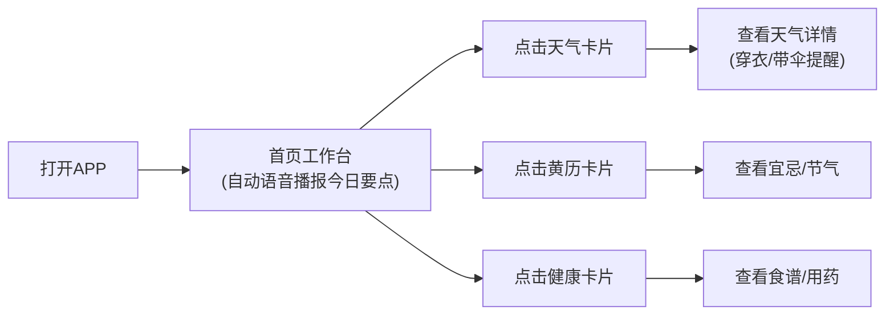
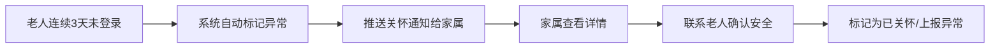
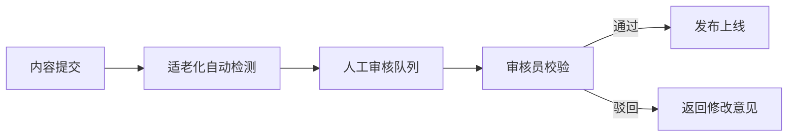

## 1. 产品概述

专为50岁以上中老年用户打造的一站式数字生活服务平台，解决老年人使用智能设备的痛点，提供天气、黄历、健康等核心生活服务，同时通过家属协同功能保障老年人安全与健康。

- 核心价值：让老年人轻松享受数字生活，降低使用门槛，保障身心健康
- 市场定位：国内银发经济市场，覆盖中老年用户及其家属群体

## 2. 核心功能

### 2.1 用户角色

| 角色 | 注册方式 | 核心权限 |
|------|----------|----------|
| 老年用户 | 手机号注册/家属代注册 | 使用天气、黄历、健康等所有核心功能，配置无障碍设置 |
| 家属账号 | 手机号注册+绑定老人账号 | 查看老人使用数据、接收异常预警、管理用药提醒 |
| 审核员 | 管理员分配 | 审核图文/音频内容，确保适老化质量 |

### 2.2 功能模块

1. **首页工作台**：无障碍设置入口、核心功能快捷卡片、今日重要提醒
2. **天气服务**：IP定位天气、体感温度、紫外线、洗车指数、穿衣/带伞强提醒
3. **农历黄历**：宜忌解析、节气养生、纪念日标记、传统节日提醒
4. **健康知识库**：食谱推荐、八段锦视频、用药提醒、慢性病管理
5. **家属中心**：账号绑定、异常预警、关怀通知、使用数据查看
6. **内容审核后台**：内容审核流、人工校验、适老化编辑

### 2.3 页面详情

| 页面名称 | 模块名称 | 功能描述 |
|---------|---------|----------|
| 首页工作台 | 无障碍设置栏 | 字号调整(大/中/超大)、对比度切换(标准/高对比)、语音播报开关 |
| 首页工作台 | 天气卡片 | 显示当前温度、体感温度、天气图标、穿衣/带伞强提醒 |
| 首页工作台 | 黄历卡片 | 今日农历、宜忌事项、节气养生提示 |
| 首页工作台 | 健康卡片 | 今日用药提醒、推荐食谱、运动建议 |
| 天气详情页 | 精细化天气 | 24小时预报、7天预报、紫外线强度、洗车指数、空气质量 |
| 天气详情页 | 生活指数 | 穿衣指数、带伞提醒、运动指数、过敏指数 |
| 黄历详情页 | 宜忌解析 | 宜/忌事项列表、每项详细说明、传统习俗解释 |
| 黄历详情页 | 节气养生 | 当前节气养生建议、饮食调理、穴位按摩指导 |
| 黄历详情页 | 纪念日管理 | 添加/编辑生日、纪念日、重要日期提醒 |
| 健康中心页 | 食谱推荐 | 按年龄/慢性病标签筛选、食材清单、做法步骤 |
| 健康中心页 | 八段锦教学 | 视频播放、分解动作说明、每日练习提醒 |
| 健康中心页 | 用药提醒 | 药品管理、服药时间提醒、用药记录 |
| 家属中心页 | 账号绑定 | 绑定/解绑老人账号、权限管理 |
| 家属中心页 | 异常预警 | 连续3天未使用提醒、健康异常告警 |
| 家属中心页 | 使用统计 | 老人使用时长、功能访问记录、健康数据概览 |
| 审核后台页 | 内容审核 | 待审核列表、图文/音频预览、审核通过/驳回 |
| 审核后台页 | 审核记录 | 历史审核记录、审核统计、编辑团队管理 |

## 3. 核心流程

### 3.1 老年用户使用流程

### 3.2 家属关怀流程

### 3.3 内容审核流程

## 4. 用户界面设计

### 4.1 设计风格

- **主色调**：暖橙色(#FF7A45) - 温暖、活力、亲切
- **辅助色**：深青色(#2C7A7B) - 稳重、专业、健康
- **高对比模式**：纯黑(#000000)背景 + 亮黄(#FFD700)文字
- **按钮风格**：大圆角(16px)、大尺寸(最小48x48px)、阴影柔和、点击反馈明显
- **字体**：
  - 标题：Noto Sans SC Bold - 清晰醒目
  - 正文：Noto Sans SC Regular - 易读性强
  - 字号：标准18px / 大号22px / 超大号26px
- **布局风格**：卡片式布局、大间距、清晰分区、避免信息拥挤
- **图标风格**：线性粗线条图标、配色鲜明、语义明确

### 4.2 页面设计概述

| 页面名称 | 模块名称 | UI元素 |
|---------|---------|--------|
| 首页工作台 | 无障碍设置栏 | 固定在顶部、大按钮、图标+文字、状态指示 |
| 首页工作台 | 功能卡片 | 大卡片、大图标、大标题、微动效、点击缩放反馈 |
| 天气详情页 | 温度显示 | 超大字号温度、体感温度标注、天气图标动画 |
| 天气详情页 | 强提醒 | 醒目标签、语音播报按钮、颜色编码标识 |
| 黄历详情页 | 宜忌区域 | 绿色宜区、红色忌区、大字号事项列表 |
| 健康中心页 | 视频模块 | 大播放按钮、音量控制、播放进度大滑块 |
| 家属中心页 | 预警卡片 | 红色醒目标识、一键呼叫按钮、紧急联系信息 |

### 4.3 响应式设计

- **桌面优先**：1280px及以上，卡片横向排列
- **平板适配**：768px-1279px，两列布局
- **手机适配**：375px-767px，单列布局，底部导航
- **触摸优化**：所有可点击元素最小48x48px，触摸反馈明显

### 4.4 无障碍设计规范

- **字号配置**：三级字号切换，所有元素同步缩放
- **对比度**：标准模式(4.5:1)、高对比模式(10:1)
- **语音播报**：Web Speech API，支持中文男声/女声切换
- **键盘导航**：完整Tab键导航，焦点状态清晰可见
- **屏幕阅读器**：ARIA标签完整，语义化HTML结构
- **操作路径**：所有核心功能不超过3步到达
