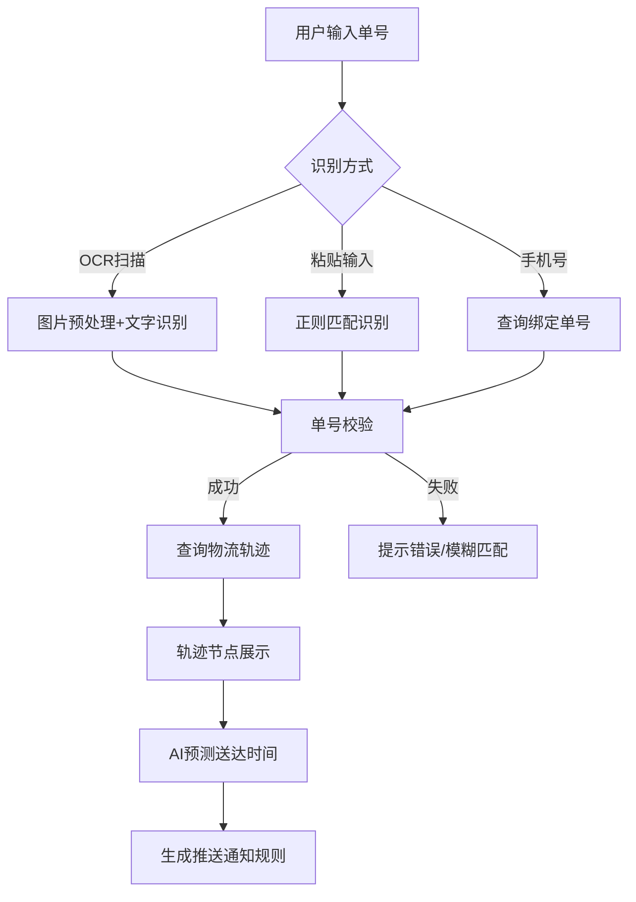
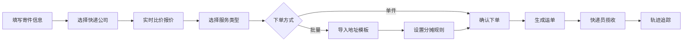
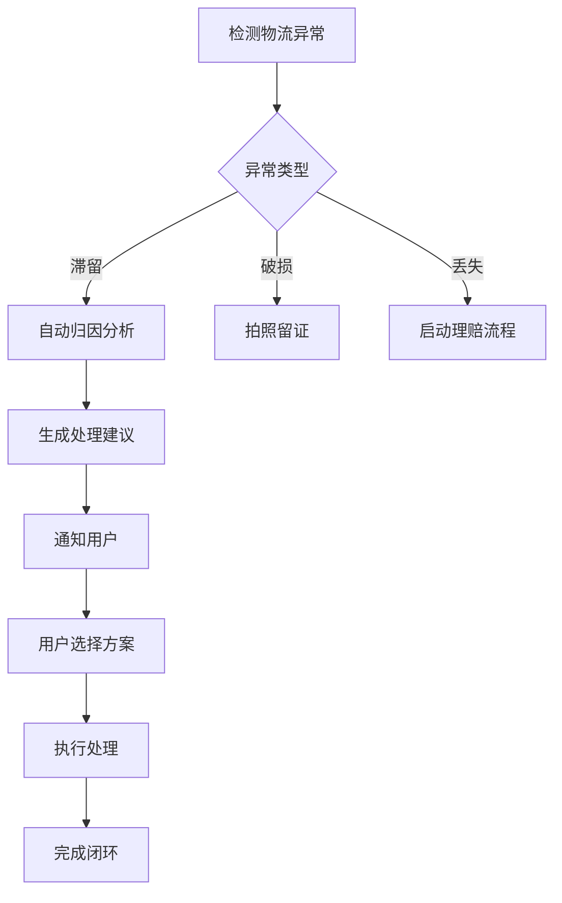
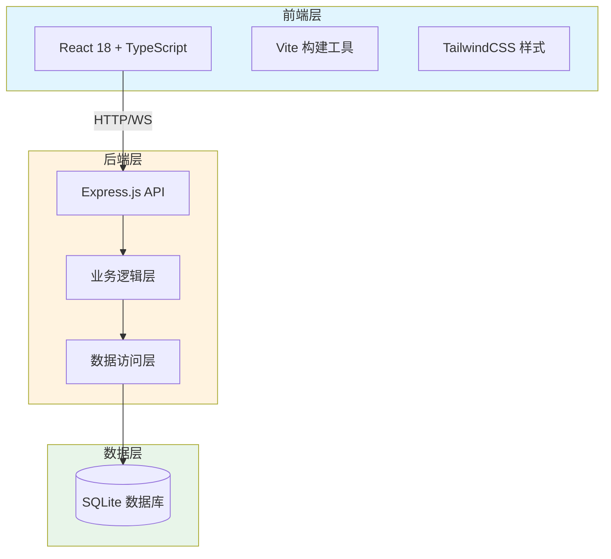

# 快递物流全链路数智化服务平台 PRD

## 1. 产品概述

快递物流全链路数智化服务平台是面向个人用户、中小商家、快递公司三方协同的一体化物流解决方案。通过整合3000+快递公司元数据、智能轨迹追踪、AI预测送达时间等核心能力，提供从下单、比价、追踪到售后的全流程数字化服务。

**核心价值**：
- 多源识别：支持OCR扫描、粘贴输入、手机号绑定等多种单号识别方式
- 智能比价：跨公司实时报价，辅助用户选择最优方案
- 批量寄件：支持多地址模板和运费分摊，提升商家效率
- 同城急送：20分钟响应SLA，满足即时配送需求
- 国际服务：清关指引和专属顾问，降低跨境物流门槛

**目标用户**：
- 个人用户：日常寄收快递需求
- 中小商家：批量发货和物流管理需求
- 快递公司：接入平台获取订单，提升运营效率

## 2. 核心功能

### 2.1 用户角色

| 角色 | 注册方式 | 核心权限 |
|------|----------|----------|
| 个人用户 | 手机号注册 | 查询追踪、发起寄件、管理地址簿 |
| 商家用户 | 企业认证 | 批量寄件、运费分摊、API接入 |
| 快递公司 | 资质审核 | 运单管理、轨迹上报、绩效查看 |
| 平台管理员 | 系统分配 | 公司接入审核、异常监控、运营数据 |

### 2.2 功能模块

#### 2.2.1 用户端功能

1. **首页**：快捷入口（查快递、寄快递）、热门服务、订单状态概览
2. **单号识别模块**：OCR扫描、手动粘贴、手机号绑定查询
3. **物流追踪模块**：实时轨迹展示、节点时间轴、AI预测送达时间
4. **寄件下单模块**：
   - 单件寄件：快速下单、选择快递公司、预估运费
   - 跨公司比价引擎：多家快递实时报价、时效对比
   - 批量寄件：多地址模板、运费分摊规则
5. **同城急送模块**：取件码聚合、20分钟响应调度、实时骑手位置
6. **国际寄件模块**：清关文档模板、申报价值计算、1v1顾问工单
7. **个人中心**：地址簿管理、订单历史、发票管理、消息通知

#### 2.2.2 快递公司端功能

1. **运单管理**：揽收录入、轨迹上报、状态更新
2. **接入网关**：API对接、回调配置、异常预警
3. **绩效看板**：日均单量、时效达成率、投诉率

#### 2.2.3 管理员端功能

1. **公司接入审核**：资质验证、合同管理、服务配置
2. **异常物流分析**：自动归因分类、处理建议、升级流程
3. **运营数据看板**：订单量趋势、快递公司占比、客诉分析
4. **企业客户管理**：API密钥管理、用量统计、账单结算

## 3. 核心流程

### 3.1 查件流程



### 3.2 寄件流程



### 3.3 异常处理流程



## 4. 用户界面设计

### 4.1 设计风格

**视觉定位**：科技感与亲和力并存，体现物流行业的专业性和服务的温度

**色彩体系**：
- 主色：#1E40AF（深邃蓝，代表信任与稳定）
- 辅助色：#10B981（生机绿，代表时效与活力）
- 警示色：#F59E0B（琥珀橙，用于异常提醒）
- 背景色：#F8FAFC（浅灰白，简洁专业）
- 文字色：#1F2937（深灰黑，高可读性）

**字体方案**：
- 主字体：思源黑体（Source Han Sans CN）- 简洁现代
- 数字字体：Roboto Mono - 物流单号的清晰展示

**按钮风格**：
- 圆角矩形，半径8px
- 阴影：0 2px 8px rgba(0,0,0,0.1)
- Hover态：上浮2px，阴影加深
- 点击态：下沉1px

**布局风格**：
- 卡片式布局为主，模块清晰
- 顶部导航固定
- 底部快捷操作栏（移动端）
- 左侧边栏（PC端管理后台）

**图标风格**：
- 线性图标为主
- 物流相关图标：快递盒、卡车、飞机、定位等

### 4.2 页面设计概览

| 页面名称 | 模块名称 | UI元素说明 |
|----------|----------|------------|
| 首页 | 快捷入口区 | 大图标按钮组：查快递、寄快递、同城送、国际件 |
| 首页 | 订单概览卡 | 订单统计卡片：待揽收/运输中/已完成 |
| 查件页 | 单号输入区 | 输入框+OCR按钮+手机号切换Tab |
| 查件页 | 轨迹展示区 | 时间轴组件+节点图标+地图轨迹 |
| 查件页 | 预测送达卡 | AI预测时间+置信度显示 |
| 寄件页 | 寄件表单 | 收寄地址选择器+物品信息+备注 |
| 寄件页 | 比价面板 | 快递公司卡片组+价格排序+时效排序 |
| 寄件页 | 地址模板 | 表格编辑区+导入导出按钮 |
| 同城急送 | 调度面板 | 地图+骑手位置+20分钟倒计时 |
| 国际件 | 清关指南 | 分步表单+文档模板下载 |
| 管理后台 | 公司接入 | 审核列表+详情侧滑抽屉 |
| 管理后台 | 异常分析 | 图表看板+异常分类统计 |

### 4.3 响应式策略

- **PC端（>1200px）**：左侧导航+右侧内容区，三栏布局
- **平板端（768-1200px）**：顶部导航收缩为汉堡菜单
- **移动端（<768px）**：单栏布局，底部Tab导航

### 4.4 动画交互

- **页面切换**：淡入淡出，300ms ease-out
- **卡片加载**：骨架屏+渐显，stagger 50ms
- **按钮点击**：涟漪效果扩散
- **轨迹节点**：逐个点亮动画
- **倒计时**：数字滚动效果

## 5. 技术架构

### 5.1 系统架构图



### 5.2 技术选型

| 层级 | 技术栈 | 说明 |
|------|--------|------|
| 前端框架 | React 18 + TypeScript | 组件化开发，强类型保障 |
| 构建工具 | Vite 5 | 快速冷启动，HMR热更新 |
| UI框架 | TailwindCSS 3 | 原子化CSS，快速定制 |
| 后端框架 | Express.js 4 | 轻量级Node.js框架 |
| 数据库 | SQLite | 文件数据库，零配置 |
| 开发规范 | ESLint + Prettier | 代码风格统一 |

### 5.3 端口配置

- **前端端口**：44817（40000 + 4817）
- **后端端口**：54817（50000 + 4817）
- **环境变量**：.env 文件统一管理

### 5.4 项目结构

```
may-88817/
├── frontend/                 # 前端项目
│   ├── src/
│   │   ├── components/      # 公共组件
│   │   ├── pages/           # 页面组件
│   │   ├── hooks/           # 自定义Hooks
│   │   ├── services/        # API服务
│   │   └── utils/           # 工具函数
│   └── package.json
├── backend/                  # 后端项目
│   ├── routes/              # 路由定义
│   ├── services/            # 业务逻辑
│   ├── models/              # 数据模型
│   ├── middleware/          # 中间件
│   └── index.js             # 入口文件
├── data/                     # 数据目录
│   └── app.sqlite           # SQLite数据库
├── .env                      # 环境变量
└── package.json             # 根目录脚本
```
