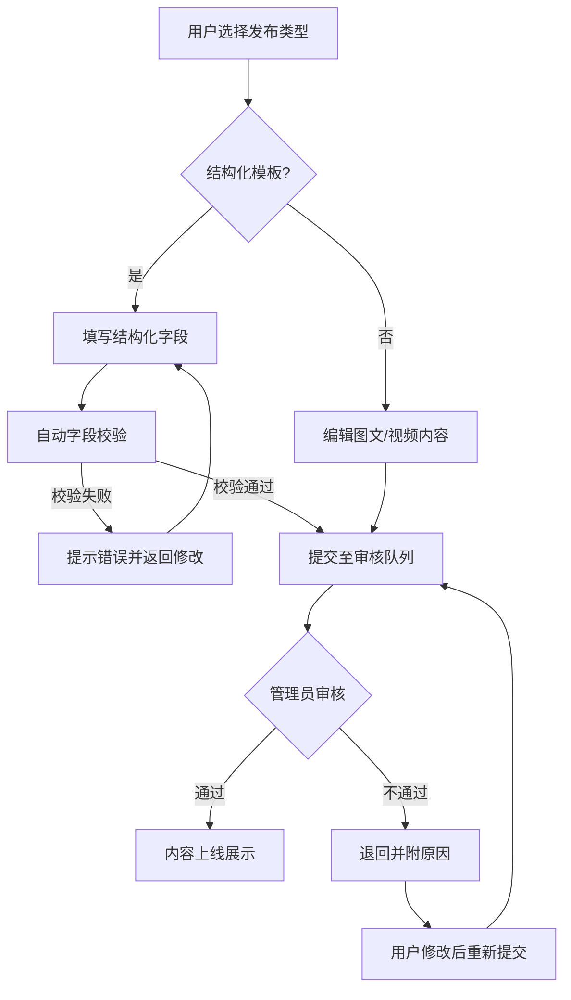
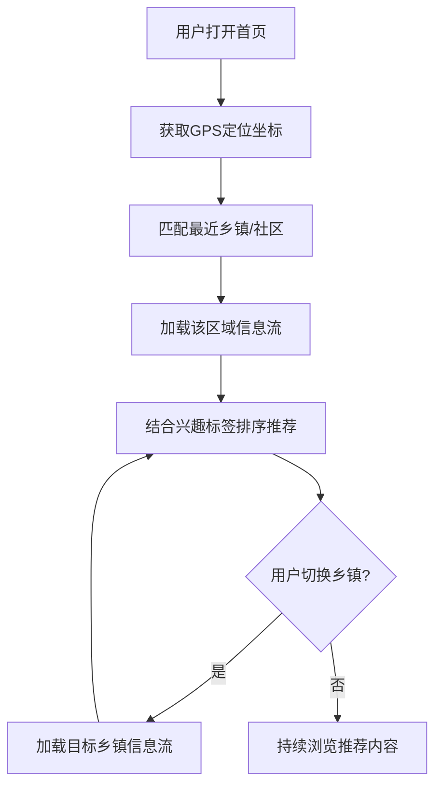
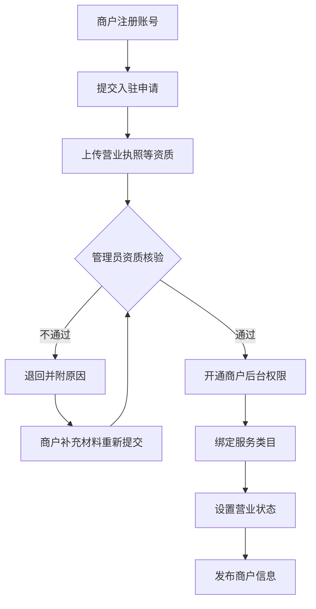

## 1. 产品概述

镇雄本地通——聚焦镇雄县全域的县域级本地生活信息聚合与服务分发平台，解决县域居民信息获取分散、本地商户触达困难、民生服务入口缺失的痛点。
- 核心目标：构建镇雄县最可信的本地信息枢纽，覆盖全县30个乡镇街道，实现"一平台知镇雄"
- 目标用户：镇雄县常住居民（18-60岁）、本地商户、返乡务工人员、基层政务人员

## 2. 核心功能

### 2.1 用户角色

| 角色 | 注册方式 | 核心权限 |
|------|----------|----------|
| 普通用户 | 手机号注册 | 浏览信息、发布UGC内容、搜索、收藏、民生服务跳转 |
| 认证商户 | 手机号+资质审核 | 商户后台管理、信息发布、营业状态管理、数据查看 |
| 平台管理员 | 后台分配 | 内容审核、商户资质核验、数据看板、系统配置 |

### 2.2 功能模块

1. **首页**：LBS定位切换、信息流推荐、分类快捷入口、热门资讯轮播、便民服务入口
2. **分类信息页**：招聘求职、房屋租售、美食推荐、交友互动四大板块，支持结构化模板录入
3. **资讯栏目页**：本地新闻、政策公告、乡镇动态、生活指南
4. **搜索页**：多维度搜索（关键词+分类+位置半径+时间筛选）、热门搜索、历史记录
5. **内容发布页**：UGC图文/短视频发布、结构化模板选择、证件照上传校验
6. **商户详情页**：商户信息展示、服务类目、营业状态、用户评价
7. **商户管理后台**：资质核验、服务类目绑定、营业状态开关、数据概览
8. **民生服务页**：社保查询跳转、水电缴费跳转、政务服务入口、便民电话
9. **数据看板页**：热门板块统计、用户活跃热区、信息更新频次、乡镇覆盖率
10. **个人中心**：我的发布、我的收藏、兴趣标签管理、位置设置、消息通知

### 2.3 页面详情

| 页面名称 | 模块名称 | 功能描述 |
|----------|----------|----------|
| 首页 | LBS定位栏 | 显示当前乡镇/社区，支持手动切换全镇30个乡镇 |
| 首页 | 信息流推荐 | 基于LBS+兴趣标签的精准信息流，支持按乡镇/社区过滤 |
| 首页 | 分类快捷入口 | 招聘、房产、美食、交友四宫格入口 |
| 首页 | 热门资讯轮播 | 本地热点资讯自动轮播，3秒切换 |
| 首页 | 便民服务入口 | 社保、缴费、政务等民生服务快捷入口 |
| 分类信息页 | 板块切换Tab | 招聘/房产/美食/交友Tab切换 |
| 分类信息页 | 结构化信息列表 | 卡片式列表展示，含标题、标签、时间、位置 |
| 分类信息页 | 筛选面板 | 按乡镇、价格区间、时间范围等条件筛选 |
| 资讯栏目页 | 栏目分类 | 本地新闻/政策公告/乡镇动态/生活指南 |
| 资讯栏目页 | 文章列表 | 图文列表展示，含标题、摘要、发布时间、阅读量 |
| 搜索页 | 搜索框 | 支持关键词+分类+位置半径+时间多维度组合搜索 |
| 搜索页 | 热门搜索 | 实时热门搜索词展示 |
| 搜索页 | 搜索结果 | 按相关度/时间/距离排序的结果列表 |
| 内容发布页 | 模板选择 | 选择发布类型（图文/短视频/结构化模板） |
| 内容发布页 | 结构化模板 | 租房、招聘等模板，字段自动校验（如证件照校验） |
| 内容发布页 | 内容编辑 | 富文本编辑、图片/视频上传、标签添加、位置标注 |
| 商户详情页 | 商户信息 | 名称、地址、营业时间、联系电话、简介 |
| 商户详情页 | 服务类目 | 商户提供的服务类目标签展示 |
| 商户详情页 | 营业状态 | 实时营业/休息状态展示 |
| 商户管理后台 | 资质核验 | 营业执照上传、实名认证审核状态展示 |
| 商户管理后台 | 服务类目管理 | 绑定/解绑服务类目标签 |
| 商户管理后台 | 营业状态开关 | 一键切换营业/休息状态 |
| 商户管理后台 | 数据概览 | 浏览量、咨询量、信息发布量统计 |
| 民生服务页 | 社保查询 | 跳转至社保查询外部链接 |
| 民生服务页 | 水电缴费 | 跳转至水电缴费外部链接 |
| 民生服务页 | 政务服务 | 跳转至政务服务外部链接 |
| 民生服务页 | 便民电话 | 常用便民电话列表（医院、报警、火警等） |
| 数据看板页 | 热门板块 | 各板块信息量/浏览量排行 |
| 数据看板页 | 用户活跃热区 | 各乡镇用户活跃度地图可视化 |
| 数据看板页 | 信息更新频次 | 各板块日/周/月信息更新量趋势图 |
| 个人中心 | 我的发布 | 已发布内容管理（编辑/删除/状态查看） |
| 个人中心 | 我的收藏 | 收藏的商户/信息/文章列表 |
| 个人中心 | 兴趣标签管理 | 选择/编辑个人兴趣标签 |
| 个人中心 | 位置设置 | 设置常住乡镇/社区 |

## 3. 核心流程

### 3.1 UGC内容发布与审核流程

用户在平台发布内容时，首先选择发布类型（图文/短视频/结构化模板），填写内容并提交。系统对结构化模板进行自动字段校验（如租房必填字段、证件照格式校验），校验通过后进入审核队列。平台管理员审核通过后内容上线，审核不通过则退回并附原因。

### 3.2 LBS精准信息流推荐流程

用户打开首页，系统获取用户地理位置坐标，匹配最近的乡镇/社区，加载该区域的信息流。用户可手动切换至其他乡镇查看，系统同时结合用户兴趣标签进行个性化排序推荐。

### 3.3 商户入驻流程

商户注册账号后提交入驻申请，上传营业执照等资质材料。平台管理员核验资质，通过后商户获得后台管理权限，可绑定服务类目、设置营业状态、发布信息。

## 4. 用户界面设计

### 4.1 设计风格

- 主色调：翡翠绿 (#0D9B6A)——象征镇雄乌蒙山的自然生态，搭配暖橙 (#F28C38)作为强调色
- 辅助色：深岩灰 (#1A2332)用于文字、浅雾白 (#F5F7FA)用于背景
- 按钮风格：圆角8px，主按钮带微妙渐变和悬浮阴影，次要按钮为描边样式
- 字体：标题使用"思源宋体"(Noto Serif SC)展现地域文化感，正文使用"霞鹜文楷"(LXGW WenKai)增强亲和力，数字/英文使用 DM Sans
- 布局风格：顶部导航+侧边乡镇切换栏，卡片式信息展示，网格化分类入口
- 图标风格：线性图标搭配微妙圆角，4px描边，统一感强
- 地域元素：融入乌蒙山剪影、苗族彝族纹样作为装饰元素，增强本地文化认同

### 4.2 页面设计概览

| 页面名称 | 模块名称 | UI元素 |
|----------|----------|--------|
| 首页 | LBS定位栏 | 顶部固定栏，绿色背景，白色文字显示当前乡镇，右侧下拉切换图标 |
| 首页 | 信息流推荐 | 瀑布流卡片布局，卡片含缩略图、标题、标签、时间、距离标识 |
| 首页 | 分类快捷入口 | 2×2网格，圆形图标+文字标签，图标带渐变背景 |
| 首页 | 热门资讯轮播 | 全宽轮播图，底部圆点指示器，3秒自动切换，左下角半透明渐变标题 |
| 首页 | 便民服务入口 | 横向滚动图标组，6个服务入口，绿色描边图标 |
| 分类信息页 | 板块切换Tab | 顶部固定Tab栏，选中态带下划线+文字变色，滑动切换 |
| 分类信息页 | 结构化信息列表 | 紧凑型卡片，左侧彩色类目标签条，右侧关键信息摘要 |
| 分类信息页 | 筛选面板 | 顶部筛选条，点击展开筛选面板，含乡镇选择器、价格滑块、日期选择器 |
| 资讯栏目页 | 栏目分类 | 顶部Tab+侧边导航组合，选中态带绿色左边框 |
| 资讯栏目页 | 文章列表 | 大图卡片+小图列表混合布局，阅读量用橙色数字高亮 |
| 搜索页 | 搜索框 | 顶部大圆角搜索框，绿色边框聚焦态，搜索图标居左 |
| 搜索页 | 热门搜索 | 标签云布局，热门词用橙色标签，普通词用灰色标签 |
| 搜索页 | 搜索结果 | 左侧筛选栏+右侧结果列表双栏布局，结果卡片含距离标识 |
| 内容发布页 | 模板选择 | 卡片式模板选择器，选中态带绿色边框+勾选标记 |
| 内容发布页 | 结构化模板 | 表单布局，必填字段标红星，证件照上传区带虚线框+拍照图标 |
| 内容发布页 | 内容编辑 | 富文本编辑区，底部工具栏含图片/视频/标签/位置按钮 |
| 商户详情页 | 商户信息 | 顶部大图+底部信息卡片的叠加布局，营业状态用绿色/灰色圆点标识 |
| 商户管理后台 | 资质核验 | 步骤条展示审核进度，各步骤含状态图标（待审核/通过/退回） |
| 商户管理后台 | 数据概览 | 三列数据卡片区，数字用大号 DM Sans 字体，带迷你趋势折线图 |
| 民生服务页 | 服务入口 | 大图标网格布局，每个服务含图标+名称+箭头跳转提示 |
| 数据看板页 | 统计图表 | 深色背景看板风格，绿色/橙色数据线条，地图热力图展示乡镇活跃度 |
| 个人中心 | 个人信息 | 顶部头像+昵称+兴趣标签组合，背景用乌蒙山渐变剪影 |

### 4.3 响应式设计

- 桌面端优先（1440px基准），适配1280px/1024px断点
- 平板端（768px）：侧边栏折叠为汉堡菜单，双栏布局变单栏
- 移动端（375px）：底部Tab导航，卡片单列排列，筛选面板全屏展开
- 触摸优化：按钮最小点击区域44px，卡片支持左滑操作（收藏/删除）

### 4.4 3D场景指引

不适用——本项目不涉及3D场景。
