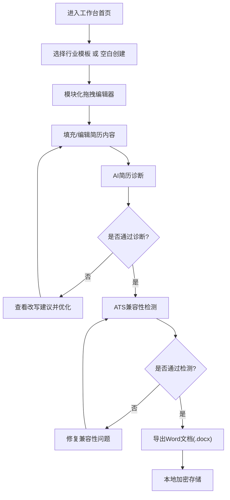

## 1. 产品概述
面向应届生与职场新人的智能简历生成工作台，专注于格式兼容性、职业表达优化与隐私安全保护。
- 解决用户简历格式不规范、内容空洞、ATS通过率低、个人信息泄露等痛点
- 通过AI驱动的语义优化与模块化编辑器，帮助用户快速生成符合HR审美和ATS标准的专业简历

## 2. 核心功能

### 2.1 用户角色
| 角色 | 注册方式 | 核心权限 |
|------|----------|----------|
| 普通用户 | 无需注册（本地模式） | 创建、编辑、诊断、导出简历，使用所有模板与AI功能 |

### 2.2 功能模块
1. **工作台首页**：快捷入口、模板推荐、最近简历、功能导航
2. **模块化拖拽编辑器**：自定义模块顺序、字段显隐、颜色主题实时预览
3. **行业语义模板库**：技术岗、设计岗、职能岗三大方向专业模板
4. **AI简历诊断**：空洞表述检测、时序矛盾检测、技能关键词缺失检测、HR视角改写建议
5. **Word文档渲染引擎**：.docx原生渲染、直接编辑、在线预览
6. **ATS兼容性检测**：字体嵌入检测、表格结构检测、超链接有效性检测
7. **隐私保护模式**：关闭云端存储、本地IndexedDB加密缓存、数据仅存本地

### 2.3 页面详情
| 页面名称 | 模块名称 | 功能描述 |
|----------|----------|----------|
| 工作台首页 | Hero区域 | 产品Slogan、开始创建按钮、核心功能亮点展示 |
| 工作台首页 | 模板推荐区 | 三大行业模板卡片展示、一键使用 |
| 工作台首页 | 最近简历区 | 本地存储的简历列表、快速编辑/删除 |
| 工作台首页 | 功能导航区 | 六大核心功能图标入口 |
| 简历编辑器 | 左侧模块面板 | 可拖拽模块列表（基本信息、教育经历、工作/实习、项目、技能、自我评价等） |
| 简历编辑器 | 中间画布区 | A4尺寸实时预览、模块拖拽排序、点击编辑字段 |
| 简历编辑器 | 右侧属性面板 | 主题配色选择、字体设置、模块字段显隐开关、全局样式调整 |
| 简历编辑器 | 顶部工具栏 | 保存、撤销/重做、预览、AI诊断、导出Word、ATS检测 |
| 模板选择页 | 分类标签栏 | 技术岗/设计岗/职能岗切换 |
| 模板选择页 | 模板网格 | 模板预览卡片、行业标签、适用说明 |
| AI诊断页 | 诊断结果面板 | 评分总览、问题分类列表（严重/警告/建议）、每条问题定位与改写建议 |
| AI诊断页 | 原文对比区 | 左侧原文、右侧AI优化版本、一键应用 |
| ATS检测页 | 检测报告 | 兼容性得分、分项检测结果（字体/表格/链接/关键词）、修复建议 |
| 设置页 | 隐私设置 | 隐私保护模式开关、本地数据管理（导出/清空）、加密密钥设置 |

## 3. 核心流程

用户进入工作台 → 选择行业模板或空白创建 → 在拖拽编辑器中填充与排版内容 → 调用AI诊断优化表述 → 运行ATS兼容性检测 → 导出Word文档（.docx）

## 4. 用户界面设计

### 4.1 设计风格
- 主色：深邃海军蓝 #1e3a5f，代表专业与信赖
- 辅色：鎏金色 #c9a24a，点缀高端感；薄荷绿 #4ade80，用于通过/成功状态
- 警示色：珊瑚橙 #fb7185（严重）、琥珀黄 #fbbf24（警告）
- 按钮风格：微立体圆角（8px），主按钮深蓝配金色描边
- 字体：标题使用 Cormorant Garamond（衬线高端感），正文使用 LXGW WenKai / PingFang SC
- 布局风格：三栏编辑器布局（左模块-中画布-右属性），卡片式组件，细腻阴影层级
- 图标风格：线性风格 Phosphor Icons，与整体专业调性匹配

### 4.2 页面设计概述
| 页面名称 | 模块名称 | UI元素 |
|----------|----------|--------|
| 工作台首页 | Hero区域 | 渐变色背景、大号衬线标题、悬浮简历预览动效、CTA主按钮 |
| 工作台首页 | 模板推荐区 | 三张并排卡片（技术/设计/职能）、悬停放大动效、金色边框高亮 |
| 简历编辑器 | 左侧模块面板 | 折叠式分组、可拖拽条目、拖拽时半透明跟随效果 |
| 简历编辑器 | 中间画布区 | A4纸张投影效果、模块间虚线分隔、编辑状态金色高亮 |
| 简历编辑器 | 右侧属性面板 | 颜色主题色板、开关式字段显隐、滑块字号调整 |
| AI诊断页 | 诊断结果面板 | 环形进度评分、问题严重等级色彩标签、可折叠详细建议 |
| ATS检测页 | 检测报告 | 绿色进度条表示通过、红色/黄色表示问题、修复建议勾选清单 |

### 4.3 响应式
- 桌面端（≥1280px）：三栏编辑器完整布局
- 平板端（768-1279px）：左右面板可折叠为抽屉式
- 移动端（<768px）：编辑器简化为单栏，仅保留核心编辑功能

### 4.4 3D场景指引
- 不适用，产品以文档编辑为核心，无需3D场景
