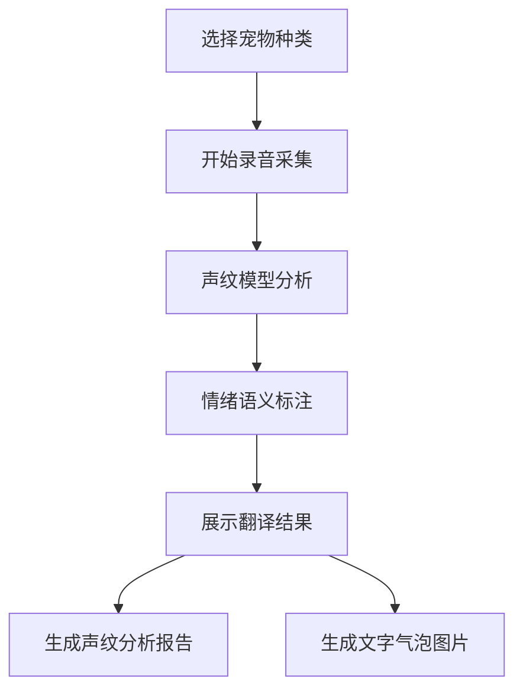
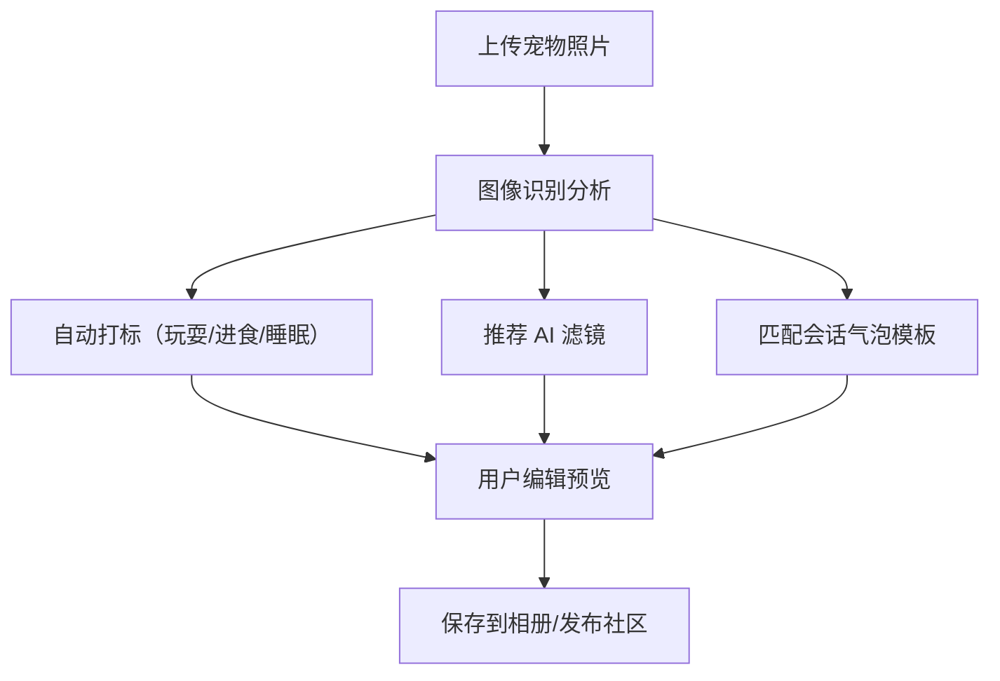
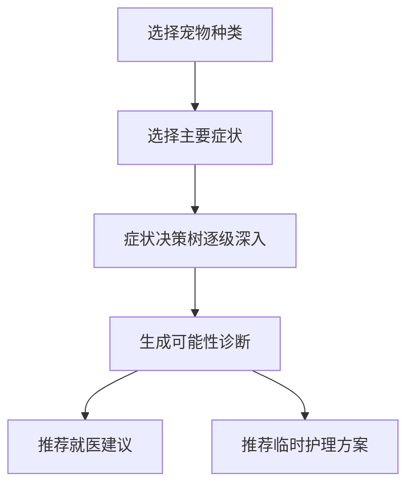

## 1. 产品概述

融合宠物行为识别与社交互动的 AI 驱动平台，基于自研猫狗声纹模型与图像识别引擎，为宠主提供宠物情绪翻译、智能相册、知识社区等一站式服务，同时为平台运营提供声纹模型迭代、内容安全审核与训练效果追踪能力。

- 目标用户：宠物主人（多宠家庭）、兽医专家、平台运营人员
- 核心价值：通过 AI 技术消除人与宠物的沟通障碍，构建宠物健康成长的社交生态

## 2. 核心功能

### 2.1 用户角色

| 角色 | 注册方式 | 核心权限 |
|------|----------|----------|
| 宠主用户 | 手机号/邮箱/微信 | 管理宠物档案、使用实时翻译、发布 UGC 内容、参与社区、记录训练日志 |
| 兽医专家 | 资质认证审核 | 发布认证内容、回答医疗咨询、参与疾病自查树维护 |
| 平台运营 | 后台账号 | 管理声纹模型迭代、内容安全审核、查看训练效果数据 |

### 2.2 功能模块

1. **首页仪表盘**：宠物状态概览、今日推荐、快捷功能入口
2. **实时翻译模块**：宠物声纹采集→情绪语义标注→文字气泡生成→主人语音转拟声播放
3. **萌宠相册引擎**：自动打标分类、AI 滤镜美化、会话气泡模板
4. **知识社区**：兽医认证内容、疾病症状自查树、个性化喂养方案推荐
5. **宠物档案管理**：多宠档案、品种/年龄/性格标签、健康记录
6. **行为训练追踪**：训练计划、改善记录、自动周报生成
7. **后台 - 声纹模型迭代中心**：用户样本上传、自动标注、模型微调
8. **后台 - 内容安全过滤器**：敏感词检测、违规图片识别、虚假医疗建议过滤
9. **后台 - 训练效果分析**：用户改善记录汇总、周报生成、数据可视化

### 2.3 页面详情

| 页面名称 | 模块名称 | 功能描述 |
|----------|----------|----------|
| 首页仪表盘 | 宠物概览卡片 | 展示所有宠物的基本信息、今日状态、健康提醒 |
| 首页仪表盘 | 快捷功能区 | 翻译入口、相册入口、训练记录入口、社区入口 |
| 首页仪表盘 | 推荐动态流 | 个性化内容推荐、热门 UGC、兽医科普 |
| 实时翻译页 | 声纹采集面板 | 录音波形动画、录制控制、宠物种类选择 |
| 实时翻译页 | 情绪分析展示 | 情绪标签、置信度、语义翻译、声纹分析报告卡片 |
| 实时翻译页 | 文字气泡生成器 | 气泡样式选择、自定义文字、一键生成图片 |
| 实时翻译页 | 反向翻译面板 | 主人语音输入、拟声转换、播放预览 |
| 萌宠相册页 | 照片瀑布流 | 时间线展示、按标签筛选（玩耍/进食/睡眠） |
| 萌宠相册页 | AI 编辑器 | 滤镜选择、会话气泡模板、自动打标编辑 |
| 知识社区页 | 内容分类流 | 兽医认证标记、疾病自查入口、喂养方案 |
| 知识社区页 | 症状自查树 | 交互式决策树、症状选择、可能性诊断建议 |
| 宠物档案页 | 多宠管理 | 宠物卡片列表、新增/编辑档案、健康记录 |
| 训练追踪页 | 训练日志 | 行为记录、改善进度、自动周报、图表可视化 |
| 后台 - 声纹中心 | 样本管理 | 上传音频列表、自动标注状态、审核队列 |
| 后台 - 声纹中心 | 模型管理 | 版本列表、微调进度、准确率对比 |
| 后台 - 内容安全 | 审核面板 | 敏感词命中、违规图片、待审内容队列 |
| 后台 - 数据中心 | 训练效果 | 用户改善记录、周报表、趋势图表 |

## 3. 核心流程

### 3.1 宠物声纹翻译流程

用户选择宠物→开始录音采集→AI 声纹模型分析→生成情绪语义标注→展示翻译结果与声纹报告→可生成文字气泡图片/保存记录

### 3.2 萌宠相册 AI 处理流程

用户上传照片→图像识别引擎分析→自动打标分类→展示推荐滤镜与气泡模板→用户编辑后发布/保存

### 3.3 疾病症状自查流程

用户选择宠物种类→选择症状分类→按决策树逐级选择→生成可能性诊断建议→推荐就医/喂养方案

## 4. 用户界面设计

### 4.1 设计风格

- **主色调**：温暖奶油橙 `#FF8A5B` + 清新薄荷绿 `#4ECDC4`，营造宠物友好的温馨氛围
- **辅助色**：柔和粉 `#FFB6C1`、天空蓝 `#87CEEB`、阳光黄 `#FFE066`
- **中性色**：米白 `#FFFAF5`、暖灰 `#8A8178`、深棕 `#3D3530`
- **按钮风格**：大圆角（16px）、柔和渐变、hover 微弹动效
- **字体**：展示字体用圆润可爱的 "ZCOOL KuaiLe"，正文字体用 "PingFang SC"
- **布局风格**：卡片式布局、柔和阴影、大量留白、圆角设计
- **图标风格**：Lucide 图标，圆角风格，配合宠物 emoji 增加趣味性

### 4.2 页面设计概览

| 页面名称 | 模块名称 | UI 元素 |
|----------|----------|---------|
| 首页仪表盘 | 宠物概览卡片 | 渐变背景卡片、宠物头像圆形裁剪、健康状态胶囊标签、滑入动画 |
| 首页仪表盘 | 快捷功能区 | 四色功能图标、圆角按钮、hover 上浮效果 |
| 实时翻译页 | 声纹采集面板 | 居中大型录音按钮、动态波形动画、脉冲光效、半透明玻璃态 |
| 实时翻译页 | 情绪分析展示 | 情绪标签彩色胶囊、置信度进度条、声纹波形图、卡片展开动画 |
| 萌宠相册页 | 照片瀑布流 | 交错瀑布流布局、悬停放大、标签覆盖层、加载淡入效果 |
| 知识社区页 | 症状自查树 | 交互式节点、选中高亮、分支展开动画、进度指示器 |
| 后台管理 | 数据面板 | 深色主题、数据卡片网格、图表可视化、状态指示灯 |

### 4.3 响应式设计

- 桌面端优先（1280px+）：多列布局、侧边导航
- 平板端（768-1279px）：两列布局、折叠导航
- 移动端（<768px）：单列布局、底部 Tab 导航、触控优化
- 录音、拍照等功能针对移动端做专属优化

### 4.4 动效设计

- 页面加载：元素级交错淡入（staggered fade-in）
- 录音状态：呼吸脉冲光效 + 波形实时动画
- 卡片交互：hover 轻微上浮 + 阴影增强
- 状态切换：平滑过渡 300ms cubic-bezier(0.4, 0, 0.2, 1)
- 情绪结果展示：结果卡片从底部滑入 + 渐显
