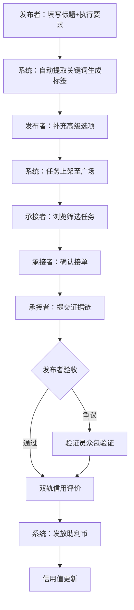
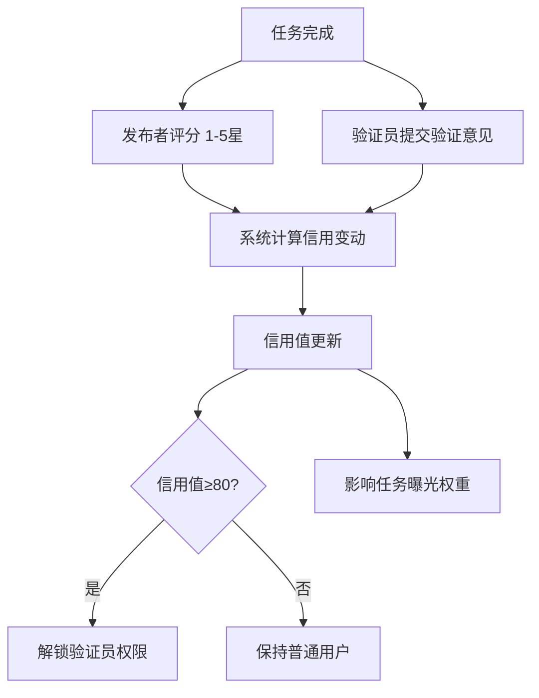

## 1. 产品概述

去中心化互助任务协作系统——以'信用值'为核心身份凭证的去中心化任务协作平台，让用户可以发布和承接实物交付、线上代办、技能支援等轻量任务，通过双轨信用机制和激励层构建可信、高效的互助社区。

- 解决传统互助平台信任缺失、任务匹配低效、缺乏激励机制的核心痛点
- 面向城市青年、自由职业者、社区志愿者等有互助需求的人群，打造'信用即价值'的协作生态

## 2. 核心功能

### 2.1 用户角色

| 角色 | 注册方式 | 核心权限 |
|------|----------|----------|
| 普通用户 | 手机号/邮箱注册 | 发布任务、承接任务、信用查看、助利币兑换 |
| 验证员 | 信用值≥80自动解锁 | 众包验证任务完成度、提交证据链 |
| 管理员 | 后台指定 | 风控管理、信用模型训练、任务广场运营 |

### 2.2 功能模块

1. **任务广场页**：动态排序任务流、城市/技能/热度筛选、搜索与标签导航
2. **任务发布页**：两步极简表单（标题+执行要求→自动标签生成+高级选项）
3. **任务详情页**：任务信息、接单操作、证据链提交、双轨信用评价
4. **个人中心页**：信用值看板、助利币钱包、任务历史、验证记录
5. **风控管理页**：风控引擎面板、刷单检测、信用模型训练接口、数据可视化

### 2.3 页面详情

| 页面名称 | 模块名称 | 功能描述 |
|----------|----------|----------|
| 任务广场页 | 动态任务流 | 按城市/技能/热度聚合排序的任务卡片流，支持下拉刷新与无限滚动 |
| 任务广场页 | 筛选导航栏 | 城市、任务类型、悬赏区间、信用门槛等组合筛选 |
| 任务广场页 | 搜索与标签 | 关键词搜索+热门标签云，点击标签快速筛选 |
| 任务发布页 | 步骤一：基础信息 | 标题输入+执行要求描述，自动提取关键词生成标签 |
| 任务发布页 | 步骤二：高级选项 | 悬赏金额/助利币、时间承诺、地理位置围栏、验收规则自定义 |
| 任务详情页 | 任务信息区 | 完整任务描述、发布者信用档案、悬赏详情、地理位置、时间线 |
| 任务详情页 | 接单操作区 | 一键接单、接单确认弹窗（信用承诺提示） |
| 任务详情页 | 证据链提交 | 照片上传、定位确认、时间戳记录，形成不可篡改证据链 |
| 任务详情页 | 双轨评价区 | 任务方履约评分（1-5星）+社区验证员众包验证 |
| 个人中心页 | 信用值看板 | 信用分仪表盘、信用变动趋势、信用等级标识 |
| 个人中心页 | 助利币钱包 | 助利币余额、收支记录、兑换福利入口、曝光权重提升入口 |
| 个人中心页 | 任务历史 | 已发布/已承接/已完成任务列表与状态追踪 |
| 个人中心页 | 验证记录 | 参与验证的任务列表、验证贡献值 |
| 风控管理页 | 风控引擎面板 | 实时风控告警、刷单/虚假地址/重复提交识别结果 |
| 风控管理页 | 信用模型训练 | 模型参数配置、训练触发、模型效果评估图表 |
| 风控管理页 | 数据可视化 | 任务分布热力图、信用分布图、助利币流通统计 |

## 3. 核心流程

### 任务发布与承接流程
1. 发布者进入任务发布页，填写标题和执行要求（步骤一）
2. 系统自动提取关键词生成标签，展示预览
3. 发布者补充高级选项：悬赏金额、时间承诺、地理位置围栏、验收规则（步骤二）
4. 任务提交至任务广场，根据曝光权重排序展示
5. 承接者在任务广场浏览筛选，点击进入任务详情
6. 承接者确认接单，系统记录信用承诺
7. 承接者完成任务，提交证据链（照片/定位/时间戳）
8. 发布者验收确认，或验证员众包验证
9. 双轨信用评价：任务方评分+社区验证
10. 系统即时发放助利币奖励

### 信用评价与验证流程

## 4. 用户界面设计

### 4.1 设计风格

- **主题色**：深邃藏青（#0A1628）为底色，搭配翡翠绿（#00E5A0）作为信任/信用的主色调，琥珀金（#FFB800）作为助利币/激励的强调色
- **按钮风格**：圆角微3D按钮，主按钮为翡翠绿渐变带轻微阴影，次按钮为描边半透明风格
- **字体**：标题使用 DM Sans（粗体，现代几何感），正文使用 Noto Sans SC（清晰中文渲染）
- **布局风格**：左侧窄导航栏+右侧主内容区，卡片式任务流，毛玻璃效果面板
- **图标风格**：线性图标搭配微渐变填充，lucide-react 图标库
- **动效**：页面切换淡入、任务卡片悬浮微抬升、信用值仪表盘动态填充、助利币获取时金币弹跳动画

### 4.2 页面设计概览

| 页面名称 | 模块名称 | UI元素 |
|----------|----------|--------|
| 任务广场页 | 动态任务流 | 深色卡片列表，左侧缩略图+右侧信息，翡翠绿标签，悬浮时卡片上浮+光晕效果 |
| 任务广场页 | 筛选导航栏 | 毛玻璃顶栏，胶囊式筛选标签，选中态翡翠绿填充 |
| 任务广场页 | 搜索与标签 | 圆角搜索框+标签云，热门标签用渐变色标识 |
| 任务发布页 | 步骤指示器 | 顶部两步进度条，完成步骤翡翠绿勾选，当前步骤高亮 |
| 任务发布页 | 表单区域 | 暗色输入框+翡翠绿聚焦边框，标签自动生成动画，地理位置选择地图组件 |
| 任务详情页 | 任务信息区 | 顶部大卡片+信用徽章，发布者头像+信用等级标识，时间轴组件 |
| 任务详情页 | 证据链提交 | 三栏上传区（照片/定位/时间戳），上传进度动画，证据链时间轴展示 |
| 任务详情页 | 双轨评价区 | 左侧星级评分+右侧验证员投票，信用变动动态指示 |
| 个人中心页 | 信用值看板 | 环形仪表盘+数字显示，信用趋势折线图，等级徽章 |
| 个人中心页 | 助利币钱包 | 金色渐变卡片+余额数字，收支流水列表，兑换按钮 |
| 风控管理页 | 风控引擎面板 | 告警列表+风险等级色标，实时刷新动画 |
| 风控管理页 | 数据可视化 | 热力图+柱状图+折线图，暗色系图表主题 |

### 4.3 响应式设计

- 桌面优先设计，主要适配 1280px+ 宽度
- 平板端（768-1279px）：侧边栏折叠为汉堡菜单，卡片改为双列
- 移动端（<768px）：单列布局，底部Tab导航，任务卡片竖排

### 4.4 3D场景指引

不适用
