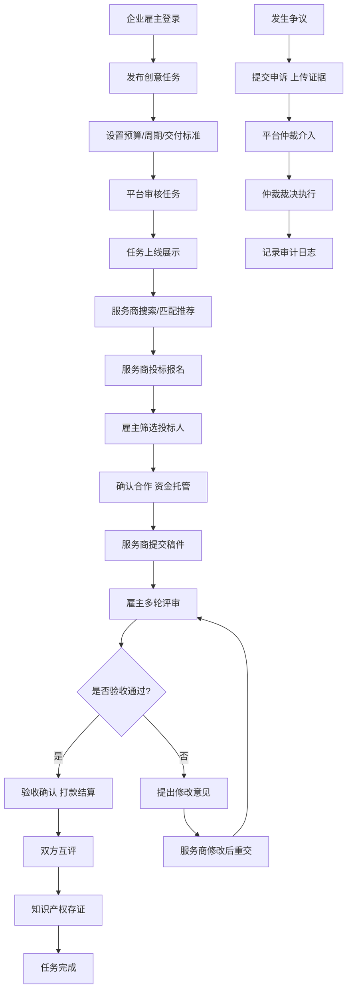

# 创意服务众包平台工作台 - 产品需求文档

## 1. 产品概述

面向企业雇主的创意服务众包平台，汇聚 UI/工业/动漫设计、软件开发、商标注册、文案策划等多领域专业人才，实现任务发布、智能匹配、在线协作、稿件评审、验收打款的全流程闭环，同时提供完善的后台运营管理、知识产权存证、争议仲裁和合规审计能力。

- **核心价值**：降低企业创意服务采购成本，保障交付质量与知识产权安全，提升服务商履约能力
- **目标用户**：企业雇主、创意服务商/自由职业者、平台运营管理员、合规审计人员
- **市场价值**：打造可信任的创意服务交易生态，构建从需求到交付的数字化闭环

## 2. 核心功能

### 2.1 用户角色

| 角色 | 注册方式 | 核心权限 |
|------|----------|----------|
| 企业雇主 | 企业营业执照认证 | 发布任务、查看人才库、邀请投标、稿件评审、验收打款、争议申诉 |
| 创意服务商 | 个人/企业认证 + 资质审核 | 设置服务类目、上传作品集、投标报名、提交稿件、沟通协商、查看评价 |
| 平台运营 | 后台账号 | 任务审核、服务商分级、争议仲裁、数据监控、运营配置 |
| 合规审计 | 专用审计账号 | 查看审计日志、知识产权存证记录、争议处理记录、操作留痕追溯 |

### 2.2 功能模块

1. **任务管理中心**：多类型任务发布（UI/工业/动漫设计、软件开发、商标注册、文案策划等）、预算设置、周期管理、交付标准定义、审核节点配置
2. **专业人才库**：服务商资质认证、作品展示、历史履约评分、技能标签、搜索筛选、智能匹配推荐
3. **交易协作中心**：投标报名、在线沟通、稿件提交、版本管理、多轮评审、修改意见、验收确认
4. **支付结算系统**：托管支付、里程碑付款、验收打款、退款申请、发票管理、交易流水
5. **知识产权存证**：稿件存证、版权登记、侵权监测、存证证书、区块链存证记录
6. **争议仲裁流程**：申诉提交、证据上传、平台介入、仲裁裁决、执行记录
7. **服务商分级体系**：等级评定、履约评分、服务质量监控、升降级管理、特权配置
8. **后台运营管理**：任务状态看板、用户管理、内容审核、数据统计、系统配置
9. **合规审计系统**：操作日志、审计追溯、风险预警、合规报表、数据导出

### 2.3 页面详情

| 页面名称 | 模块名称 | 功能描述 |
|---------|----------|----------|
| 雇主工作台首页 | 数据概览 | 进行中任务、待办事项、支出统计、快捷入口 |
| 雇主工作台首页 | 任务列表 | 任务卡片、状态标签、进度追踪、快捷操作 |
| 发布任务页 | 任务类型选择 | UI设计、工业设计、动漫设计、软件开发、商标注册、文案策划等分类 |
| 发布任务页 | 需求描述 | 任务名称、详细描述、参考资料上传、需求标签 |
| 发布任务页 | 预算周期设置 | 预算金额范围、交付周期、里程碑节点配置 |
| 发布任务页 | 交付标准定义 | 交付物要求、验收标准、审核节点配置、知识产权约定 |
| 任务详情页 | 任务信息 | 需求详情、预算周期、交付标准、状态时间线 |
| 任务详情页 | 投标管理 | 投标人列表、服务商信息、邀请投标、筛选排序 |
| 任务详情页 | 稿件评审 | 稿件列表、版本对比、评审意见、修改请求、通过/驳回 |
| 任务详情页 | 在线沟通 | 实时消息、文件传输、沟通记录、@提及 |
| 任务详情页 | 支付管理 | 托管记录、里程碑付款、验收打款、退款申请 |
| 人才库页面 | 人才搜索 | 技能筛选、类目筛选、评分筛选、地区筛选、搜索框 |
| 人才库页面 | 人才卡片 | 头像、技能标签、评分、成交额、作品集预览、邀请合作 |
| 人才详情页 | 服务商信息 | 基本资料、资质认证、作品展示、历史评价、履约数据 |
| 服务商工作台 | 数据概览 | 进行中项目、待办事项、收入统计、评分展示 |
| 服务商工作台 | 任务管理 | 投标中、进行中、已完成、已取消任务列表 |
| 稿件提交页 | 稿件上传 | 文件上传、版本说明、交付清单、预览展示 |
| 个人中心 | 账户设置 | 基本信息、认证信息、安全设置、收款方式 |
| 个人中心 | 评价管理 | 收到的评价、给出的评价、评分统计 |
| 争议中心 | 申诉列表 | 发起申诉、处理进度、仲裁结果、执行记录 |
| 管理后台-首页 | 数据看板 | 平台总览、关键指标、今日数据、趋势图表 |
| 管理后台-任务管理 | 任务看板 | 任务状态看板、列表视图、筛选查询、详情查看 |
| 管理后台-任务管理 | 任务审核 | 待审核任务、审核操作、驳回原因、违规处理 |
| 管理后台-服务商管理 | 服务商列表 | 服务商分级、等级调整、资质审核、账号管理 |
| 管理后台-服务商管理 | 评价管理 | 评价列表、申诉处理、评分调整、信用记录 |
| 管理后台-知识产权 | 存证管理 | 存证记录、证书管理、侵权监测、版权登记 |
| 管理后台-争议仲裁 | 争议列表 | 待处理争议、仲裁操作、裁决记录、执行跟踪 |
| 管理后台-合规审计 | 审计日志 | 操作记录、风险预警、审计追溯、合规报表 |
| 管理后台-财务中心 | 交易管理 | 订单流水、资金托管、付款记录、退款处理 |
| 管理后台-系统设置 | 配置管理 | 分类配置、模板管理、规则设置、通知配置 |

## 3. 核心流程

### 3.1 任务发布与交付流程

雇主登录工作台 → 选择任务类型 → 填写需求描述 → 设置预算与周期 → 定义交付标准与审核节点 → 提交发布 → 平台审核 → 任务上线 → 服务商投标 → 雇主选择服务商 → 确认合作并托管资金 → 服务商开始工作 → 提交稿件 → 雇主评审 → (多轮修改) → 验收通过 → 打款给服务商 → 双方互评 → 任务完成

### 3.2 智能匹配推荐流程

雇主发布任务 → 系统分析任务需求（类目、技能、预算、周期）→ 匹配符合条件的服务商（技能标签、评分、历史履约数据、类目匹配度）→ 生成推荐列表 → 推送给雇主 → 雇主查看服务商详情 → 邀请投标或直接合作

### 3.3 争议仲裁流程

一方发起争议申诉 → 填写申诉理由并上传证据 → 系统通知另一方 → 另一方提交申辩和证据 → 平台仲裁员介入 → 审核双方证据和沟通记录 → 做出仲裁裁决 → 通知双方 → 执行裁决结果（退款/部分退款/继续履行等）→ 记录仲裁档案 → 双方可申请复议

### 3.4 核心流程 Mermaid 图

## 4. 用户界面设计

### 4.1 设计风格

**设计方向**：专业商务风，深蓝主色调搭配高级灰，体现信任、专业、高效的平台调性

- **主色调**：商务深蓝 `#1E40AF`（代表专业、信任、稳重）
- **辅助色**：成功绿 `#059669`、警示橙 `#EA580C`、品牌紫 `#7C3AED`（创意灵感）
- **中性色**：炭黑 `#1F2937`（正文）、深灰 `#4B5563`（次要文字）、银灰 `#F3F4F6`（背景）
- **按钮风格**：圆角 6px，扁平化设计，主按钮深蓝渐变，悬停阴影效果
- **字体**：现代无衬线字体栈 `'Inter', 'PingFang SC', 'Microsoft YaHei', sans-serif`
- **字号层级**：标题 20-28px，正文 14px，辅助文字 12px，数据展示 24-32px
- **布局风格**：工作台式布局，左侧导航 + 顶部操作栏 + 主内容区 + 右侧信息面板
- **图标风格**：线性图标，统一 2px 线条，圆角端点
- **动效设计**：页面切换平滑过渡，数据加载骨架屏，状态变更微动画，通知弹窗滑入

### 4.2 页面设计概览

| 页面名称 | 模块名称 | UI 元素 |
|---------|----------|----------|
| 雇主工作台首页 | 顶部栏 | Logo、全局搜索、消息通知、待办提醒、用户头像下拉 |
| 雇主工作台首页 | 侧边导航 | 工作台、发布任务、任务管理、人才库、争议中心、财务中心、设置 |
| 雇主工作台首页 | 数据看板 | 指标卡片（进行中任务、待评审、已完成、总支出）、趋势折线图、任务状态环形图 |
| 雇主工作台首页 | 快捷入口 | 快速发布、常用模板、最近访问、热门服务商推荐 |
| 雇主工作台首页 | 任务列表 | 卡片式布局，任务状态标签，进度条，快捷操作按钮 |
| 发布任务页 | 分类选择 | 图标网格布局，6大分类卡片，分类描述，示例展示 |
| 发布任务页 | 表单区 | 分段式表单，步骤指示器，实时校验，自动保存草稿 |
| 发布任务页 | 预算设置 | 滑块组件，价格区间输入，市场价参考，里程碑配置面板 |
| 任务详情页 | 头部信息 | 任务标题、状态徽章、预算、周期、操作按钮组 |
| 任务详情页 | Tab 导航 | 需求详情、投标人、稿件管理、沟通记录、支付信息、存证记录 |
| 任务详情页 | 时间线 | 任务状态变更时间线，关键节点高亮 |
| 任务详情页 | 稿件区 | 稿件卡片、版本标签、预览功能、评审操作区 |
| 任务详情页 | 沟通区 | 消息列表、输入框、文件上传、表情、@功能 |
| 人才库页面 | 筛选区 | 多维度筛选器，搜索框，排序选项，快捷筛选标签 |
| 人才库页面 | 人才列表 | 卡片式布局，评分星级，技能标签云，作品集缩略图预览 |
| 服务商详情页 | 头部 | 头像、认证徽章、评分、成交数据、邀请合作按钮 |
| 服务商详情页 | 作品集 | 瀑布流布局，图片预览，作品描述，关联项目 |
| 管理后台 | 顶部栏 | Logo、系统名称、全局搜索、消息中心、快捷操作、用户菜单 |
| 管理后台 | 侧边栏 | 可收起菜单，图标+文字，角标提醒，当前页高亮 |
| 管理后台 | 任务看板 | 看板视图，拖拽式状态变更，任务卡片，筛选面板 |
| 管理后台 | 数据表格 | 高级筛选，批量操作，分页，自定义列，导出功能 |

### 4.3 响应式设计

- **设计原则**：Desktop-first，针对大屏工作台场景优化
- **大屏 (>1600px)**：四栏布局，左侧导航 + 主内容 + 右侧面板 + 辅助面板
- **中屏 (1280-1600px)**：标准三栏布局，左侧导航 + 主内容 + 右侧信息面板
- **小屏 (1024-1280px)**：两栏布局，可收起侧边栏，主内容区自适应
- **移动端 (<1024px)**：响应式适配，底部 Tab 导航，卡片式列表

### 4.4 数据可视化设计

- **任务看板**：拖拽式看板，列对应任务状态（待审核、投标中、进行中、评审中、已完成、已取消）
- **评分展示**：星级评分组件，评分分布柱状图，履约趋势折线图
- **财务数据**：收支趋势图，分类饼图，月度对比柱状图
- **热力图**：任务类型分布热力图，服务商地域分布，交易时间分布
- **实时监控**：在线人数、任务量、交易额实时更新数字滚动
- **审计日志**：时间轴布局，操作类型图标，风险等级颜色标识，溯源链接
