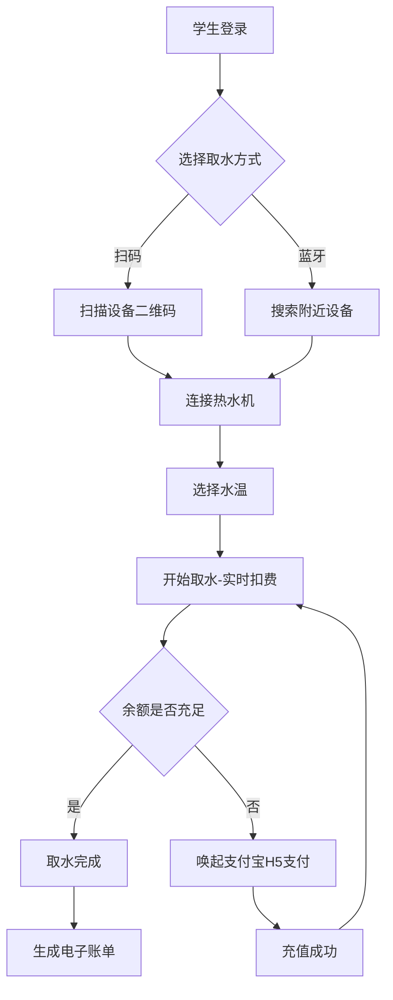
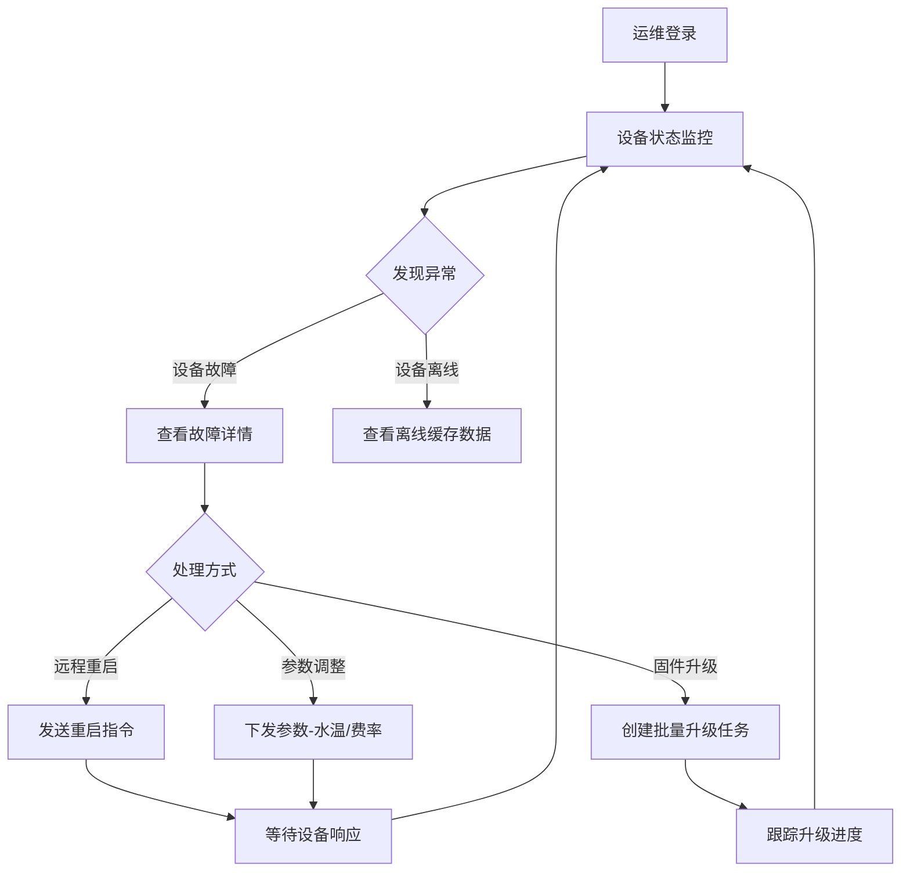

## 1. 产品概述

校园直饮水IoT服务平台——面向高校场景的智能饮水设备管理与运营平台，连接学生、运维方与投资商三方角色，实现设备扫码取水、实时计费、智能运维与投资分析的全链路数字化闭环。

- 解决校园饮水设备管理分散、付费不透明、运维响应慢、投资回报不可视的痛点
- 目标用户：在校学生（消费者）、运维团队（设备管理者）、投资商（资产运营者）

## 2. 核心功能

### 2.1 用户角色

| 角色 | 注册方式 | 核心权限 |
|------|----------|----------|
| 学生 | 手机号+验证码注册 | 绑定设备、扫码/蓝牙取水、查看账单、充值 |
| 运维方 | 管理员分配账号 | 设备监控、远程重启、参数下发、固件升级 |
| 投资商 | 管理员分配账号 | 设备集群总览、ROI仪表盘、能耗分析、项目报表 |

### 2.2 功能模块

1. **学生端**：手机号绑定设备、扫码/蓝牙启动取水、实时扣费、电子账单、余额充值
2. **运维端**：设备状态监控、远程重启、参数下发、批量固件升级、告警处理
3. **投资商端**：设备集群地图、单机运行分析、项目级ROI仪表盘、能耗曲线

### 2.3 页面详情

| 页面名称 | 模块名称 | 功能描述 |
|----------|----------|----------|
| 登录页 | 登录/注册 | 手机号+验证码登录，角色选择切换入口 |
| 学生-首页 | 设备绑定 | 手机号绑定设备，蓝牙搜索附近设备 |
| 学生-取水页 | 扫码取水 | 扫码/蓝牙连接启动热水机，实时显示水温、用量、金额 |
| 学生-账单页 | 电子账单 | 账单列表，单笔账单含水温、用量、金额、时间详情 |
| 学生-充值页 | 余额充值 | 余额展示、支付宝H5支付充值入口 |
| 运维-设备监控 | 设备列表 | 设备状态总览（在线/离线/故障），搜索筛选 |
| 运维-设备详情 | 远程管控 | 远程重启、参数下发（水温/费率）、固件版本与升级 |
| 运维-告警中心 | 告警列表 | 实时告警推送、历史告警记录、告警处理状态 |
| 运维-固件管理 | 批量升级 | 固件版本管理、批量升级任务创建与进度跟踪 |
| 投资商-总览仪表盘 | 数据总览 | 关键指标卡片（设备总数、在线率、日均用水量、总营收） |
| 投资商-设备地图 | 集群地图 | 设备地理分布，地图标注设备状态（在线/离线/故障） |
| 投资商-设备分析 | 单机分析 | 单机运行时长、故障码、能耗曲线图表 |
| 投资商-ROI仪表盘 | 项目ROI | 日均用水量×单价－维保成本，项目级ROI趋势图 |

## 3. 核心流程

### 3.1 学生取水流程

用户打开小程序/H5 → 手机号登录 → 扫码或蓝牙搜索设备 → 连接热水机 → 选择水温 → 开始取水（实时扣费）→ 取水完成 → 生成电子账单（含水温、用量、金额）→ 余额不足时自动唤起支付宝H5支付 → 充值成功后继续取水或返回

### 3.2 运维管控流程

运维人员登录 → 查看设备状态列表 → 发现异常设备 → 查看故障详情 → 远程重启/参数下发 → 创建批量固件升级任务 → 跟踪升级进度

### 3.3 投资分析流程

投资商登录 → 查看总览仪表盘 → 下钻至设备地图 → 点击单机查看运行分析 → 查看项目级ROI仪表盘 → 导出报表

## 4. 用户界面设计

### 4.1 设计风格

- **主色调**：深青蓝 (#0A2E3C) + 活力橙 (#FF6B35) 作为品牌色，传达科技感与活力
- **辅助色**：浅灰底 (#F5F7FA)、白色卡片、状态色（在线绿 #22C55E、离线灰 #9CA3AF、故障红 #EF4444）
- **按钮风格**：圆角胶囊按钮（border-radius: 24px），主操作用活力橙填充，次操作用描边样式
- **字体**：标题使用 DIN Alternate（数字仪表感），正文使用 PingFang SC / Noto Sans SC
- **布局风格**：左侧固定导航栏 + 右侧内容区，卡片式布局，数据可视化模块使用深色卡片背景
- **图标风格**：线性图标（stroke 1.5px），搭配圆形状态指示灯

### 4.2 页面设计概览

| 页面名称 | 模块名称 | UI元素 |
|----------|----------|--------|
| 登录页 | 登录表单 | 居中卡片、渐变背景、手机号输入框、验证码按钮、角色Tab切换 |
| 学生-首页 | 设备绑定 | 顶部余额卡片、蓝牙搜索动画、设备列表卡片、扫码浮动按钮 |
| 学生-取水页 | 实时取水 | 大号数字显示（水温/用量/金额）、水波动画背景、停止取水按钮 |
| 学生-账单页 | 账单列表 | 月份筛选器、账单卡片列表、每笔含水温/用量/金额标签 |
| 学生-充值页 | 充值面板 | 余额大字展示、快捷金额按钮组、支付宝图标、充值记录 |
| 运维-设备监控 | 设备列表 | 状态筛选标签组、设备卡片（含状态灯）、搜索栏 |
| 运维-设备详情 | 远程管控 | 设备参数面板、操作按钮组（重启/下发/升级）、实时数据曲线 |
| 运维-告警中心 | 告警列表 | 告警级别标签、时间轴样式列表、处理状态标记 |
| 运维-固件管理 | 批量升级 | 固件版本表格、升级任务进度条、批量选择复选框 |
| 投资商-总览仪表盘 | 数据总览 | KPI指标卡片（4列）、迷你趋势图、环形图占比 |
| 投资商-设备地图 | 集群地图 | 全屏地图、设备标记点（颜色区分状态）、侧边统计面板 |
| 投资商-设备分析 | 单机分析 | 折线图（运行时长/能耗）、故障码时间轴、参数对比表 |
| 投资商-ROI仪表盘 | 项目ROI | ROI大字指标、瀑布图（收入-成本分解）、趋势折线图 |

### 4.3 响应式设计

- 桌面优先设计，核心仪表盘和地图页面优先适配 1440px+ 宽屏
- 平板端（768px-1024px）：侧边栏折叠为图标模式，卡片由4列变2列
- 移动端（<768px）：学生端优先移动适配，运维/投资商端横向滚动表格、底部Tab导航

### 4.4 安全机制UI体现

- 设备连接时显示双向认证状态指示器（锁图标+认证中/已认证）
- 交易确认页展示AES加密标识
- 设备离线时显示缓存状态标签（"数据缓存中"/"已同步"）
