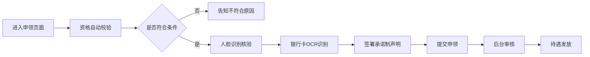

# 省级社保公共服务统一门户系统 PRD

## 1. 产品概述

省级社保公共服务统一门户系统，严格遵循人社部《社会保险公共服务事项清单》标准，为全省参保群众提供一站式、全天候的社会保险线上服务。系统覆盖职工、灵活就业、城乡居民三类参保人群，集成个人参保核验、养老金测算、失业补贴申领、医保定点机构查询等核心业务功能，后台配备待遇发放风控引擎、政策文件智能标签系统和服务效能监测模块，实现政务服务的规范化、智能化和便捷化。

- **目标用户**：全省参保人员（职工/灵活就业/城乡居民）、各级社保经办机构、定点医药机构
- **核心价值**：实现社保服务"一网通办、跨省通办"，提升政务服务效能，保障社保基金安全

## 2. 核心功能

### 2.1 用户角色

| 角色 | 注册方式 | 核心权限 |
|------|----------|----------|
| 参保个人 | 身份证实名认证 + 人脸识别 | 个人参保信息查询、业务申办、待遇测算 |
| 经办人员 | 机构统一授权 | 业务审核、风控管理、政策维护 |
| 系统管理员 | 后台授权 | 用户管理、系统配置、效能监测 |

### 2.2 功能模块

1. **门户首页**：政务公告、快捷服务入口、个人中心、办件进度查询
2. **参保核验模块**：个人参保状态实时核验、缴费记录查询、参保凭证打印
3. **养老金模拟器**：养老金计发测算、缴费方案对比、待遇调整测算
4. **失业补贴申领**：线上申领、人脸识别核验、银行账户OCR识别、承诺制容缺受理
5. **医保定点机构检索**：地图检索、按等级/科室/药品目录筛选、机构详情展示
6. **后台管理系统**：待遇发放风控引擎、政策文件智能标签、服务效能监测

### 2.3 页面详情

| 页面名称 | 模块名称 | 功能描述 |
|----------|----------|----------|
| 门户首页 | 顶部导航 | 政务标识、导航菜单、用户中心、搜索框 |
| 门户首页 | Banner轮播 | 政策公告、重要通知、便民提示 |
| 门户首页 | 快捷服务 | 8大高频服务入口、图标+文字展示 |
| 门户首页 | 服务大厅 | 按险种分类的服务事项列表 |
| 门户首页 | 政策资讯 | 最新政策、办事指南、常见问题 |
| 参保核验页 | 身份认证 | 身份证号输入、人脸核验、参保状态查询 |
| 参保核验页 | 参保信息 | 参保状态、缴费明细、个人账户、参保证明 |
| 养老金模拟器 | 参数输入 | 缴费年限、缴费基数、退休年龄、个人账户余额 |
| 养老金模拟器 | 测算结果 | 基础养老金、个人账户养老金、过渡性养老金、总额展示 |
| 养老金模拟器 | 方案对比 | 不同缴费方案的待遇对比图表 |
| 失业补贴申领 | 资格校验 | 参保状态校验、缴费时长校验、失业状态确认 |
| 失业补贴申领 | 材料提交 | 人脸识别、银行卡OCR识别、电子签名、承诺制勾选 |
| 失业补贴申领 | 进度查询 | 申领进度、审核状态、发放记录 |
| 定点机构检索 | 地图展示 | 区域地图、机构标记、位置定位 |
| 定点机构检索 | 筛选条件 | 机构等级、科室类别、药品目录、服务时间 |
| 定点机构检索 | 机构详情 | 基本信息、科室介绍、地址导航、预约挂号 |
| 后台首页 | 数据概览 | 办件总量、办结率、平均时长、风险预警 |
| 风控引擎 | 待遇发放监控 | 重复领取拦截、死亡停发触发、疑点人员清单 |
| 政策标签系统 | 政策管理 | 政策录入、智能标签、条款关联、适用人群匹配 |
| 效能监测 | 数据看板 | 各渠道申办量、平均办理时长、退件原因聚类分析 |

## 3. 核心流程

### 3.1 个人参保核验流程

用户进入参保核验页面 → 输入身份证号码 → 人脸识别活体检测 → 对接全国社保联网接口 → 实时返回参保状态 → 展示参保详情/缴费记录 → 支持电子参保证明下载

### 3.2 失业补贴申领流程

用户进入申领页面 → 资格自动校验（参保/缴费/失业状态）→ 人脸核验身份 → 银行卡OCR识别 → 勾选承诺制声明 → 提交申请 → 后台审核 → 待遇发放 → 进度可查

### 3.3 养老金测算流程

用户选择参保类型 → 输入缴费参数（年限/基数/年龄）→ 系统根据计发公式自动测算 → 展示养老金构成明细 → 支持多方案对比 → 生成测算报告

## 4. 用户界面设计

### 4.1 设计风格

- **主色调**：政务红（#C8102E）搭配深蓝（#003366），体现政府门户的权威性和公信力
- **辅助色**：浅灰蓝（#E8F0F8）作为背景，金色（#D4A84B）用于强调重要信息
- **按钮风格**：圆角矩形，主按钮使用政务红渐变，悬停有微交互效果
- **字体**：使用"思源宋体"作为标题字体，"思源黑体"作为正文字体，符合政务阅读习惯
- **布局风格**：顶部导航 + 内容区卡片式布局，信息层级清晰，操作流程引导明确
- **图标风格**：线性图标，简洁明了，统一2px描边，配色与主题一致

### 4.2 页面设计概览

| 页面名称 | 模块名称 | UI元素 |
|----------|----------|--------|
| 门户首页 | 顶部导航 | 政务徽标、主导航、搜索框、登录入口、语言切换 |
| 门户首页 | 轮播Banner | 大图轮播、政策标题、淡入淡出动画 |
| 门户首页 | 快捷服务 | 8宫格布局、图标+文字、悬停上浮效果 |
| 门户首页 | 服务大厅 | 选项卡切换、分类图标、服务事项列表 |
| 参保核验页 | 核验表单 | 步骤引导条、表单卡片、人脸采集框 |
| 参保核验页 | 信息展示 | 状态卡片、明细表格、图表可视化 |
| 养老金模拟器 | 参数配置 | 滑块输入、数字输入、方案保存 |
| 养老金模拟器 | 结果展示 | 数字动画、环形图、对比柱状图 |
| 失业补贴申领 | 申领表单 | 步骤条、OCR识别框、电子签名板 |
| 定点机构检索 | 地图页面 | 地图组件、筛选侧边栏、机构卡片列表 |
| 后台管理 | 数据看板 | 数据卡片、趋势图表、热力图、预警提示 |

### 4.3 响应式设计

- **桌面优先**：以1920px宽度为基准设计，适配1366px及以上屏幕
- **平板适配**：1024px-1366px宽度，侧边栏收起，内容区自适应
- **手机适配**：768px以下宽度，导航转为汉堡菜单，卡片纵向堆叠
- **触摸优化**：移动端按钮最小44x44px，表单元素优化触摸体验

### 4.4 无障碍设计

- 所有图片提供alt文本
- 表单控件关联label标签
- 支持键盘导航（Tab键切换）
- 色彩对比度满足WCAG AA标准
- 重要信息不止依赖颜色传达
