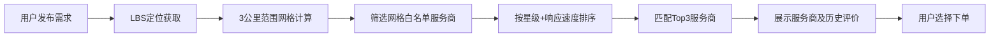

## 1. 产品概述

以地级市为单元的区域性生活服务聚合平台，构建本地化服务生态。通过LBS网格化管理、虚拟体验、智能分发、成长体系和纠纷仲裁五大核心模块，连接本地居民与优质服务商，解决服务信任度低、匹配效率低、体验不直观、纠纷处理难等行业痛点。

- 目标用户：本地居民（C端用户）、本地生活服务商（B端商家）
- 产品定位：城市级本地化生活服务的"数字管家"

## 2. 核心功能

### 2.1 用户角色

| 角色 | 注册方式 | 核心权限 |
|------|---------|---------|
| 普通用户 | 手机号+验证码 | 发布服务需求、预约虚拟体验、查看服务商、发起纠纷仲裁 |
| 服务商 | 营业执照+实名认证 | 入驻白名单、接单、管理店铺、上传虚拟体验内容、查看成长数据 |
| 平台管理员 | 后台账号 | 网格化管理、纠纷仲裁、服务商星级审核、白名单配置 |

### 2.2 功能模块

1. **首页**：城市切换、LBS定位服务网格、服务分类导航、热门服务商、虚拟体验入口、智能发布需求
2. **LBS服务网格**：500米×500米网格地图、网格白名单服务商、服务覆盖热力图、网格切换
3. **虚拟体验中心**：AR试衣间、VR看房、360°美食探店视频库
4. **服务需求大厅**：发布需求、智能匹配服务商、历史履约评价、订单追踪
5. **服务商成长体系**：星级认证展示、成长数据看板、流量权重说明、升级路径
6. **纠纷仲裁中心**：提交纠纷、图片/视频举证、客服介入、赔偿标准匹配、仲裁结果

### 2.3 页面详情

| 页面名称 | 模块名称 | 功能描述 |
|---------|---------|---------|
| 首页 | 城市与定位区 | 地级市切换、自动LBS定位、当前网格编号展示 |
| 首页 | 服务分类导航 | 餐饮/家政/维修/快递等8大类服务快捷入口 |
| 首页 | 网格地图卡片 | 可视化500米网格，显示当前网格内服务商数量 |
| 首页 | 智能需求发布 | 一句话发布需求（如"家电清洗"），自动匹配3公里内3家服务商 |
| 首页 | 虚拟体验入口 | AR试衣、VR看房、360°探店三大入口卡片 |
| 首页 | 热门服务商排行 | 星级认证、好评率、响应速度等维度展示Top5 |
| LBS网格管理 | 交互式网格地图 | 可点击切换500米网格，显示白名单服务商列表 |
| LBS网格管理 | 服务覆盖热力图 | 按网格维度展示服务密度热力层 |
| LBS网格管理 | 服务商白名单 | 当前网格内认证服务商列表，带星级与评分 |
| AR试衣间 | 虚拟试衣 | 摄像头或上传照片，选择服装虚拟试穿 |
| AR试衣间 | 服装库 | 本地服装店上架的服装分类浏览 |
| VR看房 | 房源列表 | 本地租房/二手房源列表 |
| VR看房 | 全景漫游 | 360°VR沉浸式看房体验 |
| 360°探店 | 视频库 | 本地餐厅全景探店视频 |
| 360°探店 | 全景预览 | 360°全景播放器 |
| 需求智能分发 | 需求发布表单 | 服务类型、描述、地址、期望时间 |
| 需求智能分发 | 服务商匹配结果 | 3公里内3家匹配服务商，展示星级、评价、报价 |
| 需求智能分发 | 历史履约评价 | 每家服务商近30天评价样本 |
| 服务商成长体系 | 星级认证展示 | 1-5星评级，附成长指标雷达图 |
| 服务商成长体系 | 成长数据看板 | 接单量、好评率、响应速度三大核心指标趋势 |
| 服务商成长体系 | 流量权重说明 | 星级与流量分发权重对应关系表 |
| 纠纷仲裁中心 | 纠纷提交 | 关联订单、纠纷类型、描述 |
| 纠纷仲裁中心 | 举证上传 | 图片/视频多文件上传，带预览 |
| 纠纷仲裁中心 | 仲裁进度 | 平台客服介入状态、赔偿标准匹配、处理结果 |

## 3. 核心流程

### 3.1 服务需求智能分发流程

用户进入首页 → 输入"家电清洗"需求 → 系统获取LBS定位 → 计算3公里范围 → 筛选覆盖网格内白名单服务商 → 按星级+响应速度排序 → 返回Top3服务商（附历史履约评价）→ 用户选择下单

### 3.2 纠纷仲裁流程

用户发起纠纷 → 关联订单 → 选择纠纷类型 → 上传图片/视频举证 → 系统自动匹配赔偿标准 → 平台客服介入 → 双方沟通 → 出具仲裁结果 → 赔偿执行

## 4. 用户界面设计

### 4.1 设计风格

- **主色调**：深海蓝 `#0A2540` 作为品牌色，传递专业与信任感
- **辅助色**：活力橙 `#FF6B35` 用于CTA按钮和关键交互，体现生活服务的温度
- **点缀色**：翠绿 `#2DD4A8` 用于成功状态和星级高亮
- **背景色**：暖灰白 `#F8F7F4` 基底，搭配浅米色 `#F5F0E8` 卡片背景
- **字体**：标题使用 **Playfair Display** 衬线字体体现城市质感，正文使用 **Noto Sans SC** 保证中文可读性
- **按钮风格**：圆润大圆角（16px），带微妙阴影与悬停浮起动效
- **布局风格**：卡片式布局，大量留白，信息层级分明，网格化视觉呼应LBS主题
- **图标风格**：线性图标配圆形色块背景，统一2px线宽

### 4.2 页面设计概览

| 页面名称 | 模块名称 | UI元素 |
|---------|---------|--------|
| 首页 | 城市定位区 | 左侧大号城市名+下拉箭头，右侧网格编号徽章，背景浅地图纹理 |
| 首页 | 服务分类导航 | 4×2 图标矩阵，圆形色块背景，悬停放大+色阶变化 |
| 首页 | 网格地图卡片 | 渐变蓝色地图背景，网格化线条叠加，浮动数据标签 |
| 首页 | 智能需求发布 | 搜索框式输入，橙色渐变按钮，输入时展开建议 |
| 首页 | 虚拟体验入口 | 三张倾斜卡片，AR/VR/360° 图标差异化，悬停扶正+阴影加深 |
| 首页 | 热门服务商 | 头像+星级+数据标签横向排列，第一名带金色皇冠标识 |
| LBS网格 | 交互地图 | 可拖拽缩放，500米网格线，点击高亮白名单侧边抽屉 |
| 虚拟体验 | AR试衣间 | 左侧模特/摄像头区，右侧服装选择面板，半透明玻璃拟态 |
| 需求匹配 | 服务商卡片 | 头像、星级评分条、核心指标徽章、评价标签云、报价区 |
| 成长体系 | 雷达图 | 五维能力雷达图，填充渐变，中心展示当前星级 |
| 纠纷仲裁 | 上传区 | 虚线拖拽框，图片/视频缩略图网格，进度条状态 |

### 4.3 响应式

- 桌面端（1440px+）：三栏布局，地图/主内容/侧边栏
- 平板端（768px-1439px）：双栏布局，侧边栏折叠为抽屉
- 移动端（<768px）：单栏流式，地图全屏展开，底部Tab导航
- 触摸优化：所有可点击区域 ≥ 44×44px，手势滑动支持地图与全景

### 4.4 3D/全景场景指引

- **VR看房**：室内HDRI环境光，三点光源补光，摄像机第一人称漫游，热点标记可点击跳转房间
- **360°探店**：餐厅暖光氛围，鱼眼转全景投影，热点弹出菜品卡片
- **AR试衣**：人体骨骼关键点跟踪，服装mesh贴合形变，柔和环境光消除阴影
- **性能预算**：单场景纹理 ≤ 10MB，帧率 ≥ 30fps
