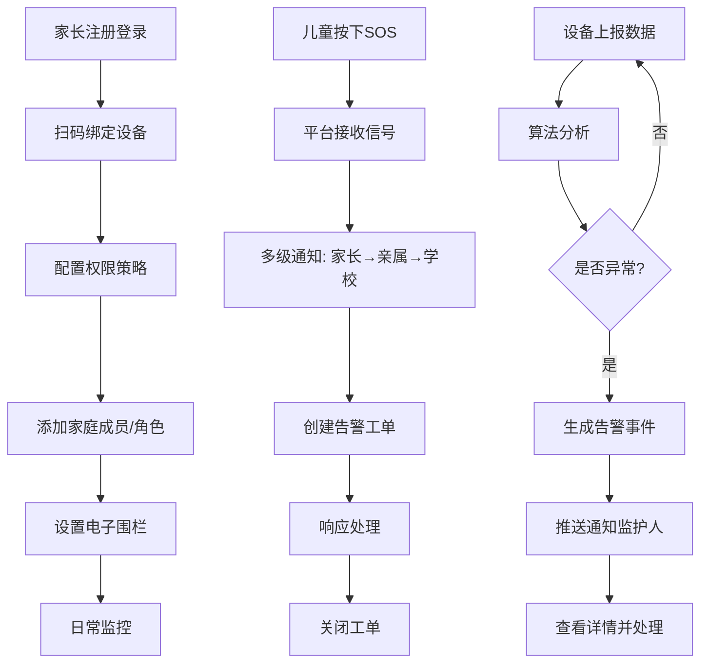

## 1. 产品概述

儿童安全监护SaaS平台——连接家长端与儿童智能穿戴设备（手表/定位鞋）的一站式安全守护系统。通过多模定位、双向通话、SOS求助、电子围栏、异常行为分析等核心能力，为3-12岁儿童提供全方位安全监护，让家长随时掌握孩子动态，守护每一个成长瞬间。

- 目标用户：3-12岁儿童的家长、亲属、学校管理员
- 核心价值：实时定位+智能告警+隐私保护，构建家庭-学校-社会三位一体的儿童安全防护网
- 安全合规：全链路端到端加密，符合等保二级认证要求，隐私数据自动脱敏处理

## 2. 核心功能

### 2.1 用户角色

| 角色 | 注册方式 | 核心权限 |
|------|----------|----------|
| 主监护人 | 手机号注册 | 全部权限：设备管理、成员管理、围栏设置、通话、告警处理、隐私策略配置 |
| 临时看护人 | 主监护人邀请 | 查看定位、接收告警、通话；不可修改设备设置和成员配置 |
| 学校管理员 | 机构注册 | 管理校内设备、查看学生位置、接收SOS告警、围栏管理 |
| 超级管理员 | 平台分配 | 设备固件管理、全局告警工单分派、系统配置、数据分析 |

### 2.2 功能模块

1. **仪表盘总览页**：实时定位地图、设备状态卡片、告警统计、快捷操作入口
2. **定位与围栏页**：多模定位地图、电子围栏管理、历史轨迹回放、越界告警
3. **通话管理页**：双向音视频通话面板、通话记录列表、录音存储与回放
4. **SOS告警中心页**：SOS紧急求助列表、多级通知链路追踪、告警工单分派
5. **设备管理页**：设备绑定/解绑、固件OTA升级、电量预警、权限分级设置
6. **成员与角色页**：家庭成员配置、角色权限管理、邀请临时看护人
7. **隐私保护页**：隐私策略引擎、人脸模糊处理、位置元数据脱敏、加密状态监控
8. **异常行为分析页**：行为异常检测面板、静止/夜间移动告警、行为趋势分析

### 2.3 页面详情

| 页面名称 | 模块名称 | 功能描述 |
|----------|----------|----------|
| 仪表盘总览页 | 实时定位地图 | 展示所有已绑定设备实时位置，支持地图缩放/拖拽，设备图标显示电量和信号状态 |
| 仪表盘总览页 | 设备状态卡片 | 每个设备一张卡片：在线/离线状态、电量、信号强度、最后定位时间 |
| 仪表盘总览页 | 告警统计 | 近24小时告警数量饼图：SOS/围栏越界/异常行为/电量低 分类统计 |
| 仪表盘总览页 | 快捷操作 | SOS测试、围栏设置、通话拨号、设备管理快捷入口 |
| 定位与围栏页 | 多模定位地图 | GPS/WiFi/基站融合定位显示，标注定位精度圈，支持卫星/标准地图切换 |
| 定位与围栏页 | 电子围栏管理 | 创建圆形/多边形围栏，设置进出规则和生效时段，围栏列表增删改 |
| 定位与围栏页 | 历史轨迹回放 | 日期选择+时间轴播放，轨迹动画回放，标注停留点 |
| 通话管理页 | 通话面板 | 拨号键盘+快捷联系人，音视频切换，通话时长计时，静音/挂断控制 |
| 通话管理页 | 通话记录 | 按时间排序的通话列表：来电/去电/未接，时长，录音标识 |
| 通话管理页 | 录音存储 | 录音文件列表，在线播放，下载，按日期筛选 |
| SOS告警中心页 | 告警列表 | 实时SOS告警时间线，告警状态（待处理/已响应/已关闭），优先级标签 |
| SOS告警中心页 | 通知链路 | 多级通知追踪：家长→亲属→学校管理员，每级响应状态和响应时间 |
| SOS告警中心页 | 工单分派 | 告警转工单，分派人选择，工单状态流转，处理记录 |
| 设备管理页 | 设备绑定 | 扫码绑定/IMEI输入绑定，设备信息确认，初始权限配置 |
| 设备管理页 | 固件OTA | 当前版本/最新版本对比，批量/单个升级，升级进度条，回滚操作 |
| 设备管理页 | 电量预警 | 电量阈值设置（低电量/极低电量），预警通知方式配置 |
| 设备管理页 | 权限分级 | 禁用陌生号码呼入、限制系统应用、上课模式禁用等策略配置 |
| 成员与角色页 | 成员列表 | 家庭成员头像、角色标签、加入时间，操作按钮（编辑/移除） |
| 成员与角色页 | 角色配置 | 主监护人/临时看护人权限矩阵配置，自定义权限勾选 |
| 成员与角色页 | 邀请管理 | 生成邀请链接/二维码，有效期设置，待确认列表 |
| 隐私保护页 | 策略引擎 | 隐私规则列表（人脸模糊/位置脱敏/通话加密），开关切换 |
| 隐私保护页 | 数据脱敏 | 相册人脸自动模糊处理预览，EXIF位置信息脱敏状态 |
| 隐私保护页 | 加密监控 | 端到端加密状态仪表盘，证书有效性，密钥轮换记录 |
| 异常行为分析页 | 异常检测面板 | 实时异常事件卡片：长时间静止/夜间移动/信号异常，置信度评分 |
| 异常行为分析页 | 行为趋势 | 7天/30天异常事件趋势图，异常类型分布，高风险时段热力图 |
| 异常行为分析页 | 告警规则 | 自定义异常检测阈值（静止时长/移动距离/时间段），灵敏度调节 |

## 3. 核心流程

**设备绑定与监护流程**：家长注册→扫码绑定设备→配置权限策略→添加家庭成员/角色→设置电子围栏→日常监控

**SOS紧急求助流程**：儿童按下SOS→平台接收信号→触发多级通知（家长→亲属→学校管理员）→创建告警工单→响应处理→关闭工单

**异常行为检测流程**：设备上报运动数据→平台算法分析→检测到异常→生成告警事件→推送通知监护人→监护人查看详情并处理

## 4. 用户界面设计

### 4.1 设计风格

- 主色调：安全蓝 `#1A6DFF`（信任感、科技感），辅助色：警示橙 `#FF6B35`（告警）、安全绿 `#00C48C`（安全状态）
- 按钮：圆角8px，主按钮实心蓝色，危险操作橙红色，次级按钮描边
- 字体：标题使用 Noto Sans SC Bold，正文使用 Noto Sans SC Regular，数据使用 JetBrains Mono
- 布局：左侧固定导航栏 + 右侧内容区，卡片式模块布局，顶部面包屑导航
- 图标：线性图标风格，使用 Lucide Icons
- 地图：暗色主题地图底图，设备标记使用脉冲动画圆点

### 4.2 页面设计概览

| 页面名称 | 模块名称 | UI元素 |
|----------|----------|--------|
| 仪表盘总览页 | 实时定位地图 | 暗色地图，脉冲动画设备点，左侧面板叠加，渐变半透明背景 |
| 仪表盘总览页 | 设备状态卡片 | 圆角卡片，左侧设备图标+状态灯，右侧电量进度条，hover阴影提升 |
| 仪表盘总览页 | 告警统计 | 环形图+数字，告警类型色彩编码，动画计数器 |
| 定位与围栏页 | 多模定位地图 | 全屏地图，顶部工具栏切换模式，定位精度渐变圈 |
| 定位与围栏页 | 电子围栏管理 | 右侧面板围栏列表，地图上虚线围栏轮廓，拖拽调整围栏范围 |
| 定位与围栏页 | 历史轨迹回放 | 底部时间轴滑块，轨迹线条渐变色，停留点脉冲标记 |
| 通话管理页 | 通话面板 | 居中拨号面板，圆形头像，通话状态呼吸灯动画 |
| 通话管理页 | 通话记录 | 列表项左侧类型图标，中间信息，右侧时长+录音播放按钮 |
| SOS告警中心页 | 告警列表 | 左侧时间线，告警卡片按严重度色彩编码，脉冲动画未读标识 |
| SOS告警中心页 | 通知链路 | 纵向流程图，每级节点响应状态图标，连接线动画 |
| 设备管理页 | 设备列表 | 表格布局，状态列彩色标签，操作列图标按钮 |
| 设备管理页 | 固件OTA | 版本对比卡片，圆形进度环，升级日志滚动区 |
| 成员与角色页 | 成员列表 | 头像网格，角色标签徽章，hover显示操作菜单 |
| 隐私保护页 | 策略引擎 | 开关卡片列表，策略图标+描述+状态开关，模糊预览缩略图 |
| 异常行为分析页 | 异常检测面板 | 实时事件卡片流，置信度进度条，严重度色带 |
| 异常行为分析页 | 行为趋势 | 面积图+折线图，时间范围选择器，异常区域高亮 |

### 4.3 响应式设计

- 桌面优先设计，最小适配1440px宽度
- 平板端（768px-1024px）：侧边栏收缩为图标模式，卡片网格从4列调整为2列
- 移动端（< 768px）：底部Tab导航，全屏地图，卡片单列堆叠

### 4.4 动效设计

- 页面切换：淡入淡出 200ms
- 卡片hover：阴影提升 + 微上移 2px
- 告警出现：从右侧滑入 + 脉冲动画
- 地图定位点：呼吸灯脉冲动画
- 数据更新：数字滚动动画
- 围栏越界：围栏边界红色闪烁

## 5. 安全合规设计

### 5.1 端到端加密

- 传输层：TLS 1.3 全链路加密，设备→平台→家长端三段式加密通道
- 数据层：AES-256-GCM 对称加密存储，RSA-4096 非对称密钥交换
- 通话加密：SRTP/ZRTP 端到端加密通话，录音文件加密存储
- 密钥管理：自动轮换机制，90天密钥周期，HSM 安全模块存储根密钥

### 5.2 等保二级认证要求

- 身份鉴别：多因子认证（手机号+短信验证码），登录失败锁定策略
- 访问控制：基于角色的细粒度权限控制，最小权限原则
- 安全审计：全操作日志记录，6个月日志保留期，异常操作实时告警
- 数据完整性：数据传输校验码，关键操作防篡改签名
- 数据保密性：敏感字段加密存储，隐私数据自动脱敏
- 入侵防范：WAF防护，SQL注入/XSS/CSRF防护，请求频率限制

### 5.3 隐私保护策略

- 人脸模糊：相册中自动检测人脸并高斯模糊处理，保留情感识别但不泄露面部特征
- 位置脱敏：EXIF元数据中GPS信息自动剥离，历史轨迹坐标偏移处理
- 数据最小化：仅采集必要数据，通话录音仅存储30天自动清除
- 用户控制：家长可随时查看/导出/删除所有关联数据
