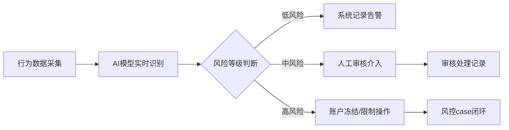

## 1. 产品概述

新时代健康产业专属展业协同平台，围绕"人-货-场"三大维度重构直销业务体系，服务直销员、生活馆店主与总部运营团队三大核心角色。通过数字化手段赋能直销展业全流程，实现合规风控穿透式管理，驱动业务高质量增长。

- **核心价值**：打通直销业务全链路数据孤岛，实现人效提升、货流透明、场景数字化，同时构建多层次合规风控体系
- **目标用户**：直销员（个人展业）、生活馆店主（线下服务）、总部运营团队（管理决策）

## 2. 核心功能

### 2.1 用户角色

| 角色 | 注册方式 | 核心权限 |
|------|---------|---------|
| 直销员 | 总部邀请注册 | 个人数字展业空间、客户管理、分享传播、预约到店、收入提现、培训考试 |
| 生活馆店主 | 总部认证开通 | 门店预约管理、服务记录、客户评价、库存管理、门店数据看板 |
| 总部运营 | 管理员账号 | 系统配置、课件下发、题库管理、风控审核、层级数据看板、预警处理 |

### 2.2 功能模块

1. **首页仪表盘**：数据概览、快捷入口、待办事项、业绩趋势
2. **人侧模块**：个人数字展业空间、专属二维码生成、客户关系图谱、分享内容传播效果追踪
3. **货侧模块**：产品全生命周期管理、批次溯源、库存分布式同步、促销活动规则引擎
4. **场侧模块**：生活馆预约到店、服务记录上链、客户评价聚合
5. **合规风控模块**：敏感话术AI识别、收入提现反洗钱校验、跨区域展业地理围栏
6. **培训业绩模块**：标准化课件下发、考试题库、业绩排行榜
7. **数据看板模块**：经销商层级穿透式看板、团队裂变图谱、产品动销分析、区域市场饱和度预警

### 2.3 页面详情

| 页面名称 | 模块名称 | 功能描述 |
|---------|---------|----------|
| 登录页 | 身份认证 | 多角色登录、双因素认证、密码找回 |
| 首页仪表盘 | 数据概览 | 业绩卡片、趋势图表、待办列表、快捷操作入口 |
| 个人展业空间 | 人侧-个人中心 | 个人资料、专属二维码、展业数据统计、团队信息 |
| 客户关系管理 | 人侧-客户管理 | 客户列表、关系图谱可视化、客户标签、跟进记录 |
| 分享传播中心 | 人侧-内容传播 | 素材库、分享链接生成、传播效果漏斗分析、转化追踪 |
| 产品管理中心 | 货侧-产品管理 | 产品列表、批次溯源查询、产品详情、溯源链路可视化 |
| 库存管理 | 货侧-库存同步 | 多仓库库存、分布式同步状态、调拨记录、库存预警 |
| 促销活动引擎 | 货侧-促销管理 | 活动创建、规则配置、效果分析、活动状态监控 |
| 生活馆预约 | 场侧-预约管理 | 门店列表、预约创建、预约日历、预约状态流转 |
| 服务记录 | 场侧-服务上链 | 服务记录录入、区块链存证标识、服务流程追踪 |
| 客户评价 | 场侧-评价聚合 | 评价列表、评分统计、评价回复、差评预警 |
| 风控监控中心 | 合规-风控总览 | 风险事件列表、AI识别告警、待审核事项 |
| 话术审核 | 合规-敏感识别 | 聊天记录扫描、敏感词命中、人工复核、处理记录 |
| 提现审核 | 合规-反洗钱 | 提现申请列表、大额交易校验、可疑交易标记、审核流程 |
| 地理围栏 | 合规-区域管控 | 围栏配置、越界告警、展业轨迹、区域权限管理 |
| 课件中心 | 培训-课程学习 | 课件列表、分类管理、学习进度、在线播放 |
| 在线考试 | 培训-题库考试 | 题库管理、随机组卷、在线答题、成绩统计 |
| 业绩排行榜 | 培训-业绩激励 | 个人/团队排行、排名维度切换、历史榜单 |
| 团队裂变图谱 | 数据-组织分析 | 层级树可视化、团队关系、裂变数据、关键节点标注 |
| 产品动销分析 | 数据-销售分析 | 动销率报表、SKU分析、趋势对比、区域分布 |
| 市场饱和度预警 | 数据-市场分析 | 热力图可视化、饱和度计算、预警提示、区域建议 |
| 系统设置 | 通用功能 | 个人设置、权限管理、通知配置 |

## 3. 核心流程

### 3.1 直销员展业流程

### 3.2 产品溯源流程

### 3.3 合规风控流程

## 4. 用户界面设计

### 4.1 设计风格

**主色调**：
- 主色：#059669（翡翠绿）- 代表健康、信任、专业
- 辅助色：#2563EB（品牌蓝）- 代表科技、可靠
- 强调色：#DC2626（警示红）- 用于风控告警
- 中性色：#F8FAFC 至 #0F172A 渐变灰阶

**设计语言**：
- 现代简约企业级风格，卡片式布局为主
- 按钮风格：圆角 8px，微立体阴影，悬停动效
- 图标风格：Lucide 线性图标，统一 24px 网格

**字体选型**：
- 标题字体："Noto Sans SC"，粗重有力量感
- 正文字体："PingFang SC"，清晰易读
- 数据字体："JetBrains Mono"，数字对齐美观

### 4.2 页面设计概览

| 页面名称 | 模块名称 | UI 元素 |
|---------|---------|--------|
| 登录页 | 身份认证 | 渐变背景、品牌标识、卡片式登录框、角色切换标签 |
| 首页仪表盘 | 数据概览 | KPI卡片网格、ECharts折线/柱状图、待办列表、快捷操作区 |
| 团队裂变图谱 | 数据可视化 | 力导向树状图、节点交互高亮、层级缩放、详情浮层 |
| 风控监控中心 | 合规总览 | 告警计数器、风险等级色块、实时事件流、快捷处理按钮 |
| 产品溯源 | 溯源可视化 | 时间轴布局、扫描动效、上链标识、溯源路径连线 |

### 4.3 响应式设计

- **桌面优先**：1440px 基准设计，适配 1280px 至 1920px
- **平板适配**：1024px 断点，侧边栏可收起，表格横向滚动
- **移动适配**：768px 断点，底部 Tab 导航，卡片单列布局
- **触控优化**：按钮最小 44x44px，列表项触控间距 8px

### 4.4 数据可视化规范

- 图表库：ECharts 5.x
- 配色：主色系渐变，避免彩虹色
- 动画：加载时渐入，交互时微缩放
- 数据大屏：暗色主题，荧光色点缀，毛玻璃效果
