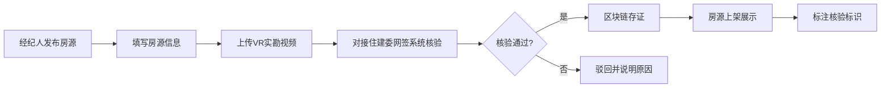
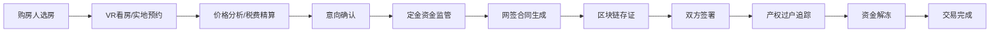
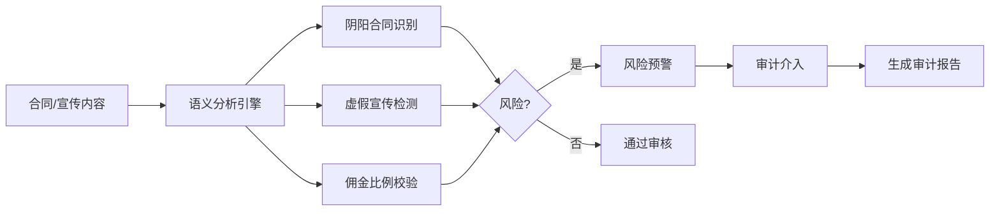

## 1. 产品概述

房地产交易数字化基础设施平台，覆盖新房代理、二手房中介、开发商、购房人四类角色，通过房源真实性核验、价格透明化引擎、交易安全保障三大核心能力，构建合规、透明、安全的房产交易生态。

- **核心价值**：解决房产交易中信息不对称、虚假房源、价格不透明、交易风险高等行业痛点
- **合规要求**：所有数据字段符合《房地产经纪管理办法》强制披露要求
- **目标用户**：购房人、房产经纪人、中介机构、开发商、合规审计人员

---

## 2. 核心功能

### 2.1 用户角色

| 角色 | 注册方式 | 核心权限 |
|------|----------|----------|
| 购房人 | 手机号/实名认证注册 | 房源搜索筛选、VR看房、价格查询、交易追踪、资金监管 |
| 经纪人 | 经纪机构认证+执业资格审核 | 房源发布/维护、客户管理、预约看房、协同作业、佣金查看 |
| 开发商 | 企业资质审核注册 | 新房项目管理、销售漏斗分析、佣金计提管理、数据看板 |
| 合规审计 | 平台管理员授权 | 阴阳合同识别、虚假宣传检测、佣金分成校验、审计报告生成 |

### 2.2 功能模块

1. **房源真实性核验**：住建委网签系统对接、VR实勘视频存证、房源信息校验
2. **价格透明化引擎**：同小区成交价分析、税费精算器、价格浮动区间标注
3. **交易安全保障**：定金资金监管、网签合同区块链存证、产权过户进度追踪
4. **智能筛选系统**：学区/地铁/装修标准/开发商信用分多维度筛选
5. **经纪人协同空间**：客户跟进记录共享、预约看房日程同步、任务分配
6. **开发商销售看板**：线索来源分析、转化率统计、佣金计提明细
7. **合规审计模块**：阴阳合同识别、虚假宣传语义分析、佣金分成比例校验

### 2.3 页面详情

| 页面名称 | 模块名称 | 功能描述 |
|----------|----------|----------|
| 登录页 | 角色选择登录 | 四类角色身份认证、双因素验证、权限控制 |
| 购房人首页 | 房源搜索 | 多维度筛选器、地图找房、智能推荐、收藏夹 |
| 房源详情页 | 房源信息展示 | VR看房、核验标识、价格分析、税费计算、联系方式 |
| 交易中心 | 交易流程管理 | 定金支付、合同签署、过户进度、资金状态 |
| 经纪人工作台 | 客户房源管理 | 客户池、房源库、跟进记录、日程管理、协同空间 |
| 开发商看板 | 销售数据分析 | 漏斗图、转化率、线索来源、佣金报表、项目管理 |
| 合规审计中心 | 审计监控 | 风险预警、合同审核、语义分析、审计报告 |
| 个人中心 | 账户管理 | 实名认证、消息通知、设置、帮助中心 |

---

## 3. 核心流程

### 3.1 房源上架核验流程

### 3.2 购房交易流程

### 3.3 合规审计流程

---

## 4. 用户界面设计

### 4.1 设计风格

**设计定位**：专业稳重、科技感、可信赖的金融级B端+C端混合平台

- **主色调**：深邃藏青 `#1a365d` - 代表专业、可信赖
- **辅助色**：翡翠绿 `#059669` - 代表安全、合规、通过
- **警示色**：琥珀橙 `#d97706` - 代表预警、提醒
- **危险色**：赤红 `#dc2626` - 代表风险、禁止
- **中性色**：深灰 `#1f2937` / 中灰 `#6b7280` / 浅灰 `#f3f4f6`

**字体选择**：
- 标题字体：`Noto Serif SC` - 稳重专业，体现金融属性
- 正文字体：`Noto Sans SC` - 清晰易读，保障信息传达
- 数据字体：`JetBrains Mono` - 等宽字体，确保数字对齐易读

**组件风格**：
- 卡片：圆角 `8px`，精致阴影 `box-shadow: 0 4px 6px -1px rgba(0,0,0,0.1)`
- 按钮：直角转圆角过渡 `border-radius: 6px`，悬停微抬升效果
- 输入框：细边框 `1px solid #e5e7eb`，聚焦时主色光晕
- 数据展示：表格 + 卡片混合布局，关键数据高亮

**设计细节**：
- 背景：浅灰渐变 `linear-gradient(135deg, #f8fafc 0%, #f1f5f9 100%)`
- 分隔：细线 + 留白，避免过度装饰
- 图标：线性风格 `Lucide Icons`，统一 `20px` 尺寸
- 动效：过渡动画 `200ms ease`，状态切换平滑

### 4.2 页面设计概览

| 页面名称 | 模块名称 | UI元素 |
|----------|----------|--------|
| 登录页 | 角色选择 | 四角色卡片切换、渐变背景、玻璃拟态登录框 |
| 购房人首页 | 房源搜索 | 顶部搜索栏、多维度筛选抽屉、房源卡片网格、地图双栏视图 |
| 房源详情页 | 信息展示 | VR播放器、核验徽章、价格走势图、税费计算器、联系按钮 |
| 交易中心 | 流程追踪 | 时间轴进度条、资金状态卡片、合同预览、操作按钮组 |
| 经纪人工作台 | 数据看板 | 关键指标卡片、客户列表、房源列表、日程日历 |
| 开发商看板 | 数据可视化 | 销售漏斗图、折线趋势图、饼图分析、数据表格 |
| 合规审计中心 | 风险监控 | 风险仪表盘、预警列表、语义分析结果、审计报告 |
| 个人中心 | 账户管理 | 侧边导航、信息卡片、表单编辑、操作记录 |

### 4.3 响应式设计

- **桌面优先**：1440px 基准设计，向下兼容
- **平板适配**：1024px 断点，侧边栏折叠，网格列数调整
- **移动端**：768px 断点，底部导航，单列布局，触摸交互优化
- **触控优化**：最小点击区域 `44x44px`，手势滑动支持

### 4.4 数据可视化规范

- **图表库**：Recharts
- **销售漏斗**：渐变填充，层级分明
- **价格走势**：面积图，平滑曲线
- **进度追踪**：垂直时间轴，状态色标
- **风险指标**：仪表盘，三色分区
