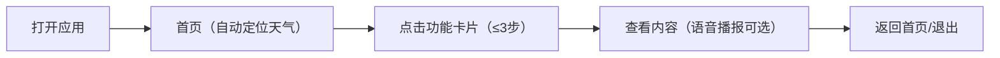
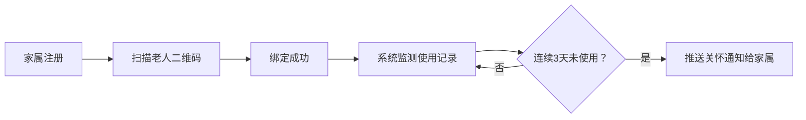
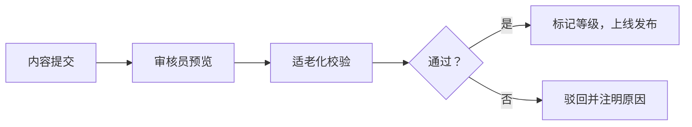

## 1. 产品概述

银发数字生活工作台是专为55岁以上中老年用户设计的一站式数字生活服务平台，解决老年人使用数字产品的障碍问题，提供天气、黄历、健康等核心生活服务。

- 目标用户：55-85岁中老年群体，视力减退、操作能力有限、对复杂界面敏感
- 核心价值：大字清晰、操作简单、信息可靠、家人关怀、无广告干扰
- 市场定位：国内首个深度适老化的综合生活服务工作台，连接老人与家属的情感桥梁

## 2. 核心功能

### 2.1 用户角色

| 角色 | 注册方式 | 核心权限 |
|------|----------|----------|
| 老年用户 | 手机号+验证码 | 使用天气、黄历、健康模块，查看语音播报 |
| 家属用户 | 手机号+验证码，绑定老人账号 | 查看老人使用记录，设置异常预警，接收关怀通知 |
| 内容审核员 | 管理员分配 | 审核图文/音频内容，标记适老化等级 |
| 系统管理员 | 后台登录 | 用户管理、内容管理、系统配置 |

### 2.2 功能模块

1. **首页工作台**：无障碍设置入口、四大功能卡片、语音快捷操作
2. **天气服务**：IP定位天气、体感温度、紫外线、洗车指数、穿衣/带伞强提醒
3. **农历黄历**：宜忌事项、节气养生、纪念日标记、黄历查询
4. **健康知识库**：食谱推荐、八段锦视频、用药提醒、慢性病筛选
5. **家属后台**：账号绑定、使用记录、异常预警、关怀通知
6. **内容审核后台**：内容列表、审核操作、适老化标记

### 2.3 页面详情

| 页面名称 | 模块名称 | 功能描述 |
|----------|----------|----------|
| 首页工作台 | 无障碍设置栏 | 字号调节（大/特大/超大）、对比度切换（标准/高对比）、语音播报开关 |
| 首页工作台 | 功能导航区 | 四大功能卡片（天气/黄历/健康/家属），单指点击即可进入 |
| 天气详情页 | 实时天气卡 | 当前温度、体感温度、湿度、风力、天气图标动效 |
| 天气详情页 | 生活指数卡 | 紫外线强度、洗车指数、穿衣建议、带伞提醒（强提醒用红色大图标） |
| 天气详情页 | 7日预报 | 未来7天天气概况，大字显示高低温 |
| 黄历详情页 | 今日黄历 | 农历日期、干支、节气、宜忌事项动态解析 |
| 黄历详情页 | 养生联动 | 根据当前节气推荐养生食材、运动建议 |
| 黄历详情页 | 纪念日 | 生日、节日、重要日期标记与提醒 |
| 健康知识页 | 筛选标签 | 按年龄段（60-/60-70/70+）、慢性病（高血压/糖尿病/无）筛选 |
| 健康知识页 | 食谱推荐 | 大图+大字+语音，食材清单、做法步骤 |
| 健康知识页 | 八段锦视频 | 慢放倍速、分步教学、大按钮控制 |
| 健康知识页 | 用药提醒 | 药品名称、剂量、时间，闹钟式提醒 |
| 家属后台页 | 账号绑定 | 扫描二维码或输入手机号绑定老人账号 |
| 家属后台页 | 异常预警 | 连续3天未登录自动推送关怀通知 |
| 内容审核页 | 审核列表 | 待审核内容，支持预览、通过、驳回、标记适老化等级 |

## 3. 核心流程

### 3.1 老年用户使用流程

### 3.2 家属绑定与预警流程

### 3.3 内容审核流程

## 4. 用户界面设计

### 4.1 设计风格

- **主色调**：温暖橙红色系（#E64A19 主色），传递关怀与活力
- **辅助色**：天蓝色（#2196F3）用于天气，墨绿色（#2E7D32）用于健康，土黄色（#F9A825）用于黄历
- **对比度**：严格遵循WCAG AA级标准，文字与背景对比度≥4.5:1
- **按钮风格**：超大圆角（16px）、立体阴影、最小点击区域48x48px
- **字体**：系统无衬线字体，正文最小20px，标题28-36px，数字32-48px
- **布局**：卡片式布局，大间距（24px+），垂直流式排列，避免复杂层级
- **图标**：线性+填充组合图标，尺寸≥32px，含义直白，避免抽象隐喻
- **动画**：缓慢过渡（300-500ms），避免闪烁，重要操作有明确震动/音效反馈

### 4.2 页面设计概述

| 页面名称 | 模块名称 | UI元素 |
|----------|----------|----------|
| 首页工作台 | 无障碍设置栏 | 固定顶部，大图标按钮，状态清晰可见 |
| 首页工作台 | 功能导航区 | 2x2卡片网格，每个卡片带大图标+大字标题+简短描述 |
| 天气详情页 | 实时天气卡 | 居中大号温度数字（48px），动态天气背景（晴天渐变蓝、雨天深蓝） |
| 天气详情页 | 强提醒区域 | 红色背景+白色大字+感叹号图标，固定在页面顶部 |
| 黄历详情页 | 宜忌区域 | 左右分栏，绿色"宜"，红色"忌"，每项带大图标 |
| 健康知识页 | 视频播放器 | 大播放按钮（≥64px），进度条加粗，倍速按钮（0.5x/1x/1.5x） |
| 家属后台页 | 预警卡片 | 红色边框+闪烁提示，一键拨打老人电话按钮 |

### 4.3 响应式设计

- 桌面端：最大宽度1200px，居中显示，侧边导航
- 平板端：流式布局，卡片自适应宽度
- 移动端：单列布局，底部导航栏，触控区域≥48px
- 触控优化：所有可点击元素≥48x48px，间距≥16px，避免误触

### 4.4 无障碍特殊设计

- 字号三级可调：标准（20px）、大号（24px）、超大号（28px）
- 对比度模式：标准模式 / 高对比模式（黑底黄字/黄底黑字）
- 语音播报：所有文字内容支持TTS朗读，语速可调（0.8x-1.2x）
- 键盘导航：Tab键清晰聚焦，Enter/Space操作
- 屏幕阅读器：完整ARIA标签，语义化HTML结构
- 无弹窗：所有提示采用顶部固定通知条，无模态弹窗干扰
- 无外链：所有内容站内展示，禁止跳转到外部网站
