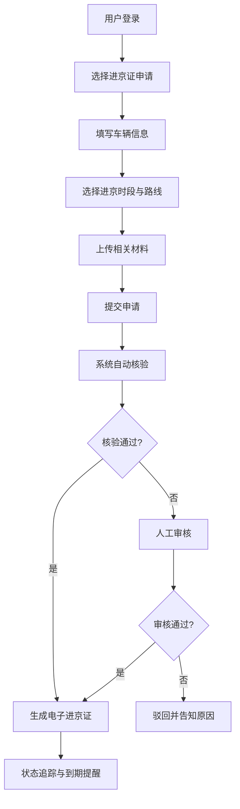
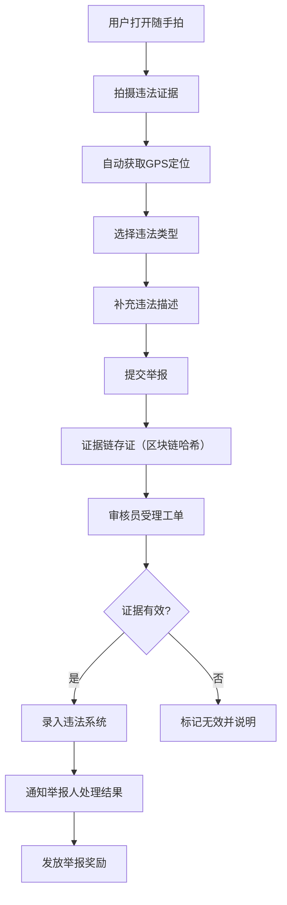
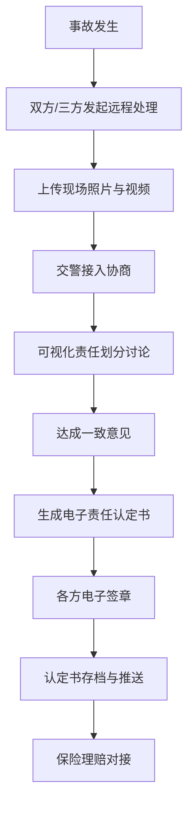

## 1. 产品概述

面向北京市居民的交管政务服务平台，提供一站式交通管理政务服务，涵盖进京证、违法举报、事故处理、电动车登记等核心业务，实现"让数据多跑路、群众少跑腿"的政务服务目标。

- 主要解决北京市居民办理交管业务线下排队难、流程繁琐、材料重复提交等痛点
- 目标用户为北京市常住居民、外埠进京车辆驾驶员、电动自行车车主等
- 产品价值在于打通交管业务全流程线上化，提升政务服务效率与群众满意度

## 2. 核心功能

### 2.1 用户角色

| 角色 | 注册方式 | 核心权限 |
|------|----------|----------|
| 居民用户 | 实名认证 + 手机号 | 办理进京证、举报违法、处理事故、电动车登记、预约服务、智能问答 |
| 窗口审核员 | 后台账号分配 | 审核业务申请、处理工单、签发电子证照 |
| 部门主管 | 后台账号分配 | 多级审核审批、查看效能统计、异常预警处理 |
| 系统管理员 | 后台账号分配 | 系统配置、用户管理、排班管理、数据统计 |

### 2.2 功能模块

1. **工作台首页**：服务入口导航、待办提醒、常用业务快捷入口、通知公告
2. **进京证服务**：申请、续期、核验、状态追踪、历史记录
3. **交通违法随手拍**：图像上传、GPS定位、证据链存证、审核工单流
4. **事故远程处理**：三方可视化协商、电子责任认定书生成与签章
5. **电动自行车登记**：身份核验、车辆信息采集、电子行驶证发放
6. **预约导办服务**：时段预约、窗口排班、现场叫号联动、服务评价
7. **智能问答机器人**：驾驶证/机动车/电动车档案查询、风险提示
8. **后台管理中心**：多级审核工作流、电子证照签发中心、异常订单预警、服务效能统计

### 2.3 页面详情

| 页面名称 | 模块名称 | 功能描述 |
|---------|---------|----------|
| 工作台首页 | 服务导航 | 八大业务入口、待办事项、通知公告、个人中心 |
| 工作台首页 | 数据概览 | 我的证件、我的预约、我的举报、我的事故卡片展示 |
| 进京证申请页 | 表单模块 | 车辆信息录入、进京时段选择、路线规划、材料上传 |
| 进京证列表页 | 列表模块 | 申请记录、状态标签、续期按钮、核验二维码 |
| 违法举报页 | 上传模块 | 拍照/录像、GPS自动定位、违法类型选择、证据描述 |
| 举报进度页 | 工单模块 | 审核进度、处理结果、奖励信息 |
| 事故处理页 | 协商模块 | 三方视频协商、现场照片上传、责任划分、认定书预览 |
| 电动车登记页 | 登记模块 | 身份核验、车辆信息采集、车架号识别、电子行驶证生成 |
| 预约服务页 | 预约模块 | 窗口选择、时段选择、预约确认、叫号提醒 |
| 智能问答页 | 对话模块 | 自然语言问答、档案查询、风险提示、常见问题 |
| 审核工作台 | 工作流模块 | 待办审核、多级审批、审核记录、电子签章 |
| 证照管理页 | 签发模块 | 证照模板管理、签发记录、证照验真 |
| 预警看板 | 监控模块 | 异常订单预警、实时监控、处理分派 |
| 效能统计页 | 统计模块 | 月度业务统计、办理时效分析、满意度统计、部门排名 |

## 3. 核心业务流程

### 3.1 进京证办理流程

### 3.2 交通违法举报流程

### 3.3 事故远程处理流程

## 4. 用户界面设计

### 4.1 设计风格

- **主色调**：#0052D9（交管蓝），代表权威、专业、可信赖
- **辅助色**：#00B42A（成功绿）、#F53F3F（警示红）、#FF7D00（提醒橙）
- **中性色**：#1D2129（主文字）、#4E5969（次文字）、#86909C（辅助文字）、#F2F3F5（背景）
- **按钮风格**：圆角6px，主色填充，hover状态加深10%，点击态加深20%
- **字体**：PingFang SC（中文），系统默认字体栈，标题18-24px，正文14px，辅助文字12px
- **布局风格**：卡片式布局，顶部导航 + 左侧菜单（PC端），底部Tab导航（移动端）
- **图标风格**：线性图标，24px标准尺寸，统一圆角风格

### 4.2 页面设计概述

| 页面名称 | 模块名称 | UI元素 |
|---------|---------|--------|
| 工作台首页 | 服务导航 | 网格布局卡片、图标+文字、hover动效、渐变背景 |
| 工作台首页 | 数据概览 | 横向滚动卡片、数字动效、状态标签、快捷操作按钮 |
| 表单类页面 | 表单模块 | 分组布局、必填标记、实时校验、错误提示、分步进度条 |
| 列表类页面 | 列表模块 | 卡片式列表、状态色标、时间线、筛选标签 |
| 审核工作台 | 工作流模块 | 待办气泡、审批流程图、电子签章面板、审核意见框 |
| 预警看板 | 监控模块 | 数据大屏风格、告警闪烁、数字滚动、图表可视化 |
| 智能问答 | 对话模块 | 聊天气泡、输入联想、快捷问题、档案卡片嵌入 |

### 4.3 响应式设计

- **设计原则**：PC端优先，移动端自适应
- **断点设置**：≥1200px（PC桌面）、768-1199px（平板）、<768px（手机）
- **PC端**：三栏布局（顶部导航 + 左侧菜单 + 内容区），最大宽度1440px
- **移动端**：单栏布局，底部Tab导航，手势操作优化，触控区域≥44x44px
- **适配策略**：CSS Grid + Flexbox，流式布局，图片自适应，字体响应式缩放

### 4.4 动效设计

- 页面加载：元素渐入 + 轻微上移动画，staggered delay 50ms
- 按钮交互：scale(0.98) 点击反馈，transition 0.2s ease
- 卡片悬停： translateY(-2px) + 阴影加深，transition 0.3s ease
- 数字滚动：计数器动画，ease-out 缓动
- 状态切换：淡入淡出 + 滑动过渡，避免生硬跳转
