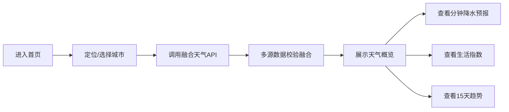
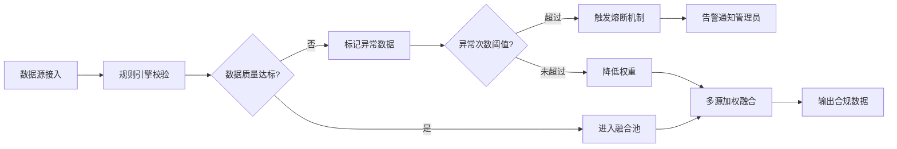
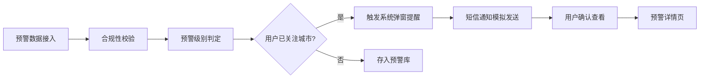

# 高精度气象数据融合服务平台 - 产品需求文档

## 1. 产品概述

高精度气象数据融合服务平台是一款集多源气象数据接入、智能融合分析、精准预报预测于一体的综合气象服务系统。平台接入国家级气象局API、第三方雷达卫星源及城市微站IoT设备数据，为用户提供分钟级高精度降水预报、15天天气趋势预测以及12类生活指数服务。

- **核心价值**：通过多源数据融合与质量校验，提供比单一数据源更精准、更及时的气象信息服务
- **目标用户**：城市居民、出行决策人群、气象服务开发者、行业用户
- **合规要求**：输出符合《气象信息服务管理办法》的合规数据服务接口

## 2. 核心功能

### 2.1 用户角色

| 角色 | 注册方式 | 核心权限 |
|------|----------|----------|
| 普通用户 | 默认访问 | 查看天气、关注城市、接收预警、历史对比 |
| 管理员 | 后台登录 | 数据质量监控、熔断管理、参数配置、接口管理 |

### 2.2 功能模块

1. **首页仪表盘**：当前天气概览、分钟级降水预报、生活指数卡片、灾害预警提醒
2. **城市管理**：自定义关注城市列表、城市搜索添加、城市切换
3. **预报详情**：24小时逐时预报、15天趋势预测、500米网格降水分布
4. **历史对比**：历史天气数据图表、同比环比分析、多维度对比
5. **灾害预警**：预警信息展示、强提醒弹窗、短信通知模拟、预警级别标识
6. **生活指数**：12类指数详情（AQI、PM2.5、紫外线、体感温度、穿衣、洗车、运动、感冒、紫外线、晾晒、旅游、交通）
7. **后台管理面板**：
   - 数据质量监控：多源数据接入状态、质量评分、异常告警
   - 熔断机制管理：异常值自动熔断状态、手动熔断/恢复
   - 指数算法配置：参数可配置化面板、算法版本管理
   - 合规接口管理：API密钥、调用统计、合规日志

### 2.3 页面详情

| 页面名称 | 模块名称 | 功能描述 |
|---------|---------|----------|
| 首页仪表盘 | 天气概览 | 展示当前城市温度、天气状况、风力风向、湿度气压等核心信息 |
| 首页仪表盘 | 分钟降水 | 未来2小时分钟级降水预报曲线，500米网格精度 |
| 首页仪表盘 | 生活指数 | 12类生活指数卡片网格展示，点击查看详情 |
| 首页仪表盘 | 预警提醒 | 灾害预警横幅展示，支持强提醒弹窗 |
| 城市管理 | 城市列表 | 已关注城市卡片列表，支持排序、删除 |
| 城市管理 | 搜索添加 | 城市搜索、热门城市推荐、一键添加 |
| 预报详情 | 24小时预报 | 逐小时温度、降水、天气状况折线图 |
| 预报详情 | 15天趋势 | 15天高低温趋势、降水概率、天气图标 |
| 历史对比 | 图表展示 | 多维度历史天气对比图表（温度、降水、湿度等） |
| 历史对比 | 时间选择 | 日期范围选择、同比/环比切换 |
| 预警中心 | 预警列表 | 当前生效预警、历史预警记录 |
| 预警中心 | 预警详情 | 预警级别、影响范围、防御指南 |
| 后台-数据质量 | 接入状态 | 多源数据接入实时状态、延迟、成功率 |
| 后台-数据质量 | 规则引擎 | 质量校验规则配置、阈值设置 |
| 后台-熔断管理 | 熔断状态 | 各数据源熔断状态、熔断原因、恢复时间 |
| 后台-指数配置 | 参数面板 | 12类指数算法参数可配置化调整 |
| 后台-接口管理 | API概览 | 合规接口列表、调用统计、密钥管理 |

## 3. 核心流程

### 3.1 用户查看天气流程

### 3.2 数据质量校验流程

### 3.3 灾害预警推送流程

## 4. 用户界面设计

### 4.1 设计风格

- **设计定位**：科技感、专业、数据驱动的气象数据平台
- **主色调**：深邃蓝 (#0F172A) 作为基础色，配合科技蓝渐变 (#3B82F6 → #06B6D4)
- **辅助色**：预警红 (#EF4444)、警告橙 (#F59E0B)、成功绿 (#10B981)、信息蓝 (#3B82F6)
- **视觉风格**：玻璃拟态 (Glassmorphism) + 深色科技风 + 数据可视化
- **按钮风格**：圆角胶囊按钮，渐变背景，悬停发光效果
- **字体**：标题使用 JetBrains Mono (等宽科技感)，正文使用 Inter (清晰易读)
- **布局风格**：卡片式仪表盘布局，网格化信息展示
- **图标风格**：线性图标 (Lucide)，配合微动画交互

### 4.2 页面设计概述

| 页面名称 | 模块名称 | UI元素 |
|---------|---------|--------|
| 首页仪表盘 | 天气概览 | 大字号温度、动态天气图标、渐变背景、玻璃卡片 |
| 首页仪表盘 | 分钟降水 | 面积折线图、时间轴、500米网格标识 |
| 首页仪表盘 | 生活指数 | 12宫格卡片、图标+数值+等级、渐变色区分 |
| 首页仪表盘 | 预警横幅 | 红色/橙色渐变背景、闪烁动画、紧急图标 |
| 城市管理 | 城市卡片 | 悬浮卡片、温度微缩展示、拖拽排序 |
| 预报详情 | 24小时图表 | 双轴折线图、渐变填充、时间滑块 |
| 预报详情 | 15天趋势 | 温度柱状+折线组合图、天气图标阵列 |
| 后台面板 | 数据质量 | 状态指示灯、进度条、趋势 sparkline |
| 后台面板 | 熔断管理 | 开关式状态、熔断日志时间线 |
| 后台面板 | 参数配置 | 滑块控制器、数值输入、实时预览 |

### 4.3 响应式设计

- **设计策略**：桌面端优先，移动端自适应
- **断点设置**：sm (640px)、md (768px)、lg (1024px)、xl (1280px)
- **移动端优化**：
  - 顶部导航折叠为汉堡菜单
  - 仪表盘卡片单列排列
  - 图表自适应宽度，支持触摸滑动
  - 按钮尺寸放大，适合触控操作

### 4.4 动效设计

- **页面加载**：元素淡入上移， staggered 延迟
- **数据更新**：数值滚动动画 (count-up)
- **预警提醒**：脉冲闪烁 + 震动反馈
- **卡片悬停**：轻微上浮 + 阴影增强 + 背景光效
- **图表加载**：数据线条渐进绘制动画
- **状态切换**：平滑过渡 (0.3s ease-out)
