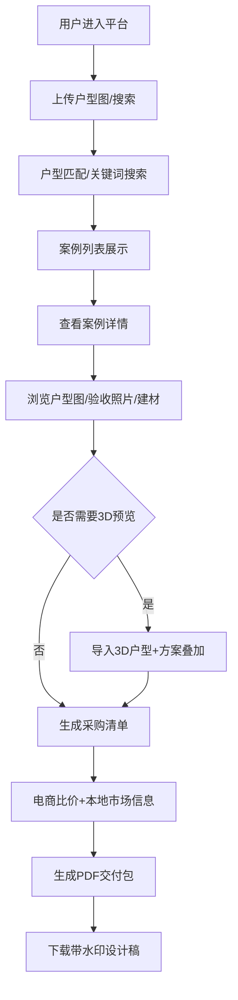

## 1. 产品概述

家装决策支持型B2C内容服务平台，以真实施工数据驱动用户装修决策。平台聚合千万级完工案例，为装修用户提供户型匹配、方案参考、建材比价、PDF交付包等一站式服务；同时为设计师提供案例展示、入驻审核、质量评分等后台管理能力。

- **核心问题**：装修用户缺乏真实可参考的完工案例，建材采购信息不对称，设计方案难以落地
- **目标用户**：有装修需求的C端用户、室内设计师、装修公司
- **市场价值**：通过真实施工数据建立信任，降低用户决策成本，打通设计-选材-施工全链路

## 2. 核心功能

### 2.1 用户角色

| 角色 | 注册方式 | 核心权限 |
|------|----------|----------|
| 普通用户 | 手机号/微信注册 | 浏览案例、户型匹配、建材比价、生成PDF交付包 |
| 设计师 | 资质审核入驻 | 上传案例、管理案例、查看评分、响应咨询 |
| 平台管理员 | 后台账号 | 设计师审核、案例质量评分、数据管理 |

### 2.2 功能模块

1. **首页**：案例推荐、搜索入口、户型上传、热门城市、平台数据展示
2. **案例库**：千万级完工案例列表、多维筛选（城市/户型/风格/预算）、户型相似度匹配
3. **案例详情**：SVG户型图、水电点位图、验收节点照片、建材清单、施工数据
4. **3D方案预览**：SketchUp/GLTF户型导入、方案叠加展示、3D交互浏览
5. **采购清单**：建材明细、京东/天猫API比价、本地建材市场供货信息、材料用量计算
6. **PDF交付包**：带水印设计稿下载、施工注意事项、材料用量公式导出
7. **设计师后台**：入驻申请、案例上传管理、质量评分查看、数据统计
8. **平台管理后台**：设计师审核、案例质量评分模型、数据监控

### 2.3 页面详情

| 页面名称 | 模块名称 | 功能描述 |
|----------|----------|----------|
| 首页 | Hero区 | 搜索框、案例上传入口、核心数据展示（案例数/城市数/设计师数） |
| 首页 | 热门城市导航 | 按城市筛选案例，显示各城市案例数量 |
| 首页 | 精选案例推荐 | 高质量案例卡片展示，支持按风格/预算快速筛选 |
| 首页 | 户型匹配入口 | 上传户型图/SVG，一键匹配相似案例 |
| 案例列表页 | 筛选面板 | 城市/户型/面积/风格/预算/装修类型多维筛选 |
| 案例列表页 | 排序功能 | 相似度/最新/热度/评分多维度排序 |
| 案例列表页 | 案例卡片 | 缩略图、城市、户型、面积、预算、设计师评分 |
| 案例详情页 | SVG户型图标注 | 矢量户型图，房间尺寸、功能区标注、可缩放交互 |
| 案例详情页 | 水电点位图 | 强电/弱电/给排水点位可视化展示 |
| 案例详情页 | 验收节点照片 | 隐蔽工程/泥木/油漆三阶段照片时间线 |
| 案例详情页 | 建材品牌型号 | OCR识别建材信息，链接至建材数据库详情 |
| 案例详情页 | 施工数据 | 工期、施工队、各阶段验收记录 |
| 3D预览页 | 3D模型加载 | SketchUp/GLTF格式导入与渲染 |
| 3D预览页 | 方案叠加 | 在3D户型上叠加推荐装修方案对比 |
| 3D预览页 | 交互控制 | 旋转、缩放、漫游、切换视角 |
| 采购清单页 | 建材清单 | 分类展示全部建材明细与用量 |
| 采购清单页 | 电商比价 | 京东/天猫实时价格对比，显示优惠信息 |
| 采购清单页 | 本地市场信息 | 附近建材市场门店地址、库存、联系电话 |
| 采购清单页 | 用量计算器 | 基于户型面积自动计算材料用量公式 |
| PDF交付页 | 预览下载 | 带水印设计稿PDF预览与下载 |
| PDF交付页 | 施工注意事项 | 各工序施工要点与验收标准 |
| PDF交付页 | 材料用量表 | 自动生成的材料用量公式与预算汇总 |
| 设计师入驻页 | 资质提交 | 个人信息、作品集、执业证书上传 |
| 设计师后台 | 案例管理 | 案例上传、编辑、上下架、查看数据 |
| 设计师后台 | 评分看板 | 质量评分明细、用户评价、排名 |
| 管理员后台 | 设计师审核 | 资质审核、入驻审批、黑名单管理 |
| 管理员后台 | 质量评分 | 案例质量自动评分+人工审核 |
| 管理员后台 | 数据统计 | 平台运营数据、用户行为分析 |

## 3. 核心流程

### 3.1 用户案例匹配流程
用户上传户型图 → 系统解析户型结构（房间数/面积/布局） → 户型相似度算法匹配 → 展示相似案例列表 → 用户筛选排序 → 查看案例详情

### 3.2 建材采购比价流程
用户查看案例建材清单 → 系统调用京东/天猫API获取实时价格 → 匹配本地建材市场库存 → 展示多渠道比价结果 → 用户生成采购计划 → 导出PDF清单

### 3.3 设计师入驻流程
设计师提交入驻申请 → 上传资质证明与作品集 → 平台管理员审核 → 审核通过开通账号 → 设计师上传案例 → 案例质量评分模型打分 → 优质案例推荐展示

## 4. 用户界面设计

### 4.1 设计风格
- **主色调**：深青绿色 #0F766E（专业、信赖），暖橙色 #F97316（活力、创造）
- **辅助色**：浅灰背景 #F8FAFC，卡片白色 #FFFFFF，深灰文字 #1E293B
- **按钮风格**：圆角8px，主按钮实色填充带微阴影，悬停时轻微上浮+阴影加深
- **字体**：标题使用思源宋体（衬线体，品质感），正文使用思源黑体（可读性强）
- **布局风格**：卡片式栅格布局，顶部固定导航，左侧筛选面板，主内容区自适应
- **图标风格**：Lucide线性图标，统一2px描边，与主色调一致

### 4.2 页面设计概览

| 页面名称 | 模块名称 | UI元素 |
|----------|----------|--------|
| 首页 | Hero区 | 全屏渐变背景（青绿→深蓝），大标题+副标题，中央搜索框，背景模糊的案例图片轮播 |
| 首页 | 数据统计 | 4个数据卡片（千万案例/百城覆盖/万名设计师/真实评分），悬停微动效 |
| 首页 | 精选案例 | 不等高瀑布流卡片，悬停时显示更多信息+遮罩渐变 |
| 案例详情页 | 信息架构 | 左侧粘性导航（户型/水电/验收/建材），右侧内容区滚动联动 |
| 案例详情页 | 图片展示 | 验收照片时间线布局，三阶段标签切换，图片灯箱放大 |
| 3D预览页 | 场景布局 | 全幅3D画布，右下角工具条，左侧方案切换面板，底部进度条 |
| 采购清单页 | 比价表格 | 商品行显示三列价格（京东/天猫/本地），最优价高亮标记 |
| PDF交付页 | 预览区 | 模拟纸张的拟物化预览，翻页动效，水印半透明平铺 |

### 4.3 响应式设计
- **设计策略**：桌面端优先（1440px基准），自适应平板（768px）和移动端（375px）
- **断点设置**：lg 1024px / md 768px / sm 640px
- **移动端适配**：筛选面板转为底部抽屉，案例卡片单列展示，3D预览简化交互
- **触摸优化**：可点击区域≥44px，滑动手势支持翻页/缩放，禁用双击缩放

### 4.4 3D场景指导
- **环境/HDRI**：使用柔和的室内HDRI环境贴图，营造真实家居光照氛围
- **光照设置**：主光DirectionalLight模拟自然光，辅光AmbientLight提亮暗部，点光源模拟室内灯具
- **相机设置**：透视相机，初始角度45°俯视，支持OrbitControls轨道控制
- **构图与焦点**：客厅区域为默认焦点，模型中心对齐坐标原点
- **交互动画**：模型加载时淡入+旋转展示，方案切换时平滑过渡动画
- **后处理效果**：SSAO环境光遮蔽增强立体感，Bloom发光效果
- **性能预算**：单个3D模型三角面≤50万，单场景Draw Call≤100
