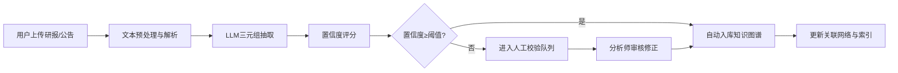
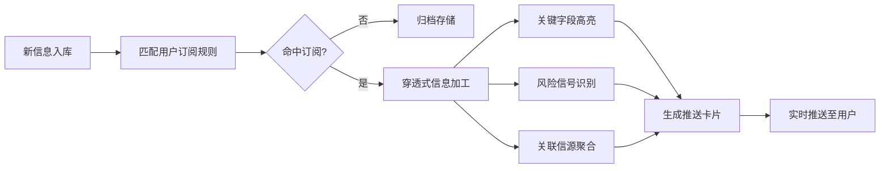

## 1. 产品概述

深度财经信息挖掘与知识图谱驱动的研究协作平台，面向资本市场研究者、分析师和投资机构，通过自动抽取财经文本中的实体关系三元组，构建动态更新的关联知识网络，并提供穿透式信息推送、多人研报协作和智能摘要生成等核心能力。

- 核心价值：解决财经信息过载、关联关系挖掘困难、研报协作低效三大痛点
- 目标用户：券商分析师、基金研究员、投资机构、财经媒体、企业战略部

## 2. 核心功能

### 2.1 用户角色

| 角色 | 注册方式 | 核心权限 |
|------|---------|---------|
| 研究员 | 企业邮箱注册 | 浏览知识图谱、订阅推送、标注研报、生成摘要 |
| 分析师 | 企业邮箱+资质审核 | 全部研究员权限 + 创建协作空间、管理标注任务、信源评分复核 |
| 管理员 | 后台分配 | 用户管理、系统配置、数据血缘追溯、模型参数调整 |

### 2.2 功能模块

1. **知识图谱主页**：实体搜索、关系网络可视化、概念/事件分类导航、热点实体排行榜
2. **实体详情页**：实体画像、关联关系图谱、时间线事件、相关公告研报
3. **信息抽取中心**：文本上传解析、三元组抽取展示、人工校验修正、抽取历史记录
4. **订阅推送中心**：实体/概念/事件订阅管理、推送列表、穿透式详情（信源链接+高亮+风险标识）
5. **分析师协作空间**：研报列表、PDF在线标注、多人批注锚点、结构化摘要生成
6. **后台管理面板**：数据血缘追溯、信源可信度评分、LLM摘要生成器、人工校验通道

### 2.3 页面详情

| 页面名称 | 模块名称 | 功能描述 |
|---------|---------|---------|
| 知识图谱主页 | 搜索导航栏 | 实体/概念/事件全文搜索，智能联想建议 |
| 知识图谱主页 | 图谱可视化区 | 力导向布局展示实体关系网络，支持缩放/拖拽/筛选 |
| 知识图谱主页 | 热点实体排行 | 按关注度排序展示Top10上市公司/高管/机构 |
| 知识图谱主页 | 概念板块导航 | 光伏胶膜、跨境支付等概念分类，点击跳转概念详情 |
| 实体详情页 | 实体档案卡 | 基本信息、核心指标、风险标签 |
| 实体详情页 | 关联图谱 | 以目标实体为中心的一跳/二跳关系网络 |
| 实体详情页 | 时间线 | 按时间倒序展示关联事件（定增、并购、高管变更等） |
| 实体详情页 | 相关资讯 | 关联公告、研报、新闻列表，支持按类型筛选 |
| 信息抽取中心 | 文本输入区 | 支持粘贴文本或上传PDF/Word文档 |
| 信息抽取中心 | 三元组展示区 | 主体-谓词-客体结构化展示，支持置信度筛选 |
| 信息抽取中心 | 人工校验面板 | 逐条审核、修正、标注抽取结果 |
| 订阅推送中心 | 订阅管理 | 新增/删除/编辑订阅项（实体/概念/事件） |
| 订阅推送中心 | 推送列表 | 实时推送流，支持未读标记、分类过滤 |
| 订阅推送中心 | 穿透详情面板 | 原始信源链接、关键字段高亮、风险信号等级标识 |
| 协作空间 | 研报库 | 研报列表，支持按行业/作者/日期筛选 |
| 协作空间 | PDF阅读器 | 在线PDF渲染，支持高亮/下划线/批注锚点 |
| 协作空间 | 多人协作面板 | 在线用户列表、实时批注同步、评论回复 |
| 协作空间 | 摘要生成器 | LLM自动摘要 + 人工编辑校验双通道 |
| 后台管理 | 数据血缘追溯 | 三元组溯源链路可视化展示 |
| 后台管理 | 信源评分 | 信源可信度评分模型配置与结果展示 |
| 后台管理 | 摘要审核 | LLM生成摘要人工复核队列 |
| 后台管理 | 系统配置 | 模型参数、推送策略、权限配置 |

## 3. 核心流程

### 3.1 信息抽取与入库流程

### 3.2 订阅推送流程

### 3.3 研报协作流程

## 4. 用户界面设计

### 4.1 设计风格

- **主色调**：深邃藏蓝 `#0B1E3F`（专业金融感）+ 金色 `#C9A962`（高端质感）
- **辅助色**：翡翠绿 `#10B981`（正面信号）+ 警示红 `#EF4444`（风险信号）+ 琥珀黄 `#F59E0B`（中性提醒）
- **字体**：标题使用 Noto Serif SC（衬线体，专业感），正文使用 Source Han Sans SC（现代清晰）
- **按钮风格**：微圆角（4px），悬浮微动效，主按钮金色描边+深色填充
- **布局风格**：三栏式主布局（左侧导航 + 中间内容区 + 右侧信息面板），卡片式模块化
- **图表风格**：D3.js力导向图，节点带发光描边，连线按关系类型着色

### 4.2 页面设计概述

| 页面名称 | 模块名称 | UI 设计要点 |
|---------|---------|------------|
| 知识图谱主页 | 图谱可视化区 | 全幅力导向图，节点悬浮高亮关联路径，右侧滑出详情抽屉 |
| 知识图谱主页 | 搜索导航栏 | 深色磨砂玻璃效果，输入联想下拉卡片，快捷键Ctrl+K聚焦 |
| 实体详情页 | 实体档案卡 | 金色渐变边框，核心指标数字大号展示，风险标签醒目警示 |
| 实体详情页 | 时间线 | 垂直时间线，事件节点带颜色编码，悬浮展开详情 |
| 信息抽取中心 | 三元组展示区 | 表格+卡片混合视图，置信度进度条，待审核项闪烁提示 |
| 订阅推送中心 | 推送列表 | 消息流布局，未读项左侧金色竖线，风险信号标签突出 |
| 协作空间 | PDF阅读器 | 左侧文档缩略图，中间阅读区，右侧批注面板分栏 |
| 协作空间 | 摘要生成器 | 左右分栏对比（原文 vs 摘要），编辑区支持富文本 |
| 后台管理 | 数据血缘追溯 | 有向无环图可视化，节点可点击追溯原始文本片段 |
| 后台管理 | 信源评分 | 雷达图展示多维度评分，趋势折线图展示历史变化 |

### 4.3 响应式设计

- 采用 Desktop-First 设计，核心交互以桌面端为主
- 平板端：右侧面板折叠为底部抽屉，图谱自适应缩放
- 移动端：导航转为底部Tab栏，图谱简化为列表视图

### 4.4 动效与交互

- 知识图谱节点：入场涟漪动画，脉冲发光效果提示新更新实体
- 页面切换：淡入淡出 + 轻微位移动画（200ms ease-out）
- 卡片悬浮：微妙上浮（translateY(-2px)）+ 阴影增强
- 推送通知：顶部滑入动画，未读红点呼吸动效
