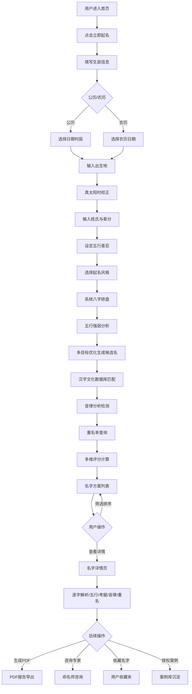

## 1. 产品概述

传统文化驱动的智能起名SaaS服务系统，基于可验证的文化逻辑与数据支撑，为新生儿家庭提供科学、文化底蕴深厚的起名解决方案。系统集成八字排盘、汉字文化数据库、音律分析、重名率查询及多目标优化算法，输出多维评分的名字方案，并支持命名师专业服务与PDF报告导出。

- **核心价值**：拒绝玄学包装，以数据驱动+文化考据为核心，提供透明、可溯源的起名服务
- **目标用户**：新生儿父母、传统文化爱好者、专业命名师
- **市场定位**：国内首个强调"可验证文化逻辑"的智能起名平台

## 2. 核心功能

### 2.1 用户角色

| 角色 | 注册方式 | 核心权限 |
|------|----------|----------|
| 普通用户 | 手机号/微信注册 | 使用起名向导、查看名字方案、导出基础报告、浏览案例库 |
| 高级会员 | 付费升级 | 无限次起名、完整PDF报告、专属命名师咨询、优先客服 |
| 命名师 | 资质审核入驻 | 发布案例、接受用户咨询、管理个人主页、参与名字方案审核 |
| 平台管理员 | 后台账号 | 用户管理、命名师审核、案例审核、数据统计、系统配置 |

### 2.2 功能模块

1. **首页**：品牌展示、核心功能入口、精选案例、命名师推荐、用户评价
2. **智能起名向导**：生辰录入（公历/农历）、姓氏选择、辈分设定、五行偏好、起名偏好配置
3. **名字方案展示**：名字列表、多维评分（吉祥度/独特性/书写便捷/音律和谐）、五行分析、文化考据、重名率统计
4. **名字详情页**：逐字解析、五行补益说明、古籍佐证、诗词典故、音律分析、笔画分析、相似名字推荐
5. **案例库**：授权案例展示、分类筛选、命名师关联、用户收藏
6. **命名师广场**：命名师列表、个人主页、资质展示、案例作品集、咨询入口
7. **用户中心**：起名历史、收藏管理、会员管理、个人信息、PDF下载记录
8. **后台管理系统**：用户管理、命名师入驻审核、案例审核、数据看板、系统配置
9. **PDF报告导出**：完整起名报告生成，包含八字排盘、五行分析、名字详解、文化考据

### 2.3 页面详情

| 页面名称 | 模块名称 | 功能描述 |
|----------|----------|----------|
| 首页 | Hero品牌区 | 动态背景、品牌主张、核心功能展示动效、立即起名CTA |
| 首页 | 功能特色区 | 六大核心能力卡片（八字排盘/汉字考据/音律分析/重名查询/智能优化/专家服务），hover交互效果 |
| 首页 | 起名流程区 | 五步起名流程可视化（录入信息→八字排盘→智能生成→多维筛选→报告导出） |
| 首页 | 精选案例区 | 用户授权案例卡片网格，展示名字、寓意、评分、命名师 |
| 首页 | 命名师推荐 | 轮播展示认证命名师，头像、简介、擅长领域、案例数 |
| 首页 | 用户评价区 | 真实用户评价，带动效的横向滚动展示 |
| 智能起名向导 | 步骤导航 | 步骤指示器，可回溯修改 |
| 智能起名向导 | 生辰录入 | 公历/农历切换、日期选择器、时辰选择、出生地选择（用于真太阳时校正） |
| 智能起名向导 | 姓氏与辈分 | 姓氏输入（支持双姓）、辈分字开关与输入、性别选择 |
| 智能起名向导 | 五行偏好 | 五行喜忌可视化选择（金木水火土）、偏好强度调节、用字禁忌 |
| 智能起名向导 | 风格偏好 | 起名风格标签（经典/现代/诗意/大气/儒雅/灵动）、单双名选择、字数范围 |
| 智能起名向导 | 生成与等待 | 加载动画、实时进度提示、排盘过程可视化 |
| 名字方案列表 | 排序与筛选 | 综合排序/吉祥度/独特性/书写便捷/音律和谐、筛选器（字数/五行/风格） |
| 名字方案列表 | 名字卡片 | 名字、拼音、核心评分、五行标签、主寓意、收藏按钮、查看详情 |
| 名字方案列表 | 批量对比 | 支持多选名字进行横向对比 |
| 名字详情页 | 名字概览 | 大字展示名字、拼音、综合评分环形图、核心标签 |
| 名字详情页 | 逐字解析 | 每个字的康熙笔画、五行属性、说文解字释义、常用搭配 |
| 名字详情页 | 五行补益 | 八字排盘结果、五行强弱雷达图、名字补益说明、可验证的五行计算逻辑 |
| 名字详情页 | 文化考据 | 诗词典故出处（原文+译文+出处）、古籍佐证、同名字历史名人 |
| 名字详情页 | 音律分析 | 平仄搭配图示、声母韵母分析、谐音检测、朗读试听 |
| 名字详情页 | 重名统计 | 全国重名人数、年龄分布、地域分布热力图 |
| 名字详情页 | 操作区 | 收藏、加入对比、生成PDF报告、咨询命名师 |
| 案例库 | 筛选区 | 按风格/五行/字数/命名师筛选、搜索框 |
| 案例库 | 案例卡片 | 名字、宝宝信息、命名师、评分、授权标识 |
| 案例详情页 | 完整案例 | 完整起名过程、八字排盘、备选方案、最终方案、用户评价（授权后可见） |
| 命名师广场 | 筛选与排序 | 按领域/评分/案例数排序、认证标签筛选 |
| 命名师个人主页 | 基本信息 | 头像、姓名、简介、资质证书、从业年限、擅长领域 |
| 命名师个人主页 | 案例作品 | 作品集网格、点击查看详情 |
| 命名师个人主页 | 评价与咨询 | 用户评价列表、在线咨询入口 |
| 用户中心 | 起名历史 | 历史起名记录列表、可重新查看/导出 |
| 用户中心 | 我的收藏 | 收藏的名字和案例、分类管理 |
| 用户中心 | 会员中心 | 会员等级、权益说明、续费/升级入口 |
| 用户中心 | 资料设置 | 个人信息、偏好设置、地址管理 |
| 后台登录 | 登录表单 | 账号密码、验证码登录 |
| 后台首页 | 数据看板 | 用户增长、起名次数、命名师数量、收入统计、趋势图表 |
| 后台用户管理 | 用户列表 | 用户信息、会员状态、操作（禁用/查看详情） |
| 后台命名师管理 | 入驻审核 | 待审核命名师列表、资质查看、通过/拒绝操作 |
| 后台命名师管理 | 命名师列表 | 已入驻命名师管理、禁用/推荐 |
| 后台案例审核 | 案例列表 | 用户授权案例审核、敏感词检测、上下架操作 |
| 后台系统配置 | 参数配置 | 起名算法参数、会员价格、通知模板 |
| PDF报告页 | 报告预览 | 完整报告页面、封面、目录、各章节内容、打印/下载按钮 |

## 3. 核心流程

### 3.1 主要用户流程描述

用户进入首页 → 点击"立即起名"进入向导 → 填写生辰信息（支持公历/农历切换，自动根据出生地经纬度进行真太阳时校正）→ 输入父母姓氏、选择辈分字 → 设定五行喜忌与起名风格偏好 → 系统执行八字排盘与五行分析 → 调用多目标优化算法生成候选名字池 → 依次进行汉字文化匹配、音律检测、重名率查询 → 输出带有多维评分的名字方案列表 → 用户浏览、筛选、收藏名字 → 点击查看名字详情 → 查看逐字解析、五行补益说明、文化考据、音律分析、重名统计 → 用户可生成PDF报告或咨询命名师 → 满意后授权案例可被平台展示。

### 3.2 核心流程Mermaid图

## 4. 用户界面设计

### 4.1 设计风格

**整体风格**：新中式极简主义，融合传统水墨意境与现代数据可视化

- **主色调**：
  - 主色：墨玉青 `#1a3a3a`（沉稳内敛，象征传统文化深度）
  - 辅色：朱砂红 `#9b2d2d`（重要操作与强调元素，呼应传统印章文化）
  - 点缀：宣纸米 `#f5f0e8`（背景底色，营造古籍质感）、金石金 `#b8860b`（评分与数据高亮）
- **按钮样式**：圆角 8px，主按钮墨玉青底白字带细微金边，hover状态有轻微上浮动效；次要按钮宣纸米底墨玉青字
- **字体**：
  - 展示字体（名字、标题）：思源宋体（Noto Serif SC），传递书卷气与文化厚重感
  - 正文字体：思源黑体（Noto Sans SC），保证阅读清晰度
  - 数据数字：JetBrains Mono，等宽字体增强数据感
- **布局风格**：卡片式布局配合留白，采用中式纹样做微妙分隔线，数据图表采用水墨晕染风格
- **图标风格**：线性图标融入中式元素（如印章、竹简、毛笔笔触），统一24px网格
- **装饰元素**：水墨晕染背景纹理、中式云纹分隔线、印章式标签、竹简风格侧边栏

### 4.2 页面设计概览

| 页面名称 | 模块名称 | UI元素 |
|----------|----------|--------|
| 首页 | Hero品牌区 | 全屏水墨晕染动态背景，毛笔书写式品牌名称淡入动效，核心Slogan逐字显现，CTA按钮带朱砂印章风格边框，入场动画1.2s分层渐显 |
| 首页 | 功能特色区 | 六张功能卡片，每张卡片配有线性中式图标，hover时卡片轻微上浮（translateY(-4px)）并出现淡金色阴影，图标动画旋转360° |
| 首页 | 起名流程区 | 横向五步骤时间线，节点采用印章式圆形设计，连接线为墨色渐变，当前步骤用朱砂红高亮，过渡动画0.4s |
| 首页 | 精选案例区 | 响应式网格3列，案例卡片采用宣纸纹理底，名字用大号宋体展示，评分用金石金圆环进度条，hover时轻微放大1.02倍 |
| 起名向导 | 步骤导航 | 顶部固定步骤条，每步图标+文字，已完成打勾用印章动画 |
| 起名向导 | 表单区 | 大卡片容器，输入框采用中式双线边框，焦点态变为朱砂红，日期选择器带有农历标注 |
| 起名向导 | 五行偏好 | 五行圆形图标（金木水火土各对应颜色：金白/木绿/水蓝/火红/土黄），点击选中出现环形波纹动画 |
| 名字方案列表 | 名字卡片 | 左右布局：左侧名字+拼音，右侧四维评分条形图（墨玉青/朱砂红/金石金/水蓝四种颜色），评分条带填充动效 |
| 名字详情页 | 名字概览 | 超大号宋体名字展示（80px起），综合评分环形图（SVG绘制，水墨渐变填充），标签采用印章式圆角设计 |
| 名字详情页 | 五行雷达图 | SVG五边形雷达图，面积用水墨半透明渐变填充，各顶点标注五行名称与数值 |
| 名字详情页 | 文化考据 | 古籍风格卡片，引用原文用仿宋斜体，出处标注在右下角，带竹简纹理背景 |
| 名字详情页 | 音律分析 | 平仄图示用方块表示（阴平阳平为白圈，上声去声为黑圈），声母韵母用表格展示，谐音警告用朱砂红边框 |
| PDF报告页 | 报告内容 | 打印优化布局，A4尺寸分页，封面含名字水印，每页有中式页码，页眉带墨色分隔线 |
| 后台系统 | 数据看板 | 深色主题（墨玉青底），数据卡片大数字展示，趋势图采用平滑曲线+面积填充水墨风格 |

### 4.3 响应式设计

- **桌面优先**：1440px基准栅格（12列，24px间距），最大内容宽度1280px
- **平板适配**：≥768px切换为8列栅格，部分双列模块合并为单列
- **手机适配**：≥375px切换为4列栅格，导航转为底部Tab栏，表单元素全宽展示，名字详情页数据图表自适应缩放
- **触摸优化**：所有可点击元素最小尺寸44×44px，hover效果在移动端改为active状态反馈，滚动采用惯性滚动优化

### 4.4 交互动效规范

- **页面转场**：淡入+向上位移12px，时长300ms，ease-out缓动
- **数据加载**：骨架屏采用宣纸米底色，墨色渐变从左到右扫过（shimmer效果）
- **名字评分动画**：数字从0滚动到目标值（duration=1.2s），进度条同步填充
- **五行图表**：初始空状态，各数据点依次延迟出现（stagger=80ms），带动画弹动效果
- **按钮反馈**：点击时scale(0.97)，松开后回弹，总时长150ms
- **卡片悬浮**：translateY(-4px) + box-shadow增强，transition: all 0.3s cubic-bezier(0.4, 0, 0.2, 1)
