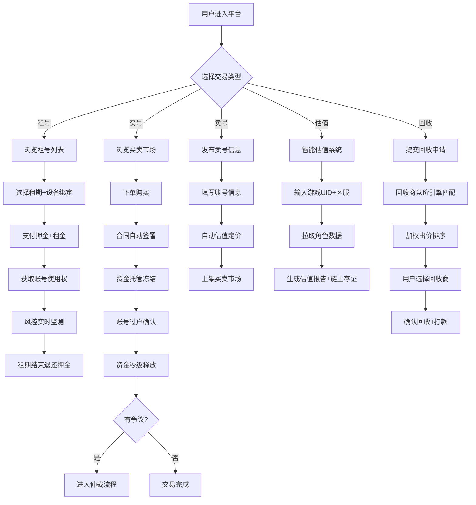

## 1. 产品概述

高安全等级游戏账号全生命周期交易平台——覆盖租号、买号、卖号、估值、回收五大主干流程，通过链上存证、风控引擎、资金托管与保险理赔构建可信交易闭环，面向游戏玩家、回收商与平台运营方提供一站式账号资产流通服务。

## 2. 核心功能

### 2.1 用户角色

| 角色 | 注册方式 | 核心权限 |
|------|----------|----------|
| 玩家用户 | 手机号/邮箱注册 | 租号、买号、卖号、估值、申请回收、保险理赔 |
| 回收商 | 资质审核注册 | 竞价回收、批量出价、回收订单管理 |
| 平台运营 | 内部授权 | 反作弊看板、合规审计、仲裁处理、系统配置 |

### 2.2 功能模块

1. **首页大厅**: 平台概览、快捷入口、热门账号推荐、实时交易动态
2. **租号中心**: 账号浏览、租用下单、租期管理、风控状态
3. **买卖市场**: 账号买卖列表、合同签署、资金托管、争议仲裁
4. **估值系统**: 智能估值、资产快照、估值报告
5. **回收竞价**: 回收商竞价、加权出价、回收订单
6. **保险理赔**: 找回保险、合同履约监控、自动赔付
7. **VR预览**: 3D装备可视化、账号详情沉浸式展示
8. **运营后台**: 反作弊看板、合规审计、三流合一追踪

### 2.3 页面详情

| 页面名称 | 模块名称 | 功能描述 |
|----------|----------|----------|
| 首页大厅 | Hero区域 | 平台核心数据展示：总交易额、在线账号数、安全保障次数，动态粒子背景 |
| 首页大厅 | 快捷导航 | 租/买/卖/估/回收五大入口卡片，悬停3D翻转效果 |
| 首页大厅 | 实时交易流 | 滚动展示最近成交记录，含游戏名称、交易类型、金额、时间 |
| 首页大厅 | 热门推荐 | 热门游戏账号卡片，含装备预览缩略图和价格 |
| 租号中心 | 搜索筛选 | 按游戏/区服/等级/价格区间筛选，支持关键词搜索 |
| 租号中心 | 账号列表 | 卡片式展示：游戏图标、区服、等级、装备亮点、时租/日租价格 |
| 租号中心 | 租用下单 | 选择租期、确认风控条款、支付押金、设备指纹绑定 |
| 租号中心 | 风控面板 | 设备指纹状态、行为异常评分、异地登录告警、熔断状态 |
| 买卖市场 | 买号列表 | 可购买账号列表，含估值区间、卖家信誉、合同状态 |
| 买卖市场 | 卖号发布 | 上架账号、填写资产信息、自动估值、设置价格 |
| 买卖市场 | 交易详情 | 账号资产明细、合同预览、资金托管状态、双方信息 |
| 买卖市场 | 合同签署 | 电子合同展示、双方签章、自动生效、托管资金冻结 |
| 买卖市场 | 争议仲裁 | 发起争议、提交证据、仲裁进度、裁决结果 |
| 估值系统 | 智能估值 | 输入游戏UID+区服，自动拉取角色数据并生成估值 |
| 估值系统 | 估值报告 | 角色等级、装备价值、市场均价、趋势图表、链上存证哈希 |
| 回收竞价 | 回收提交 | 提交回收申请、选择游戏/账号、设置期望回收价 |
| 回收竞价 | 竞价面板 | 回收商出价列表，按热度/估值/时效加权排名 |
| 回收竞价 | 回收订单 | 已确认回收订单、物流状态、打款进度 |
| 保险理赔 | 保单管理 | 已购保险列表、保单状态、覆盖范围 |
| 保险理赔 | 理赔申请 | 发起理赔、提交找回证明、自动触发赔付流程 |
| 保险理赔 | 履约监控 | 合同履约状态实时面板、异常预警、赔付记录 |
| VR预览 | 3D装备展示 | Three.js渲染装备模型、旋转/缩放交互、装备属性浮层 |
| VR预览 | 账号全景 | 沉浸式账号信息展示、角色外观预览、资产总览 |
| 运营后台 | 反作弊看板 | 异常账号聚集热力图、刷单行为图谱、风险评分分布 |
| 运营后台 | 合规审计 | 资金流/账号流/合同流三流合一追踪、审计日志、导出报告 |
| 运营后台 | 仲裁管理 | 待处理争议列表、证据审查、裁决操作 |

## 3. 核心流程

### 3.1 租号流程
用户浏览账号 → 选择租期 → 设备指纹绑定 → 支付押金+租金 → 获取账号 → 实时风控监测 → 租期结束 → 押金退还

### 3.2 买卖流程
卖家发布 → 智能估值 → 买家下单 → 合同自动签署 → 资金托管冻结 → 账号过户确认 → 资金秒级释放 → (可选)争议仲裁

### 3.3 回收流程
用户提交回收 → 千家回收商竞价引擎匹配 → 加权出价排序 → 用户选择回收商 → 确认回收价 → 账号移交 → 打款完成

### 3.4 保险理赔流程
购买找回保险 → 合同履约状态实时同步 → 账号被找回触发告警 → 用户申请理赔 → 系统自动验证合同状态 → 赔付自动触发

## 4. 用户界面设计

### 4.1 设计风格

- **主色调**: 深色赛博朋克风——主色 #0A0E1A（深邃暗蓝）、辅色 #00F0FF（电光青）、#FF3366（警告红）、#00FF88（安全绿）
- **次色调**: #1A1F35（卡片深蓝）、#2A3050（悬浮面板）
- **按钮风格**: 圆角8px、微发光边框、hover时光晕扩散效果
- **字体**: 标题使用 Orbitron（科技感显示字体）、正文使用 Noto Sans SC
- **布局**: 左侧导航栏+主内容区，卡片化模块布局
- **图标**: 线性+微光效果的游戏风格图标
- **整体氛围**: 赛博朋克×游戏交易——暗色基底、霓虹高光、数据流动画、网格线背景

### 4.2 页面设计概览

| 页面名称 | 模块名称 | UI元素 |
|----------|----------|--------|
| 首页大厅 | Hero区域 | 深色渐变背景+粒子动画，中央大字标题+实时数据计数器，霓虹发光边框 |
| 首页大厅 | 快捷导航 | 五张半透明玻璃态卡片，hover时3D倾斜+边框发光，图标使用游戏风格 |
| 首页大厅 | 实时交易流 | 左右滚动数据条，半透明背景+滚动动画，交易类型用不同颜色标识 |
| 首页大厅 | 热门推荐 | 横向滚动卡片，装备缩略图+渐变叠加层，价格标签荧光效果 |
| 租号中心 | 搜索筛选 | 顶部固定筛选栏，下拉选择器+滑块，玻璃态背景 |
| 租号中心 | 账号列表 | 网格卡片布局，左图右文，装备标签霓虹色，价格突出显示 |
| 租号中心 | 风控面板 | 右侧抽屉面板，风险评分仪表盘，告警红色闪烁，状态指示灯 |
| 买卖市场 | 合同签署 | 中央模态框，合同文本滚动区，底部签章区+确认按钮，签章动画 |
| 买卖市场 | 资金托管 | 进度条+状态节点，金额高亮，冻结/释放状态切换动画 |
| 估值系统 | 估值报告 | 雷达图+柱状图，资产明细表，链上存证哈希显示区 |
| 回收竞价 | 竞价面板 | 实时出价滚动列表，出价动画闪烁，排名徽章 |
| 保险理赔 | 履约监控 | 时间轴+状态节点，异常告警弹窗，赔付进度条 |
| VR预览 | 3D装备展示 | Three.js全屏渲染，装备模型+属性浮层，星空/网格背景 |
| 运营后台 | 反作弊看板 | 热力图+关系图谱，异常点红色脉冲，刷单链条可视化 |
| 运营后台 | 合规审计 | 三列并排时间轴（资金流/账号流/合同流），交叉验证高亮 |

### 4.3 响应式设计

- 桌面优先设计，最小适配 1280px 宽度
- 平板端（768-1280px）：侧边栏折叠为图标模式，卡片从3列变2列
- 移动端（<768px）：底部Tab导航，单列卡片，VR预览降级为2D图片展示

### 4.4 3D场景指引

- **环境**: 深色太空/赛博空间环境，微弱星光粒子背景
- **灯光**: 冷色调环境光+霓虹色点光源，营造科技氛围
- **相机**: 45度俯视初始角度，支持鼠标拖拽旋转和缩放
- **交互**: 装备模型点击高亮+属性面板弹出，自动缓慢旋转
- **后处理**: 泛光效果(Bloom)增强霓虹感，微弱景深效果
