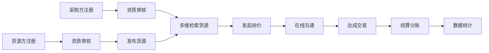
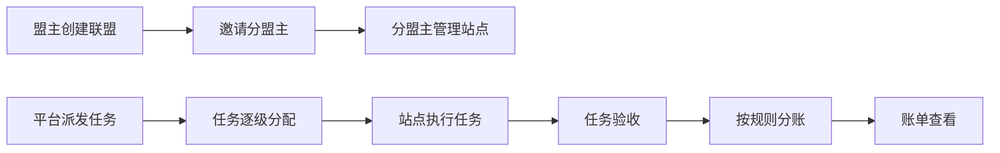

## 1. 产品概述

面向再生资源行业的B2B产业协同平台，连接货源方、采购方与运营方，实现12类废料品类的线上交易、行情监控、联盟管理与数据分析。解决行业信息不对称、交易不透明、管理效率低下等痛点，打造数字化产业生态。

- 核心价值：实现再生资源交易全流程数字化，提升行业协同效率与透明度
- 目标用户：回收站/个体户（货源方）、冶炼厂/贸易商（采购方）、平台运营方

## 2. 核心 Features

### 2.1 用户角色

| 角色 | 注册方式 | 核心权限 |
|------|----------|----------|
| 货源方（回收站/个体户） | 手机号+资质审核 | 发布货源、管理数字名片、查看行情、接收询价、参与联盟任务 |
| 采购方（冶炼厂/贸易商） | 手机号+资质审核 | 搜索货源、发布采购需求、订阅价格预警、在线询价、查看数据看板 |
| 平台运营方 | 内部账号系统 | 用户管理、资质审核、联盟体系管理、数据看板、价格行情维护、结算分账 |

### 2.2 功能模块

1. **实时行情看板**：区域价差热力图、历史走势对比、价格预警订阅
2. **货源交易中心**：结构化货源发布、多维检索筛选、在线询价通道
3. **回收站数字名片**：资质上传管理、服务半径标注、在线询价入口
4. **联盟管理体系**：盟主-分盟-站点三级权限、任务派发、结算分账
5. **数据看板**：行业供需波动分析、货源转化漏斗复盘

### 2.3 页面详情

| 页面名称 | 模块名称 | 功能描述 |
|----------|----------|----------|
| 行情看板首页 | 行情概览 | 12类废料品类实时价格卡片、涨跌幅指示器 |
| 行情看板首页 | 区域价差热力图 | 中国地图热力展示各区域价格差异 |
| 行情看板首页 | 历史走势对比 | 多品类价格趋势叠加图表、时间维度切换 |
| 行情看板首页 | 价格预警订阅 | 设置品类/阈值预警、通知渠道配置 |
| 货源列表页 | 多维检索筛选 | 按品类/吨位/纯度/地理位置/认证状态筛选 |
| 货源列表页 | 货源卡片 | 展示货源详情、价格、位置、认证标识 |
| 货源发布页 | 结构化表单 | 品类、吨位、纯度、图片、地理位置、期望价格 |
| 货源详情页 | 货源信息 | 完整货源信息、历史交易记录 |
| 货源详情页 | 在线询价 | 发送询价消息、查看历史询价记录 |
| 回收站名片页 | 基础信息 | 回收站名称、地址、联系方式、服务半径 |
| 回收站名片页 | 资质展示 | 营业执照、经营许可证等资质文件展示 |
| 回收站名片页 | 货源展示 | 该回收站发布的所有货源列表 |
| 联盟管理页 | 组织架构 | 盟主-分盟-站点三级组织树展示 |
| 联盟管理页 | 权限管理 | 角色权限配置、成员邀请与移除 |
| 联盟管理页 | 任务派发 | 创建协作任务、指派成员、进度追踪 |
| 联盟管理页 | 结算分账 | 交易分账规则配置、账单明细 |
| 数据看板页 | 供需波动分析 | 供需趋势图、区域供需热力图 |
| 数据看板页 | 转化漏斗分析 | 货源发布-询价-报价-成交转化漏斗 |
| 数据看板页 | 交易统计 | 交易额、成交量、活跃用户等核心指标 |
| 个人中心 | 账户信息 | 基本信息、资质管理、安全设置 |
| 个人中心 | 消息中心 | 系统通知、询价消息、预警通知 |

## 3. 核心流程

### 3.1 货源发布与交易流程

用户注册并完成资质审核后，货源方可以发布结构化货源信息，采购方通过多维检索找到合适货源后发起询价，双方在线沟通后达成交易，平台记录交易数据并完成结算分账。

### 3.2 联盟协作流程

盟主创建联盟并邀请分盟主，分盟主管理下属站点，平台派发协作任务，各级成员协同完成任务后按预设规则进行分账结算。

## 4. 用户界面设计

### 4.1 设计风格

- **主色调**：工业绿（#16a34a）代表环保与再生，搭配深灰蓝（#1e293b）体现专业与稳重
- **辅助色**：橙色（#f97316）用于价格上涨提示，红色（#ef4444）用于下跌提示，金色（#eab308）用于认证标识
- **按钮风格**：圆角6px，主按钮采用渐变背景，hover时有轻微上浮效果与阴影
- **字体**：标题使用"Noto Sans SC" Bold，正文使用"Noto Sans SC" Regular，数字使用"JetBrains Mono"增强数据感
- **布局风格**：卡片式布局，清晰的信息层级，数据可视化区域采用深色背景增强科技感
- **图标风格**：线性图标，统一2px线条粗细，使用lucide-react图标库

### 4.2 页面设计概览

| 页面名称 | 模块名称 | UI元素 |
|----------|----------|----------|
| 行情看板首页 | 行情概览 | 价格卡片网格布局，红绿涨跌色块，实时更新动画 |
| 行情看板首页 | 区域价差热力图 | 中国地图SVG，鼠标悬停显示区域详情，渐变色阶图例 |
| 行情看板首页 | 历史走势对比 | 多折线图表，可拖拽时间轴，品类切换标签 |
| 行情看板首页 | 价格预警订阅 | 表单卡片，阈值滑块，通知渠道开关 |
| 货源列表页 | 多维检索筛选 | 侧边筛选栏，标签式多选，范围滑块，地图筛选 |
| 货源列表页 | 货源卡片 | 图片缩略图，品类标签，认证徽章，价格醒目显示 |
| 货源详情页 | 货源信息 | 大图轮播，参数表格，地图定位，资质徽章 |
| 回收站名片页 | 资质展示 | 卡片式资质文件，可点击放大，有效期标识 |
| 回收站名片页 | 服务半径 | 地图圆形覆盖层，半径数值标注 |
| 联盟管理页 | 组织架构 | 树状结构图，可折叠展开，角色徽章区分 |
| 联盟管理页 | 结算分账 | 分账规则流程图，账单列表带状态标签 |
| 数据看板页 | 供需波动分析 | 面积对比图表，关键指标卡片，同比环比标注 |
| 数据看板页 | 转化漏斗 | 漏斗图，各阶段转化率标注，流失点高亮 |

### 4.3 响应式

- **桌面端**：1440px基准设计，采用12列栅格系统，侧边栏宽度260px固定
- **平板端**：1024px适配，侧边栏可折叠为图标导航，卡片布局调整为2列
- **移动端**：375px适配，底部Tab导航，筛选抽屉式展开，卡片单列布局
- **触控优化**：按钮最小高度44px，列表项触控区域加大，支持下拉刷新与左滑操作

### 4.4 数据可视化设计

- **图表库**：使用recharts实现专业数据可视化
- **热力图**：自定义SVG地图组件，支持多区域数据展示
- **漏斗图**：渐变填充漏斗，数据标签清晰可读
- **交互效果**：图表支持hover详情、点击钻取、图例筛选
