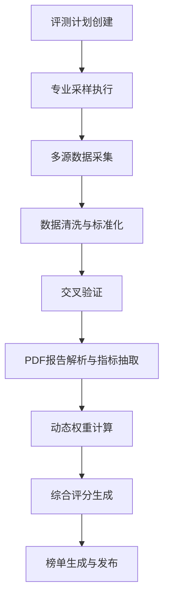
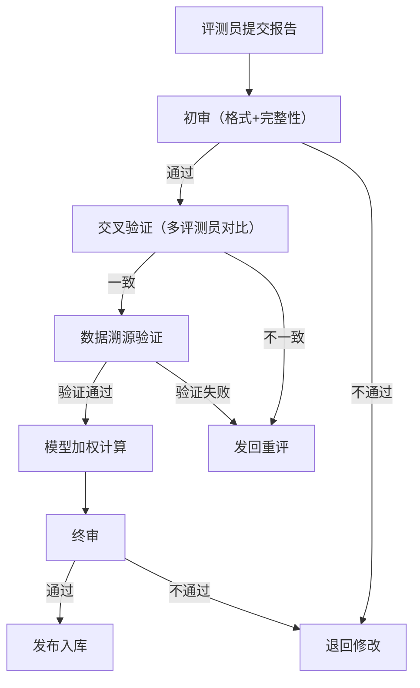
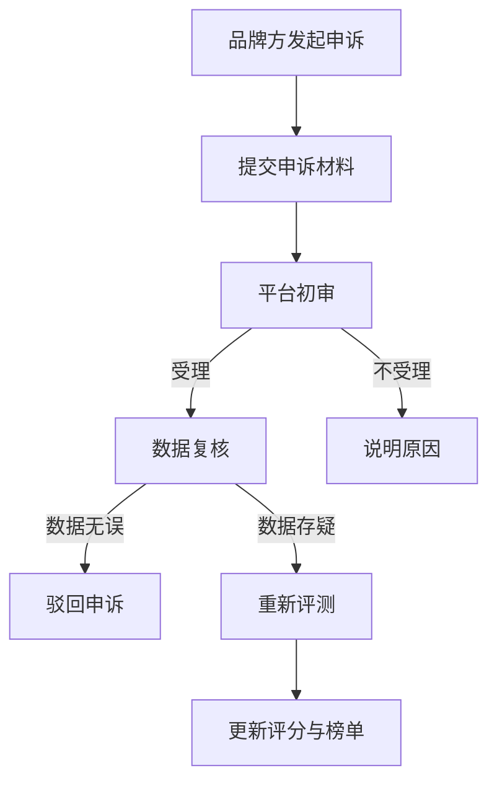

## 1. 产品概述

垂直领域可信评价中枢是一个全栈评价平台，以消费品、教育机构、医美服务、旅游景点为评测单元，构建专业采样→交叉验证→模型加权→榜单生成的完整数据流水线。解决当前评价市场数据来源单一、权重不透明、榜单公信力不足等核心问题，为用户提供可信、可溯源、可对比的专业评价服务。

## 2. 核心特性

### 2.1 用户角色

| 角色 | 注册方式 | 核心权限 |
|------|----------|----------|
| 普通用户 | 手机号/邮箱注册 | 搜索榜单、浏览报告、阅读评测详情、对比竞品 |
| 评测员 | 资质申请+人工审核 | 提交评测报告、参与采样任务、查看历史评价质量分 |
| 品牌方 | 企业资质入驻 | 提交入驻申请、查看舆情监测看板、发起申诉、响应评价 |
| 平台管理员 | 内部账号 | 评测计划排期、报告审核、品牌申诉处理、系统配置 |

### 2.2 功能模块

1. **用户端首页**：榜单展示、搜索入口、分类导航、热门评测
2. **榜单浏览页**：城市切换、分类筛选、排名展示、溯源查看
3. **报告详情页**：结构化评分展示、数据来源溯源、评分指标分解
4. **竞品对比页**：多品牌横向对比、指标雷达图、优劣分析
5. **品牌方后台**：入驻申请、舆情看板、数据概览、申诉通道
6. **评测员中心**：资质管理、任务大厅、报告提交、质量评分
7. **平台管理后台**：评测排期、审核流管理、申诉处理、权重配置

### 2.3 页面详情

| 页面名称 | 模块名称 | 功能描述 |
|---------|----------|----------|
| 首页 | 英雄区域 | 平台价值主张、核心数据展示、分类快捷入口 |
| 首页 | 榜单概览 | 四大领域Top5榜单预览、城市切换器 |
| 首页 | 热门报告 | 最新评测报告卡片、报告标签、评分预览 |
| 榜单页 | 筛选器 | 领域选择、城市切换、排序维度、时间范围 |
| 榜单页 | 排名列表 | 排名卡片、综合评分、核心指标、溯源标签 |
| 榜单页 | 溯源面板 | 每项评分的数据来源、采集时间、验证状态 |
| 报告详情页 | 评分总览 | 综合评分展示、维度分解、评测摘要 |
| 报告详情页 | 指标详情 | 各项评分指标、权重占比、原始数据 |
| 报告详情页 | 数据溯源 | 每个数据点的来源渠道、采集时间、验证方式 |
| 竞品对比页 | 对比矩阵 | 多品牌多指标横向对比表格 |
| 竞品对比页 | 雷达图 | 多维度能力雷达图可视化 |
| 竞品对比页 | 优劣势分析 | 自动生成对比分析结论 |
| 品牌方后台 | 入驻申请 | 企业信息填写、资质上传、提交审核 |
| 品牌方后台 | 舆情看板 | 评价趋势、投诉监测、竞品对比 |
| 品牌方后台 | 申诉通道 | 争议评价申诉、证据上传、进度查询 |
| 评测员中心 | 资质管理 | 资质证书上传、审核状态、专业领域 |
| 评测员中心 | 任务大厅 | 可接采样任务、任务详情、报名入口 |
| 评测员中心 | 质量评分 | 历史报告质量分、扣分记录、提升建议 |
| 管理后台 | 评测排期 | 评测计划创建、任务分配、进度跟踪 |
| 管理后台 | 审核流 | 报告初审、交叉验证、终审发布 |
| 管理后台 | 申诉处理 | 申诉列表、证据审核、裁决处理 |
| 管理后台 | 权重配置 | 各领域动态权重设置、算法参数调优 |

## 3. 核心流程

### 3.1 数据流水线主流程

### 3.2 报告审核流程

### 3.3 品牌申诉流程

## 4. 用户界面设计

### 4.1 设计风格

- **主色调**：深邃蓝 (#0F172A) 作为主背景，象征专业与可信
- **辅助色**：翡翠绿 (#10B981) 用于验证通过、可信标识
- **警示色**：琥珀橙 (#F59E0B) 用于待审核、待处理状态
- **危险色**：珊瑚红 (#EF4444) 用于不合格、高风险标识
- **按钮风格**：微圆角 (6px)、微妙阴影、悬停微放大效果
- **字体**：标题使用 "Noto Serif SC" 衬线体体现专业性，正文使用 "Inter" 无衬线体保证可读性
- **布局风格**：卡片式布局、网格化排列、充分留白
- **图标风格**：线性图标 (Lucide Icons)、统一2px描边

### 4.2 页面设计概览

| 页面名称 | 模块名称 | UI 元素 |
|---------|----------|---------|
| 首页 | 英雄区域 | 深蓝渐变背景、大号衬线标题、动态数据统计、微妙网格纹理 |
| 首页 | 榜单卡片 | 半透明玻璃态卡片、排名徽章、评分圆环进度条、领域标签 |
| 榜单页 | 排名列表 | 行式布局、排名数字徽章、综合评分大数字、溯源标签组 |
| 榜单页 | 溯源面板 | 可展开抽屉、时间线布局、数据源Logo、验证状态指示器 |
| 报告详情页 | 评分总览 | 大尺寸评分圆环、维度分解柱状图、评测员信息卡片 |
| 报告详情页 | 指标表格 | 斑马纹表格、权重占比进度条、数据来源tooltip |
| 竞品对比页 | 对比矩阵 | 固定表头、差异高亮、最优指标绿色标红、最差指标橙色标记 |
| 竞品对比页 | 雷达图 | 交互式SVG雷达图、悬停显示数值、可切换指标集 |
| 管理后台 | 审核流 | 卡片式工作流、状态色标、审批按钮组、评论区 |
| 管理后台 | 权重配置 | 滑块控件、实时预览、权重占比饼图、保存与重置 |

### 4.3 响应式设计

- **桌面优先**：以1440px宽度为基准设计，使用CSS Grid实现复杂布局
- **平板适配**：1024px断点，侧边栏变为可收起抽屉，多列变两列
- **手机适配**：768px断点，单列布局，底部Tab导航，触摸目标≥44x44px
- **交互优化**：移动端使用手势操作，桌面端支持键盘快捷键

### 4.4 动效设计

- **页面入场**：元素按层次淡入上移，stagger动画延迟50ms
- **数据加载**：骨架屏脉冲动画，数据到位后平滑过渡
- **交互反馈**：按钮点击缩放95%，卡片悬停上浮4px+阴影加深
- **榜单滚动**：无限滚动加载，新条目滑入动画
- **溯源展开**：抽屉滑入+内容淡入组合动画
