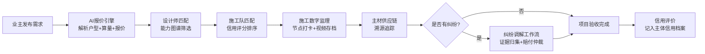

## 1. 产品概述

家装行业信用驱动型装修服务中台系统，连接业主、设计师、施工队、主材供应商四类主体，通过 AI 技术、信用体系、数字监理和供应链溯源，解决装修行业信息不对称、质量难保障、纠纷难处理等痛点。

- 核心价值：以信用体系为核心驱动力，实现装修全流程透明化、数字化、可追溯
- 市场定位：家装行业产业互联网基础设施平台

## 2. 核心 Features

### 2.1 用户角色

| 角色 | 注册方式 | 核心权限 |
|------|----------|----------|
| 业主 | 手机号实名认证 | 发布需求、获取报价、选择设计师/施工队、施工监理、纠纷维权 |
| 设计师 | 资质审核入驻 | 查看需求、投标报价、作品展示、项目管理、信用评价 |
| 施工队 | 资质审核入驻 | 承接项目、施工打卡、进度上报、材料验收、信用评价 |
| 主材供应商 | 企业认证入驻 | 商品上架、订单管理、物流跟踪、溯源信息维护 |
| 平台管理员 | 后台账号 | 资质审核、纠纷调解、数据统计、规则配置 |

### 2.2 Feature Module

1. **AI 装修报价引擎**：户型图解析、智能算量、分项报价、方案对比
2. **设计师能力图谱**：多维画像、智能匹配、信用评分、案例展示
3. **施工数字监理**：节点打卡、进度可视化、隐蔽工程存档、质量巡检
4. **主材供应链溯源**：品牌授权、质检报告、物流轨迹、批次追溯
5. **纠纷调解工作流**：证据归集、第三方评估、赔付引擎、仲裁记录

### 2.3 Page Details

| 页面名称 | 模块名称 | 功能描述 |
|----------|----------|----------|
| 首页总览 | 数据仪表盘 | 平台核心数据统计、今日待办、信用趋势图表 |
| AI 报价中心 | 户型图上传 | 支持拖拽上传户型图、自动识别面积和房间格局 |
| AI 报价中心 | 智能报价 | 10秒生成含人工/辅料/主材/管理费的分项报价单 |
| AI 报价中心 | 方案对比 | 多套报价方案并行对比、成本构成可视化 |
| 设计师图谱 | 能力雷达图 | 风格专长、案例数量、业主评分、投诉率多维展示 |
| 设计师图谱 | 智能筛选 | 按预算、风格、区域、信用分筛选匹配 |
| 施工监理 | 进度看板 | 施工关键节点进度条、时间轴可视化 |
| 施工监理 | 打卡中心 | 拍照定位打卡、隐蔽工程视频存档 |
| 供应链溯源 | 商品溯源 | 品牌授权验证、质检报告查看、物流轨迹跟踪 |
| 纠纷调解 | 案件管理 | 纠纷申请、证据链自动归集、第三方评估指派 |
| 纠纷调解 | 赔付引擎 | 赔付规则配置、自动计算赔付金额、仲裁记录 |
| 信用中心 | 信用画像 | 四类主体信用分、评价记录、奖惩历史 |

## 3. Core Process

业主发布装修需求后，系统通过 AI 报价引擎生成初步报价，推荐匹配的设计师和施工队，施工过程中通过数字监理全程管控，主材供应全程溯源，如遇纠纷启动调解工作流，所有环节数据记入信用体系。

## 4. User Interface Design

### 4.1 Design Style

- **主色调**：深海蓝 `#1a365d`（专业可信）+ 暖金色 `#d69e2e`（品质保证）
- **辅助色**：翡翠绿 `#38a169`（通过/正常）+ 珊瑚红 `#e53e3e`（警告/异常）+ 天青蓝 `#3182ce`（信息/链接）
- **按钮风格**：圆角 8px、微阴影、悬停浮起效果、主按钮渐变填充
- **字体**：标题使用 Playfair Display（优雅高端），正文使用 Noto Sans SC（清晰易读）
- **布局风格**：卡片式布局、多栏网格、微妙的分割线、充足留白
- **图标风格**：线性图标、统一 2px 描边、配合颜色编码状态
- **背景质感**：极细微的噪点纹理、梯度柔和的卡片阴影、玻璃态浮层

### 4.2 Page Design Overview

| 页面名称 | 模块名称 | UI Elements |
|----------|----------|-------------|
| 首页总览 | 数据仪表盘 | 深色顶部导航 + 左侧功能菜单 + 卡片式数据面板 + 趋势折线图 |
| AI 报价中心 | 户型图上传 | 大尺寸拖拽上传区 + 户型图预览 + 识别进度动画 |
| AI 报价中心 | 智能报价 | 瀑布式报价明细 + 费用构成饼图 + 价格区间滑块 |
| 设计师图谱 | 能力雷达图 | 六边形雷达图 + 金色信用徽章 + 滚动式案例卡片 |
| 施工监理 | 进度看板 | 垂直时间轴 + 节点状态徽章 + 照片网格墙 |
| 供应链溯源 | 商品溯源 | 溯源时间线 + 电子印章授权书 + 地图物流轨迹 |
| 纠纷调解 | 案件管理 | 案件状态时间线 + 证据链文件树 + 赔付金额计算器 |

### 4.3 Responsiveness

- 采用桌面优先设计，主窗口断点 1280px
- 侧边栏在平板尺寸折叠为图标菜单
- 卡片布局在移动端自动堆叠为单列
- 图表组件自适应容器宽度，触控操作优化

### 4.4 Motion Design

- 页面加载：卡片错峰淡入（staggered fade-in），导航栏滑入
- 状态切换：数字滚动动画、进度条平滑过渡、雷达图数据填充动画
- 交互反馈：按钮悬停轻微放大 + 阴影加深、卡片浮起效果
- 数据更新：新消息红点脉冲、状态变更高亮闪烁
