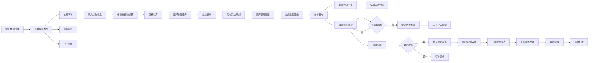

## 1. 产品概述
德邦大件物流垂直领域数字服务门户，面向企业及个人客户提供50kg以上大件货物的全链路物流服务。
- 核心目标：解决大件货物在线下单难、特殊包装报价不透明、运输监控缺失、理赔流程繁琐等行业痛点
- 目标用户：制造业企业、电商大卖家、搬家公司、工程设备商、有大件运输需求的个人用户

## 2. 核心功能

### 2.1 用户角色
| 角色 | 注册方式 | 核心权限 |
|------|----------|----------|
| 个人客户 | 手机号注册 | 在线下单、预约测量、查看运单、申请理赔 |
| 企业客户 | 营业执照认证 | 以上全部 + API对接、批量下单、专属客服 |
| 运营管理员 | 后台账号 | 路由规划、视频审核、理赔处理、数据统计 |
| 司机/装卸工 | 工号绑定 | 视频回传、装卸确认、GPS上报 |

### 2.2 功能模块
1. **门户首页**：Hero横幅、服务模块导航、特色服务展示、在线询价快捷入口、企业客户API入口
2. **在线下单页**：收发货信息、货物信息录入、体积重自动换算、运费试算、特殊包装选择
3. **包装报价页**：木箱/托盘/框架包装规格选择、尺寸录入、材料费用预估、人工费用报价
4. **上门测量预约页**：地址定位、时间选择、货物照片上传、GPS坐标获取、测量工单生成
5. **运输监控页**：温湿度实时曲线、震动阈值告警、GPS轨迹回放、异常事件时间轴
6. **后台路由规划页**：限高限重图层、多维度路线对比、桥梁隧道避让、油耗成本估算
7. **后台审核中心**：装卸作业视频列表、视频播放器、AI智能抽检、人工审核标签
8. **后台理赔中心**：OCR运单识别、破损照片标注、维修发票录入、理算金额计算器
9. **企业API文档页**：接口列表、参数说明、在线调试、SDK下载、对接申请

### 2.3 页面详情
| 页面名称 | 模块名称 | 功能描述 |
|----------|----------|----------|
| 门户首页 | Hero横幅 | 自动轮播大件物流案例图片，突出德邦大件服务特色 |
| 门户首页 | 服务导航 | 6个特色服务卡片：在线下单、包装报价、上门测量、运输监控、路由规划、理赔服务 |
| 门户首页 | 快捷询价 | 简化版下单表单，输入起止地+重量+体积，一键获取预估运费 |
| 在线下单页 | 体积重换算 | 长×宽×高÷6000自动计算体积重，与实际重量取大者计费 |
| 在线下单页 | 运费试算 | 实时计算基础运费+送货费+上楼费+包装费+保险费 |
| 包装报价页 | 包装材料选择 | 木箱(熏蒸/免熏蒸)、木托盘、木框架、塑料托盘、铁框架选项 |
| 包装报价页 | 费用明细 | 材料费、人工费、熏蒸费、加固费分项展示 |
| 上门测量页 | GPS定位 | 调用浏览器定位API获取坐标，支持地图选点修正 |
| 上门测量页 | 照片上传 | 支持多图上传、拖拽排序、图片压缩预览 |
| 运输监控页 | 实时指标 | 温度-40~85℃、湿度0~100%RH、震动加速度0~20g分卡片展示 |
| 运输监控页 | 阈值告警 | 超阈值红色高亮闪烁，触发短信/站内信推送 |
| 路由规划页 | 地图图层 | 叠加限高(≤4.5m)、限重(≤49t)、限行(时段/区域)数据层 |
| 审核中心 | 视频回传 | HLS流媒体播放、支持倍速、关键帧截图标记 |
| 理赔中心 | OCR识别 | 运单号、收发件人、货物信息、金额字段自动提取回填 |
| API文档页 | 在线调试 | Swagger风格接口调试器，支持token认证、参数填写、响应预览 |

## 3. 核心流程

## 4. 界面设计
### 4.1 设计风格
- **主色调**：德邦蓝 (#0052D9) 作为品牌主色，搭配橙红 (#FF6A00) 作为告警强调色
- **辅助色**：浅蓝灰背景 (#F0F4FA)、深灰文字 (#1F2937)、中灰次要文字 (#6B7280)
- **按钮风格**：圆角6px的矩形按钮，主色渐变填充，hover上浮2px加阴影
- **字体**：思源黑体 (Source Han Sans) + DIN数字字体，大号数字使用DIN增强专业感
- **布局风格**：卡片式+栅格布局，顶部通栏导航，左侧二级分类菜单
- **图标风格**：线性风格图标，描边2px，圆角风格，与主色调统一

### 4.2 页面设计概览
| 页面名称 | 模块名称 | UI元素 |
|----------|----------|--------|
| 门户首页 | Hero横幅 | 全屏宽图，左文右图布局，大标题56px加粗，副标题18px，主CTA按钮120×48px |
| 门户首页 | 服务卡片 | 2×3栅格，每张卡片180px高，hover时背景色从白渐变到浅蓝，图标缩放1.1倍 |
| 在线下单页 | 表单区 | 三步骤向导(地址→货物→确认)，左侧进度条，右侧表单区800px宽 |
| 在线下单页 | 体积重换算 | 左侧输入长宽高(cm)，中间等号箭头，右侧实时显示体积重(kg)与计费重量(kg) |
| 运输监控页 | 仪表盘 | 三个圆环仪表盘分别展示温湿度/震动，中心大数字显示实时值 |
| 运输监控页 | 告警列表 | 时间轴布局，告警项红色左边框，严重级别顶部红色徽章 |
| 路由规划页 | 地图区 | 左侧60%地图区域，右侧40%路线对比列表，地图上标注限高限重图标 |
| 理赔中心 | OCR识别 | 左侧图片预览区，右侧结构化表单，识别到的字段带绿色"已识别"标签 |

### 4.3 响应式设计
- **桌面端优先**：最小支持1280px宽度，主内容区最大宽度1440px居中
- **平板适配**：≤1024px时侧边栏折叠为图标模式，卡片布局改为2列
- **手机适配**：≤768px时顶部导航改为汉堡菜单，表单改为单列布局，仪表盘纵向排列
- **触摸优化**：按钮最小高度44px，图片上传支持多点触控缩放预览

### 4.4 动效与微交互
- **页面加载**：内容区域150ms淡入，卡片20ms错位依次上浮
- **表单交互**：输入框focus时边框过渡0.2s变为主色，错误时抖动动画300ms
- **数据变化**：数值变化时采用滚动数字动画，告警触发时脉冲闪烁动画
- **导航切换**：路由切换采用淡入淡出过渡300ms，菜单项下划线从左滑入
- **数据可视化**：图表首屏加载从底部生长动画800ms，数据更新平滑过渡
