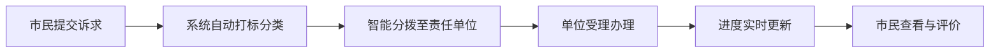
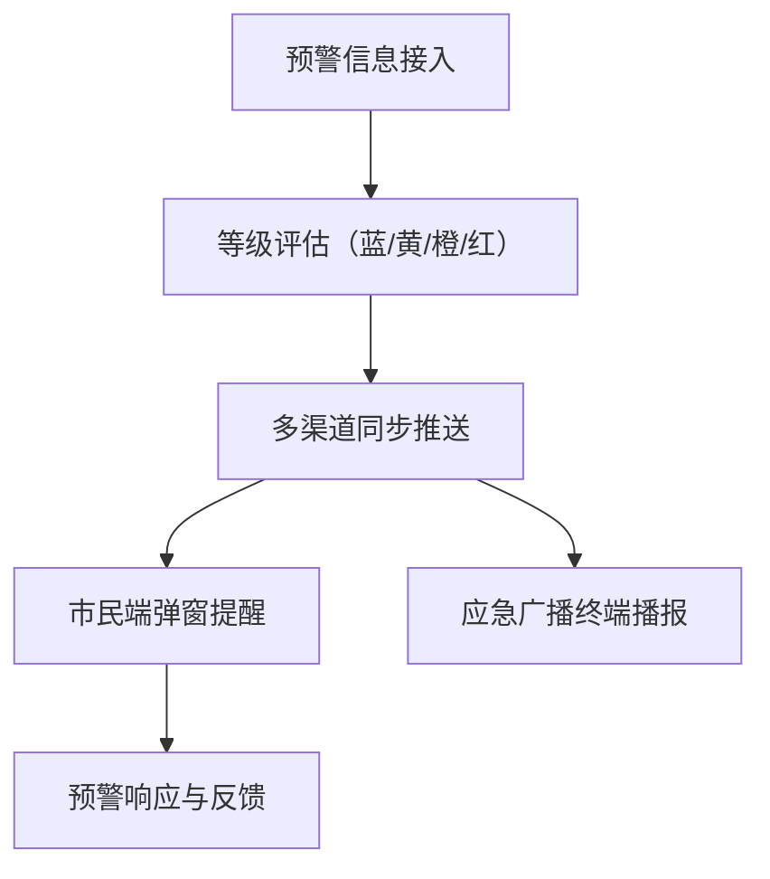

## 1. 产品概述

盐城市级融媒体民生云平台是面向盐城市民的一站式政务信息与公共服务总入口，整合新闻资讯、便民服务、诉求反馈、应急预警等多元功能，打造市级融媒体智慧民生服务标杆。平台采用适老化设计，保障老年群体无障碍使用，实现"让数据多跑路、让群众少跑腿"的智慧民生服务目标。

## 2. 核心功能

### 2.1 用户角色
| 角色 | 注册方式 | 核心权限 |
|------|----------|----------|
| 普通市民 | 手机号实名注册 | 浏览资讯、使用便民服务、提交诉求、紧急呼救 |
| 政务编辑 | 单位统一分配 | 稿件发布、内容审核、舆情监测 |
| 管理员 | 超级管理员授权 | 用户管理、系统配置、数据分析 |

### 2.2 功能模块
1. **首页**：顶部导航、轮播Banner、新闻资讯区、便民服务入口、紧急呼救浮窗、应急预警横幅
2. **新闻客户端**：图文新闻、短视频专区、直播频道、分类浏览（政策/民生/文化）
3. **12345热线工单**：诉求提交、工单查询、办理进度追踪、满意度评价
4. **应急广播**：预警信息推送（台风/暴雨/高温）、历史预警查询、预警终端状态
5. **公共服务地图**：水电气营业厅、社区卫生服务中心、实时排队人数、导航路线
6. **便民服务大厅**：社保查询、违章处理、公积金提取、证件办理预约
7. **内容中台（管理端）**：多源稿件管理、自动打标、热点事件聚类、舆情风险评估
8. **适老化模式**：语音搜索、一键紧急呼救、服务视频讲解、大字体高对比度

### 2.3 页面详情
| 页面名称 | 模块名称 | 功能描述 |
|----------|----------|----------|
| 首页 | 应急预警横幅 | 红色置顶滚动展示台风/暴雨等紧急预警，支持点击查看详情 |
| 首页 | 轮播Banner | 自动轮播重要政务公告与活动宣传，支持手动切换 |
| 首页 | 便民服务九宫格 | 社保/公积金/违章/水电燃气等常用服务快捷入口，大图标设计 |
| 首页 | 新闻资讯流 | 按时间倒序展示要闻、民生、政策、文化分类资讯卡片 |
| 首页 | 紧急呼救浮窗 | 右下角常驻红色按钮，点击后一键呼叫预设紧急联系人 |
| 新闻详情页 | 图文正文区 | 富文本展示新闻内容，支持图片放大查看 |
| 新闻详情页 | 视频播放器 | 嵌入式视频播放，支持全屏、倍速、清晰度切换 |
| 新闻详情页 | 相关推荐 | 基于标签和分类的相关新闻推荐列表 |
| 工单提交页 | 诉求表单 | 分类选择、位置定位、图片上传、描述填写、匿名选项 |
| 工单列表页 | 进度时间轴 | 可视化展示工单从受理→分拨→办理→办结的全流程节点 |
| 服务地图页 | 地图图层 | 标注各类服务网点位置，点击显示详情与实时排队数 |
| 便民服务页 | 服务列表 | 分类展示各项政务服务，点击跳转办理流程或对接第三方系统 |
| 舆情监测页 | 风险仪表盘 | 舆情等级热力图、传播趋势折线图、情感分析饼图 |
| 适老化设置页 | 模式开关 | 字体大小调整、色彩对比度切换、语音播报开关 |

## 3. 核心流程

### 3.1 市民诉求提交流程
市民打开首页 → 点击12345热线入口 → 选择诉求类型 → 填写描述与上传凭证 → 提交工单 → 系统自动分拨至责任单位 → 责任单位办理反馈 → 市民查看进度并评价

### 3.2 应急预警发布流程
气象/应急部门推送预警信息 → 内容中台审核确认等级 → 多渠道推送（APP推送+应急广播终端+短信）→ 市民接收查看 → 预警解除通知

## 4. 用户界面设计

### 4.1 设计风格
- **主色调**：政务蓝 `#1E5EAA`（信任、专业），辅助色：活力橙 `#FF7A1A`（民生温度）、预警红 `#E53935`
- **按钮风格**：圆角8px，主按钮渐变填充，次按钮描边样式，悬停微放大动效
- **字体**：标题使用"思源宋体"彰显政务正式感，正文使用"思源黑体"保证可读性，字号基础16px，适老化模式下基础20px
- **布局风格**：卡片式布局，信息分区清晰，大留白，导航采用顶部Tab+底部TabBar双层结构
- **图标风格**：线性填充混合图标，统一圆角风格，使用 lucide-react 图标库

### 4.2 页面设计概览
| 页面名称 | 模块名称 | UI元素 |
|----------|----------|--------|
| 首页 | 应急预警横幅 | 红色渐变背景+白色闪烁动画图标，marquee滚动文字 |
| 首页 | 便民服务九宫格 | 4列网格布局，彩色图标+大号文字，hover上浮阴影动效 |
| 新闻详情页 | 视频播放器 | 圆角卡片内嵌，半透明控制栏，自动检测网络清晰度适配 |
| 工单进度页 | 时间轴组件 | 左侧竖线+节点圆标，已完成绿色、进行中蓝色、待处理灰色 |
| 服务地图页 | 网点标记 | 彩色水滴标记，点击弹出信息气泡含排队人数进度条 |
| 舆情监测页 | 风险仪表盘 | 半环形进度图表示风险等级，颜色从绿→黄→橙→红渐变 |

### 4.3 响应式设计
- Desktop 优先（1440px基准），适配 1024px 平板横屏、768px 平板竖屏、375px 手机
- 断点策略：≥1280px 三栏布局，768-1280px 双栏布局，<768px 单栏全屏布局
- 触控优化：适老化模式下所有可点击元素最小触控区域 48×48px，间距增大

### 4.4 动效设计
- 页面进入：顶部导航下拉→Banner淡入→卡片依次上浮（stagger 100ms）
- 紧急呼救：按钮常驻脉冲呼吸动效，点击时扩散波纹+震动反馈
- 预警横幅：文字从右向左循环滚动，背景色由深到浅呼吸闪烁
