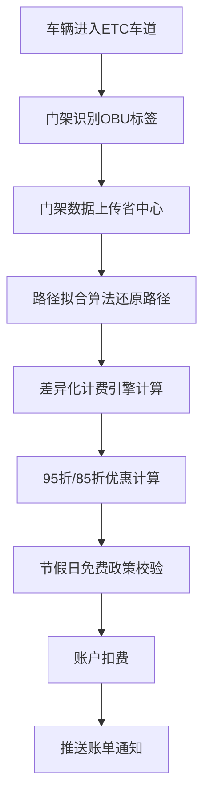

## 1. 产品概述

省级交通缴费基础设施数字服务中台，以粤通卡（记账卡/储值卡）为唯一身份载体，打通ETC车道通行、高速费计算、充值缴费、网点服务四大核心场景，构建全省统一的高速公路出行服务生态。

- **主要目标**：实现高速公路出行全链路数字化，提升用户缴费体验与运营效率
- **解决问题**：传统ETC服务渠道分散、计费不透明、充值不便、网点信息不对称
- **目标用户**：全省1000万+ETC车主、高速公路运营方、交通管理部门
- **市场价值**：构建省级智慧交通标杆，降本增效，提升公众出行满意度

## 2. 核心功能

### 2.1 用户角色

| 角色 | 注册方式 | 核心权限 |
|------|----------|----------|
| 车主用户 | 粤通卡绑定+实名认证 | 通行记录查询、充值缴费、网点预约、路费查询 |
| 网点管理员 | 企业认证+权限分配 | 网点信息维护、叫号管理、业务办理 |
| 运营管理员 | 内部系统账号 | 清分结算监控、OBU设备管理、异常事件处理 |
| 系统管理员 | 超级管理员账号 | 用户权限管理、系统配置、数据统计 |

### 2.2 功能模块

1. **首页仪表盘**：账户概览、余额预警、快捷入口、通行统计
2. **通行服务**：ETC通行记录、门架数据路径拟合、账单详情
3. **路费查询**：起终点收费站组合、最短路径、多路径比价、节假日免费计算
4. **充值缴费**：NFC闪充、蓝牙OBU充值、微信/支付宝代扣、自动预警
5. **网点服务**：GIS地图检索、营业时间标注、业务类型过滤、预约排队
6. **管理后台**：清分结算、OBU生命周期、异常事件归因、工单派发

### 2.3 页面详情

| 页面名称 | 模块名称 | 功能描述 |
|----------|----------|----------|
| 首页仪表盘 | 账户概览 | 粤通卡余额、卡类型（记账/储值）、车辆信息、有效期 |
| 首页仪表盘 | 快捷操作 | 一键充值、路费查询、网点查找、客服入口 |
| 首页仪表盘 | 通行统计 | 本月通行次数、总消费、优惠金额、月度趋势图 |
| 通行记录页 | 列表展示 | 按时间筛选、进出站信息、门架路径、费用明细 |
| 通行记录页 | 路径拟合 | 可视化地图展示行驶路径、门架节点、分段计费 |
| 路费查询页 | 路径计算 | 起点/终点收费站选择、最短路径推荐、多方案比价 |
| 路费查询页 | 费用计算 | 95折/85折差异化计费、节假日免费政策叠加、车型系数 |
| 充值中心页 | 充值方式 | NFC手机闪充、蓝牙OBU远程充值、在线支付充值 |
| 充值中心页 | 代扣管理 | 微信/支付宝绑定、自动充值阈值设置、代扣记录 |
| 充值中心页 | 余额预警 | 阈值设置、短信/APP推送通知、预警历史 |
| 网点服务页 | GIS地图 | 周边网点展示、实时路况、距离排序、导航跳转 |
| 网点服务页 | 信息展示 | 营业时间、业务类型、当前排队人数、评价评分 |
| 网点服务页 | 预约排队 | 在线取号、预约时间、叫号提醒、业务办理进度 |
| 管理后台-首页 | 数据概览 | 今日交易总额、通行车次、异常事件数、系统健康度 |
| 管理后台-清分结算 | 对账管理 | 省联网中心对接、交易对账、差异处理、结算报表 |
| 管理后台-OBU管理 | 设备生命周期 | 设备入库、激活、挂失、更换、报废全流程 |
| 管理后台-异常事件 | 智能归因 | 跟车干扰、标签失效、交易异常自动识别与工单派发 |

## 3. 核心流程

### 3.1 ETC通行计费流程

用户驾车进入ETC车道 → 门架识别OBU标签 → 门架数据上传至省中心 → 路径拟合算法还原行驶路径 → 差异化计费引擎计算费用（95折/85折）→ 从绑定账户扣费 → 推送通行账单通知。

### 3.2 充值缴费流程

用户选择充值方式 → NFC读取粤通卡/蓝牙连接OBU → 输入充值金额 → 选择支付渠道（微信/支付宝/银行卡）→ 支付成功 → 写卡/远程圈存 → 余额更新 → 推送充值成功通知。

### 3.3 网点预约流程

用户进入网点服务页 → GIS定位周边网点 → 筛选业务类型（新办/充值/故障）→ 查看网点详情与排队情况 → 选择预约时间 → 生成排队号 → 实时叫号提醒 → 到达网点办理业务。

### 3.4 异常事件处理流程

系统实时监控通行数据 → AI算法识别异常（跟车干扰/标签失效/交易失败）→ 自动归因分析 → 生成工单 → 派发给对应运营人员 → 处理结果反馈 → 用户通知与补偿。

## 4. 用户界面设计

### 4.1 设计风格

- **主色调**：交通蓝 `#0F52BA`（专业、可信、科技感）
- **辅助色**：活力橙 `#FF6B35`（警示、操作、重点）、成功绿 `#10B981`、警示红 `#EF4444`
- **中性色**：深空灰 `#1F2937`、中灰 `#6B7280`、浅灰 `#F3F4F6`、纯白 `#FFFFFF`
- **设计语言**：现代科技风，扁平化+微渐变，圆角卡片式布局，细腻阴影层次
- **按钮风格**：大圆角(8px)、悬停微上浮+阴影加深、点击按压反馈
- **字体**：标题使用 `PingFang SC Semibold`，正文使用 `PingFang SC Regular`，数字使用 `JetBrains Mono`
- **图标**：Lucide React 图标库，线性风格，统一 24px 尺寸

### 4.2 页面设计概览

| 页面名称 | 模块名称 | UI元素 |
|----------|----------|--------|
| 首页仪表盘 | Hero区域 | 渐变背景卡片、余额大字展示、充值快捷按钮、动画数字计数 |
| 首页仪表盘 | 通行统计 | 折线图+柱状图组合、数据卡片网格、悬停交互提示 |
| 通行记录页 | 列表区域 | 时间轴布局、折叠展开详情、路径地图缩略图 |
| 路费查询页 | 路径规划 | 起终点输入框、地图可视化路径、费用对比表格 |
| 充值中心页 | 充值方式 | 卡片式选择、NFC/蓝牙连接动画、进度条展示 |
| 网点服务页 | GIS地图 | 地图控件、网点Marker弹窗、筛选标签栏 |
| 管理后台 | 数据大屏 | 深色主题、数据可视化图表、实时数据流、状态指示灯 |

### 4.3 响应式设计

- **桌面端优先**：1440px 基准设计，适配 1280px-1920px
- **平板适配**：768px-1024px，网格列数自适应，侧边栏可收起
- **移动端适配**：375px-767px，底部导航栏，卡片单列布局，触控区域 ≥ 44x44px
- **触摸优化**：按钮尺寸适配移动端，滑动操作支持，避免hover依赖

### 4.4 动效与交互动效

- **页面加载**：骨架屏脉冲动画 → 内容渐入 → 元素错落出现(50ms间隔)
- **数据更新**：数字滚动动画、图表渐入动画
- **卡片交互**：悬停上浮2px、阴影加深、边框微高亮
- **操作反馈**：按钮点击缩放(0.97)、表单验证实时反馈
- **状态切换**：标签页滑动切换、模态框淡入+缩放
