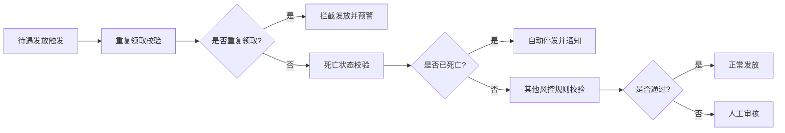

## 1. 产品概述

省级社保公共服务统一门户系统，严格遵循人社部《社会保险公共服务事项清单》标准，为参保人员提供一站式社保服务办理平台。核心价值在于实现社保业务"跨省通办、一网通办"，提升社保服务的便捷性、透明度和智能化水平。

- 主要服务对象：参保人（职工/灵活就业/城乡居民三类身份）、经办机构工作人员（省/市/县三级）、定点医药机构
- 核心价值：实现社保服务数字化转型，提高经办效率，保障基金安全，提升群众满意度

---

## 2. 核心功能

### 2.1 用户角色

| 角色 | 注册方式 | 核心权限 |
|------|----------|----------|
| 参保人-职工 | 身份证实名认证 | 个人参保信息查询、业务办理、待遇申领 |
| 参保人-灵活就业 | 身份证实名认证 | 自主缴费、待遇核算、补贴申领 |
| 参保人-城乡居民 | 身份证实名认证 | 居民医保缴费、养老待遇查询 |
| 经办机构-省级 | 内部账号分配 | 全省数据监测、政策发布、风控管理 |
| 经办机构-市级 | 内部账号分配 | 本市业务审核、机构管理 |
| 经办机构-县级 | 内部账号分配 | 窗口业务办理、基层服务 |
| 定点医药机构 | 机构资质认证 | 医保结算、目录查询、服务登记 |

### 2.2 功能模块

#### 2.2.1 前端服务门户
1. **首页**：服务导航、政策公告、个人中心入口、快捷服务
2. **个人参保状态核验**：实时查询参保状态、缴费记录、待遇享受情况
3. **养老金计发模拟器**：输入缴费年限/基数自动测算养老金待遇
4. **失业补贴线上申领**：人脸识别核验、银行账户OCR识别、承诺制容缺受理
5. **医保定点机构地图检索**：支持按等级/科室/药品目录筛选，地图导航

#### 2.2.2 后台管理系统
1. **待遇发放风控引擎**：重复领取拦截、死亡停发自动触发、异常预警
2. **政策文件智能标签系统**：政策条款结构化、适用人群关联、智能推送
3. **服务效能监测**：各渠道申办量统计、平均办理时长分析、退件原因聚类

### 2.3 页面详情

| 页面名称 | 模块名称 | 功能描述 |
|----------|----------|----------|
| 首页 | 服务导航区 | 分类展示全部社保服务事项，支持搜索 |
| 首页 | 政策公告区 | 轮播展示最新政策文件、通知公告 |
| 首页 | 个人快捷区 | 我的参保、我的待遇、我的申请 |
| 参保核验页 | 身份核验模块 | 身份证号输入、人脸活体检测 |
| 参保核验页 | 状态展示模块 | 参保状态、缴费明细、待遇享受记录 |
| 养老金模拟器页 | 参数输入模块 | 缴费年限、缴费基数、退休年龄选择 |
| 养老金模拟器页 | 测算结果模块 | 基础养老金、个人账户养老金、过渡性养老金明细 |
| 失业补贴申领页 | 人脸识别模块 | 实时人脸采集、活体检测 |
| 失业补贴申领页 | OCR识别模块 | 银行卡拍照识别、自动填充账号 |
| 失业补贴申领页 | 承诺制模块 | 电子承诺书签署、容缺受理确认 |
| 定点机构地图页 | 地图展示模块 | 基于地图的机构分布展示 |
| 定点机构地图页 | 筛选模块 | 按等级、科室、药品目录、距离筛选 |
| 后台-风控引擎页 | 预警监控模块 | 实时异常预警、风险等级展示 |
| 后台-风控引擎页 | 规则配置模块 | 风控规则定义、拦截策略配置 |
| 后台-政策标签页 | 标签管理模块 | 智能标签生成、标签体系维护 |
| 后台-政策标签页 | 政策关联模块 | 政策条款与标签、适用人群关联 |
| 后台-效能监测页 | 数据看板模块 | 申办量、办理时长、满意度趋势图 |
| 后台-效能监测页 | 退件分析模块 | 退件原因聚类、高频问题分析 |

---

## 3. 核心流程

### 3.1 个人参保状态核验流程

### 3.2 失业补贴申领流程

### 3.3 待遇发放风控流程

---

## 4. 用户界面设计

### 4.1 设计风格

**政务服务专业风格**，体现权威性、可信性和专业性。

- **主色调**：政务蓝 `#165DFF`，代表信任、专业、稳重
- **辅助色**：中国红 `#F53F3F`（重要提示、预警）、绿色 `#00B42A`（成功、通过）、橙色 `#FF7D00`（警告、待办）
- **中性色**：以 `#1D2129` 深灰为主文字，`#4E5969` 次级文字，`#F2F3F5` 背景色
- **字体**：主标题使用 "Noto Serif SC" 宋体体现正式感，正文使用 "PingFang SC" 苹方保证可读性
- **按钮风格**：圆角4px，矩形为主，点击有微交互动效
- **布局风格**：顶部导航 + 侧边分类 + 内容区三栏式，政务门户典型布局
- **图标风格**：线性图标为主，统一使用24px标准尺寸，颜色与文字保持一致

### 4.2 页面设计概述

| 页面名称 | 模块名称 | UI元素 |
|----------|----------|----------|
| 首页 | Hero区域 | 政务蓝渐变背景，大标题"社保服务 温暖民心"，吉祥物形象 |
| 首页 | 服务矩阵 | 4×3网格布局，每个服务带图标、名称、简介 |
| 首页 | 数据展示区 | 参保人数、服务人次、满意度等核心数据大屏展示 |
| 参保核验页 | 核验区 | 身份证号输入框、人脸采集摄像头区域、进度指示器 |
| 参保核验页 | 结果展示 | 卡片式布局，分参保状态、缴费记录、待遇享受三个Tab |
| 养老金模拟器页 | 计算器 | 滑杆选择器、数字输入框、实时计算结果展示 |
| 养老金模拟器页 | 结果图表 | 柱状图对比不同缴费方案的待遇差异 |
| 后台-风控引擎页 | 监控大屏 | 数据可视化仪表盘，风险等级热力图，实时预警流 |
| 后台-效能监测页 | 分析图表 | 折线图趋势、饼图占比、柱状图对比 |

### 4.3 响应式设计

- **设计原则**：桌面端优先，向下兼容平板和移动端
- **断点设置**：1440px（桌面）、1024px（平板横屏）、768px（平板竖屏）、375px（手机）
- **适配策略**：
  - 桌面端：三栏布局，左侧导航 + 主内容 + 右侧信息
  - 平板端：收起左侧导航为汉堡菜单，主内容区自适应
  - 移动端：顶部导航下拉，内容区单列流式布局，表格转卡片展示
- **触摸优化**：移动端按钮最小44×44px，表单输入框自适应键盘弹出

### 4.4 无障碍设计

- 所有图片和图标提供alt文本说明
- 表单控件关联label标签
- 颜色对比度符合WCAG AA标准（正文4.5:1，大文字3:1）
- 支持键盘Tab键导航，焦点状态清晰可见
- 重要信息不止用颜色标识，同时配有文字或图标说明
