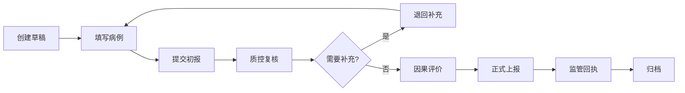

## 1. 产品概述

药品不良反应（ADR）收集与上报系统，面向医疗机构医生、药师、药企质控人员及监管部门联系人，实现从病例发现、药品关联、因果评价到正式上报的全流程闭环管理。系统确保病例、药品、反应、评价和上报状态全链路连续可查，所有核心操作落库留痕，满足药监合规与追溯要求。

## 2. 核心功能

### 2.1 用户角色
| 角色 | 注册方式 | 核心权限 |
|------|----------|----------|
| 医生 | 机构账号开通 | 填写上报草稿、提交初诊病例 |
| 药师 | 机构账号开通 | 完善用药信息、核对药品匹配 |
| 药企质控 | 企业账号开通 | 质控复核、补充资料、正式上报、查看回执 |
| 监管联系人 | 监管账号开通 | 接收上报、下发回执、全局查询统计 |

### 2.2 功能模块
1. **药品库管理**：批号、厂家、适应症、说明书风险、上市许可持有人维护
2. **不良反应上报**：患者信息、用药信息、剂量、给药途径、开始时间、反应表现、处理结果录入
3. **因果评价**：时间关系、停药改善、再用反应、合并用药、严重程度五项判断
4. **上报流程**：草稿 → 质控复核 → 退回补充 → 正式上报 → 监管回执
5. **分析报表**：药品维度统计、反应类型分布、严重病例识别、上报时效分析、重复病例识别

### 2.3 页面详情
| 页面名称 | 模块名称 | 功能描述 |
|----------|----------|----------|
| 首页仪表盘 | 统计概览 | 待办数量、本月上报、严重病例、时效趋势卡 |
| 药品库列表 | 药品CRUD | 分页查询、新增、编辑、删除、批量导入 |
| 药品详情 | 药品信息 | 基本信息、批号历史、关联上报记录、说明书风险 |
| 上报列表 | 病例查询 | 按状态/药品/时间筛选，流程进度可视化 |
| 上报表单 | 病例录入 | 患者信息、用药信息、反应表现、处理结果四步表单 |
| 因果评价 | 评价表单 | 五维度评分、自动计算关联等级、评价历史 |
| 流程管理 | 状态流转 | 复核、退回、上报、回执操作，操作日志 |
| 分析报表 | 数据统计 | 多维度图表、严重病例高亮、重复病例预警 |
| 运营视图 | 全局管理 | 用户管理、操作审计、数据导出、系统配置 |

## 3. 核心流程

医生或药师发现不良反应后，在系统中创建上报草稿并填写患者及用药信息；提交后进入质控复核环节，药企质控人员进行因果评价，必要时退回补充资料；评价通过后正式上报至监管部门，监管方下发回执完成流程。全流程每一步操作均记录操作人、时间和备注，支持完整追溯。

## 4. 用户界面设计

### 4.1 设计风格
- **主色调**：医疗蓝 `#165DFF`（专业、可信），辅助色：警示红 `#F53F3F`（严重病例）、成功绿 `#00B42A`（正常）
- **按钮风格**：圆角 6px，微悬浮阴影，禁用态灰度
- **字体**：标题使用 `Noto Sans SC` 600，正文使用 `Noto Sans SC` 400，等宽数据使用 `JetBrains Mono`
- **布局风格**：左侧导航 + 顶部面包屑 + 卡片式内容区，医疗系统风格
- **图标风格**：Lucide 线性图标，高对比度，关键操作配彩色图标

### 4.2 页面设计概述
| 页面名称 | 模块名称 | UI 元素 |
|----------|----------|----------|
| 首页仪表盘 | 统计概览 | 4 张数据卡片 + 2 个趋势图表 + 待办列表，卡片悬浮动画 |
| 药品库列表 | 药品CRUD | 搜索栏 + 表格 + 分页，行悬停高亮，操作列按钮组 |
| 上报表单 | 病例录入 | 四步进度条 + 分组表单 + 实时校验，必填项红标 |
| 因果评价 | 评价表单 | 五维度滑块评分 + 自动等级计算 + 评价历史时间线 |
| 分析报表 | 数据统计 | 多标签页 + ECharts 柱状图/饼图/折线图 + 数据导出 |

### 4.3 响应性
- 桌面优先设计，最小支持 1280px 宽度
- 左侧导航固定宽度 240px，内容区自适应
- 表格支持横向滚动，表单在小屏幕自动单列布局
