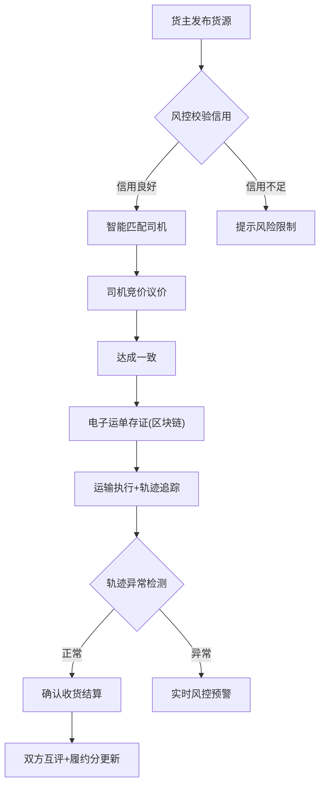

## 1. 产品概述

货运供需智能匹配平台是一款面向中小货主与个体司机的高频场景物流匹配服务，通过智能算法实现货源与运力的精准对接，构建覆盖货主端、司机端、运营后台的一站式物流生态，同时内置风控引擎保障交易安全。

- 解决痛点：信息不对称、空驶率高、运费拖欠、运输安全无保障
- 目标用户：中小货主企业、个体货运司机、平台运营管理者
- 市场价值：降低物流空驶率30%+，提升司机收入25%，缩短货主找车时间80%

## 2. 核心功能

### 2.1 用户角色

| 角色 | 注册方式 | 核心权限 |
|------|----------|----------|
| 货主 | 手机号+企业认证 | 发布货源、匹配司机、查看轨迹、支付运费、信用评估 |
| 司机 | 手机号+驾驶证+车辆认证 | 上报空车、接收推送、竞价议价、运输执行、积分兑换 |
| 平台管理员 | 后台账号登录 | 运价管理、风控监控、司机成长体系、交通管制推送、系统管理 |

### 2.2 功能模块

1. **货主工作台**：货源发布、智能匹配、在途追踪、运单管理、信用中心
2. **司机工作台**：空车上报、货源大厅、常跑线路推荐、议价中心、积分商城
3. **物流风控引擎**：货主信用评分、轨迹异常检测、电子运单区块链存证
4. **运营管理后台**：专线价格指导模型、司机成长体系、交通管制信息推送、数据看板

### 2.3 页面详情

| 页面名称 | 模块名称 | 功能描述 |
|----------|----------|----------|
| 货主-货源发布 | 表单区 | 强制填写货物体积/重量/装卸方式/保险要求，支持图片上传 |
| 货主-货源发布 | 智能报价 | 根据线路/货类/季节自动生成基准运价参考 |
| 货主-智能匹配 | 司机列表 | 按车型/承运资质/履约分>95%筛选，展示匹配度排名 |
| 货主-在途追踪 | 实时地图 | GPS轨迹实时展示、异常偏离预警、预计到达时间 |
| 货主-信用中心 | 信用看板 | 信用分数、交易记录、风险提示 |
| 司机-货源大厅 | 列表卡片 | 展示附近货源、价格、距离、匹配度标签 |
| 司机-货源大厅 | 常跑推荐 | 基于历史线路AI预测回程货源 |
| 司机-议价中心 | 聊天室 | 实时议价对话、价格留痕、报价历史 |
| 司机-积分商城 | 兑换中心 | 安全驾驶积分兑换ETC充值、油卡、保险等 |
| 后台-运价模型 | 配置面板 | 线路/货类/季节基准运价配置、价格趋势图 |
| 后台-风控监控 | 实时大屏 | 信用异常告警、轨迹偏离热力图、存证哈希展示 |
| 后台-司机成长 | 体系配置 | 积分规则配置、等级体系、兑换记录 |
| 后台-交通管制 | 推送管理 | 高德/百度路况API接入、管制区域推送配置 |

## 3. 核心流程

### 3.1 货主发货匹配流程
货主发布货源(必填体积/重量/装卸/保险) → 系统风控校验货主信用 → 智能匹配车型+资质+履约分>95%司机 → 司机竞价议价 → 达成一致生成电子运单 → 区块链存证 → 运输执行+轨迹追踪 → 确认收货+运费结算 → 互评履约分

### 3.2 司机接单流程
司机上报空车状态+位置 → 系统推送常跑线路回程货源 → 司机浏览/筛选货源 → 发起议价或一键接单 → 确认电子运单 → 装货出发 → 实时轨迹上报 → 卸货签收 → 积分累积

### 3.3 流程图

## 4. 用户界面设计

### 4.1 设计风格
- **主色调**：货运橙 (#FF6B1A) + 深蓝 (#0F2847) — 传达活力、专业与信任感
- **辅助色**：成功绿 (#10B981)、警示黄 (#F59E0B)、风险红 (#EF4444)
- **按钮风格**：圆角8px，主色渐变填充，悬浮时微浮起+阴影加深
- **字体方案**：标题使用"Space Grotesk"几何感无衬线字体，正文使用"PingFang SC"
- **布局风格**：卡片式布局+左侧导航栏，关键数据使用仪表盘数字展示
- **图标风格**：Lucide线性图标，统一2px描边

### 4.2 页面设计概览

| 页面名称 | 模块名称 | UI元素 |
|----------|----------|--------|
| 货主工作台 | 统计卡片 | 渐变背景卡片+大号数字+趋势微图表，悬浮动画 |
| 货源发布 | 表单流程 | 步骤指示器、必填项星标、实时校验反馈 |
| 智能匹配 | 司机卡片 | 头像+履约分徽章+车型标签+匹配度进度条 |
| 在途追踪 | 地图组件 | 暗色地图底图+动态车辆marker+轨迹动画线 |
| 司机货源大厅 | 列表卡片 | 价格高亮显示、距离标签、常跑线路徽章 |
| 后台数据看板 | 大屏展示 | 深色背景+霓虹色数字+实时刷新动画 |
| 风控监控 | 告警面板 | 红色脉冲动画告警点、轨迹热力图层 |

### 4.3 响应式
- 采用桌面端优先设计（min-width: 1280px）
- 平板端（768px-1279px）：侧边栏收起为图标模式
- 移动端（<768px）：底部Tab导航，卡片垂直堆叠

### 4.4 动效设计
- 页面加载：骨架屏脉冲→内容渐入（0.4s ease-out）
- 数字滚动：统计数据从0递增到目标值（countUp动画）
- 卡片悬浮：translateY(-2px) + shadow-lg + 边框微亮
- 风控告警：红色脉冲圆环（ping动画）+ 数字闪烁
