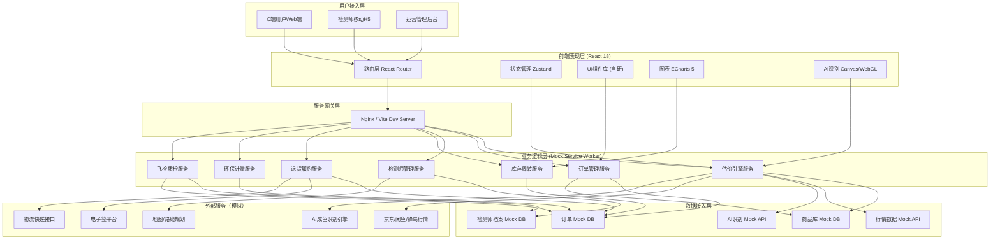
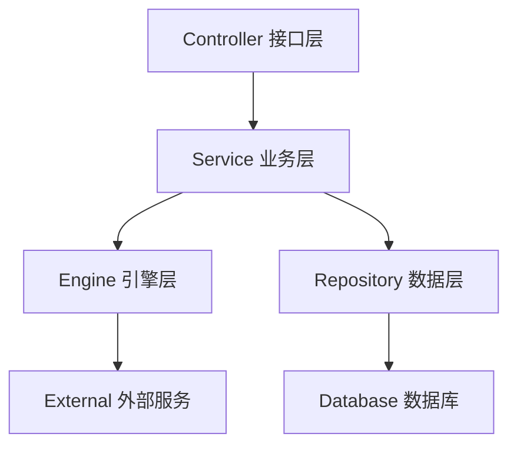
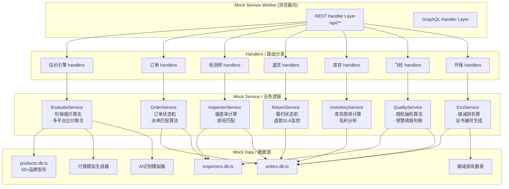
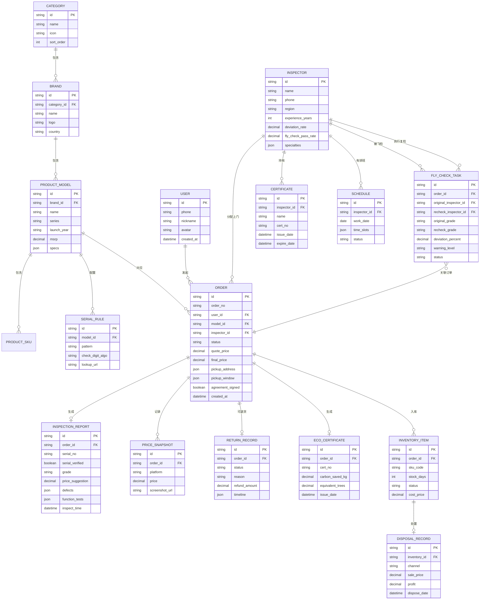

# 高值数码与奢侈品C2B回收交易平台 - 技术架构文档

## 1. 架构设计

### 1.1 系统分层架构图



### 1.2 后端服务架构图（Mock模拟）



---

## 2. 技术选型说明

### 2.1 前端技术栈

| 分类 | 技术 | 版本 | 选型理由 |
|------|------|------|----------|
| 构建工具 | Vite | ^5.0 | 极速冷启动、HMR毫秒级响应、原生ESM支持 |
| 框架 | React | ^18.3 | 成熟生态、Concurrent模式、Suspense支持 |
| 语言 | TypeScript | ^5.4 | 类型安全、大型项目可维护性、智能提示 |
| 路由 | React Router DOM | ^6.22 | 嵌套路由、数据Loader/Action、受保护路由 |
| 状态管理 | Zustand | ^4.5 | 轻量无模板、DevTools支持、跨组件共享 |
| 样式方案 | TailwindCSS | ^3.4 | 原子化CSS、设计Token系统、JIT编译 |
| 组件库 | 自研 + Radix UI | ^1.0 | 无样式基元组件、无障碍a11y、深度定制 |
| 图标 | Lucide React | ^0.344 | 轻量矢量图标、统一线性风格 |
| 图表可视化 | ECharts | ^5.5 | 丰富图表类型、大数据量性能、Canvas渲染 |
| HTTP请求 | Axios | ^1.6 | 拦截器、取消请求、自动重试机制 |
| Mock方案 | MSW (Mock Service Worker) | ^2.2 | Service Worker拦截、REST/GraphQL双支持 |
| 动画 | Framer Motion | ^11.0 | 声明式动画、React原生集成、手势支持 |
| 表单 | React Hook Form | ^7.51 | 受控/非受控混合、Yup校验、高性能 |
| 日期处理 | dayjs | ^1.11 | 2kb体积、Moment兼容API、国际化 |
| 图片处理 | react-image-crop | ^11.0 | 图片裁剪、支持Canvas压缩 |
| 签名 | react-signature-canvas | ^1.0 | 电子签名画布、移动端触控支持 |
| 文件导出 | jspdf | ^2.5 | PDF检测报告生成、支持中文 |

### 2.2 工程化配置

- **代码规范**：ESLint + Prettier + Stylelint + Husky + lint-staged
- **路径别名**：`@/*` → `src/*`
- **环境变量**：`.env.development` / `.env.production`
- **构建优化**：代码分割（按路由+图表库）、图片压缩、资源哈希

---

## 3. 路由定义

| 路径 | 页面组件 | 权限 | 功能说明 |
|------|----------|------|----------|
| `/` | HomePage | 公开 | 平台首页：估价入口、品牌导航、信任背书 |
| `/evaluate` | EvaluatePage | 公开 | 智能估价向导：品类选择→AI识别→比价→报价 |
| `/products` | ProductLibraryPage | 公开 | 商品库浏览：品牌分类、型号详情 |
| `/products/:id` | ProductDetailPage | 公开 | 型号详情：规格参数、真伪校验、历史均价 |
| `/inspectors/:id` | InspectorProfilePage | 公开 | 检测师档案：资质、偏差率、服务评价 |
| `/auth/login` | LoginPage | 公开 | 用户/检测师/管理员登录 |
| `/user/orders` | UserOrdersPage | 用户 | 我的回收订单列表 |
| `/user/orders/:id` | UserOrderDetailPage | 用户 | 订单详情：检测报告、比价图、协议签署 |
| `/user/returns` | UserReturnsPage | 用户 | 退货履约中心 |
| `/user/returns/apply/:orderId` | ReturnApplyPage | 用户 | 退货申请流程 |
| `/user/certificates` | EcoCertificatesPage | 用户 | 环保电子证书列表 |
| `/inspector/tasks` | InspectorTasksPage | 检测师 | 上门任务列表 |
| `/inspector/tasks/:id` | InspectorTaskDetailPage | 检测师 | 任务详情：录入检测数据、上传报告 |
| `/inspector/stats` | InspectorStatsPage | 检测师 | 个人偏差率与业绩统计 |
| `/admin/dashboard` | AdminDashboard | 管理员 | 运营总览大屏 |
| `/admin/cities` | CityNetworkPage | 管理员 | 城市服务网络：排班、路线优化 |
| `/admin/inventory` | InventoryDashboardPage | 管理员 | 库存周转看板 |
| `/admin/quality` | QualityInspectionPage | 管理员 | 检测师飞检中心 |
| `/admin/eco` | EcoMetricsPage | 管理员 | 环保贡献计量大屏 |
| `/admin/products` | AdminProductsPage | 管理员 | 商品库管理 |
| `/admin/inspectors` | AdminInspectorsPage | 管理员 | 检测师档案管理 |
| `*` | NotFoundPage | 公开 | 404页面 |

---

## 4. API 接口定义（Mock）

### 4.1 通用响应结构

```typescript
interface ApiResponse<T> {
  code: number;           // 0成功，非0错误码
  message: string;        // 提示信息
  data: T;                // 业务数据
  timestamp: number;      // 服务器时间戳
}

interface PagedResponse<T> {
  list: T[];
  total: number;
  page: number;
  pageSize: number;
}
```

### 4.2 估价引擎相关

```typescript
// POST /api/evaluate/brands
interface BrandListParams { category: string }
interface Brand { id: string; name: string; logo: string; models: Model[] }
interface Model { id: string; name: string; series: string; basePrice: number }

// POST /api/evaluate/ai-analyze
interface AIAnalyzeRequest {
  modelId: string;
  images: string[];           // base64图片数组
  conditionAnswers: Record<string, string>;  // 基础问卷答案
}
interface AIAnalyzeResult {
  scratchLevel: 1 | 2 | 3 | 4 | 5;    // 划痕等级1-5
  wearLevel: 1 | 2 | 3 | 4 | 5;       // 磨损等级
  oxidationLevel: 1 | 2 | 3 | 4 | 5;  // 氧化等级
  functionScore: number;              // 功能完好度0-100
  overallGrade: 'S' | 'A+' | 'A' | 'B+' | 'B' | 'C';  // 综合成色
  aiConfidence: number;               // AI置信度
  defectDetails: { area: string; type: string; severity: string }[];
}

// POST /api/evaluate/quote
interface QuoteRequest {
  modelId: string;
  aiResult: AIAnalyzeResult;
  conditionAnswers: Record<string, string>;
}
interface TieredPrice {
  tier: 'instant' | 'standard' | 'consignment';
  label: string;
  price: number;
  settlementDays: string;
  description: string;
}
interface QuoteResult {
  tieredPrices: TieredPrice[];
  priceComparison: {
    platform: string;
    price: number;
    trend: 'up' | 'down' | 'flat';
    trendPercent: number;
  }[];
  priceHistory: { date: string; price: number }[];   // 近30天价格走势
  serialVerifyRule: string;    // 序列号校验规则说明
}
```

### 4.3 订单相关

```typescript
// POST /api/orders
interface CreateOrderRequest {
  modelId: string;
  selectedTier: string;
  quotePrice: number;
  address: { province: string; city: string; district: string; detail: string; contact: string; phone: string };
  pickupWindow: { date: string; period: 'morning' | 'afternoon' | 'evening' };
}
interface Order {
  id: string;
  orderNo: string;
  status: 'pending_pickup' | 'inspecting' | 'pending_confirm' | 'paid' | 'completed' | 'returning' | 'returned' | 'cancelled';
  productInfo: { brand: string; model: string; image: string; grade: string };
  quotePrice: number;
  finalPrice?: number;
  pickupAddress: any;
  pickupWindow: any;
  inspector?: Inspector;
  inspectionReport?: InspectionReport;
  priceComparisonScreenshots?: string[];
  signedAgreement?: boolean;
  createdAt: string;
  paidAt?: string;
}

// POST /api/orders/:id/sign-agreement
interface SignAgreementRequest {
  signature: string;    // base64签名图片
  smsCode: string;
}

// GET /api/orders/:id/report
interface InspectionReport {
  id: string;
  inspectorName: string;
  inspectTime: string;
  serialNumber: string;
  serialVerified: boolean;
  grade: string;
  functionStatus: Record<string, boolean>;
  appearancePhotos: string[];
  defectMarkups: { position: string; description: string; photo: string }[];
  testItems: { name: string; result: string; note?: string }[];
  finalConclusion: string;
  priceSuggestion: number;
}
```

### 4.4 检测师相关

```typescript
interface Inspector {
  id: string;
  name: string;
  avatar: string;
  certificates: { name: string; no: string; issueDate: string; expireDate: string; issuer: string }[];
  experienceYears: number;
  specialties: string[];
  deviationRate30d: number;     // 近30天检测偏差率
  totalOrders: number;
  rating: number;
  region: string;
  flyCheckPassRate: number;     // 飞检通过率
}

// GET /api/inspectors/:id/stats
interface InspectorStats {
  deviationTrend: { date: string; rate: number }[];
  avgDeviation: number;
  industryAvg: number;
  flyCheckResults: { date: string; original: number; recheck: number; deviation: number }[];
}
```

### 4.5 退货相关

```typescript
// POST /api/returns
interface ReturnApplyRequest {
  orderId: string;
  reason: string;
  description: string;
  photos: string[];
  refundMethod: 'original' | 'bank';
  bankInfo?: { bank: string; account: string; holder: string };
}
interface ReturnRecord {
  id: string;
  orderId: string;
  status: 'pending_pickup' | 'shipping' | 'inspecting' | 'refunding' | 'completed' | 'rejected';
  reason: string;
  timeline: { time: string; status: string; operator?: string }[];
  estimatedRefundDate: string;
  refundAmount: number;
  logistics?: { company: string; trackingNo: string };
}
```

### 4.6 库存周转相关

```typescript
// GET /api/admin/inventory/overview
interface InventoryOverview {
  totalInStock: number;
  avgStockDays: number;
  refurbishmentRate: number;
  monthlyProfit: number;
  monthlyProfitTrend: { month: string; profit: number }[];
  channelProfit: { channel: string; count: number; profit: number; margin: number }[];
  stockAgeDistribution: { range: string; count: number; percentage: number }[];
  slowMovingItems: { product: string; days: number; cost: number; suggestion: string }[];
}
```

### 4.7 环保相关

```typescript
// GET /api/eco/metrics
interface EcoMetrics {
  totalRecycled: number;
  totalCarbonSavedKg: number;
  equivalentTrees: number;
  equivalentEnergy: number;         // 度电
  categoryBreakdown: { category: string; count: number; carbonKg: number }[];
  monthlyTrend: { month: string; carbonKg: number }[];
}

// GET /api/eco/certificates/:orderId
interface EcoCertificate {
  id: string;
  orderId: string;
  certNo: string;
  issueDate: string;
  productName: string;
  carbonSavedKg: number;
  equivalentTrees: number;
  userName: string;
  qrCode: string;
  template: 'standard' | 'premium';
}
```

### 4.8 飞检相关

```typescript
// POST /api/admin/quality/fly-check
interface FlyCheckCreateRequest {
  orderIds: string[];      // 随机抽检的订单
  inspectorId: string;     // 复检员ID
  priority: 'normal' | 'urgent';
}
interface FlyCheckTask {
  id: string;
  originalOrderId: string;
  originalInspector: string;
  originalGrade: string;
  originalPrice: number;
  recheckInspector?: string;
  recheckGrade?: string;
  recheckPrice?: number;
  deviationPercent?: number;
  status: 'pending' | 'in_progress' | 'completed';
  warning?: boolean;
  warningLevel?: 'low' | 'medium' | 'high';
  createdAt: string;
}
```

---

## 5. 服务器架构图（Mock MSW层）



---

## 6. 数据模型

### 6.1 ER 关系图



### 6.2 关键算法说明

**1. 阶梯报价算法（EvaluateService）**
```
基础价 = 型号历史成交均价 × 成色系数
成色系数 = {
  S: 0.92-0.95, A+: 0.85-0.91, A: 0.78-0.84,
  B+: 0.70-0.77, B: 0.60-0.69, C: 0.50-0.59
}
三档报价 = 基础价 × [0.88(即时), 0.95(标准), 1.02(寄售×15天费率)]
多平台比价加权 = JD×0.35 + Xianyu×0.4 + Fengniao×0.25
```

**2. 随机飞检算法（QualityService）**
```
抽检权重 = 检测师偏差率×2 + 订单高价值系数×1.5 + 新入职系数×3
每日每检测师至少1单抽检（偏差率>5%则3单/日）
预警阈值 = 偏差率 >3% 黄色警告，>5% 红色警告并停单培训
```

**3. 碳减排折算（EcoService）**
```
碳减排(kg) = 新品生产碳排放 - 回收处理碳排放
折算系数表 = {
  手机: 85kg/台, 笔记本: 220kg/台, 相机: 150kg/台,
  手表: 120kg/只, 包包: 95kg/只, 珠宝: 65kg/件
}
等效植树数 = 碳减排kg ÷ 18 （每棵树年均吸碳约18kg）
```
