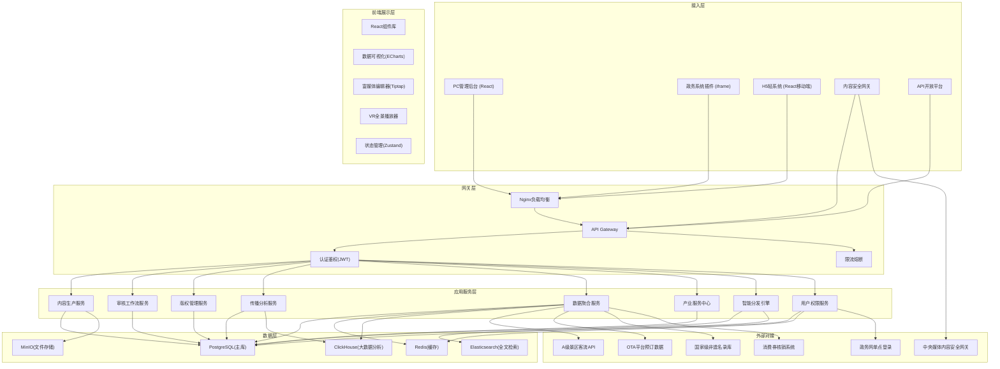

## 1. 架构设计



## 2. 技术描述

### 2.1 前端技术栈
- **框架**: React 18 + TypeScript 5.x
- **构建工具**: Vite 5.x
- **样式方案**: TailwindCSS 3.x + CSS Variables
- **状态管理**: Zustand 4.x
- **路由管理**: React Router DOM 6.x
- **UI组件库**: 自研组件库（基于设计规范）
- **富文本编辑**: Tiptap 2.x
- **数据可视化**: Apache ECharts 5.x
- **VR全景**: Pannellum / Three.js
- **HTTP客户端**: Axios + TanStack Query
- **图标**: Lucide React

### 2.2 后端技术栈
- **运行时**: Node.js 20.x + TypeScript 5.x
- **Web框架**: Express 4.x
- **ORM**: Prisma 5.x
- **数据库**: PostgreSQL 16.x
- **缓存**: Redis 7.x
- **消息队列**: BullMQ
- **认证**: JWT + bcrypt
- **日志**: Winston + ELK
- **监控**: Prometheus + Grafana

### 2.3 初始化工具
- 使用 `vite-init` 脚手架创建 react-express-ts 模板
- 包管理器：pnpm（优先）/ npm

### 2.4 数据库选择说明
- **PostgreSQL**: 主业务数据库，存储用户、内容、审核、服务等结构化数据
- **Redis**: 缓存热点数据、Session管理、分布式锁、限流计数器
- **ClickHouse**: 存储海量传播数据、用户行为数据，支持OLAP分析
- **Elasticsearch**: 全文检索、智能搜索、日志分析
- **MinIO**: 对象存储，存放图片、视频、VR全景等媒体文件

## 3. 路由定义

### 3.1 PC管理后台路由

| 路由路径 | 页面名称 | 权限要求 |
|----------|----------|----------|
| `/login` | 登录页 | 公开 |
| `/dashboard` | 工作台 | 登录用户 |
| `/content/list` | 内容列表 | content:read |
| `/content/create` | 创建内容 | content:create |
| `/content/edit/:id` | 编辑内容 | content:edit |
| `/content/audit` | 审核中心 | audit:operate |
| `/content/copyright` | 版权管理 | copyright:manage |
| `/analytics/propagation` | 传播分析 | analytics:view |
| `/analytics/sentiment` | 舆情分析 | analytics:view |
| `/data/dashboard` | 数据看板 | data:view |
| `/data/dashboard/create` | 创建看板 | data:edit |
| `/data/api` | API开放平台 | developer:access |
| `/data/api/apply` | 接口申请 | developer:apply |
| `/service/investment` | 招商对接 | service:invest |
| `/service/festival` | 节庆活动申报 | service:festival |
| `/service/guide` | 导游资格认证 | service:guide |
| `/system/users` | 用户管理 | system:user |
| `/system/roles` | 角色权限 | system:role |
| `/system/settings` | 系统设置 | system:setting |
| `/system/logs` | 操作日志 | system:log |

### 3.2 H5移动端路由

| 路由路径 | 页面名称 | 权限要求 |
|----------|----------|----------|
| `/h5` | H5首页 | 公开 |
| `/h5/content/:id` | 内容详情 | 公开 |
| `/h5/vr/:id` | VR导览 | 公开 |
| `/h5/category/:category` | 分类列表 | 公开 |
| `/h5/search` | 搜索页 | 公开 |
| `/h5/subscribe` | 订阅中心 | 登录用户 |
| `/h5/activity` | 活动列表 | 公开 |
| `/h5/activity/:id` | 活动详情 | 公开 |
| `/h5/coupon` | 消费券领取 | 登录用户 |
| `/h5/profile` | 个人中心 | 登录用户 |

### 3.3 政务插件路由

| 路由路径 | 页面名称 | 嵌入方式 |
|----------|----------|----------|
| `/plugin/dashboard` | 政务数据概览 | iframe |
| `/plugin/audit` | 待办审核 | iframe |
| `/plugin/report` | 统计报表 | iframe |
| `/plugin/notification` | 消息通知 | iframe |

### 3.4 API接口路由

| 路由前缀 | 模块 | 说明 |
|----------|------|------|
| `/api/auth/*` | 认证模块 | 登录、注册、登出、Token刷新 |
| `/api/content/*` | 内容模块 | CRUD、发布、下架 |
| `/api/audit/*` | 审核模块 | 审核流程、审核记录 |
| `/api/media/*` | 媒体模块 | 文件上传、转码、水印 |
| `/api/analytics/*` | 分析模块 | 传播数据、舆情分析 |
| `/api/data/*` | 数据模块 | 聚合数据、看板、API开放 |
| `/api/service/*` | 服务模块 | 招商、活动、认证 |
| `/api/user/*` | 用户模块 | 用户信息、权限、角色 |
| `/api/system/*` | 系统模块 | 配置、日志、监控 |

## 4. API 类型定义

```typescript
// 基础响应类型
interface ApiResponse<T> {
  code: number;
  message: string;
  data: T;
  timestamp: number;
}

interface PageResponse<T> {
  list: T[];
  total: number;
  page: number;
  pageSize: number;
}

// 用户相关类型
type UserRole = 'super_admin' | 'government' | 'scenic_admin' | 'enterprise' | 'editor' | 'professional' | 'tourist';

interface User {
  id: string;
  username: string;
  realName: string;
  email: string;
  phone: string;
  role: UserRole;
  organization: string;
  avatar: string;
  status: 'active' | 'inactive' | 'pending';
  createdAt: string;
  lastLoginAt: string;
}

interface LoginRequest {
  username: string;
  password: string;
  captcha?: string;
}

interface LoginResponse {
  token: string;
  refreshToken: string;
  user: User;
  permissions: string[];
}

// 内容相关类型
type ContentType = 'article' | 'video' | 'vr' | 'infographic';
type ContentStatus = 'draft' | 'pending_audit' | 'auditing' | 'approved' | 'rejected' | 'published' | 'offline';

interface Content {
  id: string;
  title: string;
  type: ContentType;
  authorId: string;
  authorName: string;
  summary: string;
  content: string;
  coverImage: string;
  tags: string[];
  category: string;
  region: string;
  status: ContentStatus;
  views: number;
  likes: number;
  shares: number;
  comments: number;
  copyright: CopyrightInfo;
  watermark: WatermarkConfig;
  auditTrail: AuditRecord[];
  scheduledPublishAt?: string;
  publishedAt?: string;
  createdAt: string;
  updatedAt: string;
}

interface CopyrightInfo {
  owner: string;
  registrationNo: string;
  authorizedUse: string[];
  watermarkEnabled: boolean;
}

interface WatermarkConfig {
  type: 'text' | 'image';
  text?: string;
  imageUrl?: string;
  position: 'top-left' | 'top-right' | 'bottom-left' | 'bottom-right' | 'center';
  opacity: number;
}

interface AuditRecord {
  id: string;
  contentId: string;
  auditorId: string;
  auditorName: string;
  level: 1 | 2 | 3;
  action: 'submit' | 'approve' | 'reject';
  opinion: string;
  createdAt: string;
}

// 数据聚合类型
interface ScenicSpotFlow {
  id: string;
  scenicSpotId: string;
  scenicSpotName: string;
  region: string;
  visitorCount: number;
  maxCapacity: number;
  saturation: number;
  realTimeData: boolean;
  timestamp: string;
}

interface OTABookingData {
  id: string;
  platform: string;
  scenicSpotId: string;
  bookingCount: number;
  bookingAmount: number;
  checkInDate: string;
  dataDate: string;
}

interface IntangibleCulturalHeritage {
  id: string;
  name: string;
  category: string;
  level: 'national' | 'provincial' | 'municipal';
  region: string;
  inheritor: string;
  description: string;
  certificationDate: string;
}

interface CouponConsumption {
  id: string;
  couponBatchId: string;
  couponName: string;
  totalAmount: number;
  usedAmount: number;
  usedCount: number;
  writeOffRate: number;
  region: string;
  statisticsDate: string;
}

// 产业服务类型
interface InvestmentProject {
  id: string;
  name: string;
  type: string;
  region: string;
  totalInvestment: number;
  description: string;
  contactPerson: string;
  contactPhone: string;
  status: 'pending' | 'negotiating' | 'signed' | 'completed';
  createdAt: string;
}

interface FestivalActivity {
  id: string;
  name: string;
  organizer: string;
  region: string;
  startDate: string;
  endDate: string;
  venue: string;
  expectedScale: number;
  description: string;
  status: 'draft' | 'submitted' | 'reviewing' | 'approved' | 'rejected' | 'ongoing' | 'completed';
  createdAt: string;
}

interface GuideCertification {
  id: string;
  userId: string;
  realName: string;
  idCard: string;
  qualificationNo: string;
  qualificationLevel: 'primary' | 'intermediate' | 'senior';
  certificateImage: string;
  status: 'pending' | 'approved' | 'rejected' | 'expired';
  validUntil: string;
  createdAt: string;
}

// 看板相关类型
interface Dashboard {
  id: string;
  name: string;
  description: string;
  layout: DashboardWidget[];
  ownerId: string;
  isPublic: boolean;
  sharedRoles: string[];
  createdAt: string;
  updatedAt: string;
}

interface DashboardWidget {
  id: string;
  type: 'line' | 'bar' | 'pie' | 'map' | 'table' | 'card' | 'gauge';
  title: string;
  dataSource: string;
  dimensions: string[];
  measures: string[];
  filters: Record<string, any>;
  position: { x: number; y: number; w: number; h: number };
}

// API开放平台类型
interface OpenApi {
  id: string;
  name: string;
  path: string;
  method: 'GET' | 'POST' | 'PUT' | 'DELETE';
  description: string;
  category: string;
  requestParams: ApiParam[];
  responseParams: ApiParam[];
  rateLimit: number;
  isPublic: boolean;
}

interface ApiParam {
  name: string;
  type: string;
  required: boolean;
  description: string;
  example: string;
}

interface ApiApplication {
  id: string;
  name: string;
  description: string;
  appKey: string;
  appSecret: string;
  ownerId: string;
  subscribedApis: string[];
  status: 'active' | 'suspended';
  createdAt: string;
}

// 智能分发类型
interface DistributionRule {
  id: string;
  name: string;
  contentTags: string[];
  targetRegions: string[];
  targetUserGroups: string[];
  priority: number;
  channels: string[];
  startTime: string;
  endTime: string;
  isEnabled: boolean;
}

interface DistributionRecord {
  id: string;
  contentId: string;
  channel: string;
  targetUserId?: string;
  targetRegion?: string;
  deliveredAt: string;
  viewedAt?: string;
  clickedAt?: string;
}

// 内容安全网关类型
interface ContentSecurityCheckRequest {
  contentId: string;
  content: string;
  type: ContentType;
  mediaUrls?: string[];
}

interface ContentSecurityCheckResponse {
  passed: boolean;
  riskLevel: 'safe' | 'low' | 'medium' | 'high';
  sensitiveKeywords: string[];
  suggestions: string[];
  checkTime: string;
}

// 舆情分析类型
interface SentimentAnalysis {
  id: string;
  contentId: string;
  totalMentions: number;
  positiveCount: number;
  neutralCount: number;
  negativeCount: number;
  sentimentScore: number;
  hotTopics: string[];
  keyOpinionLeaders: string[];
  analysisDate: string;
}

interface PropagationNode {
  id: string;
  contentId: string;
  userId: string;
  userName: string;
  platform: string;
  shareCount: number;
  viewCount: number;
  level: number;
  parentId?: string;
  timestamp: string;
}
```

## 5. 服务端架构图

```mermaid
graph TD
    subgraph "API层 (Controllers)"
        C1["AuthController"]
        C2["ContentController"]
        C3["AuditController"]
        C4["MediaController"]
        C5["AnalyticsController"]
        C6["DataController"]
        C7["ServiceController"]
        C8["UserController"]
        C9["SystemController"]
    end

    subgraph "业务逻辑层 (Services)"
        S1["AuthService"]
        S2["ContentService"]
        S3["AuditWorkflowService"]
        S4["MediaProcessingService"]
        S5["CopyrightService"]
        S6["PropagationAnalysisService"]
        S7["SentimentAnalysisService"]
        S8["DataAggregationService"]
        S9["DashboardService"]
        S10["OpenApiService"]
        S11["InvestmentService"]
        S12["FestivalService"]
        S13["GuideCertService"]
        S14["DistributionEngineService"]
        S15["SecurityGatewayService"]
        S16["UserPermissionService"]
    end

    subgraph "数据访问层 (Repositories)"
        R1["UserRepository"]
        R2["ContentRepository"]
        R3["AuditRepository"]
        R4["MediaRepository"]
        R5["DataRepository"]
        R6["ServiceRepository"]
        R7["AnalyticsRepository"]
        R8["SystemRepository"]
    end

    subgraph "基础设施"
        I1["数据库(PostgreSQL)"]
        I2["缓存(Redis)"]
        I3["对象存储(MinIO)"]
        I4["搜索引擎(Elasticsearch)"]
        I5["分析数据库(ClickHouse)"]
        I6["消息队列(BullMQ)"]
        I7["任务调度器"]
        I8["文件处理服务"]
        I9["视频转码服务"]
    end

    C1 --> S1
    C2 --> S2
    C2 --> S3
    C3 --> S3
    C4 --> S4
    C5 --> S6
    C5 --> S7
    C6 --> S8
    C6 --> S9
    C6 --> S10
    C7 --> S11
    C7 --> S12
    C7 --> S13
    C8 --> S16
    C9 --> S16
    
    S1 --> R1
    S2 --> R2
    S3 --> R3
    S4 --> R4
    S5 --> R2
    S6 --> R7
    S7 --> R7
    S8 --> R5
    S9 --> R5
    S10 --> R5
    S11 --> R6
    S12 --> R6
    S13 --> R6
    S14 --> R2
    S15 --> R2
    S16 --> R1
    S16 --> R8
    
    R1 --> I1
    R2 --> I1
    R3 --> I1
    R4 --> I1
    R5 --> I1
    R6 --> I1
    R7 --> I5
    R8 --> I1
    
    S2 --> I2
    S8 --> I2
    S14 --> I4
    S15 --> I4
    S4 --> I3
    S4 --> I8
    S4 --> I9
    S3 --> I6
    S8 --> I6
    S14 --> I6
    S8 --> I7
```



## 6. 数据模型

### 6.1 ER图

```mermaid
erDiagram
    USER ||--o{ CONTENT : creates
    USER ||--o{ AUDIT_RECORD : audits
    USER ||--o{ USER_ROLE : has
    ROLE ||--o{ USER_ROLE : assigned
    ROLE ||--o{ ROLE_PERMISSION : has
    PERMISSION ||--o{ ROLE_PERMISSION : assigned
    
    CONTENT ||--o{ CONTENT_TAG : tagged
    TAG ||--o{ CONTENT_TAG : belongs
    CONTENT ||--o{ AUDIT_RECORD : has
    CONTENT ||--o{ COPYRIGHT : has
    CONTENT ||--o{ MEDIA : contains
    CONTENT ||--o{ DISTRIBUTION_RECORD : distributed
    CONTENT ||--o{ PROPAGATION_NODE : propagated
    CONTENT ||--o{ SENTIMENT_ANALYSIS : analyzed
    
    SCENIC_SPOT ||--o{ SCENIC_FLOW : has
    SCENIC_SPOT ||--o{ OTA_BOOKING : has
    INTANGIBLE_HERITAGE ||--o{ HERITAGE_CATEGORY : categorized
    COUPON_BATCH ||--o{ COUPON_CONSUMPTION : has
    
    DASHBOARD ||--o{ DASHBOARD_WIDGET : contains
    API_APPLICATION ||--o{ API_SUBSCRIPTION : subscribes
    OPEN_API ||--o{ API_SUBSCRIPTION : subscribed
    
    INVESTMENT_PROJECT ||--o{ PROJECT_CONTACT : has
    FESTIVAL_ACTIVITY ||--o{ ACTIVITY_REGISTRATION : has
    GUIDE_CERTIFICATION ||--o{ CERTIFICATION_HISTORY : has
    
    USER {
        uuid id PK
        string username
        string password_hash
        string real_name
        string email
        string phone
        string organization
        string avatar
        string status
        datetime created_at
        datetime last_login_at
    }
    
    ROLE {
        uuid id PK
        string name
        string code
        string description
        boolean is_system
    }
    
    PERMISSION {
        uuid id PK
        string name
        string code
        string module
        string action
    }
    
    USER_ROLE {
        uuid id PK
        uuid user_id FK
        uuid role_id FK
    }
    
    ROLE_PERMISSION {
        uuid id PK
        uuid role_id FK
        uuid permission_id FK
    }
    
    CONTENT {
        uuid id PK
        string title
        string type
        uuid author_id FK
        string summary
        text content
        string cover_image
        string category
        string region
        string status
        int views
        int likes
        int shares
        int comments
        datetime scheduled_publish_at
        datetime published_at
        datetime created_at
        datetime updated_at
    }
    
    TAG {
        uuid id PK
        string name
        string category
        int use_count
    }
    
    CONTENT_TAG {
        uuid id PK
        uuid content_id FK
        uuid tag_id FK
    }
    
    AUDIT_RECORD {
        uuid id PK
        uuid content_id FK
        uuid auditor_id FK
        int level
        string action
        text opinion
        datetime created_at
    }
    
    COPYRIGHT {
        uuid id PK
        uuid content_id FK
        string owner
        string registration_no
        boolean watermark_enabled
    }
    
    MEDIA {
        uuid id PK
        uuid content_id FK
        string type
        string url
        string file_size
        string mime_type
        int duration
        datetime created_at
    }
    
    DISTRIBUTION_RULE {
        uuid id PK
        string name
        string[] content_tags
        string[] target_regions
        int priority
        string[] channels
        datetime start_time
        datetime end_time
        boolean is_enabled
    }
    
    DISTRIBUTION_RECORD {
        uuid id PK
        uuid content_id FK
        uuid rule_id FK
        string channel
        string target_region
        datetime delivered_at
    }
    
    PROPAGATION_NODE {
        uuid id PK
        uuid content_id FK
        string user_id
        string user_name
        string platform
        int share_count
        int view_count
        int level
        uuid parent_id FK
        datetime timestamp
    }
    
    SENTIMENT_ANALYSIS {
        uuid id PK
        uuid content_id FK
        int total_mentions
        int positive_count
        int neutral_count
        int negative_count
        float sentiment_score
        text hot_topics
        datetime analysis_date
    }
    
    SCENIC_SPOT {
        uuid id PK
        string name
        string level
        string region
        string address
        int max_capacity
        decimal latitude
        decimal longitude
    }
    
    SCENIC_FLOW {
        uuid id PK
        uuid scenic_spot_id FK
        int visitor_count
        float saturation
        boolean real_time
        datetime timestamp
    }
    
    OTA_BOOKING {
        uuid id PK
        uuid scenic_spot_id FK
        string platform
        int booking_count
        decimal booking_amount
        date check_in_date
        date data_date
    }
    
    INTANGIBLE_HERITAGE {
        uuid id PK
        string name
        string category
        string level
        string region
        string inheritor
        text description
        date certification_date
    }
    
    COUPON_BATCH {
        uuid id PK
        string name
        decimal total_amount
        int total_count
        string region
        date valid_from
        date valid_to
    }
    
    COUPON_CONSUMPTION {
        uuid id PK
        uuid coupon_batch_id FK
        decimal used_amount
        int used_count
        float write_off_rate
        date statistics_date
    }
    
    DASHBOARD {
        uuid id PK
        string name
        uuid owner_id FK
        boolean is_public
        datetime created_at
    }
    
    DASHBOARD_WIDGET {
        uuid id PK
        uuid dashboard_id FK
        string type
        string title
        string data_source
        text dimensions
        text measures
        text filters
        text position
    }
    
    OPEN_API {
        uuid id PK
        string name
        string path
        string method
        string description
        int rate_limit
        boolean is_public
    }
    
    API_APPLICATION {
        uuid id PK
        string name
        string app_key
        string app_secret
        uuid owner_id FK
        string status
    }
    
    INVESTMENT_PROJECT {
        uuid id PK
        string name
        string type
        string region
        decimal total_investment
        text description
        string contact_person
        string contact_phone
        string status
        datetime created_at
    }
    
    FESTIVAL_ACTIVITY {
        uuid id PK
        string name
        string organizer
        string region
        date start_date
        date end_date
        string venue
        int expected_scale
        string status
        datetime created_at
    }
    
    GUIDE_CERTIFICATION {
        uuid id PK
        uuid user_id FK
        string real_name
        string qualification_no
        string qualification_level
        string status
        date valid_until
        datetime created_at
    }
    
    CONTENT_SECURITY_LOG {
        uuid id PK
        uuid content_id FK
        boolean passed
        string risk_level
        text sensitive_keywords
        text suggestions
        datetime check_time
    }
    
    OPERATION_LOG {
        uuid id PK
        uuid user_id FK
        string module
        string action
        text request_params
        text response_result
        string ip_address
        datetime created_at
    }
```



### 6.2 DDL 语句

```sql
-- 用户表
CREATE TABLE "user" (
    id UUID PRIMARY KEY DEFAULT gen_random_uuid(),
    username VARCHAR(50) UNIQUE NOT NULL,
    password_hash VARCHAR(255) NOT NULL,
    real_name VARCHAR(100) NOT NULL,
    email VARCHAR(100) UNIQUE,
    phone VARCHAR(20) UNIQUE,
    organization VARCHAR(200),
    avatar VARCHAR(500),
    status VARCHAR(20) NOT NULL DEFAULT 'active',
    created_at TIMESTAMP NOT NULL DEFAULT CURRENT_TIMESTAMP,
    last_login_at TIMESTAMP,
    updated_at TIMESTAMP NOT NULL DEFAULT CURRENT_TIMESTAMP
);

CREATE INDEX idx_user_username ON "user"(username);
CREATE INDEX idx_user_status ON "user"(status);

-- 角色表
CREATE TABLE "role" (
    id UUID PRIMARY KEY DEFAULT gen_random_uuid(),
    name VARCHAR(50) NOT NULL,
    code VARCHAR(50) UNIQUE NOT NULL,
    description TEXT,
    is_system BOOLEAN NOT NULL DEFAULT false,
    created_at TIMESTAMP NOT NULL DEFAULT CURRENT_TIMESTAMP
);

-- 权限表
CREATE TABLE permission (
    id UUID PRIMARY KEY DEFAULT gen_random_uuid(),
    name VARCHAR(100) NOT NULL,
    code VARCHAR(100) UNIQUE NOT NULL,
    module VARCHAR(50) NOT NULL,
    action VARCHAR(50) NOT NULL,
    created_at TIMESTAMP NOT NULL DEFAULT CURRENT_TIMESTAMP
);

-- 用户角色关联表
CREATE TABLE user_role (
    id UUID PRIMARY KEY DEFAULT gen_random_uuid(),
    user_id UUID NOT NULL REFERENCES "user"(id) ON DELETE CASCADE,
    role_id UUID NOT NULL REFERENCES "role"(id) ON DELETE CASCADE,
    created_at TIMESTAMP NOT NULL DEFAULT CURRENT_TIMESTAMP,
    UNIQUE(user_id, role_id)
);

-- 角色权限关联表
CREATE TABLE role_permission (
    id UUID PRIMARY KEY DEFAULT gen_random_uuid(),
    role_id UUID NOT NULL REFERENCES "role"(id) ON DELETE CASCADE,
    permission_id UUID NOT NULL REFERENCES permission(id) ON DELETE CASCADE,
    created_at TIMESTAMP NOT NULL DEFAULT CURRENT_TIMESTAMP,
    UNIQUE(role_id, permission_id)
);

-- 内容表
CREATE TABLE content (
    id UUID PRIMARY KEY DEFAULT gen_random_uuid(),
    title VARCHAR(500) NOT NULL,
    type VARCHAR(20) NOT NULL,
    author_id UUID NOT NULL REFERENCES "user"(id),
    summary VARCHAR(1000),
    content TEXT NOT NULL,
    cover_image VARCHAR(500),
    category VARCHAR(50),
    region VARCHAR(100),
    status VARCHAR(30) NOT NULL DEFAULT 'draft',
    views INTEGER NOT NULL DEFAULT 0,
    likes INTEGER NOT NULL DEFAULT 0,
    shares INTEGER NOT NULL DEFAULT 0,
    comments INTEGER NOT NULL DEFAULT 0,
    scheduled_publish_at TIMESTAMP,
    published_at TIMESTAMP,
    created_at TIMESTAMP NOT NULL DEFAULT CURRENT_TIMESTAMP,
    updated_at TIMESTAMP NOT NULL DEFAULT CURRENT_TIMESTAMP
);

CREATE INDEX idx_content_type ON content(type);
CREATE INDEX idx_content_status ON content(status);
CREATE INDEX idx_content_category ON content(category);
CREATE INDEX idx_content_region ON content(region);
CREATE INDEX idx_content_created_at ON content(created_at DESC);
CREATE INDEX idx_content_published_at ON content(published_at DESC);

-- 标签表
CREATE TABLE tag (
    id UUID PRIMARY KEY DEFAULT gen_random_uuid(),
    name VARCHAR(50) UNIQUE NOT NULL,
    category VARCHAR(50),
    use_count INTEGER NOT NULL DEFAULT 0,
    created_at TIMESTAMP NOT NULL DEFAULT CURRENT_TIMESTAMP
);

-- 内容标签关联表
CREATE TABLE content_tag (
    id UUID PRIMARY KEY DEFAULT gen_random_uuid(),
    content_id UUID NOT NULL REFERENCES content(id) ON DELETE CASCADE,
    tag_id UUID NOT NULL REFERENCES tag(id) ON DELETE CASCADE,
    created_at TIMESTAMP NOT NULL DEFAULT CURRENT_TIMESTAMP,
    UNIQUE(content_id, tag_id)
);

-- 审核记录表
CREATE TABLE audit_record (
    id UUID PRIMARY KEY DEFAULT gen_random_uuid(),
    content_id UUID NOT NULL REFERENCES content(id) ON DELETE CASCADE,
    auditor_id UUID NOT NULL REFERENCES "user"(id),
    level INTEGER NOT NULL,
    action VARCHAR(20) NOT NULL,
    opinion TEXT,
    created_at TIMESTAMP NOT NULL DEFAULT CURRENT_TIMESTAMP
);

CREATE INDEX idx_audit_content ON audit_record(content_id);
CREATE INDEX idx_audit_created_at ON audit_record(created_at DESC);

-- 版权信息表
CREATE TABLE copyright (
    id UUID PRIMARY KEY DEFAULT gen_random_uuid(),
    content_id UUID NOT NULL REFERENCES content(id) ON DELETE CASCADE,
    owner VARCHAR(200) NOT NULL,
    registration_no VARCHAR(100),
    watermark_enabled BOOLEAN NOT NULL DEFAULT true,
    watermark_config JSONB,
    created_at TIMESTAMP NOT NULL DEFAULT CURRENT_TIMESTAMP
);

CREATE UNIQUE INDEX idx_copyright_content ON copyright(content_id);

-- 媒体资源表
CREATE TABLE media (
    id UUID PRIMARY KEY DEFAULT gen_random_uuid(),
    content_id UUID REFERENCES content(id) ON DELETE SET NULL,
    type VARCHAR(20) NOT NULL,
    url VARCHAR(500) NOT NULL,
    file_size BIGINT NOT NULL,
    mime_type VARCHAR(100) NOT NULL,
    duration INTEGER,
    width INTEGER,
    height INTEGER,
    watermarked BOOLEAN NOT NULL DEFAULT false,
    created_at TIMESTAMP NOT NULL DEFAULT CURRENT_TIMESTAMP
);

CREATE INDEX idx_media_content ON media(content_id);
CREATE INDEX idx_media_type ON media(type);

-- 分发规则表
CREATE TABLE distribution_rule (
    id UUID PRIMARY KEY DEFAULT gen_random_uuid(),
    name VARCHAR(200) NOT NULL,
    content_tags VARCHAR(100)[],
    target_regions VARCHAR(100)[],
    target_user_groups VARCHAR(100)[],
    priority INTEGER NOT NULL DEFAULT 0,
    channels VARCHAR(50)[] NOT NULL,
    start_time TIMESTAMP,
    end_time TIMESTAMP,
    is_enabled BOOLEAN NOT NULL DEFAULT true,
    created_at TIMESTAMP NOT NULL DEFAULT CURRENT_TIMESTAMP
);

-- 分发记录表
CREATE TABLE distribution_record (
    id UUID PRIMARY KEY DEFAULT gen_random_uuid(),
    content_id UUID NOT NULL REFERENCES content(id),
    rule_id UUID REFERENCES distribution_rule(id),
    channel VARCHAR(50) NOT NULL,
    target_user_id UUID REFERENCES "user"(id),
    target_region VARCHAR(100),
    delivered_at TIMESTAMP NOT NULL DEFAULT CURRENT_TIMESTAMP,
    viewed_at TIMESTAMP,
    clicked_at TIMESTAMP
);

CREATE INDEX idx_distribution_content ON distribution_record(content_id);
CREATE INDEX idx_distribution_channel ON distribution_record(channel);

-- 传播节点表
CREATE TABLE propagation_node (
    id UUID PRIMARY KEY DEFAULT gen_random_uuid(),
    content_id UUID NOT NULL REFERENCES content(id),
    user_id VARCHAR(100),
    user_name VARCHAR(200),
    platform VARCHAR(50),
    share_count INTEGER NOT NULL DEFAULT 0,
    view_count INTEGER NOT NULL DEFAULT 0,
    level INTEGER NOT NULL,
    parent_id UUID REFERENCES propagation_node(id),
    timestamp TIMESTAMP NOT NULL,
    created_at TIMESTAMP NOT NULL DEFAULT CURRENT_TIMESTAMP
);

CREATE INDEX idx_propagation_content ON propagation_node(content_id);
CREATE INDEX idx_propagation_parent ON propagation_node(parent_id);

-- 舆情分析表
CREATE TABLE sentiment_analysis (
    id UUID PRIMARY KEY DEFAULT gen_random_uuid(),
    content_id UUID NOT NULL REFERENCES content(id),
    total_mentions INTEGER NOT NULL DEFAULT 0,
    positive_count INTEGER NOT NULL DEFAULT 0,
    neutral_count INTEGER NOT NULL DEFAULT 0,
    negative_count INTEGER NOT NULL DEFAULT 0,
    sentiment_score DECIMAL(5,4) NOT NULL DEFAULT 0.5,
    hot_topics JSONB,
    key_opinion_leaders JSONB,
    analysis_date DATE NOT NULL,
    created_at TIMESTAMP NOT NULL DEFAULT CURRENT_TIMESTAMP
);

CREATE UNIQUE INDEX idx_sentiment_content_date ON sentiment_analysis(content_id, analysis_date);

-- A级景区表
CREATE TABLE scenic_spot (
    id UUID PRIMARY KEY DEFAULT gen_random_uuid(),
    name VARCHAR(200) NOT NULL,
    level VARCHAR(10) NOT NULL,
    region VARCHAR(100) NOT NULL,
    address VARCHAR(500),
    max_capacity INTEGER,
    latitude DECIMAL(10,7),
    longitude DECIMAL(10,7),
    description TEXT,
    created_at TIMESTAMP NOT NULL DEFAULT CURRENT_TIMESTAMP,
    updated_at TIMESTAMP NOT NULL DEFAULT CURRENT_TIMESTAMP
);

CREATE INDEX idx_scenic_region ON scenic_spot(region);
CREATE INDEX idx_scenic_level ON scenic_spot(level);

-- 景区客流表
CREATE TABLE scenic_flow (
    id UUID PRIMARY KEY DEFAULT gen_random_uuid(),
    scenic_spot_id UUID NOT NULL REFERENCES scenic_spot(id) ON DELETE CASCADE,
    scenic_spot_name VARCHAR(200) NOT NULL,
    region VARCHAR(100) NOT NULL,
    visitor_count INTEGER NOT NULL,
    max_capacity INTEGER,
    saturation DECIMAL(5,4),
    real_time BOOLEAN NOT NULL DEFAULT false,
    timestamp TIMESTAMP NOT NULL
);

CREATE INDEX idx_flow_scenic ON scenic_flow(scenic_spot_id);
CREATE INDEX idx_flow_timestamp ON scenic_flow(timestamp DESC);
CREATE INDEX idx_flow_region ON scenic_flow(region);

-- OTA预订数据表
CREATE TABLE ota_booking (
    id UUID PRIMARY KEY DEFAULT gen_random_uuid(),
    scenic_spot_id UUID NOT NULL REFERENCES scenic_spot(id) ON DELETE CASCADE,
    platform VARCHAR(50) NOT NULL,
    booking_count INTEGER NOT NULL,
    booking_amount DECIMAL(12,2) NOT NULL,
    check_in_date DATE NOT NULL,
    data_date DATE NOT NULL
);

CREATE INDEX idx_ota_scenic ON ota_booking(scenic_spot_id);
CREATE INDEX idx_ota_date ON ota_booking(data_date DESC);

-- 非遗名录表
CREATE TABLE intangible_heritage (
    id UUID PRIMARY KEY DEFAULT gen_random_uuid(),
    name VARCHAR(200) NOT NULL,
    category VARCHAR(50) NOT NULL,
    level VARCHAR(20) NOT NULL,
    region VARCHAR(100) NOT NULL,
    inheritor VARCHAR(100),
    description TEXT,
    certification_date DATE,
    created_at TIMESTAMP NOT NULL DEFAULT CURRENT_TIMESTAMP
);

CREATE INDEX idx_heritage_region ON intangible_heritage(region);
CREATE INDEX idx_heritage_level ON intangible_heritage(level);

-- 消费券批次表
CREATE TABLE coupon_batch (
    id UUID PRIMARY KEY DEFAULT gen_random_uuid(),
    name VARCHAR(200) NOT NULL,
    total_amount DECIMAL(15,2) NOT NULL,
    total_count INTEGER NOT NULL,
    region VARCHAR(100) NOT NULL,
    valid_from DATE NOT NULL,
    valid_to DATE NOT NULL,
    created_at TIMESTAMP NOT NULL DEFAULT CURRENT_TIMESTAMP
);

-- 消费券核销表
CREATE TABLE coupon_consumption (
    id UUID PRIMARY KEY DEFAULT gen_random_uuid(),
    coupon_batch_id UUID NOT NULL REFERENCES coupon_batch(id) ON DELETE CASCADE,
    coupon_name VARCHAR(200) NOT NULL,
    total_amount DECIMAL(15,2) NOT NULL,
    used_amount DECIMAL(15,2) NOT NULL,
    used_count INTEGER NOT NULL,
    write_off_rate DECIMAL(5,4) NOT NULL,
    region VARCHAR(100) NOT NULL,
    statistics_date DATE NOT NULL
);

CREATE INDEX idx_consumption_date ON coupon_consumption(statistics_date DESC);
CREATE INDEX idx_consumption_region ON coupon_consumption(region);

-- 数据看板表
CREATE TABLE dashboard (
    id UUID PRIMARY KEY DEFAULT gen_random_uuid(),
    name VARCHAR(200) NOT NULL,
    description TEXT,
    owner_id UUID NOT NULL REFERENCES "user"(id),
    is_public BOOLEAN NOT NULL DEFAULT false,
    shared_roles UUID[],
    created_at TIMESTAMP NOT NULL DEFAULT CURRENT_TIMESTAMP,
    updated_at TIMESTAMP NOT NULL DEFAULT CURRENT_TIMESTAMP
);

CREATE INDEX idx_dashboard_owner ON dashboard(owner_id);

-- 看板组件表
CREATE TABLE dashboard_widget (
    id UUID PRIMARY KEY DEFAULT gen_random_uuid(),
    dashboard_id UUID NOT NULL REFERENCES dashboard(id) ON DELETE CASCADE,
    type VARCHAR(20) NOT NULL,
    title VARCHAR(200) NOT NULL,
    data_source VARCHAR(100) NOT NULL,
    dimensions JSONB,
    measures JSONB,
    filters JSONB,
    position JSONB NOT NULL,
    created_at TIMESTAMP NOT NULL DEFAULT CURRENT_TIMESTAMP,
    updated_at TIMESTAMP NOT NULL DEFAULT CURRENT_TIMESTAMP
);

-- 开放接口表
CREATE TABLE open_api (
    id UUID PRIMARY KEY DEFAULT gen_random_uuid(),
    name VARCHAR(200) NOT NULL,
    path VARCHAR(200) NOT NULL,
    method VARCHAR(10) NOT NULL,
    description TEXT,
    category VARCHAR(50) NOT NULL,
    request_params JSONB,
    response_params JSONB,
    rate_limit INTEGER NOT NULL DEFAULT 100,
    is_public BOOLEAN NOT NULL DEFAULT true,
    created_at TIMESTAMP NOT NULL DEFAULT CURRENT_TIMESTAMP
);

-- API应用表
CREATE TABLE api_application (
    id UUID PRIMARY KEY DEFAULT gen_random_uuid(),
    name VARCHAR(200) NOT NULL,
    description TEXT,
    app_key VARCHAR(64) UNIQUE NOT NULL,
    app_secret VARCHAR(128) NOT NULL,
    owner_id UUID NOT NULL REFERENCES "user"(id),
    status VARCHAR(20) NOT NULL DEFAULT 'active',
    created_at TIMESTAMP NOT NULL DEFAULT CURRENT_TIMESTAMP
);

-- API订阅表
CREATE TABLE api_subscription (
    id UUID PRIMARY KEY DEFAULT gen_random_uuid(),
    application_id UUID NOT NULL REFERENCES api_application(id) ON DELETE CASCADE,
    api_id UUID NOT NULL REFERENCES open_api(id) ON DELETE CASCADE,
    subscribed_at TIMESTAMP NOT NULL DEFAULT CURRENT_TIMESTAMP,
    UNIQUE(application_id, api_id)
);

-- 招商项目表
CREATE TABLE investment_project (
    id UUID PRIMARY KEY DEFAULT gen_random_uuid(),
    name VARCHAR(500) NOT NULL,
    type VARCHAR(50) NOT NULL,
    region VARCHAR(100) NOT NULL,
    total_investment DECIMAL(18,2) NOT NULL,
    description TEXT,
    contact_person VARCHAR(100),
    contact_phone VARCHAR(20),
    status VARCHAR(20) NOT NULL DEFAULT 'pending',
    created_by UUID NOT NULL REFERENCES "user"(id),
    created_at TIMESTAMP NOT NULL DEFAULT CURRENT_TIMESTAMP,
    updated_at TIMESTAMP NOT NULL DEFAULT CURRENT_TIMESTAMP
);

CREATE INDEX idx_investment_region ON investment_project(region);
CREATE INDEX idx_investment_status ON investment_project(status);

-- 节庆活动表
CREATE TABLE festival_activity (
    id UUID PRIMARY KEY DEFAULT gen_random_uuid(),
    name VARCHAR(500) NOT NULL,
    organizer VARCHAR(200) NOT NULL,
    region VARCHAR(100) NOT NULL,
    start_date DATE NOT NULL,
    end_date DATE NOT NULL,
    venue VARCHAR(500) NOT NULL,
    expected_scale INTEGER,
    description TEXT,
    status VARCHAR(30) NOT NULL DEFAULT 'draft',
    created_by UUID NOT NULL REFERENCES "user"(id),
    created_at TIMESTAMP NOT NULL DEFAULT CURRENT_TIMESTAMP,
    updated_at TIMESTAMP NOT NULL DEFAULT CURRENT_TIMESTAMP
);

CREATE INDEX idx_festival_region ON festival_activity(region);
CREATE INDEX idx_festival_status ON festival_activity(status);
CREATE INDEX idx_festival_date ON festival_activity(start_date);

-- 导游资格认证表
CREATE TABLE guide_certification (
    id UUID PRIMARY KEY DEFAULT gen_random_uuid(),
    user_id UUID NOT NULL REFERENCES "user"(id),
    real_name VARCHAR(100) NOT NULL,
    id_card VARCHAR(18) NOT NULL,
    qualification_no VARCHAR(50) NOT NULL,
    qualification_level VARCHAR(20) NOT NULL,
    certificate_image VARCHAR(500),
    status VARCHAR(20) NOT NULL DEFAULT 'pending',
    valid_until DATE,
    created_at TIMESTAMP NOT NULL DEFAULT CURRENT_TIMESTAMP,
    updated_at TIMESTAMP NOT NULL DEFAULT CURRENT_TIMESTAMP
);

CREATE INDEX idx_guide_user ON guide_certification(user_id);
CREATE INDEX idx_guide_status ON guide_certification(status);

-- 内容安全检测日志表
CREATE TABLE content_security_log (
    id UUID PRIMARY KEY DEFAULT gen_random_uuid(),
    content_id UUID NOT NULL REFERENCES content(id) ON DELETE CASCADE,
    passed BOOLEAN NOT NULL,
    risk_level VARCHAR(20) NOT NULL,
    sensitive_keywords TEXT[],
    suggestions TEXT,
    check_time TIMESTAMP NOT NULL DEFAULT CURRENT_TIMESTAMP
);

-- 系统操作日志表
CREATE TABLE operation_log (
    id UUID PRIMARY KEY DEFAULT gen_random_uuid(),
    user_id UUID NOT NULL REFERENCES "user"(id),
    module VARCHAR(50) NOT NULL,
    action VARCHAR(50) NOT NULL,
    request_params JSONB,
    response_result JSONB,
    ip_address VARCHAR(45),
    user_agent VARCHAR(500),
    created_at TIMESTAMP NOT NULL DEFAULT CURRENT_TIMESTAMP
);

CREATE INDEX idx_operation_user ON operation_log(user_id);
CREATE INDEX idx_operation_module ON operation_log(module);
CREATE INDEX idx_operation_created ON operation_log(created_at DESC);

-- 初始化系统角色
INSERT INTO "role" (name, code, description, is_system) VALUES
('超级管理员', 'super_admin', '系统最高权限管理员', true),
('文旅主管部门', 'government', '文旅管理部门用户', true),
('景区运营方', 'scenic_admin', '景区运营管理人员', true),
('文旅企业', 'enterprise', '文旅企业用户', true),
('专业编辑', 'editor', '内容编辑人员', true),
('专业读者', 'professional', '专业读者用户', true),
('普通游客', 'tourist', '普通游客用户', true);

-- 初始化基础权限
INSERT INTO permission (name, code, module, action) VALUES
('内容查看', 'content:read', 'content', 'read'),
('内容创建', 'content:create', 'content', 'create'),
('内容编辑', 'content:edit', 'content', 'edit'),
('内容删除', 'content:delete', 'content', 'delete'),
('内容发布', 'content:publish', 'content', 'publish'),
('审核操作', 'audit:operate', 'audit', 'operate'),
('审核查看', 'audit:view', 'audit', 'view'),
('版权管理', 'copyright:manage', 'copyright', 'manage'),
('数据分析查看', 'analytics:view', 'analytics', 'view'),
('数据看板编辑', 'data:edit', 'data', 'edit'),
('API开发访问', 'developer:access', 'developer', 'access'),
('API申请', 'developer:apply', 'developer', 'apply'),
('招商服务', 'service:invest', 'service', 'invest'),
('活动申报', 'service:festival', 'service', 'festival'),
('导游认证', 'service:guide', 'service', 'guide'),
('用户管理', 'system:user', 'system', 'user'),
('角色管理', 'system:role', 'system', 'role'),
('系统设置', 'system:setting', 'system', 'setting'),
('日志查看', 'system:log', 'system', 'log');
```
