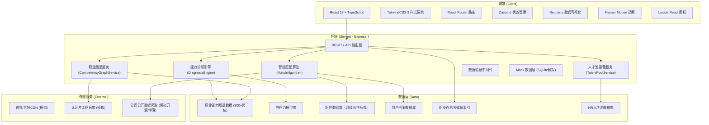
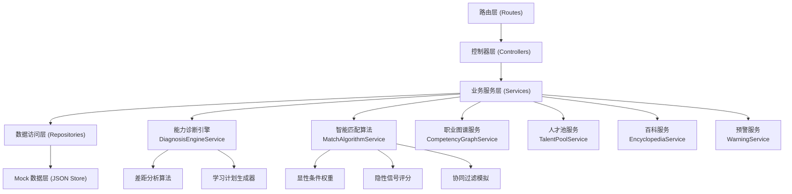
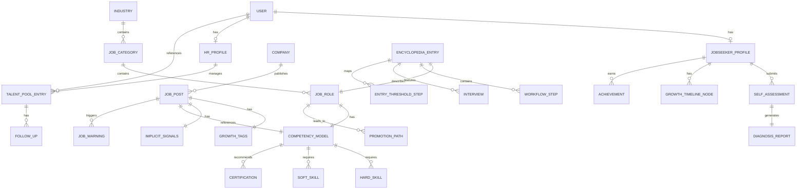

## 1. 架构设计



## 2. 技术描述

- **前端框架**：React@18 + TypeScript@5 + Vite@6
- **初始化工具**：vite-init react-express-ts 模板
- **样式方案**：TailwindCSS@3 + CSS Variables 主题系统
- **后端框架**：Express@4 + TypeScript + ts-node
- **数据库**：Mock 数据（JSON + 内存存储），演示用无需真实数据库
- **路由管理**：react-router-dom@6（前端），Express Router（后端）
- **状态管理**：zustand@4（用户态、诊断报告态、筛选条件态）
- **数据可视化**：recharts@2（雷达图、折线图、条形图、环形图、桑基图）
- **动画库**：framer-motion@11（页面过渡、卡片动效、图表入场）
- **图标库**：lucide-react@0.400
- **UI组件**：自研组件库（基于Tailwind，避免Radix/shadcn过度通用风格）
- **HTTP请求**：axios@1，封装统一错误处理
- **表单处理**：react-hook-form@7 + zod@3 数据校验
- **包管理器**：npm

## 3. 路由定义

### 前端路由

| 路由路径 | 页面名称 | 权限角色 |
|---------|---------|----------|
| `/` | 首页 Landing | 所有访客 |
| `/onboarding` | 职业目标设定 | 求职者 |
| `/diagnosis` | 能力差距诊断报告 | 求职者 |
| `/jobs` | 职位智能匹配列表 | 求职者 |
| `/jobs/:id` | 职位详情 | 求职者 |
| `/encyclopedia` | 职业百科首页 | 所有登录用户 |
| `/encyclopedia/:jobId` | 岗位百科详情 | 所有登录用户 |
| `/profile` | 个人成长档案 | 求职者 |
| `/hr/dashboard` | HR控制台首页 | HR |
| `/hr/talent-pool` | HR人才池 | HR |
| `/hr/talent/:id` | HR人才画像详情 | HR |
| `/hr/warnings` | 岗位需求预警 | HR |
| `/login` | 登录页 | 所有访客 |
| `/register` | 注册页 | 所有访客 |

### 后端 API 路由

| Method | 路由路径 | 功能描述 |
|--------|---------|----------|
| GET | `/api/competency-graph/jobs` | 获取岗位列表（支持分页/搜索/行业过滤） |
| GET | `/api/competency-graph/jobs/:id` | 获取指定岗位胜任力模型详情 |
| GET | `/api/competency-graph/industries` | 获取行业分类树 |
| GET | `/api/competency-graph/promotion-path/:jobId` | 获取岗位晋升路径 |
| POST | `/api/diagnosis/assess` | 提交自评数据，返回诊断报告 |
| GET | `/api/diagnosis/history` | 获取当前用户历史诊断记录 |
| GET | `/api/jobs` | 获取职位列表（支持成长性标签/薪资/地点筛选） |
| GET | `/api/jobs/:id` | 获取职位详情（含成长性信息、隐性信号） |
| GET | `/api/jobs/recommend` | 基于用户画像的智能职位推荐 |
| GET | `/api/encyclopedia/jobs` | 职业百科岗位索引 |
| GET | `/api/encyclopedia/jobs/:id` | 百科详情（工作流/访谈/阶梯图） |
| GET | `/api/encyclopedia/interviews` | 从业者访谈列表 |
| POST | `/api/auth/login` | 用户登录 |
| POST | `/api/auth/register` | 用户注册 |
| GET | `/api/users/profile` | 获取当前用户档案 |
| PUT | `/api/users/profile` | 更新用户档案 |
| GET | `/api/users/growth-timeline` | 获取成长时间轴 |
| GET | `/api/hr/talent-pool` | 获取人才池列表 |
| POST | `/api/hr/talent-pool/:id/tag` | 标记人才潜力等级 |
| GET | `/api/hr/talent-pool/:id` | 获取人才详情画像 |
| POST | `/api/hr/follow-ups` | 创建跟进提醒 |
| GET | `/api/hr/dashboard/stats` | HR看板统计数据 |
| GET | `/api/hr/warnings` | 获取岗位需求预警列表 |

## 4. API 类型定义（TypeScript）

```typescript
// 通用类型
interface PaginationParams {
  page: number;
  pageSize: number;
}

interface PaginatedResponse<T> {
  data: T[];
  total: number;
  page: number;
  pageSize: number;
}

// 岗位与胜任力
interface HardSkill {
  id: string;
  name: string;
  category: string;
  priority: 'must' | 'important' | 'nice';
  targetLevel: 1 | 2 | 3 | 4 | 5;
  description: string;
}

interface SoftSkill {
  id: string;
  name: string;
  dimension: 'communication' | 'leadership' | 'thinking' | 'execution' | 'emotional';
  targetLevel: 1 | 2 | 3 | 4 | 5;
  behavioralIndicators: string[];
}

interface Certification {
  id: string;
  name: string;
  issuer: string;
  difficulty: 'basic' | 'intermediate' | 'advanced';
  estimatedHours: number;
  relevance: number;
}

interface CompetencyModel {
  jobId: string;
  jobName: string;
  jobLevel: 'entry' | 'junior' | 'middle' | 'senior' | 'expert' | 'lead';
  hardSkills: HardSkill[];
  softSkills: SoftSkill[];
  certifications: Certification[];
  yearsOfExperience: { min: number; ideal: number };
  educationRequirement: string;
  industryKnowledge: string[];
}

interface PromotionNode {
  id: string;
  jobName: string;
  level: string;
  estimatedMonths: number;
  keyThresholds: string[];
  avgSalaryRange: [number, number];
}

interface PromotionPath {
  fromJobId: string;
  nodes: PromotionNode[];
  totalEstimatedMonths: number;
}

// 诊断报告
interface SelfAssessment {
  targetJobId: string;
  targetJobLevel: string;
  hardSkillRatings: Record<string, 1|2|3|4|5>;
  softSkillRatings: Record<string, 1|2|3|4|5>;
  yearsOfExperience: number;
  certificationsHeld: string[];
  salaryExpectation: [number, number];
  preferredCities: string[];
}

interface SkillGap {
  skillId: string;
  skillName: string;
  currentLevel: number;
  targetLevel: number;
  gap: number;
  priority: 'critical' | 'high' | 'medium' | 'low';
  suggestedAction: string;
}

interface DiagnosisReport {
  id: string;
  createdAt: string;
  targetJob: { id: string; name: string; level: string };
  overallMatchScore: number;
  radarDimensions: {
    dimension: string;
    current: number;
    target: number;
  }[];
  hardSkillGaps: SkillGap[];
  softSkillGaps: SkillGap[];
  certificationRecommendations: Certification[];
  promotionPath: PromotionPath;
  estimatedReadinessMonths: number;
  learningPlan: {
    phase: string;
    durationWeeks: number;
    tasks: string[];
  }[];
}

// 职位与成长性
interface GrowthTags {
  hasTrainingSystem: boolean;
  hasRotationProgram: boolean;
  techStackEvolution: 'stable' | 'growing' | 'leading';
  mentorshipProgram: boolean;
  promotionPathClear: boolean;
  learningBudget: boolean;
}

interface ImplicitSignals {
  techBlogFrequency: 'none' | 'low' | 'medium' | 'high';
  openSourceContributions: number;
  employeeLevelDistribution: {
    entry: number;
    junior: number;
    middle: number;
    senior: number;
    expert: number;
    lead: number;
  };
  avgTenureMonths: number;
  internalPromotionRate: number;
}

interface JobPost {
  id: string;
  title: string;
  company: {
    id: string;
    name: string;
    size: string;
    industry: string;
    logo: string;
  };
  requiredCompetencyModelId: string;
  salaryRange: [number, number];
  city: string;
  description: string;
  growthTags: GrowthTags;
  implicitSignals: ImplicitSignals;
  matchScore?: number;
  matchBreakdown?: {
    competency: number;
    growth: number;
    preference: number;
    implicit: number;
  };
  publishedAt: string;
}

// 职业百科
interface WorkflowStep {
  title: string;
  description: string;
  duration: string;
  tools: string[];
}

interface Interview {
  id: string;
  jobName: string;
  intervieweeName: string;
  yearsOfExperience: number;
  currentLevel: string;
  audioUrl: string;
  durationSeconds: number;
  transcript: string;
  keyInsights: string[];
  tags: string[];
}

interface EntryThresholdStep {
  step: number;
  title: string;
  description: string;
  estimatedMonths: number;
  typicalObstacles: string[];
}

interface EncyclopediaEntry {
  jobId: string;
  jobName: string;
  category: string;
  overview: string;
  avgSalaryDistribution: { city: string; avg: number }[];
  workflow: WorkflowStep[];
  workflowVideoUrl: string;
  interviews: Interview[];
  entryThresholdLadder: EntryThresholdStep[];
  careerProspects: string;
}

// 用户与成长档案
interface GrowthAchievement {
  id: string;
  title: string;
  description: string;
  icon: string;
  earnedAt: string;
}

interface GrowthTimelineNode {
  date: string;
  type: 'diagnosis' | 'skill-up' | 'certification' | 'interview' | 'job-offer';
  title: string;
  description: string;
  relatedSkill?: string;
}

interface UserProfile {
  id: string;
  role: 'jobseeker' | 'hr' | 'admin';
  name: string;
  email: string;
  avatar: string;
  jobseekerProfile?: {
    currentJob?: string;
    currentLevel?: string;
    yearsOfExperience: number;
    skills: { id: string; name: string; level: number }[];
    certifications: { id: string; name: string; date: string }[];
    targetJobId?: string;
    resumeUrl?: string;
  };
  hrProfile?: {
    companyId: string;
    companyName: string;
    position: string;
    verified: boolean;
  };
  growthTimeline: GrowthTimelineNode[];
  achievements: GrowthAchievement[];
}

// HR 人才池
type PotentialLevel = 'S' | 'A' | 'B' | 'C';

interface TalentPoolEntry {
  id: string;
  userId: string;
  userSummary: {
    name: string;
    avatar: string;
    currentJob: string;
    yearsOfExperience: number;
    keySkills: string[];
    matchScore: number;
  };
  potentialLevel: PotentialLevel;
  tags: string[];
  status: 'new' | 'contacted' | 'screening' | 'interview' | 'offer' | 'archived';
  lastFollowUpAt?: string;
  nextFollowUpAt?: string;
  notes: string;
  addedAt: string;
  matchJobs: { jobId: string; jobTitle: string; score: number }[];
}

interface FollowUpReminder {
  id: string;
  talentId: string;
  scheduledAt: string;
  type: 'call' | 'email' | 'interview' | 'check-in';
  note: string;
  completed: boolean;
}

interface JobWarning {
  id: string;
  jobPostId: string;
  jobTitle: string;
  type: 'competition-intensified' | 'prolonged-hiring' | 'skill-shortage' | 'market-shift';
  severity: 'info' | 'warning' | 'critical';
  message: string;
  suggestion: string;
  dataPoint: Record<string, any>;
  detectedAt: string;
}
```

## 5. 后端服务分层架构



## 6. 数据模型（Mock JSON 结构）

### 6.1 数据实体关系



### 6.2 Mock 数据初始化要点

- **岗位数据**：覆盖 8 大行业（互联网/金融/医疗/制造/教育/零售/咨询/传媒），共 50+ 代表性岗位作为演示样本（非300全量）
- **胜任力模型**：每个岗位含 8-12 项硬技能，5-6 个软技能维度，2-4 个推荐认证
- **职位库**：100+ 模拟职位，覆盖不同城市/薪资/公司规模/成长性标签组合
- **隐性信号**：模拟公司技术博客、开源贡献、职级分布健康度数据
- **职业百科**：10+ 典型岗位完整百科内容，含模拟视频 URL、音频时长、阶梯图数据
- **人才池**：30+ 模拟人才样本，涵盖不同潜力等级与跟进状态
- **岗位预警**：8-10 条不同类型预警信息示例
