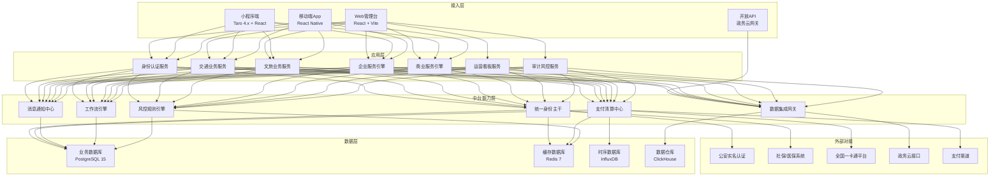
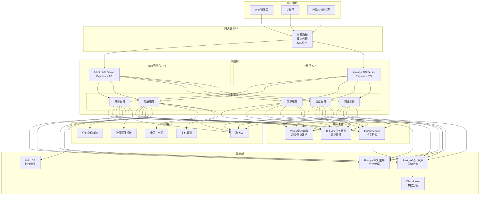
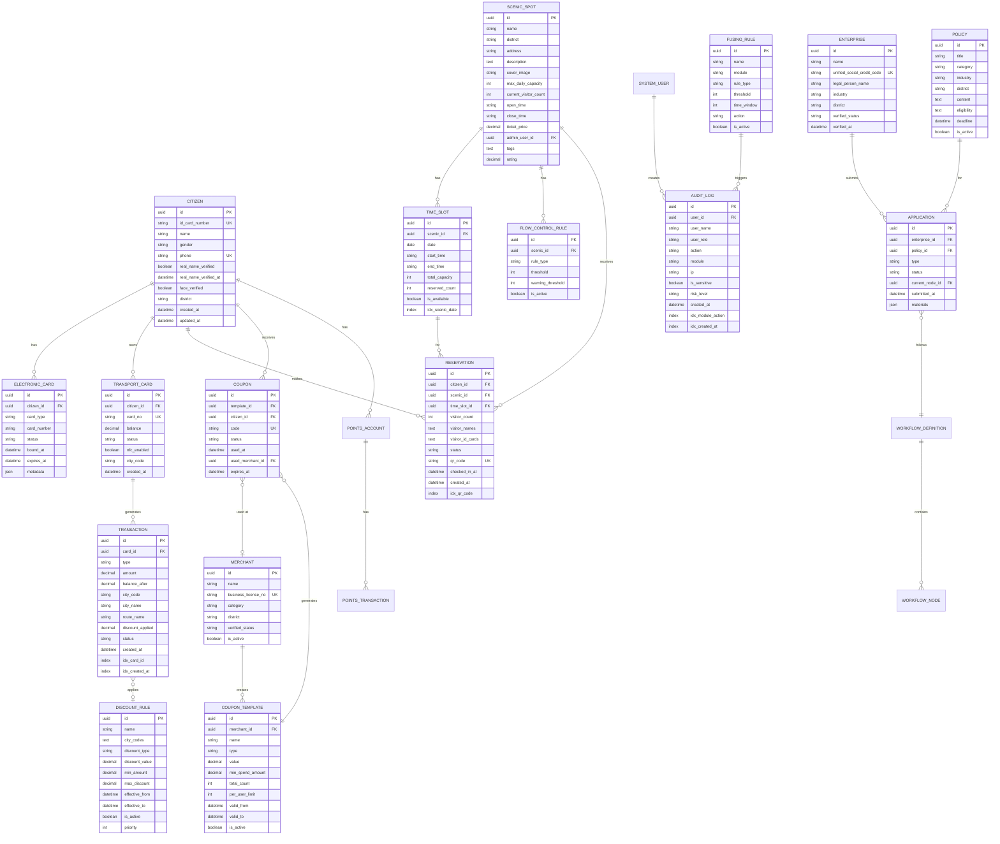

## 1. 架构设计



## 2. 技术描述

### 2.1 前端技术栈

| 层级 | 技术选型 | 版本 | 说明 |
|------|----------|------|------|
| Web管理台 | React | ^18.2.0 | 函数式组件 + Hooks |
| Web管理台 | TypeScript | ^5.3.0 | 类型安全 |
| Web管理台 | Vite | ^5.0.0 | 构建工具 |
| Web管理台 | Tailwind CSS | ^3.4.0 | 样式框架 |
| Web管理台 | Zustand | ^4.4.0 | 状态管理 |
| Web管理台 | React Router | ^6.20.0 | 路由管理 |
| Web管理台 | Recharts | ^2.10.0 | 图表库 |
| Web管理台 | Lucide React | ^0.294.0 | 图标库 |
| 小程序端 | Taro | 4.1.9 | 跨端框架 |
| 小程序端 | React | ^18.0.0 | UI框架 |
| 小程序端 | TypeScript | ^5.1.0 | 类型安全 |
| 小程序端 | SCSS Modules | - | 样式方案 |
| 小程序端 | Zustand | ^4.4.0 | 状态管理 |
| 小程序端 | Day.js | ^1.11.0 | 时间处理 |
| 小程序端 | Classnames | ^2.3.0 | 样式合并 |

### 2.2 后端技术栈

| 层级 | 技术选型 | 版本 | 说明 |
|------|----------|------|------|
| 运行时 | Node.js | ^20.0.0 | LTS版本 |
| Web框架 | Express | ^4.18.0 | 轻量高效 |
| 类型系统 | TypeScript | ^5.3.0 | 类型安全 |
| ORM | Prisma | ^5.7.0 | 类型安全ORM |
| 数据库 | PostgreSQL | ^15.0 | 主业务库 |
| 缓存 | Redis | ^7.0 | 会话、热点数据 |
| 任务队列 | BullMQ | ^5.1.0 | 异步任务处理 |
| API文档 | Swagger | ^6.2.0 | OpenAPI 3.0 |
| 日志 | Winston | ^3.11.0 | 结构化日志 |
| 监控 | Prometheus | ^2.48.0 | 指标采集 |

### 2.3 项目初始化命令

**Web管理台（React + Express 全栈）：**
```bash
# macOS/Linux
npm init vite-init@latest -y . -- --template react-express-ts --force
```

**小程序端（Taro 4.x）：**
```bash
node /Users/chen/.trae-cn/builtin_skills/TRAE-generate-mini-app/scripts/init-template.js
```

## 3. 路由定义

### 3.1 Web管理台路由

| 路由路径 | 页面名称 | 权限要求 | 说明 |
|----------|----------|----------|------|
| /login | 登录页 | 公开 | 管理员登录 |
| / | 首页看板 | 管理员 | 运营总览、数据概览 |
| /citizens | 市民列表 | 管理员 | 市民信息管理、实名认证审核 |
| /citizens/:id | 市民详情 | 管理员 | 市民卡证、交易记录 |
| /enterprises | 企业列表 | 管理员 | 企业信息、资质审核 |
| /enterprises/:id | 企业详情 | 管理员 | 企业申报记录、证照 |
| /transport/cards | 交通卡管理 | 管理员 | 虚拟卡列表、状态管理 |
| /transport/transactions | 交易记录 | 管理员 | 充值、消费记录查询 |
| /transport/discounts | 折扣策略 | 管理员 | 苏锡常折扣配置 |
| /tourism/scenics | 景区管理 | 管理员/景区管理员 | 景区列表、配置 |
| /tourism/reservations | 预约记录 | 管理员/景区管理员 | 预约查询、核验 |
| /tourism/flow-control | 限流配置 | 管理员/景区管理员 | 限流规则设置 |
| /commerce/merchants | 商户管理 | 管理员 | 商户入驻审核 |
| /commerce/coupons | 优惠券管理 | 管理员/商户管理员 | 券模板、发放记录 |
| /commerce/points | 积分管理 | 管理员 | 积分规则、互通配置 |
| /dashboard/overview | 运营看板 | 管理员 | 多维度数据可视化 |
| /dashboard/heatmap | 热力图 | 管理员 | 景区入园热力、交通热力 |
| /system/roles | 角色管理 | 超级管理员 | 角色权限配置 |
| /system/audit | 审计日志 | 超级管理员 | 操作审计记录 |
| /system/fusing | 熔断规则 | 超级管理员 | 风控规则配置 |

### 3.2 小程序端路由

| 路由路径 | 页面名称 | 页面类型 |
|----------|----------|----------|
| pages/home/index | 首页 | TabBar |
| pages/transport/index | 交通卡 | TabBar |
| pages/tourism/index | 文旅 | TabBar |
| pages/service/index | 服务 | TabBar |
| pages/mine/index | 我的 | TabBar |
| pages/auth/realname | 实名认证 | 二级页面 |
| pages/auth/card-bind | 卡证绑定 | 二级页面 |
| pages/tourism/detail | 景区详情 | 二级页面 |
| pages/tourism/reservation-success | 预约成功 | 二级页面 |
| pages/transport/recharge | 充值 | 二级页面 |
| pages/transport/ride-code | 乘车码 | 二级页面 |
| pages/transport/transactions | 交易记录 | 二级页面 |

## 4. API 定义

### 4.1 身份认证模块

```typescript
// 用户信息类型
interface Citizen {
  id: string;
  idCardNumber: string;
  name: string;
  gender: 'male' | 'female';
  phone: string;
  realNameVerified: boolean;
  realNameVerifiedAt: Date;
  faceVerified: boolean;
  avatar?: string;
  district: string;
  address?: string;
  createdAt: Date;
  updatedAt: Date;
}

// 电子卡证类型
interface ElectronicCard {
  id: string;
  citizenId: string;
  cardType: 'social_security' | 'medical_insurance' | 'driver_license' | 'transport';
  cardNumber: string;
  status: 'active' | 'inactive' | 'lost';
  boundAt: Date;
  expiresAt?: Date;
  metadata: Record<string, any>;
}

// API 接口定义
namespace AuthAPI {
  // 实名认证提交
  interface RealNameAuthRequest {
    idCardFrontImage: string;
    idCardBackImage: string;
    faceImage: string;
    phone: string;
    smsCode: string;
  }
  interface RealNameAuthResponse {
    success: boolean;
    verified: boolean;
    transactionId: string;
    failReason?: string;
  }

  // 卡证绑定
  interface CardBindRequest {
    cardType: string;
    cardNumber: string;
    verifyCode?: string;
  }
  interface CardBindResponse {
    success: boolean;
    cardId: string;
    status: string;
  }

  // 获取市民信息
  interface GetCitizenInfoResponse extends Citizen {
    cards: ElectronicCard[];
  }
}
```

### 4.2 交通业务模块

```typescript
namespace TransportAPI {
  interface TransportCard {
    id: string;
    citizenId: string;
    cardNo: string;
    balance: number;
    status: 'active' | 'inactive' | 'lost' | 'closed';
    nfcEnabled: boolean;
    cityCode: string;
    createdAt: Date;
  }

  interface Transaction {
    id: string;
    cardId: string;
    type: 'recharge' | 'consume' | 'refund';
    amount: number;
    balanceAfter: number;
    cityCode?: string;
    cityName?: string;
    routeName?: string;
    discountApplied?: number;
    originalAmount?: number;
    status: 'success' | 'pending' | 'failed';
    createdAt: Date;
  }

  interface DiscountRule {
    id: string;
    name: string;
    cityCodes: string[];
    discountType: 'percentage' | 'fixed';
    discountValue: number;
    minAmount?: number;
    maxDiscount?: number;
    effectiveFrom: Date;
    effectiveTo?: Date;
    isActive: boolean;
    priority: number;
  }

  // 开通虚拟交通卡
  interface OpenCardRequest {
    cityCode: string;
    enableNFC: boolean;
  }
  interface OpenCardResponse {
    success: boolean;
    card: TransportCard;
  }

  // 充值
  interface RechargeRequest {
    cardId: string;
    amount: number;
    payMethod: 'wechat' | 'alipay' | 'bank';
  }
  interface RechargeResponse {
    success: boolean;
    transactionId: string;
    needReview: boolean;
    payUrl?: string;
  }

  // 获取折扣策略列表
  interface GetDiscountsResponse {
    list: DiscountRule[];
    total: number;
  }
}
```

### 4.3 文旅业务模块

```typescript
namespace TourismAPI {
  interface ScenicSpot {
    id: string;
    name: string;
    district: string;
    address: string;
    description: string;
    coverImage: string;
    images: string[];
    maxDailyCapacity: number;
    currentVisitorCount: number;
    openTime: string;
    closeTime: string;
    ticketPrice: number;
    isActive: boolean;
    adminUserId?: string;
    tags: string[];
    rating: number;
  }

  interface TimeSlot {
    id: string;
    scenicId: string;
    date: string;
    startTime: string;
    endTime: string;
    totalCapacity: number;
    reservedCount: number;
    isAvailable: boolean;
  }

  interface Reservation {
    id: string;
    citizenId: string;
    scenicId: string;
    timeSlotId: string;
    visitorCount: number;
    visitorNames: string[];
    visitorIdCards: string[];
    status: 'pending' | 'confirmed' | 'cancelled' | 'checked_in';
    qrCode: string;
    checkedInAt?: Date;
    createdAt: Date;
  }

  interface FlowControlRule {
    id: string;
    scenicId: string;
    ruleType: 'daily_max' | 'hourly_max' | 'real_time_threshold';
    threshold: number;
    warningThreshold: number;
    isActive: boolean;
    createdAt: Date;
  }

  // 景区预约
  interface CreateReservationRequest {
    scenicId: string;
    timeSlotId: string;
    visitorCount: number;
    visitors: Array<{name: string; idCard: string}>;
  }
  interface CreateReservationResponse {
    success: boolean;
    reservation: Reservation;
  }

  // 入园核验
  interface VerifyCheckInRequest {
    qrCode: string;
    scenicId: string;
  }
  interface VerifyCheckInResponse {
    success: boolean;
    status: 'success' | 'already_checked' | 'invalid' | 'expired';
    reservation?: Reservation;
  }
}
```

### 4.4 企业服务模块

```typescript
namespace EnterpriseAPI {
  interface Enterprise {
    id: string;
    name: string;
    unifiedSocialCreditCode: string;
    legalPersonName: string;
    legalPersonIdCard: string;
    industry: string;
    district: string;
    address: string;
    contactName: string;
    contactPhone: string;
    verifiedStatus: 'pending' | 'verified' | 'rejected';
    verifiedAt?: Date;
    rejectReason?: string;
    createdAt: Date;
  }

  interface Policy {
    id: string;
    title: string;
    category: string;
    industry?: string;
    district?: string;
    content: string;
    eligibility: string;
    deadline?: Date;
    isActive: boolean;
    createdAt: Date;
  }

  interface Application {
    id: string;
    enterpriseId: string;
    policyId: string;
    type: 'policy' | 'subsidy' | 'license';
    status: 'draft' | 'submitted' | 'reviewing' | 'approved' | 'rejected';
    currentNodeId?: string;
    submittedAt?: Date;
    reviewedAt?: Date;
    reviewComments?: string;
    materials: Array<{name: string; url: string}>;
    createdAt: Date;
  }

  interface WorkflowNode {
    id: string;
    name: string;
    type: 'start' | 'approve' | 'condition' | 'end';
    assigneeRole?: string;
    nextNodeIds?: string[];
    conditionExpression?: string;
  }
}
```

### 4.5 商业服务模块

```typescript
namespace CommerceAPI {
  interface Merchant {
    id: string;
    name: string;
    businessLicenseNo: string;
    category: string;
    district: string;
    address: string;
    contactName: string;
    contactPhone: string;
    verifiedStatus: 'pending' | 'verified' | 'rejected';
    verifiedAt?: Date;
    rejectReason?: string;
    isActive: boolean;
    createdAt: Date;
  }

  interface CouponTemplate {
    id: string;
    merchantId?: string;
    name: string;
    type: 'discount' | 'fixed_amount' | 'free';
    value: number;
    minSpendAmount?: number;
    totalCount: number;
    distributedCount: number;
    usedCount: number;
    perUserLimit: number;
    validFrom: Date;
    validTo: Date;
    applicableMerchantIds: string[];
    isActive: boolean;
    createdAt: Date;
  }

  interface Coupon {
    id: string;
    templateId: string;
    citizenId: string;
    code: string;
    status: 'active' | 'used' | 'expired';
    usedAt?: Date;
    usedMerchantId?: string;
    expiresAt: Date;
    receivedAt: Date;
  }

  interface PointsAccount {
    id: string;
    citizenId: string;
    balance: number;
    totalEarned: number;
    totalSpent: number;
    updatedAt: Date;
  }

  interface PointsTransaction {
    id: string;
    accountId: string;
    type: 'earn' | 'spend';
    amount: number;
    reason: string;
    merchantId?: string;
    orderNo?: string;
    createdAt: Date;
  }
}
```

### 4.6 运营审计模块

```typescript
namespace PlatformAPI {
  interface AuditLog {
    id: string;
    userId: string;
    userName: string;
    userRole: string;
    action: string;
    module: string;
    targetId?: string;
    targetType?: string;
    ip: string;
    userAgent: string;
    requestData?: Record<string, any>;
    responseData?: Record<string, any>;
    isSensitive: boolean;
    riskLevel: 'low' | 'medium' | 'high';
    createdAt: Date;
  }

  interface FusingRule {
    id: string;
    name: string;
    module: string;
    ruleType: 'frequency' | 'amount' | 'duplicate' | 'abnormal_pattern';
    threshold: number;
    timeWindow: number;
    action: 'block' | 'review' | 'alert';
    isActive: boolean;
    createdAt: Date;
  }

  interface DashboardData {
    overview: {
      totalCitizens: number;
      todayNewCitizens: number;
      totalTransactions: number;
      todayTransactions: number;
      totalRevenue: number;
      todayRevenue: number;
      activeUsers7d: number;
    };
    districtStats: Array<{
      district: string;
      citizenCount: number;
      transactionCount: number;
      revenue: number;
    }>;
    scenicHeatmap: Array<{
      scenicId: string;
      scenicName: string;
      district: string;
      todayVisitorCount: number;
      currentVisitorCount: number;
      heatLevel: number;
    }>;
    transportTopCities: Array<{
      cityCode: string;
      cityName: string;
      transactionCount: number;
      totalAmount: number;
    }>;
  }
}
```

## 5. 服务器架构图



## 6. 数据模型

### 6.1 ER 图



### 6.2 DDL 语句

```sql
-- 扩展
CREATE EXTENSION IF NOT EXISTS "uuid-ossp";
CREATE EXTENSION IF NOT EXISTS "pg_trgm";

-- 市民表
CREATE TABLE citizens (
    id UUID PRIMARY KEY DEFAULT uuid_generate_v4(),
    id_card_number VARCHAR(18) UNIQUE NOT NULL,
    name VARCHAR(50) NOT NULL,
    gender VARCHAR(10) NOT NULL,
    phone VARCHAR(20) UNIQUE NOT NULL,
    real_name_verified BOOLEAN DEFAULT FALSE,
    real_name_verified_at TIMESTAMP,
    face_verified BOOLEAN DEFAULT FALSE,
    avatar VARCHAR(255),
    district VARCHAR(50),
    address TEXT,
    created_at TIMESTAMP DEFAULT CURRENT_TIMESTAMP,
    updated_at TIMESTAMP DEFAULT CURRENT_TIMESTAMP
);

CREATE INDEX idx_citizens_district ON citizens(district);
CREATE INDEX idx_citizens_verified ON citizens(real_name_verified);

-- 电子卡证表
CREATE TABLE electronic_cards (
    id UUID PRIMARY KEY DEFAULT uuid_generate_v4(),
    citizen_id UUID NOT NULL REFERENCES citizens(id),
    card_type VARCHAR(30) NOT NULL,
    card_number VARCHAR(100) NOT NULL,
    status VARCHAR(20) DEFAULT 'active',
    bound_at TIMESTAMP DEFAULT CURRENT_TIMESTAMP,
    expires_at TIMESTAMP,
    metadata JSONB,
    created_at TIMESTAMP DEFAULT CURRENT_TIMESTAMP
);

CREATE INDEX idx_ec_citizen_type ON electronic_cards(citizen_id, card_type);

-- 交通卡表
CREATE TABLE transport_cards (
    id UUID PRIMARY KEY DEFAULT uuid_generate_v4(),
    citizen_id UUID NOT NULL REFERENCES citizens(id),
    card_no VARCHAR(50) UNIQUE NOT NULL,
    balance DECIMAL(10,2) DEFAULT 0,
    status VARCHAR(20) DEFAULT 'active',
    nfc_enabled BOOLEAN DEFAULT FALSE,
    city_code VARCHAR(10) NOT NULL,
    created_at TIMESTAMP DEFAULT CURRENT_TIMESTAMP,
    updated_at TIMESTAMP DEFAULT CURRENT_TIMESTAMP
);

CREATE INDEX idx_tc_citizen ON transport_cards(citizen_id);
CREATE INDEX idx_tc_status ON transport_cards(status);

-- 交易记录表
CREATE TABLE transactions (
    id UUID PRIMARY KEY DEFAULT uuid_generate_v4(),
    card_id UUID NOT NULL REFERENCES transport_cards(id),
    type VARCHAR(20) NOT NULL,
    amount DECIMAL(10,2) NOT NULL,
    balance_after DECIMAL(10,2) NOT NULL,
    city_code VARCHAR(10),
    city_name VARCHAR(50),
    route_name VARCHAR(100),
    discount_applied DECIMAL(10,2),
    original_amount DECIMAL(10,2),
    status VARCHAR(20) DEFAULT 'success',
    risk_flagged BOOLEAN DEFAULT FALSE,
    risk_reason VARCHAR(255),
    created_at TIMESTAMP DEFAULT CURRENT_TIMESTAMP
);

CREATE INDEX idx_tx_card ON transactions(card_id);
CREATE INDEX idx_tx_created ON transactions(created_at);
CREATE INDEX idx_tx_type_status ON transactions(type, status);
CREATE INDEX idx_tx_city ON transactions(city_code);

-- 折扣策略表
CREATE TABLE discount_rules (
    id UUID PRIMARY KEY DEFAULT uuid_generate_v4(),
    name VARCHAR(100) NOT NULL,
    city_codes TEXT NOT NULL,
    discount_type VARCHAR(20) NOT NULL,
    discount_value DECIMAL(5,2) NOT NULL,
    min_amount DECIMAL(10,2),
    max_discount DECIMAL(10,2),
    effective_from TIMESTAMP NOT NULL,
    effective_to TIMESTAMP,
    is_active BOOLEAN DEFAULT TRUE,
    priority INT DEFAULT 0,
    created_at TIMESTAMP DEFAULT CURRENT_TIMESTAMP
);

-- 景区表
CREATE TABLE scenic_spots (
    id UUID PRIMARY KEY DEFAULT uuid_generate_v4(),
    name VARCHAR(100) NOT NULL,
    district VARCHAR(50) NOT NULL,
    address VARCHAR(255),
    description TEXT,
    cover_image VARCHAR(255),
    images TEXT,
    max_daily_capacity INT NOT NULL,
    current_visitor_count INT DEFAULT 0,
    open_time VARCHAR(10),
    close_time VARCHAR(10),
    ticket_price DECIMAL(10,2) DEFAULT 0,
    is_active BOOLEAN DEFAULT TRUE,
    admin_user_id UUID,
    tags TEXT,
    rating DECIMAL(2,1) DEFAULT 5.0,
    created_at TIMESTAMP DEFAULT CURRENT_TIMESTAMP
);

CREATE INDEX idx_scenic_district ON scenic_spots(district);
CREATE INDEX idx_scenic_active ON scenic_spots(is_active);

-- 时段表
CREATE TABLE time_slots (
    id UUID PRIMARY KEY DEFAULT uuid_generate_v4(),
    scenic_id UUID NOT NULL REFERENCES scenic_spots(id),
    date DATE NOT NULL,
    start_time VARCHAR(10) NOT NULL,
    end_time VARCHAR(10) NOT NULL,
    total_capacity INT NOT NULL,
    reserved_count INT DEFAULT 0,
    is_available BOOLEAN DEFAULT TRUE,
    created_at TIMESTAMP DEFAULT CURRENT_TIMESTAMP
);

CREATE UNIQUE INDEX idx_slot_unique ON time_slots(scenic_id, date, start_time);
CREATE INDEX idx_slot_date ON time_slots(date);

-- 预约表
CREATE TABLE reservations (
    id UUID PRIMARY KEY DEFAULT uuid_generate_v4(),
    citizen_id UUID NOT NULL REFERENCES citizens(id),
    scenic_id UUID NOT NULL REFERENCES scenic_spots(id),
    time_slot_id UUID NOT NULL REFERENCES time_slots(id),
    visitor_count INT NOT NULL,
    visitor_names TEXT NOT NULL,
    visitor_id_cards TEXT NOT NULL,
    status VARCHAR(20) DEFAULT 'pending',
    qr_code VARCHAR(100) UNIQUE NOT NULL,
    checked_in_at TIMESTAMP,
    created_at TIMESTAMP DEFAULT CURRENT_TIMESTAMP
);

CREATE INDEX idx_res_citizen ON reservations(citizen_id);
CREATE INDEX idx_res_scenic ON reservations(scenic_id);
CREATE INDEX idx_res_qr ON reservations(qr_code);
CREATE INDEX idx_res_status ON reservations(status);

-- 限流规则表
CREATE TABLE flow_control_rules (
    id UUID PRIMARY KEY DEFAULT uuid_generate_v4(),
    scenic_id UUID NOT NULL REFERENCES scenic_spots(id),
    rule_type VARCHAR(30) NOT NULL,
    threshold INT NOT NULL,
    warning_threshold INT NOT NULL,
    is_active BOOLEAN DEFAULT TRUE,
    created_at TIMESTAMP DEFAULT CURRENT_TIMESTAMP
);

-- 企业表
CREATE TABLE enterprises (
    id UUID PRIMARY KEY DEFAULT uuid_generate_v4(),
    name VARCHAR(200) NOT NULL,
    unified_social_credit_code VARCHAR(18) UNIQUE NOT NULL,
    legal_person_name VARCHAR(50) NOT NULL,
    legal_person_id_card VARCHAR(18),
    industry VARCHAR(50),
    district VARCHAR(50),
    address TEXT,
    contact_name VARCHAR(50),
    contact_phone VARCHAR(20),
    verified_status VARCHAR(20) DEFAULT 'pending',
    verified_at TIMESTAMP,
    reject_reason TEXT,
    created_at TIMESTAMP DEFAULT CURRENT_TIMESTAMP
);

CREATE INDEX idx_enterprise_district ON enterprises(district);
CREATE INDEX idx_enterprise_verified ON enterprises(verified_status);

-- 政策表
CREATE TABLE policies (
    id UUID PRIMARY KEY DEFAULT uuid_generate_v4(),
    title VARCHAR(200) NOT NULL,
    category VARCHAR(50) NOT NULL,
    industry VARCHAR(50),
    district VARCHAR(50),
    content TEXT NOT NULL,
    eligibility TEXT NOT NULL,
    deadline TIMESTAMP,
    is_active BOOLEAN DEFAULT TRUE,
    created_at TIMESTAMP DEFAULT CURRENT_TIMESTAMP
);

-- 申请表
CREATE TABLE applications (
    id UUID PRIMARY KEY DEFAULT uuid_generate_v4(),
    enterprise_id UUID NOT NULL REFERENCES enterprises(id),
    policy_id UUID REFERENCES policies(id),
    type VARCHAR(20) NOT NULL,
    status VARCHAR(20) DEFAULT 'draft',
    current_node_id UUID,
    submitted_at TIMESTAMP,
    reviewed_at TIMESTAMP,
    review_comments TEXT,
    materials JSONB,
    created_at TIMESTAMP DEFAULT CURRENT_TIMESTAMP
);

CREATE INDEX idx_app_enterprise ON applications(enterprise_id);
CREATE INDEX idx_app_status ON applications(status);

-- 商户表
CREATE TABLE merchants (
    id UUID PRIMARY KEY DEFAULT uuid_generate_v4(),
    name VARCHAR(200) NOT NULL,
    business_license_no VARCHAR(18) UNIQUE NOT NULL,
    category VARCHAR(50),
    district VARCHAR(50),
    address TEXT,
    contact_name VARCHAR(50),
    contact_phone VARCHAR(20),
    verified_status VARCHAR(20) DEFAULT 'pending',
    verified_at TIMESTAMP,
    reject_reason TEXT,
    is_active BOOLEAN DEFAULT TRUE,
    created_at TIMESTAMP DEFAULT CURRENT_TIMESTAMP
);

-- 优惠券模板表
CREATE TABLE coupon_templates (
    id UUID PRIMARY KEY DEFAULT uuid_generate_v4(),
    merchant_id UUID REFERENCES merchants(id),
    name VARCHAR(100) NOT NULL,
    type VARCHAR(20) NOT NULL,
    value DECIMAL(10,2) NOT NULL,
    min_spend_amount DECIMAL(10,2),
    total_count INT NOT NULL,
    distributed_count INT DEFAULT 0,
    used_count INT DEFAULT 0,
    per_user_limit INT DEFAULT 1,
    valid_from TIMESTAMP NOT NULL,
    valid_to TIMESTAMP NOT NULL,
    applicable_merchant_ids TEXT,
    is_active BOOLEAN DEFAULT TRUE,
    created_at TIMESTAMP DEFAULT CURRENT_TIMESTAMP
);

-- 优惠券表
CREATE TABLE coupons (
    id UUID PRIMARY KEY DEFAULT uuid_generate_v4(),
    template_id UUID NOT NULL REFERENCES coupon_templates(id),
    citizen_id UUID NOT NULL REFERENCES citizens(id),
    code VARCHAR(50) UNIQUE NOT NULL,
    status VARCHAR(20) DEFAULT 'active',
    used_at TIMESTAMP,
    used_merchant_id UUID REFERENCES merchants(id),
    expires_at TIMESTAMP NOT NULL,
    received_at TIMESTAMP DEFAULT CURRENT_TIMESTAMP
);

CREATE INDEX idx_coupon_citizen ON coupons(citizen_id);
CREATE INDEX idx_coupon_status ON coupons(status);

-- 积分账户表
CREATE TABLE points_accounts (
    id UUID PRIMARY KEY DEFAULT uuid_generate_v4(),
    citizen_id UUID UNIQUE NOT NULL REFERENCES citizens(id),
    balance INT DEFAULT 0,
    total_earned INT DEFAULT 0,
    total_spent INT DEFAULT 0,
    created_at TIMESTAMP DEFAULT CURRENT_TIMESTAMP,
    updated_at TIMESTAMP DEFAULT CURRENT_TIMESTAMP
);

-- 积分交易表
CREATE TABLE points_transactions (
    id UUID PRIMARY KEY DEFAULT uuid_generate_v4(),
    account_id UUID NOT NULL REFERENCES points_accounts(id),
    type VARCHAR(20) NOT NULL,
    amount INT NOT NULL,
    reason VARCHAR(255) NOT NULL,
    merchant_id UUID REFERENCES merchants(id),
    order_no VARCHAR(100),
    created_at TIMESTAMP DEFAULT CURRENT_TIMESTAMP
);

-- 系统用户表
CREATE TABLE system_users (
    id UUID PRIMARY KEY DEFAULT uuid_generate_v4(),
    username VARCHAR(50) UNIQUE NOT NULL,
    password_hash VARCHAR(255) NOT NULL,
    name VARCHAR(50) NOT NULL,
    role VARCHAR(20) NOT NULL,
    district VARCHAR(50),
    scenic_id UUID REFERENCES scenic_spots(id),
    merchant_id UUID REFERENCES merchants(id),
    is_active BOOLEAN DEFAULT TRUE,
    last_login_at TIMESTAMP,
    created_at TIMESTAMP DEFAULT CURRENT_TIMESTAMP
);

-- 审计日志表
CREATE TABLE audit_logs (
    id UUID PRIMARY KEY DEFAULT uuid_generate_v4(),
    user_id UUID NOT NULL REFERENCES system_users(id),
    user_name VARCHAR(50) NOT NULL,
    user_role VARCHAR(20) NOT NULL,
    action VARCHAR(100) NOT NULL,
    module VARCHAR(50) NOT NULL,
    target_id UUID,
    target_type VARCHAR(50),
    ip VARCHAR(45) NOT NULL,
    user_agent TEXT,
    request_data JSONB,
    response_data JSONB,
    is_sensitive BOOLEAN DEFAULT FALSE,
    risk_level VARCHAR(20) DEFAULT 'low',
    created_at TIMESTAMP DEFAULT CURRENT_TIMESTAMP
);

CREATE INDEX idx_audit_module ON audit_logs(module, action);
CREATE INDEX idx_audit_created ON audit_logs(created_at);
CREATE INDEX idx_audit_risk ON audit_logs(risk_level, created_at);

-- 熔断规则表
CREATE TABLE fusing_rules (
    id UUID PRIMARY KEY DEFAULT uuid_generate_v4(),
    name VARCHAR(100) NOT NULL,
    module VARCHAR(50) NOT NULL,
    rule_type VARCHAR(30) NOT NULL,
    threshold INT NOT NULL,
    time_window INT NOT NULL,
    action VARCHAR(20) NOT NULL,
    is_active BOOLEAN DEFAULT TRUE,
    description TEXT,
    created_at TIMESTAMP DEFAULT CURRENT_TIMESTAMP
);

-- 初始化默认数据
INSERT INTO system_users (username, password_hash, name, role)
VALUES ('admin', '$2b$12$LQv3c1yqBWVHxkd0LHAkCOYz6TtxMQJqhN8/LewYGyJkH', '超级管理员', 'super_admin');

INSERT INTO fusing_rules (name, module, rule_type, threshold, time_window, action, description)
VALUES
    ('异常充值检测', 'transport', 'amount', 100000, 3600, 'review', '单卡单小时充值超过10万需人工审核'),
    ('高频充值检测', 'transport', 'frequency', 10, 3600, 'block', '单卡单小时充值超过10次拦截'),
    ('重复核销检测', 'tourism', 'duplicate', 1, 60, 'block', '同一预约码1分钟内重复核销拦截'),
    ('高频预约检测', 'tourism', 'frequency', 5, 3600, 'review', '同一账号1小时预约超过5次需审核');
```
