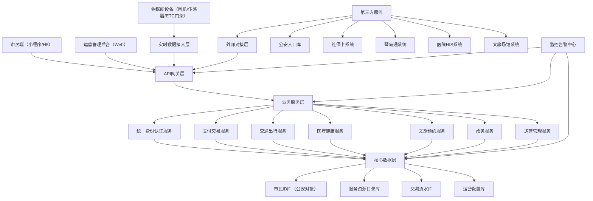
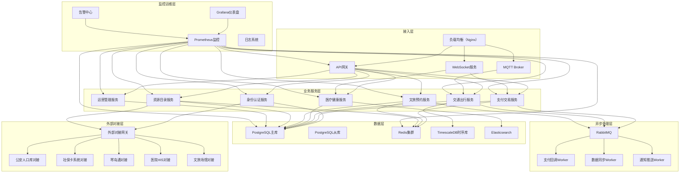

## 1. 架构设计



## 2. 技术描述

### 2.1 整体技术栈
- **前端（小程序端）**：Taro 4.x + React 18 + TypeScript + SCSS Modules
- **前端（运营后台）**：React 18 + TypeScript + Vite + TailwindCSS 3 + Zustand
- **后端服务**：Node.js + Express 4 + TypeScript
- **数据库**：PostgreSQL（主库）+ Redis（缓存/会话）+ TimescaleDB（时序数据）
- **实时通信**：WebSocket + MQTT（物联网设备）
- **消息队列**：RabbitMQ（异步处理）
- **API网关**：Express Gateway

### 2.2 初始化工具
- 小程序端：Taro 4.x 内置模板
- 运营后台：Vite + react-express-ts 模板
- 后端服务：Express 4 + TypeScript

### 2.3 技术选型说明
- **Taro**：一套代码多端运行，支持微信/支付宝/抖音小程序+H5
- **React 18**：函数式组件+Hooks，优秀的生态支持
- **Zustand**：轻量级状态管理，替代Redux减少样板代码
- **TailwindCSS 3**：原子化CSS，快速构建运营后台界面
- **PostgreSQL**：支持JSONB、GIS扩展，适合城市服务复杂数据
- **Redis**：高频访问缓存、支付码会话管理、分布式锁
- **TimescaleDB**：物联网时序数据（人流密度、ETC数据）优化存储

## 3. 路由定义

### 3.1 市民端小程序路由

| 路由 | 页面 | 用途 |
|------|------|------|
| /pages/home/index | 首页 | 支付码、快捷服务、实时信息 |
| /pages/traffic/index | 通行页 | 扫码乘车、ETC记录、隧道计费 |
| /pages/medical/index | 医疗页 | 挂号、候诊预测、药品查询 |
| /pages/culture/index | 文旅页 | 场馆预约、分时段放号 |
| /pages/profile/index | 个人中心 | 账户、认证、服务记录 |
| /pages/hospital/detail | 医院详情 | 医院信息、科室列表 |
| /pages/venue/detail | 场馆详情 | 场馆信息、预约时段 |
| /pages/order/list | 订单列表 | 通行/挂号/预约记录 |
| /pages/auth/verify | 实名认证 | 三要素验证流程 |
| /pages/payment/qrcode | 付款码 | 全屏支付码展示 |

### 3.2 运营后台Web路由

| 路由 | 页面 | 用途 |
|------|------|------|
| /dashboard | 仪表盘 | 数据概览、SLA监控 |
| /services/list | 服务管理 | 12类城市服务配置 |
| /subsidy/config | 补贴配置 | 区市分级文旅补贴配置 |
| /monitor/sla | SLA监控 | 接口响应P95监控图表 |
| /users/list | 用户管理 | 市民用户列表、权限管理 |
| /audit/logs | 审计日志 | 操作日志、异常记录 |
| /district/config | 分区配置 | 区市运营参数配置 |

### 3.3 后端API路由

| 路由前缀 | 服务模块 | 用途 |
|----------|----------|------|
| /api/v1/auth | 身份认证 | 登录、三要素验证、Token管理 |
| /api/v1/payment | 支付服务 | 扫码支付、交易记录、账户管理 |
| /api/v1/traffic | 交通服务 | 公交/地铁/ETC/隧道数据 |
| /api/v1/medical | 医疗服务 | 挂号、候诊预测、药品库存 |
| /api/v1/culture | 文旅服务 | 场馆预约、分时段放号、熔断 |
| /api/v1/resource | 资源目录 | 琴岛通、号源、场馆余量查询 |
| /api/v1/ops | 运营服务 | 分级运营、补贴配置、SLA数据 |

## 4. API 定义

### 4.1 核心类型定义

```typescript
// 统一市民ID
interface CitizenID {
  id: string;
  idCardNo: string;
  socialSecurityNo: string;
  phone: string;
  name: string;
  verifiedAt: Date;
  status: 'active' | 'suspended';
}

// 服务资源目录
interface ResourceCatalog {
  id: string;
  type: 'qindao_card' | 'hospital_appointment' | 'stadium' | 'beach_sensor';
  name: string;
  location: string;
  capacity: number;
  currentUsage: number;
  lastUpdated: Date;
  district: string;
}

// 通行记录
interface TrafficRecord {
  id: string;
  citizenId: string;
  type: 'bus' | 'subway' | 'etc' | 'tunnel';
  location: string;
  timestamp: Date;
  amount: number;
  status: 'success' | 'failed' | 'refunded';
}

// 挂号记录
interface MedicalAppointment {
  id: string;
  citizenId: string;
  hospitalId: string;
  department: string;
  doctorName: string;
  appointmentTime: Date;
  queueNumber: number;
  predictedWaitTime: number;
  status: 'scheduled' | 'waiting' | 'completed' | 'cancelled';
}

// 文旅预约
interface VenueBooking {
  id: string;
  citizenId: string;
  venueId: string;
  venueName: string;
  timeSlot: string;
  bookingDate: string;
  visitorCount: number;
  status: 'booked' | 'checked_in' | 'cancelled';
}

// API响应结构
interface ApiResponse<T> {
  code: number;
  message: string;
  data: T;
  timestamp: number;
  requestId: string;
}

// SLA监控数据
interface SLAMetric {
  apiPath: string;
  method: string;
  p50: number;
  p95: number;
  p99: number;
  errorRate: number;
  timestamp: Date;
  district: string;
}
```

### 4.2 核心API接口

#### 4.2.1 身份认证模块
```typescript
// 三要素验证
POST /api/v1/auth/verify-three-factors
Request: {
  idCardNo: string;
  socialSecurityNo: string;
  phone: string;
  verifyCode: string;
}
Response: ApiResponse<{
  citizenId: string;
  token: string;
  verified: boolean;
}>

// 获取市民信息
GET /api/v1/auth/citizen-profile
Response: ApiResponse<CitizenID>
```

#### 4.2.2 支付模块
```typescript
// 生成支付码
GET /api/v1/payment/qrcode
Response: ApiResponse<{
  qrCode: string;
  expiresAt: number;
  amount?: number;
}>

// 扫码支付回调
POST /api/v1/payment/scan-callback
Request: {
  qrCode: string;
  merchantId: string;
  amount: number;
  deviceType: 'bus' | 'subway' | 'toll';
}
Response: ApiResponse<{
  success: boolean;
  transactionId: string;
}>
```

#### 4.2.3 交通模块
```typescript
// ETC数据上报
POST /api/v1/traffic/etc-report
Request: {
  gateId: string;
  plateNumber: string;
  citizenId?: string;
  timestamp: Date;
  location: string;
}
Response: ApiResponse<{ received: boolean }>

// 获取通行记录
GET /api/v1/traffic/records
Query: { type?: string; page?: number; pageSize?: number }
Response: ApiResponse<{
  list: TrafficRecord[];
  total: number;
}>
```

#### 4.2.4 医疗模块
```typescript
// 候诊预测
GET /api/v1/medical/wait-prediction
Query: { hospitalId: string; department: string }
Response: ApiResponse<{
  currentQueue: number;
  predictedWaitMinutes: number;
  confidence: number;
  modelVersion: string;
}>

// 药品库存查询
GET /api/v1/medical/drug-stock
Query: { drugBarcode: string; latitude: number; longitude: number }
Response: ApiResponse<{
  drugName: string;
  nearbyStores: Array<{
    storeName: string;
    distance: number;
    stock: number;
    price: number;
  }>;
}>
```

#### 4.2.5 文旅模块
```typescript
// 分时段放号查询
GET /api/v1/culture/venue-slots
Query: { venueId: string; date: string }
Response: ApiResponse<{
  venueName: string;
  timeSlots: Array<{
    slot: string;
    totalQuota: number;
    remainingQuota: number;
    price: number;
  }>;
}>

// 预约（含超售熔断）
POST /api/v1/culture/book-venue
Request: {
  venueId: string;
  timeSlot: string;
  bookingDate: string;
  visitorCount: number;
}
Response: ApiResponse<{
  bookingId: string;
  status: 'booked' | 'limit_exceeded' | 'sold_out';
  weeklyCount: number;
  weeklyLimit: number;
}>
```

#### 4.2.6 运营模块
```typescript
// 区市补贴配置
PUT /api/v1/ops/district-subsidy
Request: {
  district: string;
  venueTypes: string[];
  discountRate: number;
  maxSubsidyPerOrder: number;
  effectiveFrom: Date;
  effectiveTo: Date;
}
Response: ApiResponse<{ success: boolean }>

// SLA数据查询
GET /api/v1/ops/sla-metrics
Query: { apiPath?: string; startDate: string; endDate: string; district?: string }
Response: ApiResponse<{
  metrics: SLAMetric[];
  summary: {
    avgP95: number;
    breachCount: number;
    breachRate: number;
  };
}>
```

## 5. 服务器架构图



## 6. 数据模型

### 6.1 数据模型ER图

```mermaid
erDiagram
    CITIZEN ||--|| CITIZEN_ACCOUNT : has
    CITIZEN ||--o{ TRAFFIC_RECORD : has
    CITIZEN ||--o{ MEDICAL_APPOINTMENT : has
    CITIZEN ||--o{ VENUE_BOOKING : has
    CITIZEN ||--o{ TRANSACTION : has
    CITIZEN ||--o{ WEEKLY_BOOKING_SUMMARY : has
    
    RESOURCE_CATALOG ||--o{ HOSPITAL_SLOT : contains
    RESOURCE_CATALOG ||--o{ VENUE_SLOT : contains
    RESOURCE_CATALOG ||--o{ STADIUM_CAPACITY : contains
    RESOURCE_CATALOG ||--o{ BEACH_SENSOR_DATA : reports
    
    HOSPITAL ||--o{ HOSPITAL_SLOT : has
    VENUE ||--o{ VENUE_SLOT : has
    
    DISTRICT ||--o{ SUBSIDY_CONFIG : has
    DISTRICT ||--o{ SLA_METRIC : has
    
    API_METRIC ||--o{ SLA_METRIC : aggregates
    
    CITIZEN {
        uuid id PK
        string id_card_no UK
        string social_security_no UK
        string phone UK
        string name
        datetime verified_at
        string status
        string district
    }
    
    CITIZEN_ACCOUNT {
        uuid id PK
        uuid citizen_id FK
        decimal balance
        decimal frozen_amount
        string qindao_card_no
        datetime created_at
        datetime updated_at
    }
    
    TRAFFIC_RECORD {
        uuid id PK
        uuid citizen_id FK
        string type
        string location
        datetime timestamp
        decimal amount
        string status
        string device_id
        string plate_number
    }
    
    MEDICAL_APPOINTMENT {
        uuid id PK
        uuid citizen_id FK
        uuid hospital_id FK
        string department
        string doctor_name
        datetime appointment_time
        int queue_number
        int predicted_wait_minutes
        float prediction_confidence
        string status
    }
    
    VENUE_BOOKING {
        uuid id PK
        uuid citizen_id FK
        uuid venue_id FK
        uuid slot_id FK
        date booking_date
        string time_slot
        int visitor_count
        decimal amount
        decimal subsidy_amount
        string status
    }
    
    TRANSACTION {
        uuid id PK
        uuid citizen_id FK
        string type
        decimal amount
        string order_id
        string status
        datetime created_at
    }
    
    WEEKLY_BOOKING_SUMMARY {
        uuid id PK
        uuid citizen_id FK
        int week_year
        int week_number
        int booking_count
        date week_start
        date week_end
    }
    
    RESOURCE_CATALOG {
        uuid id PK
        string type
        string name
        string location
        decimal latitude
        decimal longitude
        string district
        int total_capacity
        int current_usage
        datetime last_updated
    }
    
    HOSPITAL_SLOT {
        uuid id PK
        uuid resource_id FK
        date date
        string time_slot
        int total_quota
        int remaining_quota
        decimal price
    }
    
    VENUE_SLOT {
        uuid id PK
        uuid resource_id FK
        date date
        string time_slot
        int total_quota
        int remaining_quota
        decimal original_price
    }
    
    STADIUM_CAPACITY {
        uuid id PK
        uuid resource_id FK
        datetime timestamp
        int current_visitors
        int max_capacity
    }
    
    BEACH_SENSOR_DATA {
        uuid id PK
        uuid resource_id FK
        datetime timestamp
        int people_density
        float water_temperature
        string weather_condition
    }
    
    DISTRICT {
        varchar code PK
        string name
        decimal latitude
        decimal longitude
    }
    
    SUBSIDY_CONFIG {
        uuid id PK
        varchar district_code FK
        string[] venue_types
        float discount_rate
        decimal max_subsidy_per_order
        date effective_from
        date effective_to
        boolean is_active
    }
    
    SLA_METRIC {
        uuid id PK
        varchar district_code FK
        string api_path
        string method
        int p50_ms
        int p95_ms
        int p99_ms
        float error_rate
        datetime timestamp
    }
```



### 6.2 DDL 语句

```sql
-- 市民表
CREATE TABLE citizen (
    id UUID PRIMARY KEY DEFAULT gen_random_uuid(),
    id_card_no VARCHAR(18) UNIQUE NOT NULL,
    social_security_no VARCHAR(20) UNIQUE NOT NULL,
    phone VARCHAR(11) UNIQUE NOT NULL,
    name VARCHAR(50) NOT NULL,
    verified_at TIMESTAMP,
    status VARCHAR(20) DEFAULT 'active',
    district VARCHAR(10),
    created_at TIMESTAMP DEFAULT CURRENT_TIMESTAMP,
    updated_at TIMESTAMP DEFAULT CURRENT_TIMESTAMP,
    INDEX idx_district (district),
    INDEX idx_status (status)
);

-- 市民账户表
CREATE TABLE citizen_account (
    id UUID PRIMARY KEY DEFAULT gen_random_uuid(),
    citizen_id UUID REFERENCES citizen(id) UNIQUE NOT NULL,
    balance DECIMAL(12,2) DEFAULT 0.00,
    frozen_amount DECIMAL(12,2) DEFAULT 0.00,
    qindao_card_no VARCHAR(20),
    created_at TIMESTAMP DEFAULT CURRENT_TIMESTAMP,
    updated_at TIMESTAMP DEFAULT CURRENT_TIMESTAMP,
    INDEX idx_citizen (citizen_id)
);

-- 通行记录表
CREATE TABLE traffic_record (
    id UUID PRIMARY KEY DEFAULT gen_random_uuid(),
    citizen_id UUID REFERENCES citizen(id),
    type VARCHAR(20) NOT NULL,
    location VARCHAR(100),
    timestamp TIMESTAMP NOT NULL,
    amount DECIMAL(10,2) DEFAULT 0.00,
    status VARCHAR(20) DEFAULT 'success',
    device_id VARCHAR(50),
    plate_number VARCHAR(20),
    INDEX idx_citizen_time (citizen_id, timestamp DESC),
    INDEX idx_type (type),
    INDEX idx_plate (plate_number)
);

-- 医疗预约表
CREATE TABLE medical_appointment (
    id UUID PRIMARY KEY DEFAULT gen_random_uuid(),
    citizen_id UUID REFERENCES citizen(id) NOT NULL,
    hospital_id UUID NOT NULL,
    department VARCHAR(50) NOT NULL,
    doctor_name VARCHAR(50),
    appointment_time TIMESTAMP NOT NULL,
    queue_number INT,
    predicted_wait_minutes INT,
    prediction_confidence FLOAT,
    status VARCHAR(20) DEFAULT 'scheduled',
    created_at TIMESTAMP DEFAULT CURRENT_TIMESTAMP,
    INDEX idx_citizen (citizen_id),
    INDEX idx_hospital_time (hospital_id, appointment_time),
    INDEX idx_status (status)
);

-- 文旅预约表
CREATE TABLE venue_booking (
    id UUID PRIMARY KEY DEFAULT gen_random_uuid(),
    citizen_id UUID REFERENCES citizen(id) NOT NULL,
    venue_id UUID NOT NULL,
    slot_id UUID NOT NULL,
    booking_date DATE NOT NULL,
    time_slot VARCHAR(20) NOT NULL,
    visitor_count INT DEFAULT 1,
    amount DECIMAL(10,2) DEFAULT 0.00,
    subsidy_amount DECIMAL(10,2) DEFAULT 0.00,
    status VARCHAR(20) DEFAULT 'booked',
    created_at TIMESTAMP DEFAULT CURRENT_TIMESTAMP,
    INDEX idx_citizen_date (citizen_id, booking_date DESC),
    INDEX idx_venue (venue_id),
    INDEX idx_status (status)
);

-- 周预约统计表（用于超售熔断）
CREATE TABLE weekly_booking_summary (
    id UUID PRIMARY KEY DEFAULT gen_random_uuid(),
    citizen_id UUID REFERENCES citizen(id) NOT NULL,
    week_year INT NOT NULL,
    week_number INT NOT NULL,
    booking_count INT DEFAULT 0,
    week_start DATE NOT NULL,
    week_end DATE NOT NULL,
    created_at TIMESTAMP DEFAULT CURRENT_TIMESTAMP,
    updated_at TIMESTAMP DEFAULT CURRENT_TIMESTAMP,
    UNIQUE INDEX idx_citizen_week (citizen_id, week_year, week_number)
);

-- 服务资源目录表
CREATE TABLE resource_catalog (
    id UUID PRIMARY KEY DEFAULT gen_random_uuid(),
    type VARCHAR(50) NOT NULL,
    name VARCHAR(100) NOT NULL,
    location VARCHAR(200),
    latitude DECIMAL(10,6),
    longitude DECIMAL(10,6),
    district VARCHAR(10),
    total_capacity INT,
    current_usage INT DEFAULT 0,
    last_updated TIMESTAMP DEFAULT CURRENT_TIMESTAMP,
    INDEX idx_type (type),
    INDEX idx_district (district),
    INDEX idx_location (latitude, longitude)
);

-- 号源池表
CREATE TABLE hospital_slot (
    id UUID PRIMARY KEY DEFAULT gen_random_uuid(),
    resource_id UUID REFERENCES resource_catalog(id) NOT NULL,
    date DATE NOT NULL,
    time_slot VARCHAR(20) NOT NULL,
    total_quota INT NOT NULL,
    remaining_quota INT NOT NULL,
    price DECIMAL(10,2) DEFAULT 0.00,
    created_at TIMESTAMP DEFAULT CURRENT_TIMESTAMP,
    updated_at TIMESTAMP DEFAULT CURRENT_TIMESTAMP,
    INDEX idx_resource_date (resource_id, date),
    INDEX idx_slot (time_slot)
);

-- 场馆时段表
CREATE TABLE venue_slot (
    id UUID PRIMARY KEY DEFAULT gen_random_uuid(),
    resource_id UUID REFERENCES resource_catalog(id) NOT NULL,
    date DATE NOT NULL,
    time_slot VARCHAR(20) NOT NULL,
    total_quota INT NOT NULL,
    remaining_quota INT NOT NULL,
    original_price DECIMAL(10,2) DEFAULT 0.00,
    created_at TIMESTAMP DEFAULT CURRENT_TIMESTAMP,
    updated_at TIMESTAMP DEFAULT CURRENT_TIMESTAMP,
    INDEX idx_resource_date (resource_id, date),
    INDEX idx_remaining (remaining_quota)
);

-- 海水浴场传感器数据表
CREATE TABLE beach_sensor_data (
    id UUID PRIMARY KEY DEFAULT gen_random_uuid(),
    resource_id UUID REFERENCES resource_catalog(id) NOT NULL,
    timestamp TIMESTAMP NOT NULL,
    people_density INT NOT NULL,
    water_temperature FLOAT,
    weather_condition VARCHAR(50),
    INDEX idx_resource_time (resource_id, timestamp DESC)
);

-- 区市表
CREATE TABLE district (
    code VARCHAR(10) PRIMARY KEY,
    name VARCHAR(50) NOT NULL,
    latitude DECIMAL(10,6),
    longitude DECIMAL(10,6),
    created_at TIMESTAMP DEFAULT CURRENT_TIMESTAMP
);

-- 区市补贴配置表
CREATE TABLE subsidy_config (
    id UUID PRIMARY KEY DEFAULT gen_random_uuid(),
    district_code VARCHAR(10) REFERENCES district(code) NOT NULL,
    venue_types VARCHAR(50)[] NOT NULL,
    discount_rate FLOAT NOT NULL,
    max_subsidy_per_order DECIMAL(10,2) NOT NULL,
    effective_from DATE NOT NULL,
    effective_to DATE NOT NULL,
    is_active BOOLEAN DEFAULT true,
    created_at TIMESTAMP DEFAULT CURRENT_TIMESTAMP,
    updated_at TIMESTAMP DEFAULT CURRENT_TIMESTAMP,
    INDEX idx_district_active (district_code, is_active)
);

-- SLA监控表
CREATE TABLE sla_metric (
    id UUID PRIMARY KEY DEFAULT gen_random_uuid(),
    district_code VARCHAR(10) REFERENCES district(code),
    api_path VARCHAR(200) NOT NULL,
    method VARCHAR(10) NOT NULL,
    p50_ms INT NOT NULL,
    p95_ms INT NOT NULL,
    p99_ms INT NOT NULL,
    error_rate FLOAT DEFAULT 0.0,
    timestamp TIMESTAMP NOT NULL,
    INDEX idx_api_time (api_path, timestamp DESC),
    INDEX idx_district_time (district_code, timestamp DESC),
    INDEX idx_p95 (p95_ms)
);

-- 交易流水表
CREATE TABLE transaction (
    id UUID PRIMARY KEY DEFAULT gen_random_uuid(),
    citizen_id UUID REFERENCES citizen(id) NOT NULL,
    type VARCHAR(30) NOT NULL,
    amount DECIMAL(12,2) NOT NULL,
    order_id VARCHAR(100),
    status VARCHAR(20) DEFAULT 'pending',
    created_at TIMESTAMP DEFAULT CURRENT_TIMESTAMP,
    INDEX idx_citizen_time (citizen_id, created_at DESC),
    INDEX idx_type (type),
    INDEX idx_status (status)
);

-- 插入初始区市数据
INSERT INTO district (code, name, latitude, longitude) VALUES
('370202', '市南区', 36.0667, 120.3333),
('370203', '市北区', 36.1000, 120.3833),
('370212', '崂山区', 36.1167, 120.4167),
('370213', '李沧区', 36.1667, 120.4000),
('370214', '城阳区', 36.2333, 120.3833),
('370211', '黄岛区', 35.8833, 120.1833),
('370281', '胶州市', 36.2667, 120.0000),
('370283', '平度市', 36.7667, 119.9667),
('370285', '莱西市', 36.8667, 120.4833),
('370282', '即墨区', 36.3833, 120.4667);
```
