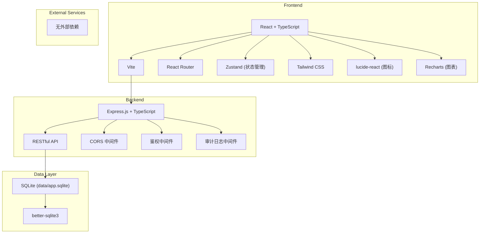
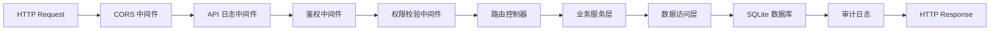
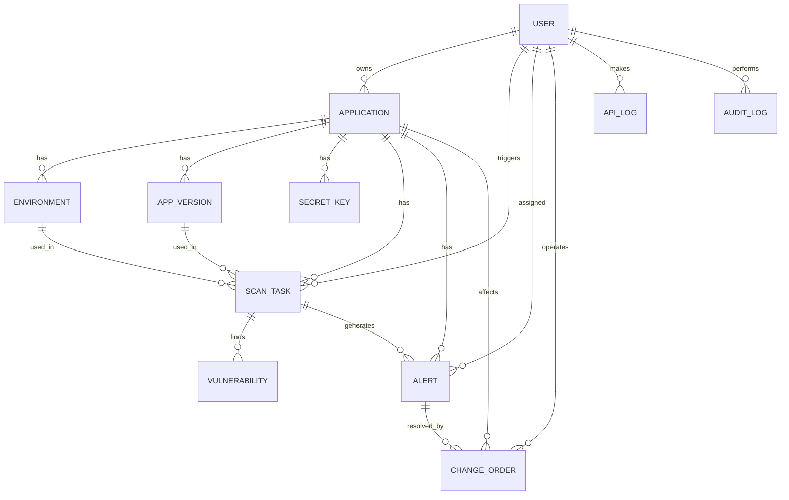

## 1. 架构设计



## 2. 技术描述

- **前端**：React@18 + TypeScript + Vite + Tailwind CSS@3 + Zustand + React Router + Recharts + lucide-react
- **后端**：Express.js@4 + TypeScript + better-sqlite3
- **数据库**：SQLite (data/app.sqlite)
- **端口配置**：FRONTEND_PORT=43391, BACKEND_PORT=53391
- **鉴权方式**：基于 Token 的会话管理，存储于 SQLite
- **CORS 配置**：仅允许 http://127.0.0.1:43391 访问后端 API

## 3. 路由定义

| 路由 | 页面 | 权限要求 |
|------|------|----------|
| /login | 登录页 | 公开 |
| /dashboard | 工作台 | 登录用户 |
| /applications | 应用列表 | 登录用户 |
| /applications/:id | 应用详情 | 登录用户 |
| /tasks | 扫描任务列表 | 登录用户 |
| /tasks/:id | 扫描任务详情 | 登录用户 |
| /alerts | 告警列表 | 登录用户 |
| /alerts/:id | 告警详情 | 登录用户 |
| /changes | 变更单列表 | 登录用户 |
| /changes/:id | 变更单详情 | 登录用户 |
| /logs | 调用日志 | 管理员 |
| /audit | 权限审计 | 管理员 |
| /settings | 配置中心 | 管理员 |

## 4. API 定义

### 4.1 类型定义

```typescript
interface User {
  id: number;
  username: string;
  role: 'platform_engineer' | 'ops' | 'developer' | 'app_owner' | 'security_admin';
  status: 'active' | 'disabled';
  createdAt: string;
}

interface Application {
  id: number;
  name: string;
  code: string;
  description: string;
  ownerId: number;
  status: 'active' | 'disabled' | 'archived';
  createdAt: string;
  updatedAt: string;
}

interface Environment {
  id: number;
  appId: number;
  name: string;
  type: 'dev' | 'test' | 'staging' | 'prod';
  config: string;
  status: 'active' | 'disabled';
  createdAt: string;
}

interface AppVersion {
  id: number;
  appId: number;
  version: string;
  branch: string;
  commitHash: string;
  dependencies: string;
  createdAt: string;
}

interface SecretKey {
  id: number;
  appId: number;
  name: string;
  type: string;
  encryptedValue: string;
  expiresAt: string;
  status: 'active' | 'expired' | 'disabled';
  createdAt: string;
}

interface ScanTask {
  id: number;
  appId: number;
  versionId: number;
  envId: number;
  status: 'pending' | 'running' | 'success' | 'failed';
  severityCounts: string;
  startTime: string;
  endTime: string;
  triggeredBy: number;
  createdAt: string;
}

interface Vulnerability {
  id: number;
  taskId: number;
  cveId: string;
  packageName: string;
  currentVersion: string;
  fixedVersion: string;
  severity: 'critical' | 'high' | 'medium' | 'low';
  description: string;
  status: 'open' | 'fixed' | 'ignored';
  createdAt: string;
}

interface Alert {
  id: number;
  type: 'duplicate_execution' | 'permission_violation' | 'config_misuse' | 'task_failure' | 'data_leak';
  severity: 'critical' | 'high' | 'medium' | 'low';
  status: 'open' | 'processing' | 'closed';
  assigneeId: number;
  title: string;
  content: string;
  suggestedAction: string;
  closeCriteria: string;
  createdAt: string;
  closedAt: string;
}

interface ChangeOrder {
  id: number;
  type: 'config' | 'permission' | 'secret' | 'application';
  status: 'pending' | 'approved' | 'rejected' | 'executed' | 'rolled_back';
  operatorId: number;
  reason: string;
  affectedObjects: string;
  recoveryPath: string;
  oldValue: string;
  newValue: string;
  createdAt: string;
  executedAt: string;
}

interface ApiLog {
  id: number;
  method: string;
  path: string;
  userId: number;
  statusCode: number;
  duration: number;
  ip: string;
  userAgent: string;
  requestBody: string;
  createdAt: string;
}

interface AuditLog {
  id: number;
  userId: number;
  action: string;
  resourceType: string;
  resourceId: number;
  oldValue: string;
  newValue: string;
  createdAt: string;
}
```

### 4.2 API 端点

```
POST   /api/auth/login
GET    /api/auth/me
POST   /api/auth/logout

GET    /api/applications
POST   /api/applications
GET    /api/applications/:id
PUT    /api/applications/:id
DELETE /api/applications/:id
GET    /api/applications/:id/timeline

GET    /api/applications/:id/environments
POST   /api/applications/:id/environments
PUT    /api/environments/:id
DELETE /api/environments/:id

GET    /api/applications/:id/versions
POST   /api/applications/:id/versions

GET    /api/applications/:id/secrets
POST   /api/applications/:id/secrets
PUT    /api/secrets/:id
DELETE /api/secrets/:id

GET    /api/tasks
POST   /api/tasks
GET    /api/tasks/:id
POST   /api/tasks/:id/execute

GET    /api/tasks/:id/vulnerabilities
PUT    /api/vulnerabilities/:id

GET    /api/alerts
GET    /api/alerts/:id
PUT    /api/alerts/:id
POST   /api/alerts/batch-process

GET    /api/changes
POST   /api/changes
GET    /api/changes/:id
PUT    /api/changes/:id
POST   /api/changes/:id/approve
POST   /api/changes/:id/reject
POST   /api/changes/:id/execute
POST   /api/changes/:id/rollback

GET    /api/logs
GET    /api/audit

GET    /api/stats/dashboard
```

## 5. 服务端架构



## 6. 数据模型

### 6.1 ER 图



### 6.2 DDL 语句

```sql
CREATE TABLE users (
  id INTEGER PRIMARY KEY AUTOINCREMENT,
  username VARCHAR(50) UNIQUE NOT NULL,
  password_hash VARCHAR(255) NOT NULL,
  role VARCHAR(30) NOT NULL,
  status VARCHAR(20) DEFAULT 'active',
  created_at DATETIME DEFAULT CURRENT_TIMESTAMP
);

CREATE TABLE applications (
  id INTEGER PRIMARY KEY AUTOINCREMENT,
  name VARCHAR(100) NOT NULL,
  code VARCHAR(50) UNIQUE NOT NULL,
  description TEXT,
  owner_id INTEGER REFERENCES users(id),
  status VARCHAR(20) DEFAULT 'active',
  created_at DATETIME DEFAULT CURRENT_TIMESTAMP,
  updated_at DATETIME DEFAULT CURRENT_TIMESTAMP
);

CREATE TABLE environments (
  id INTEGER PRIMARY KEY AUTOINCREMENT,
  app_id INTEGER REFERENCES applications(id),
  name VARCHAR(50) NOT NULL,
  type VARCHAR(20) NOT NULL,
  config TEXT,
  status VARCHAR(20) DEFAULT 'active',
  created_at DATETIME DEFAULT CURRENT_TIMESTAMP
);

CREATE TABLE app_versions (
  id INTEGER PRIMARY KEY AUTOINCREMENT,
  app_id INTEGER REFERENCES applications(id),
  version VARCHAR(50) NOT NULL,
  branch VARCHAR(100),
  commit_hash VARCHAR(64),
  dependencies TEXT,
  created_at DATETIME DEFAULT CURRENT_TIMESTAMP
);

CREATE TABLE secret_keys (
  id INTEGER PRIMARY KEY AUTOINCREMENT,
  app_id INTEGER REFERENCES applications(id),
  name VARCHAR(100) NOT NULL,
  type VARCHAR(50) NOT NULL,
  encrypted_value TEXT NOT NULL,
  expires_at DATETIME,
  status VARCHAR(20) DEFAULT 'active',
  created_at DATETIME DEFAULT CURRENT_TIMESTAMP
);

CREATE TABLE scan_tasks (
  id INTEGER PRIMARY KEY AUTOINCREMENT,
  app_id INTEGER REFERENCES applications(id),
  version_id INTEGER REFERENCES app_versions(id),
  env_id INTEGER REFERENCES environments(id),
  status VARCHAR(20) DEFAULT 'pending',
  severity_counts TEXT,
  start_time DATETIME,
  end_time DATETIME,
  triggered_by INTEGER REFERENCES users(id),
  created_at DATETIME DEFAULT CURRENT_TIMESTAMP
);

CREATE TABLE vulnerabilities (
  id INTEGER PRIMARY KEY AUTOINCREMENT,
  task_id INTEGER REFERENCES scan_tasks(id),
  cve_id VARCHAR(30),
  package_name VARCHAR(100) NOT NULL,
  current_version VARCHAR(50),
  fixed_version VARCHAR(50),
  severity VARCHAR(20) NOT NULL,
  description TEXT,
  status VARCHAR(20) DEFAULT 'open',
  created_at DATETIME DEFAULT CURRENT_TIMESTAMP
);

CREATE TABLE alerts (
  id INTEGER PRIMARY KEY AUTOINCREMENT,
  type VARCHAR(30) NOT NULL,
  severity VARCHAR(20) NOT NULL,
  status VARCHAR(20) DEFAULT 'open',
  assignee_id INTEGER REFERENCES users(id),
  title VARCHAR(200) NOT NULL,
  content TEXT,
  suggested_action TEXT,
  close_criteria TEXT,
  created_at DATETIME DEFAULT CURRENT_TIMESTAMP,
  closed_at DATETIME
);

CREATE TABLE change_orders (
  id INTEGER PRIMARY KEY AUTOINCREMENT,
  type VARCHAR(30) NOT NULL,
  status VARCHAR(20) DEFAULT 'pending',
  operator_id INTEGER REFERENCES users(id),
  reason TEXT,
  affected_objects TEXT,
  recovery_path TEXT,
  old_value TEXT,
  new_value TEXT,
  created_at DATETIME DEFAULT CURRENT_TIMESTAMP,
  executed_at DATETIME
);

CREATE TABLE api_logs (
  id INTEGER PRIMARY KEY AUTOINCREMENT,
  method VARCHAR(10) NOT NULL,
  path VARCHAR(500) NOT NULL,
  user_id INTEGER REFERENCES users(id),
  status_code INTEGER,
  duration INTEGER,
  ip VARCHAR(45),
  user_agent TEXT,
  request_body TEXT,
  created_at DATETIME DEFAULT CURRENT_TIMESTAMP
);

CREATE TABLE audit_logs (
  id INTEGER PRIMARY KEY AUTOINCREMENT,
  user_id INTEGER REFERENCES users(id),
  action VARCHAR(50) NOT NULL,
  resource_type VARCHAR(50) NOT NULL,
  resource_id INTEGER,
  old_value TEXT,
  new_value TEXT,
  created_at DATETIME DEFAULT CURRENT_TIMESTAMP
);

CREATE TABLE sessions (
  id INTEGER PRIMARY KEY AUTOINCREMENT,
  token VARCHAR(64) UNIQUE NOT NULL,
  user_id INTEGER REFERENCES users(id),
  expires_at DATETIME NOT NULL,
  created_at DATETIME DEFAULT CURRENT_TIMESTAMP
);

CREATE INDEX idx_applications_owner ON applications(owner_id);
CREATE INDEX idx_tasks_app ON scan_tasks(app_id);
CREATE INDEX idx_tasks_status ON scan_tasks(status);
CREATE INDEX idx_vulns_task ON vulnerabilities(task_id);
CREATE INDEX idx_vulns_severity ON vulnerabilities(severity);
CREATE INDEX idx_alerts_status ON alerts(status);
CREATE INDEX idx_alerts_assignee ON alerts(assignee_id);
CREATE INDEX idx_logs_user ON api_logs(user_id);
CREATE INDEX idx_logs_created ON api_logs(created_at);
CREATE INDEX idx_audit_user ON audit_logs(user_id);
CREATE INDEX idx_audit_created ON audit_logs(created_at);
```

### 6.3 初始化数据

```sql
INSERT INTO users (username, password_hash, role, status) VALUES 
('admin', '$2b$10$dummyhash', 'platform_engineer', 'active'),
('ops_user', '$2b$10$dummyhash', 'ops', 'active'),
('dev_user', '$2b$10$dummyhash', 'developer', 'active'),
('owner_user', '$2b$10$dummyhash', 'app_owner', 'active'),
('security_user', '$2b$10$dummyhash', 'security_admin', 'active');

INSERT INTO applications (name, code, description, owner_id, status) VALUES
('电商平台', 'eshop', '核心电商业务系统', 4, 'active'),
('支付网关', 'payment-gateway', '统一支付处理服务', 4, 'active'),
('用户中心', 'user-center', '用户身份与权限管理', 4, 'active');
```
