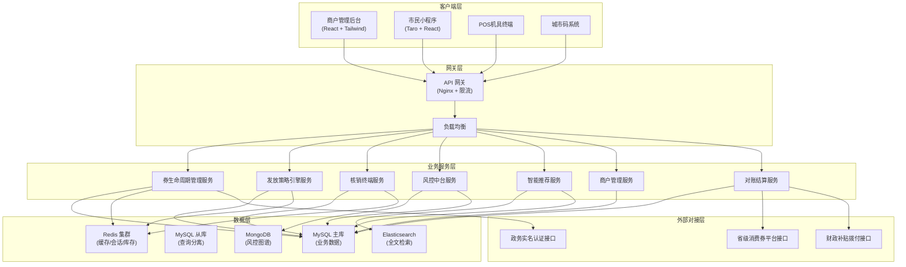
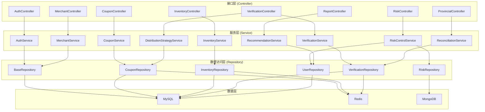
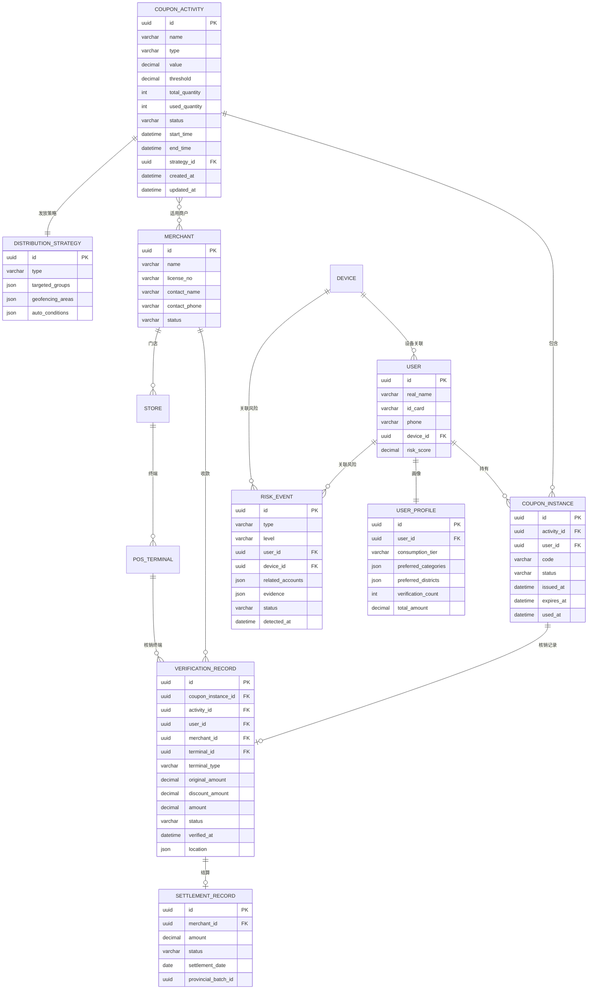

## 1. 架构设计



## 2. 技术描述

- **前端（商户后台）**：React@18 + TypeScript + Vite@5 + TailwindCSS@3 + Zustand + ECharts@5 + React Router@6 + Axios
- **前端（小程序）**：Taro@4.1.9 + React@18 + TypeScript + SCSS Modules + Zustand
- **后端**：Node.js + Express@4 + TypeScript + TypeORM + JWT + Socket.IO
- **数据库**：MySQL@8 + Redis@7 + MongoDB@6 + Elasticsearch@8
- **初始化工具**：vite-init
- **消息队列**：BullMQ (Redis-based)
- **API 文档**：Swagger/OpenAPI

## 3. 路由定义

| 路由 | 用途 |
|-------|---------|
| / | 仪表盘 - 数据概览 |
| /login | 登录页面 |
| /coupons | 券活动列表 |
| /coupons/:id | 券活动详情 |
| /coupons/create | 创建券活动 |
| /inventory | 库存管理 |
| /verification | 核销对账 |
| /reports | 数据报表 |
| /alerts | 预警中心 |
| /risk-control | 风控监控 |
| /merchant | 商户配置 |
| /provincial | 省级平台对接 |
| /settings | 系统设置 |

## 4. API 定义

### 4.1 类型定义

```typescript
// 券活动
interface CouponActivity {
  id: string;
  name: string;
  type: 'fixed' | 'discount' | 'threshold';
  value: number;
  threshold: number;
  totalQuantity: number;
  usedQuantity: number;
  status: 'draft' | 'active' | 'paused' | 'expired';
  startTime: Date;
  endTime: Date;
  distributionStrategy: DistributionStrategy;
  applicableMerchants: string[];
  createdAt: Date;
  updatedAt: Date;
}

// 发放策略
interface DistributionStrategy {
  type: 'targeted' | 'geofencing' | 'auto';
  targetedGroups?: string[];
  geofencingAreas?: GeofenceArea[];
  autoTriggerConditions?: AutoTriggerCondition;
}

// 核销记录
interface VerificationRecord {
  id: string;
  couponInstanceId: string;
  activityId: string;
  userId: string;
  merchantId: string;
  terminalType: 'pos' | 'miniapp' | 'citycode';
  terminalId: string;
  amount: number;
  originalAmount: number;
  discountAmount: number;
  status: 'success' | 'failed' | 'reversed';
  verifiedAt: Date;
  location?: GeoLocation;
}

// 风控事件
interface RiskEvent {
  id: string;
  type: 'multi_account' | 'bulk_hoarding' | 'abnormal_path';
  level: 'low' | 'medium' | 'high';
  userId?: string;
  deviceId?: string;
  relatedAccounts?: string[];
  evidence: RiskEvidence;
  status: 'pending' | 'reviewing' | 'resolved' | 'ignored';
  detectedAt: Date;
}

// 用户画像
interface UserProfile {
  userId: string;
  consumptionTier: 'low' | 'medium' | 'high';
  preferredCategories: string[];
  preferredDistricts: string[];
  historicalVerificationCount: number;
  historicalVerificationAmount: number;
  riskScore: number;
}
```

### 4.2 核心 API 端点

| 方法 | 路径 | 描述 |
|------|------|------|
| POST | /api/auth/login | 用户登录 |
| GET | /api/coupons | 获取券活动列表 |
| POST | /api/coupons | 创建券活动 |
| GET | /api/coupons/:id | 获取券活动详情 |
| PUT | /api/coupons/:id | 更新券活动 |
| PATCH | /api/coupons/:id/status | 更新活动状态 |
| GET | /api/inventory | 获取库存列表 |
| POST | /api/inventory/:id/replenish | 库存补货 |
| GET | /api/verification/records | 获取核销记录 |
| POST | /api/verification/verify | 核销券码 |
| GET | /api/verification/reconciliation | 对账数据 |
| POST | /api/verification/reconciliation/submit | 提交结算申请 |
| GET | /api/risk/events | 获取风险事件列表 |
| POST | /api/risk/events/:id/resolve | 处理风险事件 |
| GET | /api/reports/verification-trend | 核销趋势报表 |
| GET | /api/alerts | 获取预警列表 |
| POST | /api/provincial/sync | 同步数据到省级平台 |
| GET | /api/provincial/settlement | 获取跨市结算记录 |

## 5. 服务端架构图



## 6. 数据模型

### 6.1 ER 图



### 6.2 DDL 语句

```sql
-- 券活动表
CREATE TABLE coupon_activities (
    id CHAR(36) PRIMARY KEY,
    name VARCHAR(255) NOT NULL,
    type ENUM('fixed', 'discount', 'threshold') NOT NULL,
    value DECIMAL(10,2) NOT NULL,
    threshold DECIMAL(10,2) DEFAULT 0,
    total_quantity INT NOT NULL,
    used_quantity INT DEFAULT 0,
    status ENUM('draft', 'active', 'paused', 'expired') DEFAULT 'draft',
    start_time DATETIME NOT NULL,
    end_time DATETIME NOT NULL,
    strategy_id CHAR(36),
    created_at DATETIME DEFAULT CURRENT_TIMESTAMP,
    updated_at DATETIME DEFAULT CURRENT_TIMESTAMP ON UPDATE CURRENT_TIMESTAMP,
    INDEX idx_status (status),
    INDEX idx_time_range (start_time, end_time)
);

-- 券实例表
CREATE TABLE coupon_instances (
    id CHAR(36) PRIMARY KEY,
    activity_id CHAR(36) NOT NULL,
    user_id CHAR(36) NOT NULL,
    code VARCHAR(64) UNIQUE NOT NULL,
    status ENUM('available', 'used', 'expired', 'frozen') DEFAULT 'available',
    issued_at DATETIME DEFAULT CURRENT_TIMESTAMP,
    expires_at DATETIME NOT NULL,
    used_at DATETIME NULL,
    INDEX idx_user (user_id),
    INDEX idx_activity (activity_id),
    INDEX idx_status (status)
);

-- 核销记录表
CREATE TABLE verification_records (
    id CHAR(36) PRIMARY KEY,
    coupon_instance_id CHAR(36) NOT NULL,
    activity_id CHAR(36) NOT NULL,
    user_id CHAR(36) NOT NULL,
    merchant_id CHAR(36) NOT NULL,
    terminal_id CHAR(36),
    terminal_type ENUM('pos', 'miniapp', 'citycode') NOT NULL,
    original_amount DECIMAL(10,2) NOT NULL,
    discount_amount DECIMAL(10,2) NOT NULL,
    amount DECIMAL(10,2) NOT NULL,
    status ENUM('success', 'failed', 'reversed') DEFAULT 'success',
    verified_at DATETIME DEFAULT CURRENT_TIMESTAMP,
    location JSON,
    INDEX idx_merchant (merchant_id),
    INDEX idx_verified_at (verified_at),
    INDEX idx_terminal (terminal_type, terminal_id)
);

-- 库存表
CREATE TABLE inventory (
    id CHAR(36) PRIMARY KEY,
    activity_id CHAR(36) NOT NULL,
    batch_no VARCHAR(64) NOT NULL,
    quantity INT NOT NULL,
    available_quantity INT NOT NULL,
    unit_cost DECIMAL(10,2),
    expiry_date DATE,
    created_at DATETIME DEFAULT CURRENT_TIMESTAMP,
    INDEX idx_activity (activity_id),
    INDEX idx_batch (batch_no)
);

-- 用户表
CREATE TABLE users (
    id CHAR(36) PRIMARY KEY,
    real_name VARCHAR(64) NOT NULL,
    id_card VARCHAR(18) UNIQUE NOT NULL,
    phone VARCHAR(11) UNIQUE NOT NULL,
    device_id CHAR(36),
    risk_score DECIMAL(5,2) DEFAULT 0,
    status ENUM('normal', 'frozen', 'watch') DEFAULT 'normal',
    created_at DATETIME DEFAULT CURRENT_TIMESTAMP,
    INDEX idx_id_card (id_card),
    INDEX idx_phone (phone),
    INDEX idx_risk (risk_score)
);

-- 风险事件表
CREATE TABLE risk_events (
    id CHAR(36) PRIMARY KEY,
    type ENUM('multi_account', 'bulk_hoarding', 'abnormal_path') NOT NULL,
    level ENUM('low', 'medium', 'high') NOT NULL,
    user_id CHAR(36),
    device_id CHAR(36),
    related_accounts JSON,
    evidence JSON NOT NULL,
    status ENUM('pending', 'reviewing', 'resolved', 'ignored') DEFAULT 'pending',
    handler_id CHAR(36),
    handled_at DATETIME,
    detected_at DATETIME DEFAULT CURRENT_TIMESTAMP,
    INDEX idx_type (type),
    INDEX idx_level (level),
    INDEX idx_status (status)
);

-- 结算记录表
CREATE TABLE settlement_records (
    id CHAR(36) PRIMARY KEY,
    merchant_id CHAR(36) NOT NULL,
    period_start DATE NOT NULL,
    period_end DATE NOT NULL,
    total_verifications INT DEFAULT 0,
    total_amount DECIMAL(12,2) DEFAULT 0,
    subsidy_amount DECIMAL(12,2) DEFAULT 0,
    status ENUM('pending', 'approved', 'rejected', 'transferred') DEFAULT 'pending',
    provincial_batch_id VARCHAR(64),
    transfer_time DATETIME,
    created_at DATETIME DEFAULT CURRENT_TIMESTAMP,
    INDEX idx_merchant (merchant_id),
    INDEX idx_status (status)
);
```
