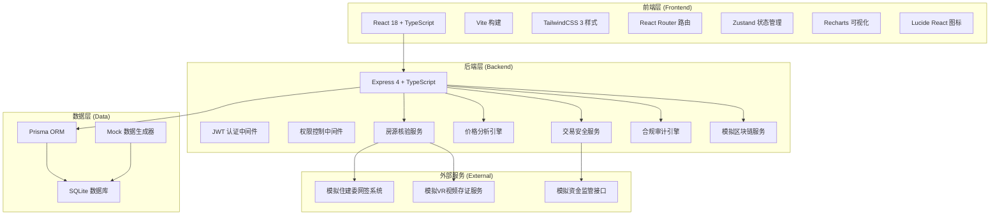
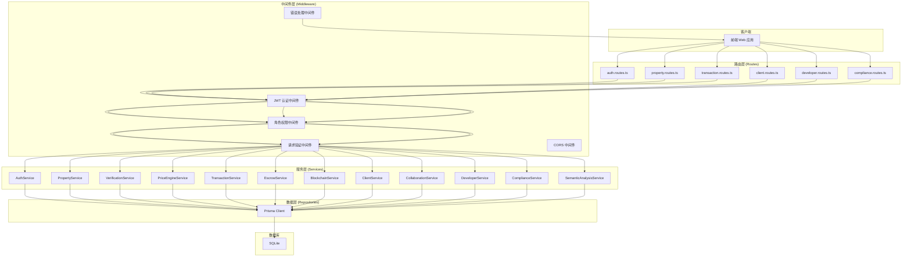
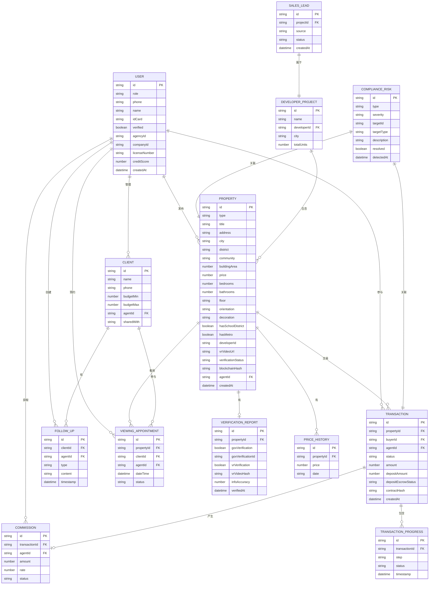

## 1. 架构设计



---

## 2. 技术描述

### 2.1 前端技术栈

| 技术 | 版本 | 用途 |
|------|------|------|
| React | 18.2.x | UI 框架 |
| TypeScript | 5.x | 类型安全 |
| Vite | 5.x | 构建工具 |
| TailwindCSS | 3.4.x | 样式框架 |
| React Router | 6.x | 路由管理 |
| Zustand | 4.x | 状态管理 |
| Recharts | 2.10.x | 数据可视化 |
| Lucide React | 0.294.x | 图标库 |
| Axios | 1.6.x | HTTP 客户端 |
| React Hook Form | 7.49.x | 表单处理 |
| Zod | 3.22.x | 数据验证 |

### 2.2 后端技术栈

| 技术 | 版本 | 用途 |
|------|------|------|
| Express | 4.18.x | Web 框架 |
| TypeScript | 5.x | 类型安全 |
| Prisma | 5.x | ORM 框架 |
| SQLite | 3.x | 数据库 |
| JWT | 9.x | 身份认证 |
| Bcrypt | 5.x | 密码加密 |
| Zod | 3.22.x | 数据验证 |
| CORS | 2.8.x | 跨域处理 |

### 2.3 初始化工具

- **前端初始化**: `npm create vite@latest client -- --template react-ts`
- **后端初始化**: `npm create vite@latest server -- --template express-ts` 或手动搭建
- **数据库初始化**: `npx prisma init` 后配置 SQLite

---

## 3. 路由定义

### 3.1 前端路由

| 路由路径 | 页面组件 | 访问角色 | 说明 |
|----------|----------|----------|------|
| `/login` | LoginPage | 所有 | 登录页，角色选择 |
| `/buyer` | BuyerHomePage | 购房人 | 购房人首页，房源搜索 |
| `/buyer/property/:id` | PropertyDetailPage | 购房人 | 房源详情页 |
| `/buyer/transactions` | TransactionCenterPage | 购房人 | 交易中心 |
| `/buyer/favorites` | FavoritesPage | 购房人 | 收藏夹 |
| `/agent` | AgentDashboardPage | 经纪人 | 经纪人工作台 |
| `/agent/clients` | ClientManagementPage | 经纪人 | 客户管理 |
| `/agent/properties` | PropertyManagementPage | 经纪人 | 房源管理 |
| `/agent/calendar` | CalendarPage | 经纪人 | 日程管理 |
| `/agent/collaboration` | CollaborationPage | 经纪人 | 协同作业空间 |
| `/developer` | DeveloperDashboardPage | 开发商 | 销售看板 |
| `/developer/projects` | ProjectManagementPage | 开发商 | 项目管理 |
| `/developer/funnel` | SalesFunnelPage | 开发商 | 销售漏斗 |
| `/developer/commissions` | CommissionPage | 开发商 | 佣金管理 |
| `/compliance` | ComplianceDashboardPage | 合规审计 | 审计中心 |
| `/compliance/contracts` | ContractReviewPage | 合规审计 | 合同审核 |
| `/compliance/audits` | AuditReportPage | 合规审计 | 审计报告 |
| `/profile` | ProfilePage | 所有 | 个人中心 |

### 3.2 后端 API 路由

| 方法 | 路径 | 模块 | 说明 |
|------|------|------|------|
| POST | `/api/auth/login` | 认证 | 用户登录 |
| POST | `/api/auth/refresh` | 认证 | 刷新 Token |
| GET | `/api/auth/me` | 认证 | 获取当前用户 |
| GET | `/api/properties` | 房源 | 房源列表（支持筛选） |
| GET | `/api/properties/:id` | 房源 | 房源详情 |
| POST | `/api/properties` | 房源 | 发布房源 |
| POST | `/api/properties/:id/verify` | 核验 | 房源真实性核验 |
| GET | `/api/properties/:id/price-analysis` | 价格 | 价格分析 |
| GET | `/api/properties/:id/tax-calculator` | 价格 | 税费计算 |
| GET | `/api/transactions` | 交易 | 交易列表 |
| POST | `/api/transactions` | 交易 | 创建交易 |
| GET | `/api/transactions/:id/progress` | 交易 | 交易进度 |
| POST | `/api/transactions/:id/deposit` | 交易 | 定金支付 |
| GET | `/api/transactions/:id/contract` | 交易 | 合同预览 |
| POST | `/api/transactions/:id/sign` | 交易 | 合同签署 |
| GET | `/api/clients` | 客户 | 客户列表 |
| POST | `/api/clients/:id/followup` | 客户 | 添加跟进记录 |
| GET | `/api/developer/funnel` | 开发商 | 销售漏斗数据 |
| GET | `/api/developer/conversion` | 开发商 | 转化率分析 |
| GET | `/api/developer/commissions` | 开发商 | 佣金数据 |
| GET | `/api/compliance/risks` | 合规 | 风险列表 |
| POST | `/api/compliance/analyze-contract` | 合规 | 合同分析 |
| POST | `/api/compliance/analyze-marketing` | 合规 | 宣传内容分析 |
| GET | `/api/compliance/audit-report` | 合规 | 审计报告 |

---

## 4. API 类型定义

```typescript
// 通用响应类型
interface ApiResponse<T> {
  success: boolean;
  data: T;
  message?: string;
  error?: string;
}

// 用户类型
type UserRole = 'buyer' | 'agent' | 'developer' | 'compliance';

interface User {
  id: string;
  role: UserRole;
  phone: string;
  name: string;
  idCard?: string;
  avatar?: string;
  verified: boolean;
  agencyId?: string;
  companyId?: string;
  licenseNumber?: string;
  creditScore?: number;
  createdAt: Date;
}

// 房源类型
type PropertyType = 'new' | 'secondhand';
type PropertyStatus = 'pending' | 'verified' | 'rejected' | 'sold';
type DecorationStandard = 'rough' | 'simple' | 'fine' | 'luxury';

interface Property {
  id: string;
  type: PropertyType;
  title: string;
  address: string;
  city: string;
  district: string;
  community: string;
  buildingArea: number;
  usableArea?: number;
  price: number;
  pricePerSquare: number;
  bedrooms: number;
  bathrooms: number;
  floor: string;
  totalFloors: number;
  orientation: string;
  decoration: DecorationStandard;
  hasSchoolDistrict: boolean;
  schoolDistrictName?: string;
  hasMetro: boolean;
  metroDistance?: number;
  developerId?: string;
  developerName?: string;
  developerCreditScore?: number;
  vrVideoUrl?: string;
  verificationStatus: PropertyStatus;
  verificationReport?: VerificationReport;
  blockchainHash?: string;
  agentId: string;
  images: string[];
  tags: string[];
  createdAt: Date;
}

interface VerificationReport {
  id: string;
  propertyId: string;
  govVerification: boolean;
  govVerificationId?: string;
  vrVerification: boolean;
  vrVideoHash?: string;
  infoAccuracy: number;
  verifiedAt: Date;
  verifier: string;
}

// 价格分析类型
interface PriceAnalysis {
  propertyId: string;
  currentPrice: number;
  avgPrice: number;
  minPrice: number;
  maxPrice: number;
  priceRange: string;
  fluctuation: number;
  historicalPrices: { date: string; price: number }[];
  comparableProperties: {
    id: string;
    title: string;
    price: number;
    area: number;
    daysAgo: number;
  }[];
}

interface TaxCalculation {
  propertyId: string;
  totalPrice: number;
  deedTax: number;
  individualIncomeTax?: number;
  valueAddedTax?: number;
  stampDuty: number;
  agencyFee: number;
  registrationFee: number;
  totalTax: number;
  breakdown: { name: string; amount: number; rate: string }[];
}

// 交易类型
type TransactionStatus = 'intent' | 'deposit_paid' | 'contract_signed' | 'transferring' | 'completed' | 'cancelled';

interface Transaction {
  id: string;
  propertyId: string;
  buyerId: string;
  sellerId?: string;
  agentId: string;
  status: TransactionStatus;
  amount: number;
  depositAmount: number;
  depositEscrowStatus: 'pending' | 'held' | 'released';
  contractHash?: string;
  progress: TransactionProgress[];
  createdAt: Date;
  updatedAt: Date;
}

interface TransactionProgress {
  id: string;
  transactionId: string;
  step: string;
  status: 'pending' | 'in_progress' | 'completed';
  timestamp: Date;
  remark?: string;
}

// 合规审计类型
interface ComplianceRisk {
  id: string;
  type: 'dual_contract' | 'false_marketing' | 'commission_irregularity';
  severity: 'low' | 'medium' | 'high';
  targetId: string;
  targetType: string;
  description: string;
  evidence: string[];
  detectedAt: Date;
  resolved: boolean;
}

interface ContractAnalysisResult {
  isDualContractRisk: boolean;
  riskScore: number;
  inconsistencies: string[];
  priceDiscrepancy?: number;
  suggestions: string[];
}

interface MarketingAnalysisResult {
  isFalseAdvertising: boolean;
  riskScore: number;
  violations: { keyword: string; context: string; type: string }[];
  suggestions: string[];
}

// 经纪人协同类型
interface Client {
  id: string;
  name: string;
  phone: string;
  budgetMin: number;
  budgetMax: number;
  preferredAreas: string[];
  requirements: string;
  agentId: string;
  sharedWith: string[];
  followUps: FollowUpRecord[];
}

interface FollowUpRecord {
  id: string;
  clientId: string;
  agentId: string;
  type: 'call' | 'visit' | 'message' | 'viewing';
  content: string;
  timestamp: Date;
  nextFollowUp?: Date;
}

interface ViewingAppointment {
  id: string;
  propertyId: string;
  clientId: string;
  agentId: string;
  dateTime: Date;
  status: 'pending' | 'confirmed' | 'cancelled' | 'completed';
  notes?: string;
}

// 开发商类型
interface SalesFunnelData {
  stage: string;
  count: number;
  conversionRate: number;
  value: number;
}

interface LeadSource {
  source: string;
  count: number;
  percentage: number;
  conversionRate: number;
}

interface CommissionRecord {
  id: string;
  transactionId: string;
  propertyId: string;
  agentId: string;
  agentName: string;
  amount: number;
  rate: number;
  status: 'pending' | 'paid';
  createdAt: Date;
}
```

---

## 5. 后端服务架构



---

## 6. 数据模型

### 6.1 ER 图



### 6.2 Prisma Schema DDL

```prisma
// schema.prisma
generator client {
  provider = "prisma-client-js"
}

datasource db {
  provider = "sqlite"
  url      = "file:./dev.db"
}

model User {
  id            String    @id @default(cuid())
  role          String    // buyer, agent, developer, compliance
  phone         String    @unique
  name          String
  passwordHash  String
  idCard        String?
  avatar        String?
  verified      Boolean   @default(false)
  agencyId      String?
  companyId     String?
  licenseNumber String?
  creditScore   Int?      @default(100)
  createdAt     DateTime  @default(now())
  
  properties    Property[]
  transactions  Transaction[]
  clients       Client[]
  followUps     FollowUp[]
  appointments  ViewingAppointment[]
  commissions   Commission[]
}

model Property {
  id              String              @id @default(cuid())
  type            String              // new, secondhand
  title           String
  address         String
  city            String
  district        String
  community       String
  buildingArea    Float
  usableArea      Float?
  price           Float
  pricePerSquare  Float
  bedrooms        Int
  bathrooms       Int
  floor           String
  totalFloors     Int
  orientation     String
  decoration      String              // rough, simple, fine, luxury
  hasSchoolDistrict Boolean          @default(false)
  schoolDistrictName String?
  hasMetro        Boolean             @default(false)
  metroDistance   Int?
  developerId     String?
  developerName   String?
  developerCreditScore Int?
  vrVideoUrl      String?
  verificationStatus String           // pending, verified, rejected, sold
  blockchainHash  String?
  agentId         String
  agent           User                @relation(fields: [agentId], references: [id])
  images          String[]
  tags            String[]
  createdAt       DateTime            @default(now())
  
  verificationReport VerificationReport?
  transactions    Transaction[]
  appointments    ViewingAppointment[]
  priceHistory    PriceHistory[]
}

model VerificationReport {
  id                 String   @id @default(cuid())
  propertyId         String   @unique
  property           Property @relation(fields: [propertyId], references: [id])
  govVerification    Boolean  @default(false)
  govVerificationId  String?
  vrVerification     Boolean  @default(false)
  vrVideoHash        String?
  infoAccuracy       Int
  verifiedAt         DateTime @default(now())
  verifier           String
}

model Transaction {
  id                 String               @id @default(cuid())
  propertyId         String
  property           Property             @relation(fields: [propertyId], references: [id])
  buyerId            String
  buyer              User                 @relation(fields: [buyerId], references: [id])
  agentId            String
  agent              User                 @relation(fields: [agentId], references: [id])
  status             String               // intent, deposit_paid, contract_signed, transferring, completed
  amount             Float
  depositAmount      Float
  depositEscrowStatus String              // pending, held, released
  contractHash       String?
  createdAt          DateTime             @default(now())
  updatedAt          DateTime             @updatedAt
  
  progress           TransactionProgress[]
  commission         Commission?
}

model TransactionProgress {
  id             String      @id @default(cuid())
  transactionId  String
  transaction    Transaction @relation(fields: [transactionId], references: [id])
  step           String
  status         String      // pending, in_progress, completed
  timestamp      DateTime    @default(now())
  remark         String?
}

model Client {
  id             String   @id @default(cuid())
  name           String
  phone          String
  budgetMin      Float
  budgetMax      Float
  preferredAreas String[]
  requirements   String?
  agentId        String
  agent          User     @relation(fields: [agentId], references: [id])
  sharedWith     String[] // agent ids
  
  followUps      FollowUp[]
  appointments   ViewingAppointment[]
}

model FollowUp {
  id           String   @id @default(cuid())
  clientId     String
  client       Client   @relation(fields: [clientId], references: [id])
  agentId      String
  agent        User     @relation(fields: [agentId], references: [id])
  type         String   // call, visit, message, viewing
  content      String
  timestamp    DateTime @default(now())
  nextFollowUp DateTime?
}

model ViewingAppointment {
  id           String   @id @default(cuid())
  propertyId   String
  property     Property @relation(fields: [propertyId], references: [id])
  clientId     String
  client       Client   @relation(fields: [clientId], references: [id])
  agentId      String
  agent        User     @relation(fields: [agentId], references: [id])
  dateTime     DateTime
  status       String   // pending, confirmed, cancelled, completed
  notes        String?
}

model Commission {
  id            String      @id @default(cuid())
  transactionId String      @unique
  transaction   Transaction @relation(fields: [transactionId], references: [id])
  agentId       String
  agent         User        @relation(fields: [agentId], references: [id])
  amount        Float
  rate          Float
  status        String      // pending, paid
  createdAt     DateTime    @default(now())
}

model ComplianceRisk {
  id          String   @id @default(cuid())
  type        String   // dual_contract, false_marketing, commission_irregularity
  severity    String   // low, medium, high
  targetId    String
  targetType  String
  description String
  evidence    String[]
  detectedAt  DateTime @default(now())
  resolved    Boolean  @default(false)
}

model PriceHistory {
  id         String   @id @default(cuid())
  propertyId String
  property   Property @relation(fields: [propertyId], references: [id])
  price      Float
  date       String
}

model DeveloperProject {
  id          String   @id @default(cuid())
  name        String
  developerId String
  city        String
  district    String
  totalUnits  Int
  createdAt   DateTime @default(now())
  
  leads       SalesLead[]
}

model SalesLead {
  id        String             @id @default(cuid())
  projectId String
  project   DeveloperProject   @relation(fields: [projectId], references: [id])
  source    String
  status    String             // new, contacted, interested, converted, lost
  name      String
  phone     String
  createdAt DateTime           @default(now())
}
```
