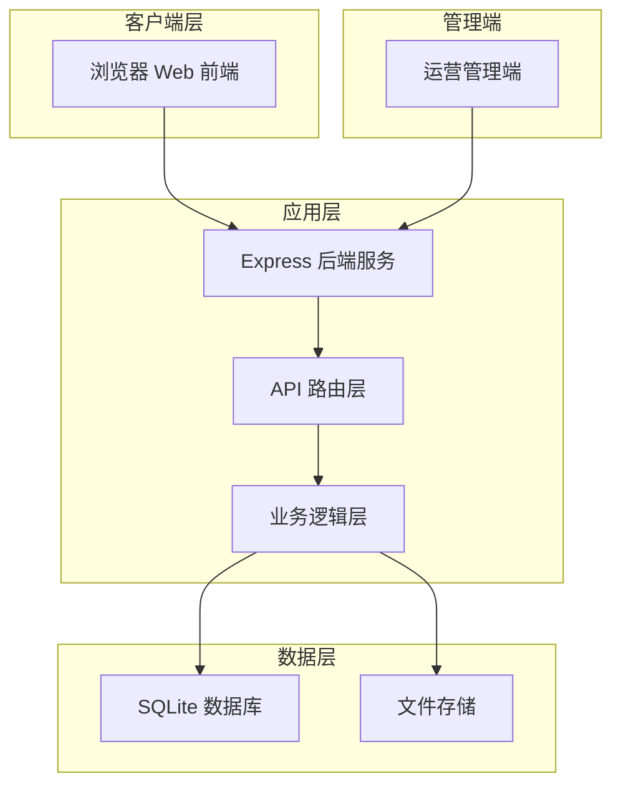

# 短视频应用技术架构文档

## 1. 技术栈选型

### 1.1 前端技术栈
| 技术 | 选型 | 版本 | 说明 |
|------|------|------|------|
| 框架 | React | ^18.2.0 | 组件化开发，生态完善 |
| 构建工具 | Vite | ^5.0.0 | 快速开发，热更新 |
| 路由 | React Router | ^6.20.0 | 声明式路由 |
| 状态管理 | Zustand | ^4.4.0 | 轻量级状态管理 |
| HTTP 客户端 | Axios | ^1.6.0 | 统一请求封装 |
| UI 组件库 | Ant Design | ^5.12.0 | 企业级组件库 |
| 图标 | Lucide React | ^0.294.0 | 现代化图标库 |
| 日期处理 | dayjs | ^1.11.10 | 轻量级日期库 |

### 1.2 后端技术栈
| 技术 | 选型 | 版本 | 说明 |
|------|------|------|------|
| 运行时 | Node.js | >=18.0.0 | JavaScript 运行时 |
| 框架 | Express | ^4.18.0 | 轻量级 Web 框架 |
| 数据库 | SQLite3 | ^5.1.6 | 文件型数据库，无需额外服务 |
| ORM | better-sqlite3 | ^9.2.0 | 高性能 SQLite 驱动 |
| 认证 | JWT | ^9.0.2 | 无状态认证 |
| 密码加密 | bcrypt | ^5.1.1 | 安全密码哈希 |
| 文件上传 | multer | ^1.4.5 | 文件上传处理 |
| CORS | cors | ^2.8.5 | 跨域资源共享 |

### 1.3 端口规划
根据项目目录名称 `may-4784`，端口规划如下：
- 前端端口：**47841**
- 后端端口：**47842**

## 2. 系统架构图



## 3. 目录结构

### 3.1 整体目录结构
```
may-4784/
├── .trae/
│   └── documents/
│       ├── PRD.md
│       └── TECH-ARCH.md
├── frontend/                 # 前端项目
│   ├── src/
│   │   ├── components/      # 公共组件
│   │   ├── pages/          # 页面组件
│   │   ├── store/          # 状态管理
│   │   ├── api/            # API 接口
│   │   ├── utils/          # 工具函数
│   │   ├── hooks/          # 自定义 Hooks
│   │   ├── App.jsx
│   │   └── main.jsx
│   ├── public/
│   ├── package.json
│   ├── vite.config.js
│   └── .env
├── backend/                  # 后端项目
│   ├── src/
│   │   ├── routes/         # 路由层
│   │   ├── controllers/    # 控制层
│   │   ├── models/         # 数据模型
│   │   ├── middleware/     # 中间件
│   │   ├── utils/          # 工具函数
│   │   └── app.js
│   ├── data/               # 数据库文件
│   │   └── app.sqlite
│   ├── uploads/            # 文件上传目录
│   ├── package.json
│   └── .env
└── README.md
```

## 4. 数据库设计

### 4.1 用户表 (users)
```sql
CREATE TABLE users (
  id INTEGER PRIMARY KEY AUTOINCREMENT,
  phone VARCHAR(20) UNIQUE NOT NULL,
  password VARCHAR(255),
  nickname VARCHAR(50),
  avatar VARCHAR(255),
  bio TEXT,
  city VARCHAR(50),
  created_at DATETIME DEFAULT CURRENT_TIMESTAMP,
  updated_at DATETIME DEFAULT CURRENT_TIMESTAMP
);
```

### 4.2 视频表 (videos)
```sql
CREATE TABLE videos (
  id INTEGER PRIMARY KEY AUTOINCREMENT,
  user_id INTEGER NOT NULL,
  title VARCHAR(255),
  description TEXT,
  video_url VARCHAR(255) NOT NULL,
  cover_url VARCHAR(255),
  duration INTEGER,
  city VARCHAR(50),
  latitude REAL,
  longitude REAL,
  view_count INTEGER DEFAULT 0,
  like_count INTEGER DEFAULT 0,
  comment_count INTEGER DEFAULT 0,
  share_count INTEGER DEFAULT 0,
  created_at DATETIME DEFAULT CURRENT_TIMESTAMP,
  FOREIGN KEY (user_id) REFERENCES users(id)
);
```

### 4.3 评论表 (comments)
```sql
CREATE TABLE comments (
  id INTEGER PRIMARY KEY AUTOINCREMENT,
  user_id INTEGER NOT NULL,
  video_id INTEGER NOT NULL,
  content TEXT NOT NULL,
  like_count INTEGER DEFAULT 0,
  created_at DATETIME DEFAULT CURRENT_TIMESTAMP,
  FOREIGN KEY (user_id) REFERENCES users(id),
  FOREIGN KEY (video_id) REFERENCES videos(id)
);
```

### 4.4 点赞表 (likes)
```sql
CREATE TABLE likes (
  id INTEGER PRIMARY KEY AUTOINCREMENT,
  user_id INTEGER NOT NULL,
  video_id INTEGER NOT NULL,
  created_at DATETIME DEFAULT CURRENT_TIMESTAMP,
  UNIQUE(user_id, video_id),
  FOREIGN KEY (user_id) REFERENCES users(id),
  FOREIGN KEY (video_id) REFERENCES videos(id)
);
```

### 4.5 关注表 (follows)
```sql
CREATE TABLE follows (
  id INTEGER PRIMARY KEY AUTOINCREMENT,
  follower_id INTEGER NOT NULL,
  following_id INTEGER NOT NULL,
  created_at DATETIME DEFAULT CURRENT_TIMESTAMP,
  UNIQUE(follower_id, following_id),
  FOREIGN KEY (follower_id) REFERENCES users(id),
  FOREIGN KEY (following_id) REFERENCES users(id)
);
```

## 5. API 接口设计

### 5.1 统一响应格式
```json
{
  "success": true,
  "data": {},
  "message": "操作成功"
}
```

### 5.2 核心接口列表

| 模块 | 接口 | 方法 | 说明 | 权限 |
|------|------|------|------|------|
| 认证 | /api/auth/login | POST | 登录 | 公开 |
| 认证 | /api/auth/register | POST | 注册 | 公开 |
| 认证 | /api/auth/send-code | POST | 发送验证码 | 公开 |
| 用户 | /api/user/profile | GET | 获取用户信息 | 需登录 |
| 用户 | /api/user/profile | PUT | 更新用户信息 | 需登录 |
| 视频 | /api/videos/recommend | GET | 推荐视频列表 | 公开 |
| 视频 | /api/videos/nearby | GET | 附近视频列表 | 公开 |
| 视频 | /api/videos/following | GET | 关注视频列表 | 需登录 |
| 视频 | /api/videos | POST | 上传视频 | 需登录 |
| 视频 | /api/videos/:id | GET | 视频详情 | 公开 |
| 互动 | /api/videos/:id/like | POST | 点赞视频 | 需登录 |
| 互动 | /api/videos/:id/like | DELETE | 取消点赞 | 需登录 |
| 互动 | /api/videos/:id/comments | GET | 评论列表 | 公开 |
| 互动 | /api/videos/:id/comments | POST | 发表评论 | 需登录 |
| 关注 | /api/users/:id/follow | POST | 关注用户 | 需登录 |
| 关注 | /api/users/:id/follow | DELETE | 取消关注 | 需登录 |

## 6. 前端架构设计

### 6.1 核心页面路由
- `/` - 首页（推荐视频）
- `/nearby` - 附近页面
- `/following` - 关注页面
- `/capture` - 拍摄页面
- `/edit/:id` - 编辑页面
- `/profile/:id` - 用户主页
- `/login` - 登录页面
- `/messages` - 消息页面（需登录）

### 6.2 状态管理设计
```javascript
// 用户状态
useUserStore: {
  user: null | User,
  token: null | string,
  isAuthenticated: boolean,
  login: () => void,
  logout: () => void,
}

// 视频状态
useVideoStore: {
  videos: Video[],
  currentVideo: null | Video,
  loading: boolean,
  fetchRecommend: () => void,
  fetchFollowing: () => void,
}
```

### 6.3 安全防护
1. **路由守卫**：未登录用户访问需权限页面自动跳转登录
2. **请求拦截**：自动添加 JWT Token，401 自动跳转登录
3. **全局错误边界**：React Error Boundary 捕获渲染错误
4. **防御性渲染**：所有数据访问使用可选链和默认值

## 7. 后端架构设计

### 7.1 中间件层
- `auth.middleware.js` - JWT 认证中间件
- `error.middleware.js` - 全局错误处理
- `upload.middleware.js` - 文件上传处理
- `validation.middleware.js` - 参数校验

### 7.2 安全措施
1. **参数校验**：所有接口校验必填参数和类型
2. **SQL 注入防护**：使用参数化查询
3. **密码加密**：bcrypt 加密存储
4. **JWT 认证**：Token 过期机制
5. **CORS 配置**：限制跨域来源

## 8. 部署与运行

### 8.1 启动命令
```bash
# 后端启动（后台运行）
cd backend && npm install && nohup npm start &

# 前端启动（后台运行）
cd frontend && npm install && nohup npm run dev &
```

### 8.2 访问地址
- 前端地址：http://localhost:47841
- 后端地址：http://localhost:47842
- API 文档：http://localhost:47842/api/docs

## 9. 验收清单

- [ ] 项目目录结构完整
- [ ] 前后端端口配置正确（47841/47842）
- [ ] SQLite 数据库文件生成
- [ ] 用户注册登录功能正常
- [ ] 推荐视频列表可播放
- [ ] 附近视频列表展示
- [ ] 关注页面功能正常
- [ ] 视频拍摄上传功能
- [ ] 评论点赞功能正常
- [ ] 未登录权限控制正确
- [ ] 全局错误处理生效
- [ ] 接口请求统一封装
