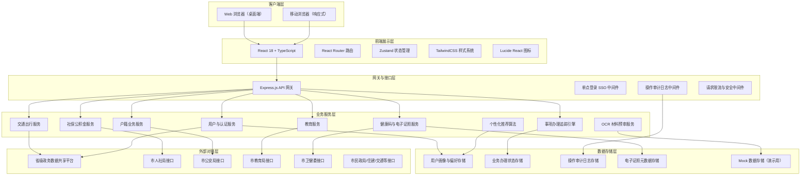
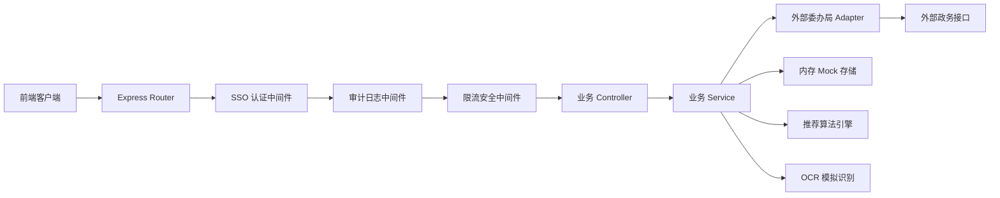
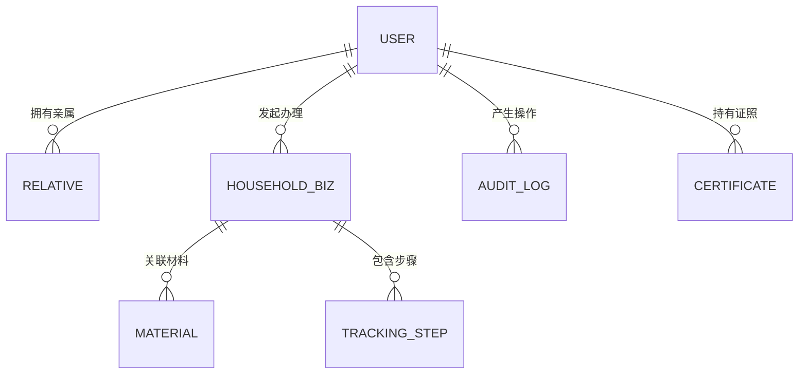

## 1. 架构设计



## 2. 技术描述

- **前端框架**：React@18 + TypeScript + Vite@5
- **样式方案**：TailwindCSS@3 + CSS 变量（主题切换）
- **路由管理**：React Router DOM@6
- **状态管理**：Zustand@4（全局状态：用户、主题、老年人模式）
- **图标库**：Lucide React@0.344
- **HTTP 客户端**：Axios@1.6
- **后端框架**：Express@4 + TypeScript
- **后端中间件**：CORS、helmet、express-rate-limit、morgan 日志
- **后端认证**：JWT Token + 模拟 SSO 对接
- **数据持久化**：内存存储 + Mock 数据（演示阶段）
- **初始化工具**：vite-init react-express-ts 模板

## 3. 路由定义

| 路由路径 | 页面组件 | 用途说明 |
|----------|----------|----------|
| `/login` | Login | 单点登录、实名认证、人脸识别入口 |
| `/` | Home | 首页工作台：服务导航、推荐、消息 |
| `/transport` | Transport | 扫码乘车：二维码、NFC、乘车记录 |
| `/social-security` | SocialSecurity | 社保公积金：账户查询、明细导出 |
| `/household` | Household | 户籍业务列表：落户/居住证/新生儿入户 |
| `/household/apply/:type` | HouseholdApply | 户籍业务办理：多步表单、材料上传 |
| `/household/progress/:id` | HouseholdProgress | 户籍业务办理进度：状态追踪 |
| `/education` | Education | 教育服务：学区地图、学校查询 |
| `/education/enroll` | EducationEnroll | 幼升小报名系统 |
| `/health` | HealthCode | 健康码亮证：动态码、疫苗核酸信息 |
| `/certificates` | Certificates | 电子证照列表：身份证/驾驶证/结婚证 |
| `/certificates/:id` | CertificateDetail | 电子证照详情与核验 |
| `/profile` | Profile | 用户中心：个人信息、亲属管理 |
| `/profile/settings` | Settings | 设置：老年人模式、语音导航、操作记录 |
| `/audit` | AuditLog | 操作留痕审计日志（管理员+本人可见） |
| `/tracking` | TrackingCenter | 事项办理中心：全部业务状态追踪 |

## 4. API 定义

### 4.1 用户与认证

```typescript
interface User {
  id: string;
  name: string;
  idCard: string;
  phone: string;
  avatar: string;
  realNameVerified: boolean;
  elderlyMode: boolean;
  fontScale: number;
  voiceNav: boolean;
  relatives: Relative[];
}

interface Relative {
  id: string;
  name: string;
  relation: string;
  idCardMasked: string;
  authorized: boolean;
}

// POST /api/auth/login
interface LoginRequest {
  phone?: string;
  idCard?: string;
  verifyCode?: string;
  ssoToken?: string;
}
interface LoginResponse {
  token: string;
  user: User;
}

// GET /api/auth/userinfo  →  User
// POST /api/auth/logout  →  { success: boolean }
```

### 4.2 社保公积金

```typescript
interface SocialAccount {
  social: {
    pension: number;
    medical: number;
    unemployment: number;
    workInjury: number;
    maternity: number;
    months: number;
    status: "normal" | "paused" | "stopped";
  };
  fund: {
    balance: number;
    monthly: number;
    months: number;
    lastDeposit: string;
  };
}

interface PaymentRecord {
  id: string;
  month: string;
  type: "pension" | "medical" | "fund" | string;
  base: number;
  personal: number;
  company: number;
  status: "paid" | "pending";
}

// GET /api/social/account  →  SocialAccount
// GET /api/social/records?type=&start=&end=  →  PaymentRecord[]
// GET /api/social/export?type=&start=&end=  →  PDF Binary
```

### 4.3 户籍业务

```typescript
type HouseholdBizType = "settle" | "residence" | "newborn";

interface HouseholdBiz {
  id: string;
  type: HouseholdBizType;
  title: string;
  status: "draft" | "submitted" | "reviewing" | "material" | "approved" | "rejected" | "completed";
  steps: { name: string; status: "done" | "active" | "pending"; time?: string; desc?: string }[];
  submittedAt?: string;
  estimatedDays?: number;
  materials: { name: string; required: boolean; uploaded: boolean; ocrPassed?: boolean }[];
}

// GET /api/household/list  →  HouseholdBiz[]
// GET /api/household/:id  →  HouseholdBiz
// POST /api/household/submit  →  { id: string; status: string }
// POST /api/household/ocr  →  { passed: boolean; fields: Record<string, string>; warnings: string[] }
```

### 4.4 健康码与电子证照

```typescript
interface HealthCode {
  status: "green" | "yellow" | "red";
  qrToken: string;
  updatedAt: string;
  vaccine: { name: string; doses: number; lastDate: string };
  pcr: { result: "negative" | "positive"; date: string; lab: string } | null;
}

interface Certificate {
  id: string;
  type: "idcard" | "driver" | "marriage";
  title: string;
  numberMasked: string;
  holder: string;
  issueDate: string;
  expireDate: string;
  issueBy: string;
  status: "valid" | "expiring" | "expired";
}

// GET /api/health/code  →  HealthCode
// GET /api/health/refresh  →  HealthCode
// GET /api/certificates  →  Certificate[]
// GET /api/certificates/:id/verify  →  { token: string; expireIn: number }
```

### 4.5 操作审计

```typescript
interface AuditLog {
  id: string;
  userId: string;
  action: string;
  module: string;
  ip: string;
  ua: string;
  time: string;
  result: "success" | "fail";
  detail?: string;
}

// GET /api/audit/logs?module=&start=&end=  →  AuditLog[]
// POST /api/audit/log  →  { id: string }
```

## 5. 后端服务架构



## 6. 数据模型

### 6.1 实体关系



### 6.2 内存数据结构说明

由于演示阶段采用内存 Mock 存储，后端初始化时加载如下数据：

- `users`: Map<string, User> — 已注册用户（含演示账号）
- `householdBiz`: Map<string, HouseholdBiz> — 户籍业务办理单
- `auditLogs`: AuditLog[] — 操作审计日志（追加写入）
- `certificates`: Map<string, Certificate[]> — 用户电子证照
- `socialRecords`: Map<string, PaymentRecord[]> — 社保缴费记录
- `serviceUsageCount`: Map<string, number> — 用户服务使用频次（推荐用）

## 7. 主题与可访问性配置

- CSS 变量定义主色、字号、间距三套 token
- `elderlyMode` 开启后，fontScale 设为 1.3，按钮高度自动 56px，间距放大
- 语音导航使用 Web Speech API（`speechSynthesis`）
- 所有交互元素含 ARIA 标签，支持 Tab 键盘导航
