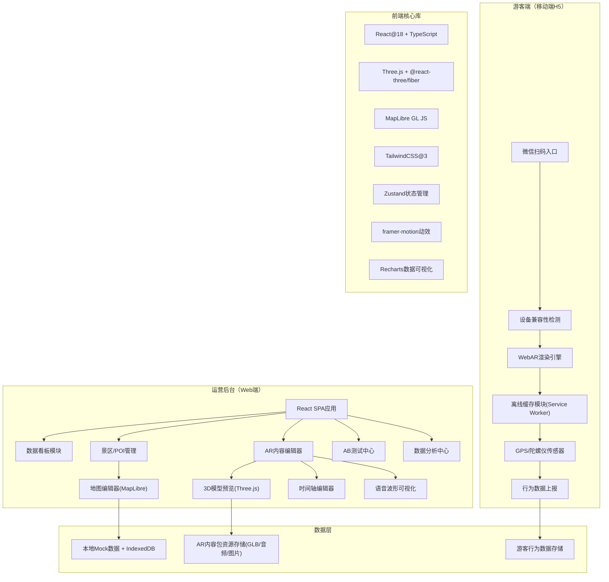
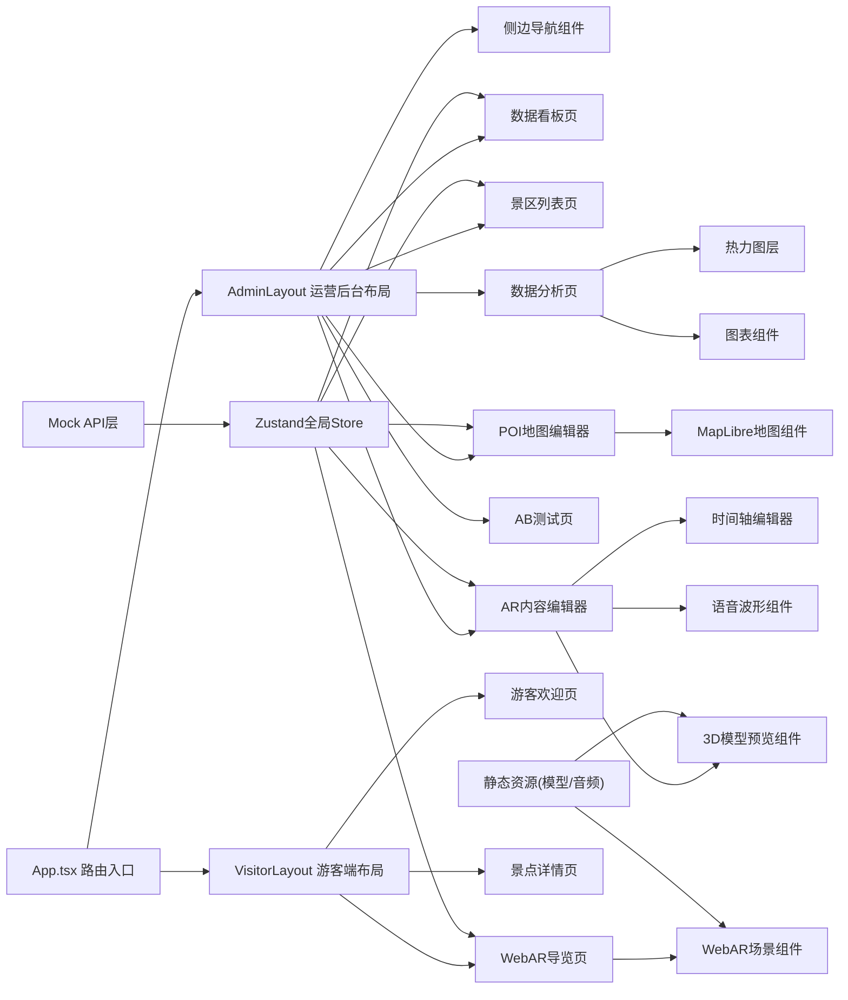

## 1. 架构设计



## 2. 技术描述

- **前端框架**：React@18 + TypeScript + Vite@5
- **样式方案**：TailwindCSS@3 + CSS变量主题系统
- **3D/AR渲染**：Three.js + @react-three/fiber + @react-three/drei + @react-three/postprocessing
- **地图引擎**：MapLibre GL JS（开源、无需API Key）
- **状态管理**：Zustand（轻量、不可变更新）
- **动效库**：framer-motion（页面过渡/微交互）
- **图表可视化**：Recharts（折线/柱状/热力图）
- **音频处理**：Web Audio API（波形可视化）
- **离线缓存**：Service Worker + Cache API + IndexedDB
- **后端服务**：纯前端Mock实现（无真实后端），使用本地JSON + localStorage持久化

## 3. 路由定义

| 路由路径 | 页面用途 |
|----------|----------|
| `/login` | 运营后台登录页 |
| `/admin/dashboard` | 运营后台首页 - 数据看板 |
| `/admin/scenic` | 景区列表管理页 |
| `/admin/scenic/:id/poi` | POI点位与导览动线编辑器 |
| `/admin/scenic/:id/ar-editor` | AR内容编辑器主页面 |
| `/admin/ab-test` | AB测试中心页 |
| `/admin/analytics` | 数据分析与热力图页 |
| `/visitor/welcome/:scenicId` | 游客端欢迎与设备检测页 |
| `/visitor/ar/:scenicId` | 游客端WebAR导览主页面 |
| `/visitor/poi/:poiId` | 游客端景点详情讲解页 |
| `/` | 入口路由（根据角色跳转） |

## 4. API定义（Mock层）

### 4.1 TypeScript 类型定义

```typescript
// 景区
interface ScenicArea {
  id: string;
  name: string;
  description: string;
  coverImage: string;
  center: { lat: number; lng: number };
  radius: number; // 覆盖半径(米)
  status: 'active' | 'inactive';
  createdAt: string;
  visitorCount: number;
  arLaunchCount: number;
}

// POI点位
interface POIPoint {
  id: string;
  scenicId: string;
  name: string;
  description: string;
  lat: number;
  lng: number;
  triggerRadius: number; // 触发半径(米)
  arContentId: string | null;
  order: number; // 动线顺序
}

// AR内容包
interface ARContent {
  id: string;
  poiId: string;
  modelUrl: string; // GLB模型路径
  modelScale: number;
  modelHeight: number; // 离地高度(米)
  audioTracks: AudioTrack[];
  interactions: InteractionNode[];
  timeline: TimelineSegment[];
  historyImages: HistoryImage[];
}

// 配音音轨
interface AudioTrack {
  id: string;
  language: 'zh-CN' | 'en-US' | 'ja-JP';
  name: string;
  audioUrl: string;
  duration: number;
  waveform: number[];
}

// 时间轴片段
interface TimelineSegment {
  id: string;
  type: 'audio' | 'model-animation' | 'interaction' | 'image';
  startTime: number;
  endTime: number;
  payload: any;
}

// 互动节点
interface InteractionNode {
  id: string;
  triggerTime: number;
  type: 'quiz' | 'hotspot' | 'share';
  question?: string;
  options?: { text: string; correct: boolean }[];
}

// 导览动线
interface TourRoute {
  id: string;
  scenicId: string;
  name: string;
  poiIds: string[]; // 按顺序排列
  estimatedDuration: number; // 分钟
  description: string;
}

// 游客行为数据
interface VisitorBehavior {
  id: string;
  scenicId: string;
  sessionId: string;
  poiId?: string;
  eventType: 'ar_launch' | 'poi_enter' | 'poi_stay' | 'interaction_complete' | 'share' | 'audio_finish';
  timestamp: string;
  stayDuration?: number; // 秒
  location?: { lat: number; lng: number };
  deviceType: 'ios' | 'android' | 'other';
  webArSupported: boolean;
}

// AB测试
interface ABTest {
  id: string;
  scenicId: string;
  name: string;
  variants: ABVariant[];
  status: 'draft' | 'running' | 'completed';
  startDate?: string;
  endDate?: string;
  winnerId?: string;
}

interface ABVariant {
  id: string;
  name: string;
  arContentId: string;
  trafficPercentage: number;
  metrics: {
    views: number;
    audioFinishRate: number;
    interactionRate: number;
    avgStaySeconds: number;
  };
}
```

### 4.2 Mock API接口

```typescript
// 景区相关
GET /api/scenic -> ScenicArea[]
GET /api/scenic/:id -> ScenicArea
POST /api/scenic -> ScenicArea
PUT /api/scenic/:id -> ScenicArea
DELETE /api/scenic/:id -> boolean

// POI相关
GET /api/scenic/:id/pois -> POIPoint[]
PUT /api/poi/:id -> POIPoint
POST /api/poi -> POIPoint
DELETE /api/poi/:id -> boolean

// AR内容
GET /api/ar-content/:id -> ARContent
PUT /api/ar-content/:id -> ARContent
POST /api/ar-content/upload-model -> { url: string }

// 导览动线
GET /api/scenic/:id/routes -> TourRoute[]
PUT /api/route/:id -> TourRoute

// 数据分析
GET /api/analytics/overview?scenicId=&startDate=&endDate= -> OverviewMetrics
GET /api/analytics/heatmap?scenicId=&date= -> HeatmapPoint[]
GET /api/analytics/behaviors?scenicId=&eventType= -> VisitorBehavior[]

// AB测试
GET /api/ab-test?scenicId= -> ABTest[]
POST /api/ab-test -> ABTest
POST /api/ab-test/:id/complete -> ABTest

// 游客端
GET /api/visitor/scenic/:id -> ScenicArea & { pois: POIPoint[], routes: TourRoute[] }
GET /api/visitor/check-ar-support -> { supported: boolean; reason?: string }
POST /api/visitor/track -> void
```

## 5. 前端模块架构



## 6. 目录结构

```
src/
├── assets/                  # 静态资源
│   ├── models/              # GLB 3D模型
│   ├── audio/               # 配音音频
│   ├── images/              # 图片/历史影像
│   └── icons/               # SVG图标
├── components/              # 通用组件
│   ├── admin/               # 后台通用组件（Sidebar、StatCard等）
│   ├── visitor/             # 游客端通用组件
│   ├── map/                 # 地图相关组件
│   ├── three/               # Three.js相关组件
│   └── ui/                  # 基础UI（Button、Modal、Input等）
├── pages/                   # 页面级组件
│   ├── admin/
│   │   ├── Login.tsx
│   │   ├── Dashboard.tsx
│   │   ├── ScenicList.tsx
│   │   ├── POIEditor.tsx
│   │   ├── AREditor.tsx
│   │   ├── ABTest.tsx
│   │   └── Analytics.tsx
│   └── visitor/
│       ├── Welcome.tsx
│       ├── ARView.tsx
│       └── POIDetail.tsx
├── store/                   # Zustand状态管理
│   ├── useScenicStore.ts
│   ├── useAREditorStore.ts
│   ├── useVisitorStore.ts
│   └── useAnalyticsStore.ts
├── services/                # API服务层
│   ├── mock/                # Mock数据
│   │   ├── scenic.ts
│   │   ├── poi.ts
│   │   ├── arContent.ts
│   │   └── analytics.ts
│   └── api.ts               # 请求封装
├── hooks/                   # 自定义Hooks
│   ├── useGeoLocation.ts
│   ├── useDeviceMotion.ts
│   ├── useAudioPlayer.ts
│   └── useWebARDetection.ts
├── types/                   # TypeScript类型定义
│   └── index.ts
├── utils/                   # 工具函数
│   ├── geo.ts               # 地理距离计算
│   ├── color.ts             # 颜色处理
│   └── waveform.ts          # 音频波形生成
├── styles/                  # 全局样式
│   ├── globals.css
│   └── theme.css            # CSS变量主题
├── App.tsx
├── main.tsx
└── vite-env.d.ts
```
